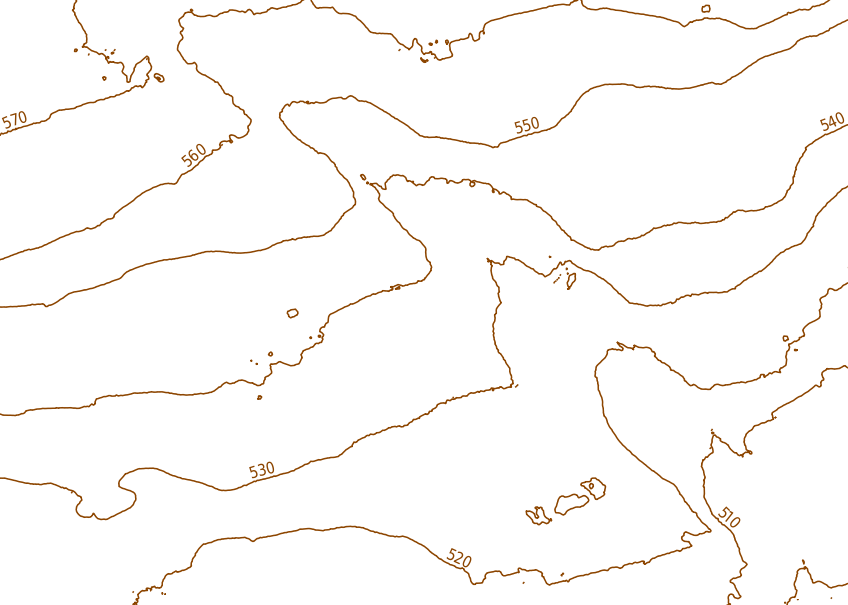
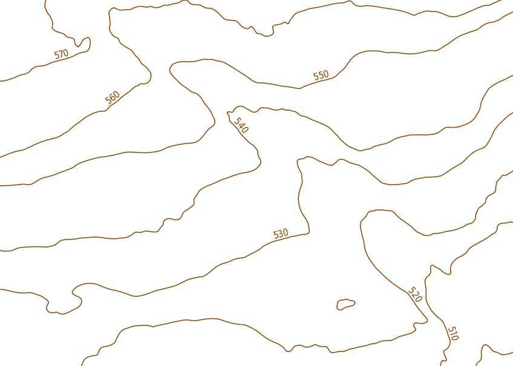

---
= Smoothe Höhenkurven
Stefan Ziegler
2014-01-03
:thoth-type: post
:thoth-status: published
:thoth-tags: GDAL,OGR,bash,Höhenkurven
:idprefix:
---
Mit http://www.gdal.org/gdal_contour.html[gdal_contour] steht ein Programm zur Verfügung, das aus einem digitalen Terrainmodell Höhenkurven berechnet:

[source]
----
gdal_contour -a elev dtm110733.tif contour.shp -i 10.0
----

Mit diesem Befehl werden Höhenkurven mit einer Äquidistanz von 10 Metern erzeugt und in der Shapedatei  `contour.shp` gespeichert. Zusätzlich wird die Höhe in das Attribut `elev` geschrieben.

Ohne jegliches Zutun wirken die Höhenkurven aber unruhig und es sind viele &laquo;Kleinst&raquo;-Höhenkurven vorhanden:

Ein schöneres Kartenbild ergibt sich durch vorgängiges Prozessieren des digitalen Terrainmodells. Mit einem Shell-Skript wird das Terrainmodell zehn Mal mit einer bestimmten Resamplingmethode umprojiziert. Das Umprojizieren ist in diesem Fall aber belanglos, da a) nichts umprojiziert wird und b) nur das Verschmieren der Rasterwerte durch das Resampling interessiert:

[source,ruby,linenums]
----
include::create_smooth_contour.sh[]
----

Das 10-fache Resampling findet in der for-Schleife statt. Anschliessend werden die Höhenkurven erzeugt. Der letzte Befehl löscht alle Höhenkurven, deren Länge kleiner 100 Meter ist. Dieser Befehl funktioniert erst mit gdal &ge; 1.10.

Et voilà:

