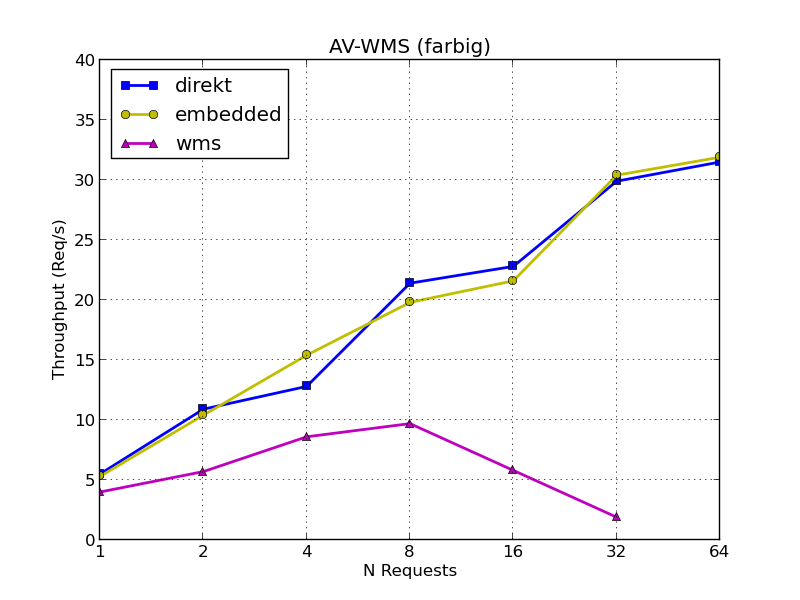

---
= QGIS server vs. QGIS server
Stefan Ziegler
2014-01-29
:thoth-type: post
:thoth-status: published
:thoth-tags: QGIS,QGIS-Server,WMS,Benchmark
:idprefix:
---
QGIS Server ist schnell. Das zeigt die http://blog.sourcepole.ch/assets/2013/6/17/fossgis_2013_performanceoptimierte_wms_dienste.pdf[Präsentation] an der FOSSGIS 2013. Ich wurde aber das Gefühl nie los, dass sich die Performance verschlechtert, falls Layer kaskadiert werden. Was verstehe ich unter &laquo;kaskadiert&raquo;?

Häufig benutzte Grundlagen- resp. Hintergrundkarten werden einmalig erstellt und über *eine* Schnittstelle (WMS) zur Verfügung gestellt. Dies ist vor allem praktisch, falls die Grundlagenkarte aus vielen einzelnen Layern und Datensätzen besteht.

Für insgesamt fünf Hintergrundkarten habe ich mit JMeter Lasttests durchgeführt:

* AV-WMS
* Plan für das Grundbuch
* Basisplan
* Orthofoto
* Kombination aus Orthofoto und Basisplan resp. Plan für das Grundbuch

Dabei wurden drei Ansätze (= drei QGIS-Projekte = drei WMS-Dienste) verfolgt:

. _direkt_: Layer werden in QGIS direkt geladen, z.B. VRT-Layer für Orthofotos, Postgis für Vektordaten.
. _embedded_: Layer werden via QGIS-Projekt (Variante 1) geladen (&laquo;Embed Layers and Groups...&raquo;).
. _wms_: Layer wird von Variante 1 als WMS in QGIS-Projekt geladen (= Kaskadieren).

Die Testbedingungen sind wie folgt:

* Hetzner-Server:
** Intel i7-3770 (4 Cores, 8 Threads, 3.4 - 3.9 GHz)
** 16 GB RAM
** 2 x 3 TB HDD (7200 rpm, Software-RAID 1)
* Ubuntu 10.04
* PostgreSQL 8.4 / Postgis 2.0
* QGIS enterprise 13.03b
* JMeter, Datenbank und QGIS auf dem gleichen Server

Exemplarisch das Resultat des AV-WMS:

Embedded Layer und Gruppen sind gleichauf mit direkt geladenen Datensätzen. Massiv hingegen ist der Einbruch unter Last bei kaskadierten Layern. Warum der Einbruch so massiv ist, entzieht sich meiner Kenntnis. Zu empfehlen sind daher kaskadierende Layer nur beschränkt. Die bessere Lösung ist das direkte Einbinden der Datensätze oder &laquo;eingebettete&raquo; Datensätze.

Für alle anderen Hintergrundkarten zeigt sich exakt das gleiche Bild. Sämtliche Resultate und einige Beispielbilder gibts http://edigonzales.github.io/qgisserver_vs_qgisserver/[hier].
