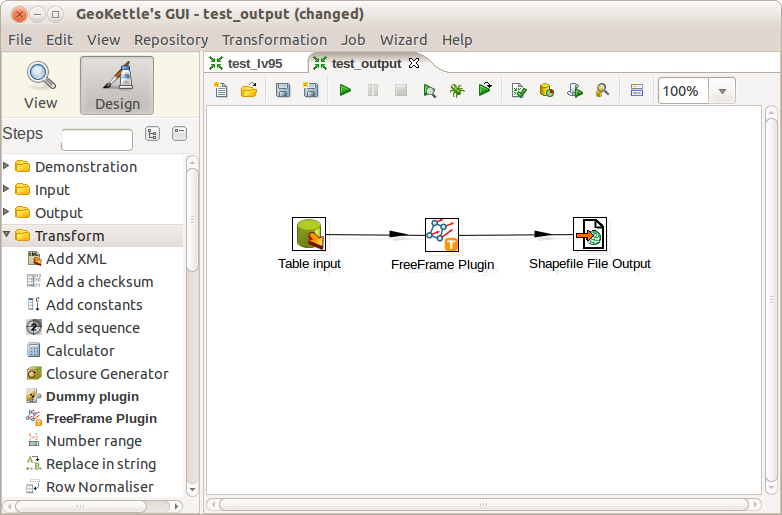
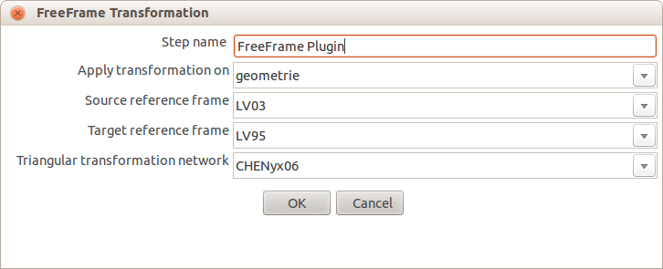
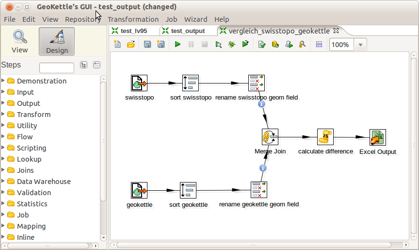

---
= Fun with GeoKettle Episode 1
Stefan Ziegler
2014-02-09
:thoth-type: post
:thoth-status: published
:thoth-tags: GeoKettle,ETL,PDI,Kettle,Bezugsrahmenwechsel,LV95
:idprefix:
---
Der http://www.swisstopo.admin.ch/internet/swisstopo/de/home/topics/survey/lv95/lv03-lv95.html[Bezugsrahmenwechsel] steht http://www.admin.ch/opc/de/classified-compilation/20071088/index.html#a53[vor der Tür] und viele Geodaten müssen früher oder später transformiert werden. Swisstopo bietet einen http://www.swisstopo.admin.ch/internet/swisstopo/de/home/apps/calc/reframe.html[Webdienst] und ein http://www.swisstopo.admin.ch/internet/swisstopo/de/home/products/software/products/reframe_fme.html[FME-Plugin] für diese Transformation an.

Für das ETL-Tool http://www.spatialytics.org/projects/geokettle/[GeoKettle] habe ich ein Plugin geschrieben, das diese Transformation für Vektordaten als &laquo;Transform-Step&raquo; anbietet. Das Plugin kann auf Github heruntergeladen werden: https://github.com/edigonzales/geokettlefreeframeplugin/releases[FreeFrame.zip]. Die Zip-Datei muss entpackt und in den Ordner `plugins/steps` von GeoKettle kopiert werden. Hat die Installation geklappt, erscheint unter Design - Transform ein neuer Step: &laquo;FreeFrame Plugin&raquo; Eine (marginal) ausführlichere Installationsanleitung findet sich https://github.com/edigonzales/geokettlefreeframeplugin[hier]. Zum Ausprobieren habe ich ein http://www.catais.org/tmp/geokettle-2.5.zip[Sorglos-Paket] zusammengestellt, das aus GeoKettle und dem Plugin selbst besteht. Es wird *nicht* mit jeder neuen Plugin-Version aktualisiert.

Die Anwendung ist einfach: Der Transformationsschritt kann innerhalb GeoKettle zu einem beliebigen Zeitpunkt angewendet werden, z.B. vor dem Export einer Datenbanktabelle in eine Shapedatei:

Viel einstellen muss/kann man nicht:

* `Apply transformation on`: Die gewünschte Geometriespalte, die transformiert werden soll.
* `Source reference frame`: Quell-Referenzrahmen (LV03 oder LV95)
* `Target reference frame`: Ziel-Referenzrahmen (LV03 oder LV95)
* `Triangular transformation network`: Dreiecksvermaschungsdatensatz (CHENyx06)

Das Plugin prüft *nicht*, ob die Geometrien im richtigen Koordinatensystem vorliegen. Wählt man also z.B. als Quell-Referenzrahmen &laquo;LV03&raquo; aus und die Input-Geometrien sind in einem anderen Koordinatensystem (also *nicht* EPSG:21781) erhält man keine befriedigenden und sinnvollen Resultate. Für vorgängige Koordinatentransformationen kann der &laquo;SRS Transformation&raquo;-Schritt verwendet werden.

Liegen die zu transformierenden Koordinaten nicht innerhalb der Dreiecksvermaschung wird keine Transformation durchgeführt und die Koordinaten werden unverändert weitergeleitet.

Stimmt die Transformation auch? Als kleine https://raw2.github.com/edigonzales/geokettlefreeframeplugin/master/data/verification/vergleich_swisstopo_geokettle.ktr[GeoKettle-Übung] habe ich Punktkoordinaten verglichen, die ich mit dem swissopo-Dienst und mit GeoKettle transformiert habe:

Die https://github.com/edigonzales/geokettlefreeframeplugin/blob/master/data/verification/vergleich_swisstopo_geokettle.xls?raw=true[Resultate] zeigen, dass es ausser Kleinstdifferenzen aus (wahrscheinlich?) nummerischen Gründen keine Unterschiede gibt.

Der Transformationsschritt ist vernünftig schnell: Für das Exportieren der gesamten Bodenbedeckung des Kantons Solothurn (circa 270'000 Polygone) aus einer PostgreSQL/Postgis-Datenbank in eine Shape-Datei benötigt GeoKettle *ohne* Transformation circa 40 Sekunden; *mit* Transformation werden knapp 100 Sekunden benötigt. Das Transformieren der gleichen Datenbanktabelle inkl. Speichern  in einer neuen Datenbanktabelle benötigt circa 130 Sekunden. Für den Test wurde ein Hetzner-Server (Intel i7-3770, HDD im Software-Raid 1, Ubuntu 10.04) verwendet.

Was bringt die Zukunft:

* Einbinden von kantonalen Dreiecksvermaschungen, z.B. http://www.lv95.bve.be.ch/lv95_bve/de/index/navi/index/haeufig_gestelltefragen/glossar.html#anker-anchor-10[BEENyx15].
* Automatische Detektierung der Geometriespalte(n). So wird es möglich sein alle Tabellen einer Datenbank oder eines Datenbankschemas in einem Rutsch zu transformieren.

Der Quellcode des Plugins befindet sich auf https://github.com/edigonzales/geokettlefreeframeplugin[Github].
