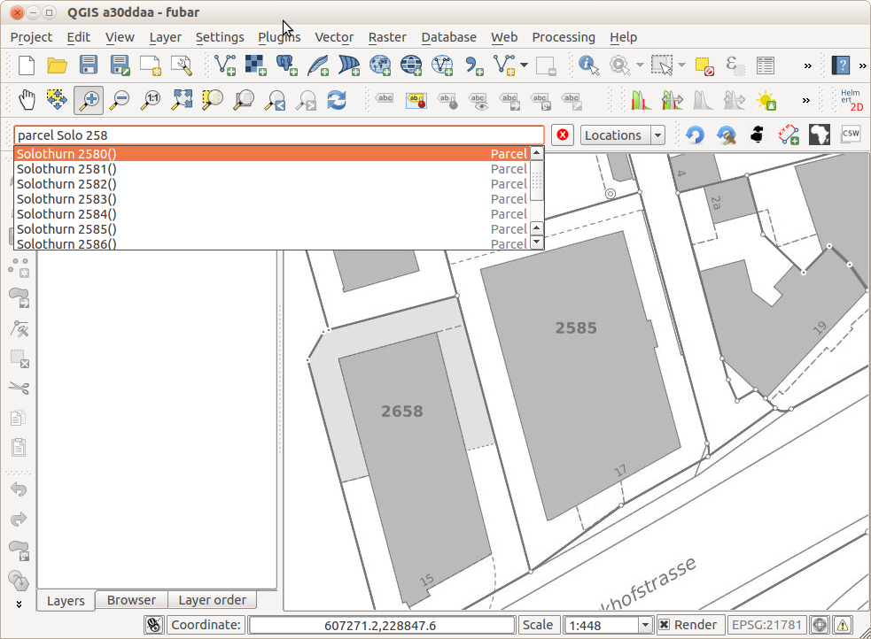
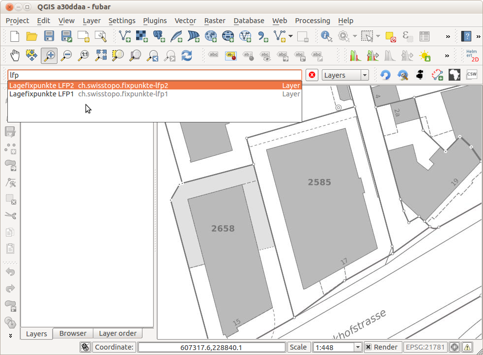
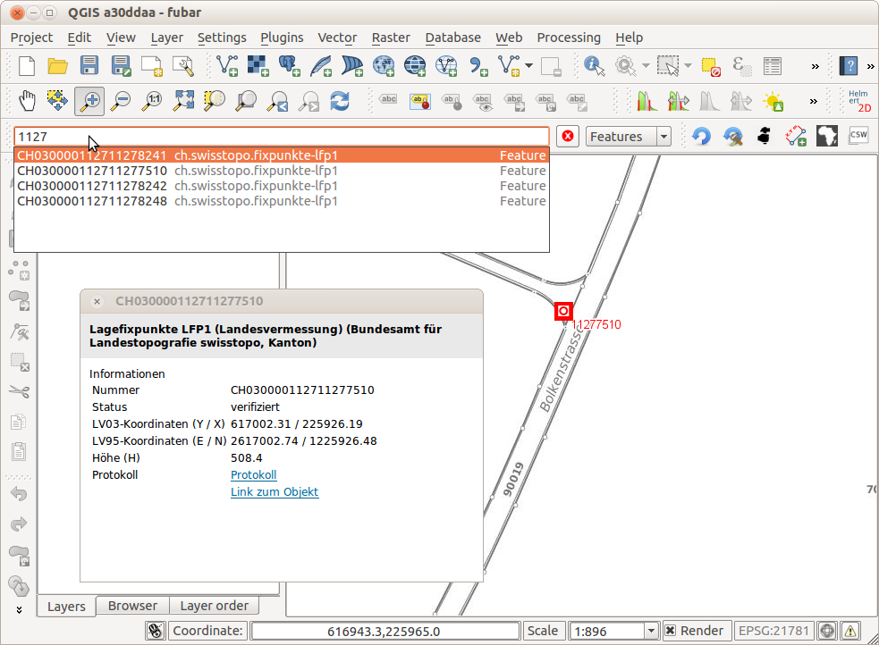
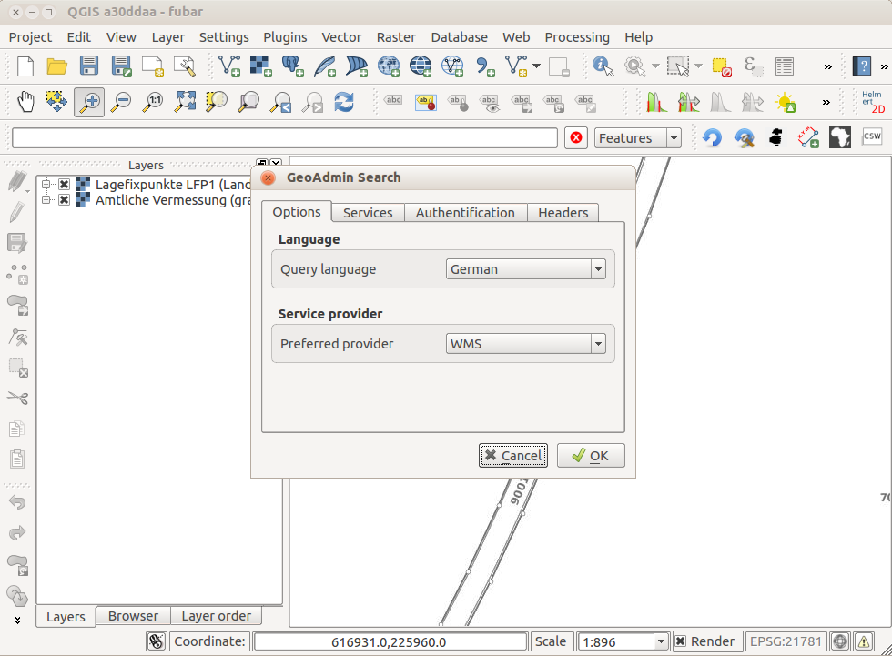

---
= GeoAdmin API Plugin für QGIS
Stefan Ziegler
2014-08-24
:thoth-type: post
:thoth-status: published
:thoth-tags: GeoAdmin,API,QGIS,QGIS-Plugin,WMS,WMTS
:idprefix:
---
Swisstopo stellt eine http://www.geo.admin.ch/internet/geoportal/de/home/services/geoservices/display_services/api_services.html[Programmierschnittstelle (API)] zur Verfügung mit der man Webseiten mit Swisstopo-Karten verschönern kann. Diese API ist sauber http://api3.geo.admin.ch/index.html[dokumentiert] und neben der eigentlichen Javascript-API stehen ebenfalls auch http://api3.geo.admin.ch/services/sdiservices.html[REST-Schnittstellen] online.

Interessant ist vor allem der http://api3.geo.admin.ch/services/sdiservices.html#search[Suchdienst], mit dem man neben Adressen und administrativen Einheiten (Kantone, Bezirke) auch Grundstücke suchen kann. Folgender Request liefert Informationen zum Grundstück Nr. 2585 in Solothurn:

http://api3.geo.admin.ch/rest/services/api/SearchServer?searchText=Solothurn%202585&origins=parcel&type=locations[http://api3.geo.admin.ch/rest/services/api/SearchServer?searchText=Solothurn%202585&origins=parcel&type=locations]

Leider darf die Adresssuche nur von der Bundesverwaltung gebraucht werden. Sucht man nach einer bestimmten Adressen, wird zwar eine Antwort geliefert, diese beinhaltet aber keine Georeferenzierung (kein `geom_st_box2d` Attribut):

http://api3.geo.admin.ch/rest/services/api/SearchServer?searchText=Solothurn%20Werkhofstrasse%2017&origins=address&type=locations[http://api3.geo.admin.ch/rest/services/api/SearchServer?searchText=Solothurn%20Werkhofstrasse%2017&origins=address&type=locations]

Ebenfalls gesucht werden können Layer, die in der GeoAdmin API zur Verfügung stehen. Dieser Request liefert Layer zur Thematik _Fixpunkte_:

http://api3.geo.admin.ch/rest/services/api/SearchServer?searchText=Fixpunkte&type=layers[http://api3.geo.admin.ch/rest/services/api/SearchServer?searchText=Fixpunkte&type=layers]

Zu guter Letzt lassen sich mit dem Suchdienst auch Features suchen, z.B. den Fixpunkt 11277510:

http://api3.geo.admin.ch/rest/services/api/SearchServer?features=ch.swisstopo.fixpunkte-lfp1&type=featuresearch&searchText=11277510[http://api3.geo.admin.ch/rest/services/api/SearchServer?features=ch.swisstopo.fixpunkte-lfp1&type=featuresearch&searchText=11277510]

Nicht alle Layer der GeoAdmin API sind http://api3.geo.admin.ch/api/faq/index.html#which-layers-are-searchable[durchsuchbar].

Mit diesen REST-Schnittstellen kann ein QGIS-Plugin erstellt werden, das ähnliche Funktionen bietet, wie die Suchfunktion auf http://map.geo.admin.ch[map.geo.admin.ch]. Dh. Lokalisationen können gesucht werden und es kann an den ausgewählten Ort gezoomt werden. Angebotene Layer können gesucht und in QGIS hinzugefügt werden. Features von durchsuchbaren Layer können gesucht werden und ein Popup-Fenster erscheint, falls etwas ausgewählt wurde.

Screenshots:

Die Layersuche resp. das anschliessende Hinzufügen des Layers in QGIS ist noch unbefriedigend gelöst. In den Plugineinstellungen lässt sich wählen, ob der Layer als `WMS` oder `WMTS` hinzugefügt werden soll:

Einige der Layer sind nur als WMS, andere nur als WMTS vorhanden. So wird zuerst also versucht den Layer mit dem Provider hinzuzufügen, den man in den Einstellungen gewählt hat. Klappt das nicht, wird der andere Provider gewählt.

Das führt auch gleich zum Thema/*Problem* &laquo;Terms of use&raquo;. Der WMTS-Dienst darf gemäss http://www.swisstopo.admin.ch/internet/swisstopo/de/home/products/services/web_services/webaccess.html[Webseite] nicht in Desktop-Applikationen verwendet werden: «Nur für Websites, kein Desktop-Zugriff». Wird beim Anfordern der Kachel *kein* Referer mitgeschickt, verweigert der Server die Auslieferung der Kachel. Zwar kann man sich mit einer Domain gratis http://www.geo.admin.ch/internet/geoportal/de/home/services/geoservices/display_services/api_services/order_form.html[registrieren] aber die Desktop-Applikation hat halt keine Domain.

Bleibt der WMS-Dienst: Gewisse Layer sind nicht frei verfügbar (z.B. Pixelkarten) und nicht im &laquo;normalen&raquo; http://wms.geo.admin.ch/?REQUEST=GetCapabilities&SERVICE=WMS&VERSION=1.0.0[BGDI-WMS] enthalten. Für diese Dienste gibt es einen zweiten http://www.swisstopo.admin.ch/internet/swisstopo/de/home/products/services/web_services/geoservices/swisstopo_wms.html[WMS-Dienst]. 5000 Megapixel/Jahr sind http://www.toposhop.admin.ch/de/shop/products/geoservice/swisstopoWMS[gratis]. Leider lässt sich mit keiner REST-Schnittstelle exakt eruieren, ob ein Layer als WMS und/oder als WMTS verfügbar ist. So meint das Plugin, dass das Orthofoto (SWISSIMAGE) nur als WMTS-Layer verfügbar ist, da in den http://api3.geo.admin.ch/rest/services/api/MapServer?searchText=ch.swisstopo.swissimage[Metainformation] beim Layer `ch.swisstopo.swissimage` das Attribut `wmsUrlResource` fehlt. Login und Passwort für den geschützten WMS lassen sich in den Plugineinstellungen speichern. Es macht den Anschein, dass entweder mein Plugin, QGIS oder der passwortgeschützte WMS von Zeit zu Zeit Probleme beim Verbinden verursacht. Erscheint in QGIS die Fehlermeldung `Error: Layer is not valid.` lohnt sich ein erneuter Versuch (irgend ein &laquo;Redirect loop detected&raquo;-Problem).

Das Plugin _GeoAdmin Search_ liegt im http://plugins.qgis.org/plugins/plugins.xml?qgis=2.4[QGIS Plugin Repository]. Quellcode gibts hier: https://bitbucket.org/edigonzales/qgis_geoadminsearch[https://bitbucket.org/edigonzales/qgis_geoadminsearch].
