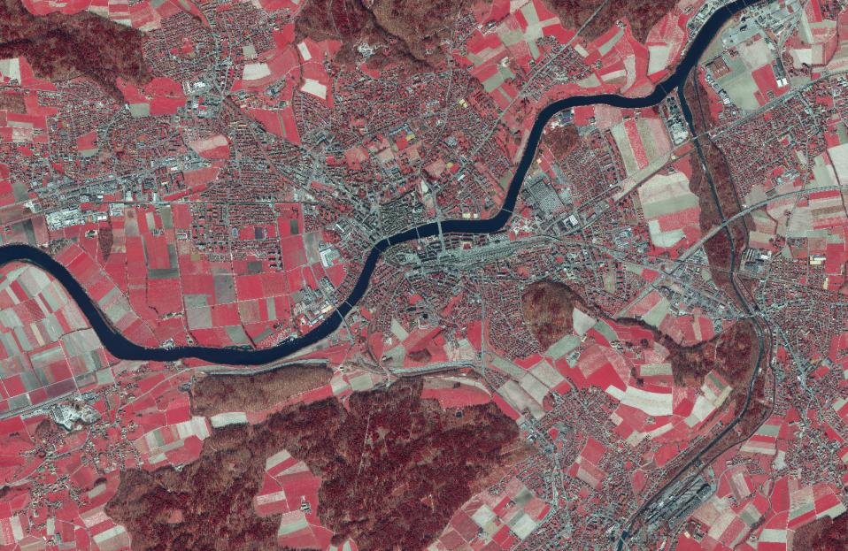
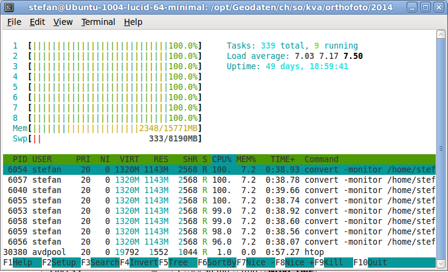
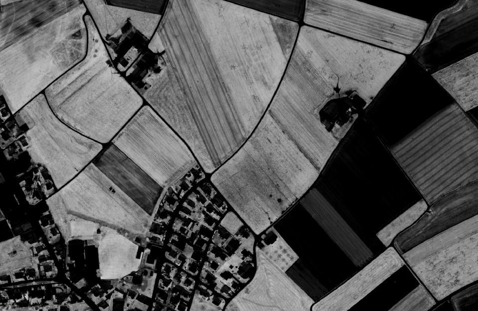
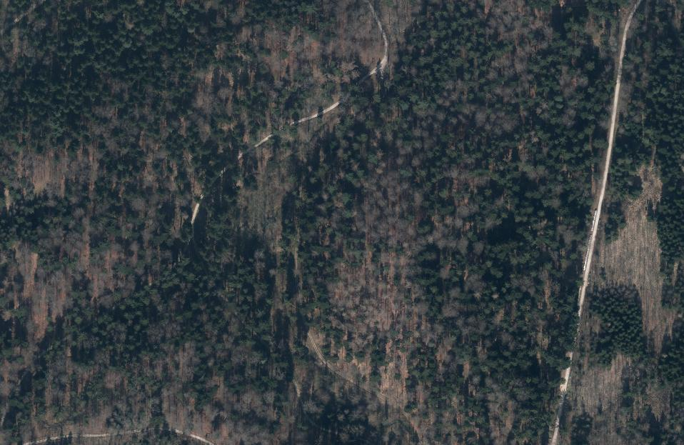
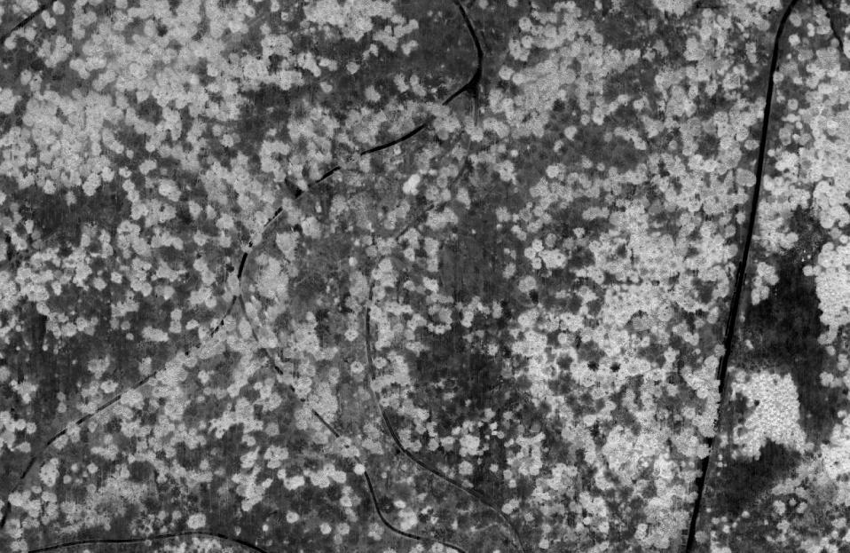
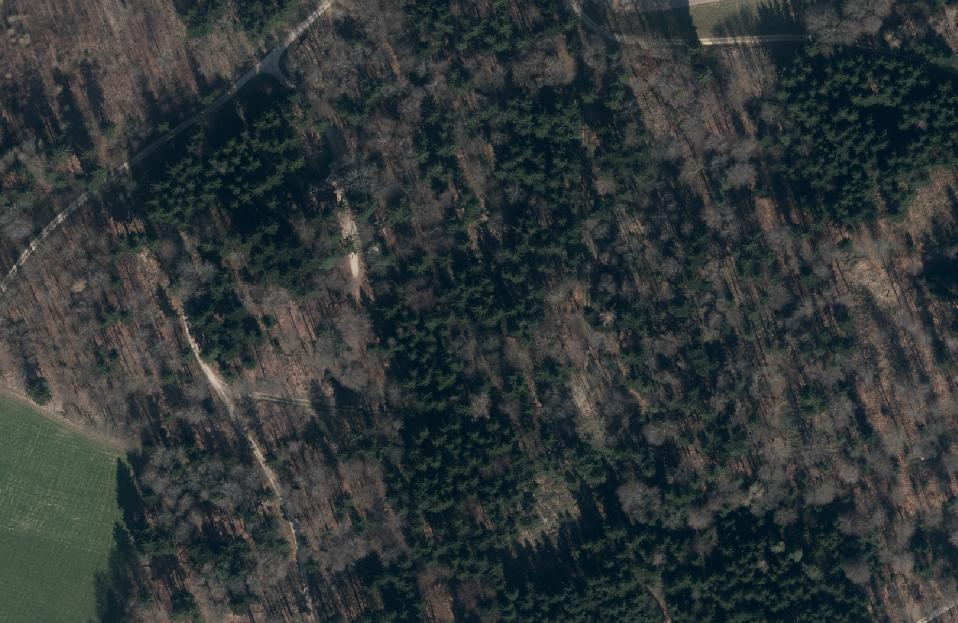
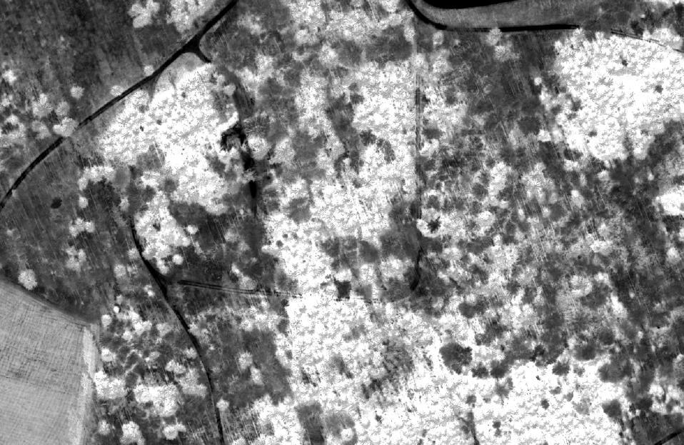
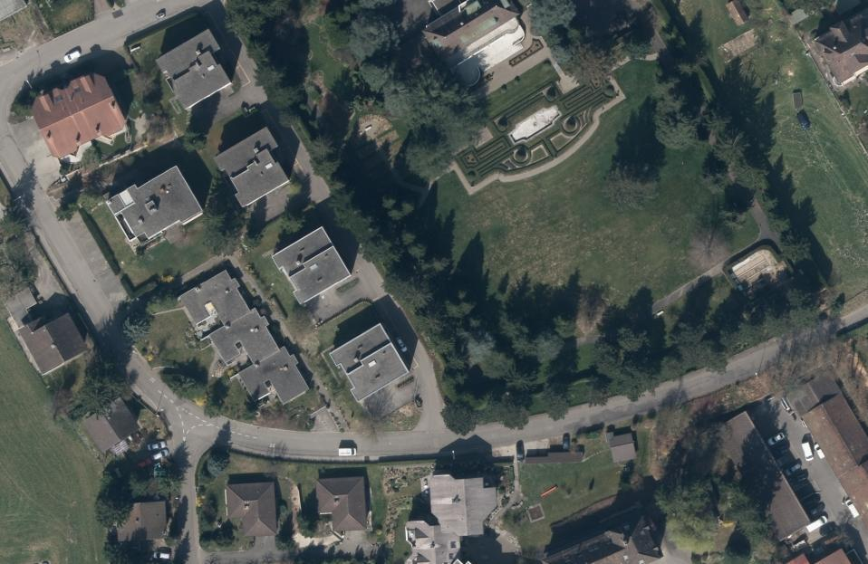
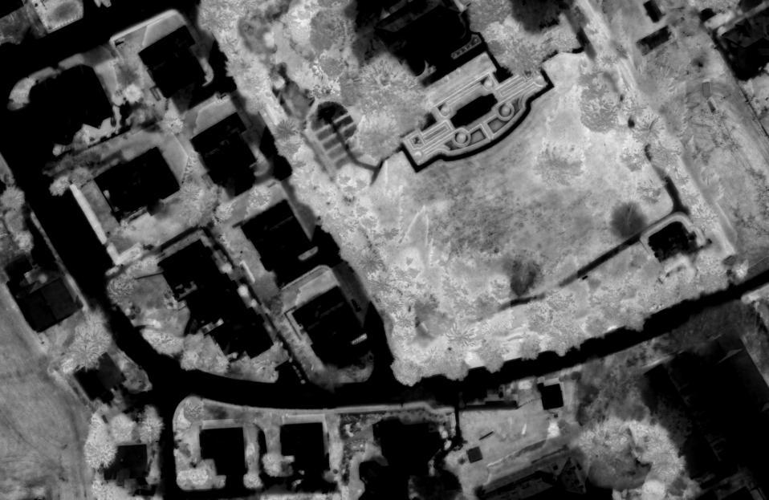

---
= NDVI Orthofotos
Stefan Ziegler
2014-09-22
:thoth-type: post
:thoth-status: published
:thoth-tags: NDVI,Orthophoto,Orthofoto,Raster,GDAL,convert,ImageMagick
:idprefix:
---
Der Kanton Solothurn lässt jedes Jahr ein Drittel seiner Fläche neu befliegen und lässt daraus neue http://www.sogis.ch/daten[Orthofotos] erstellen. Als Endprodukt werden GeoTIFF mit den vier Kanälen Rot, Grün, Blau und nahes Infrarot ausgeliefert. Daraus werden anschliessend zwei abgeleitete Produkte erstellt: ein RGB-Orthofoto und ein FCIR-Orthofoto. «FCIR» steht für «false-colour infrared» und besteht aus den Kanälen nahes Infrarot, Rot und Grün und sieht dann in etwa so aus:

Hilfreich kann diese Kombination zum Beispiel für Umweltanalysen sein. Unser Fokus lag jedoch in der besseren Identifizierbarkeit von Abgrenzungen zwischen Objekten unterschiedlicher Bodenbeschaffenheit (z.B. Wasser - nicht Wasser oder Strasse - Acker/Wiese).

Auf dem https://www.mapbox.com/blog/[Mapbox-Blog] sind verschiedene, interessante Beiträge was man mit Satellitenbildern und Orthofotos und den verschiedenen Kanälen anstellen kann. So auch ein https://www.mapbox.com/blog/processing-rapideye-imagery/[Beitrag] zu http://en.wikipedia.org/wiki/Normalized_Difference_Vegetation_Index[NDVI]. Sieht cool aus, will ich auch. Netterweise stehen auch gleich die GDAL- und ImageMagick-Befehle im Blog. Daraus lässt sich leicht für unsere Daten ein Skript erstellen:

[source,xml,linenums]
----
include::create_ndvi.sh[]
----

*Zeilen 3 - 4*: Sind nicht relevant. Die Zeilen werden gebraucht, um dem Skript mitzuteilen, dass eine bestimmte GDAL-Version verwendet werden soll.

*Zeile 6*: Hier beginnt die for-Schleife, die jede einzelne Orthofoto-Kachel verarbeitet. Da schlussendlich nur die Kanäle Rot und nahes Infrarot interessieren, kann das FCIR-Orthofoto für die Berechnung verwendet werden.

*Zeilen 8 - 11*: Parameter für die verschiedenen (temporären) Dateien.

*Zeilen 15 - 17*: Quick 'n' Dirty wird hier ein World-File erstellt. Da mit den ImageMagick-Befehlen die Georeferenzierung verloren geht, muss diese zum Schluss wiederhergestellt werden. Dafür brauchts das World-File.

*Zeile 19*: Der später verwendetete `-fx` Operator funktioniert am besten mit Dateien, die von ImageMagick selbst erstellt wurden. Aus diesem Grund wird das GeoTIFF mit dem `convert` Befehl kopiert.

*Zeile  21*: Hier passiert die Magie: Mit dem `-fx` http://www.imagemagick.org/script/fx.php[Operator] wird der NDVI-Wert für jedes Pixel berechnet. Falls sowohl der _nahe Infrarot_ (`u.r`) und _rote_ (`u.g`) Kanal einen Pixelwert von 0 aufweisen, ist der Nenner ebenfalls 0 und damit der Bruch nicht mehr definiert. Aus diesem Grund wird ein kleiner Wert beim Nenner hinzuaddiert. Dies dürfte auf das Resultat keinen Einfluss haben. Schöner wäre es natürlich wenn man das ganze mit einem if-else-Konstrukt behandeln würde.

*Zeilen 23 - 25*: Anschliessend wird die Georeferenzierung wiederhergestellt und die internen Overviews gerechnet.

*Zeilen 27 - 29*: Zu guter Letzt werden noch die temporären Dateien, die nicht mehr benötigt werden, gelöscht.

Die ganze Berechnung dauert für circa 450 1km2 Kacheln (8000 x 8000 Pixel) rund 10 Stunden. Der Flaschenhals ist der `-fx` Operator obwohl dieser sämtliche Kerne des Prozessors verwendet:

Das Resultat dieser CPU-Orgie sieht dann wie folgt aus:

Soweit so gut. Nicht wirklich spektakulär aber in etwa das was man aufgrund des Beispiels im  https://www.mapbox.com/blog/processing-rapideye-imagery/[Mapbox-Blog] erwarten durfte. Augenfällig ist aber die klare Unterscheidung zwischen Strassen (keine Vegetation) und der landwirtschaftlich genutzten Flächen oder des Waldes. Für gewisse Fragestellungen (z.B. Periodische Nachführung, Erfassung von Waldstrassen) in der amtlichen Vermessung kann man sich das jetzt zunutze machen. Unter gewissen Umständen ist im normalen RGB-Orthofoto und FCIR-Orthofoto kein Strassenverlauf mehr zu erkennen. Auf dem NDVI-Bild ist ein Verlauf aber immer noch (mehr oder weniger gut) sichtbar:

+++<del>Die Beispiele zum Vergleichen gibts <a href="http://s.geo.admin.ch/5fc9390e46">hier</a>, <a href ="http://s.geo.admin.ch/5fc93ad569">hier</a> und <a href="http://s.geo.admin.ch/5fc93bb5bb">hier</a>.</del>+++
