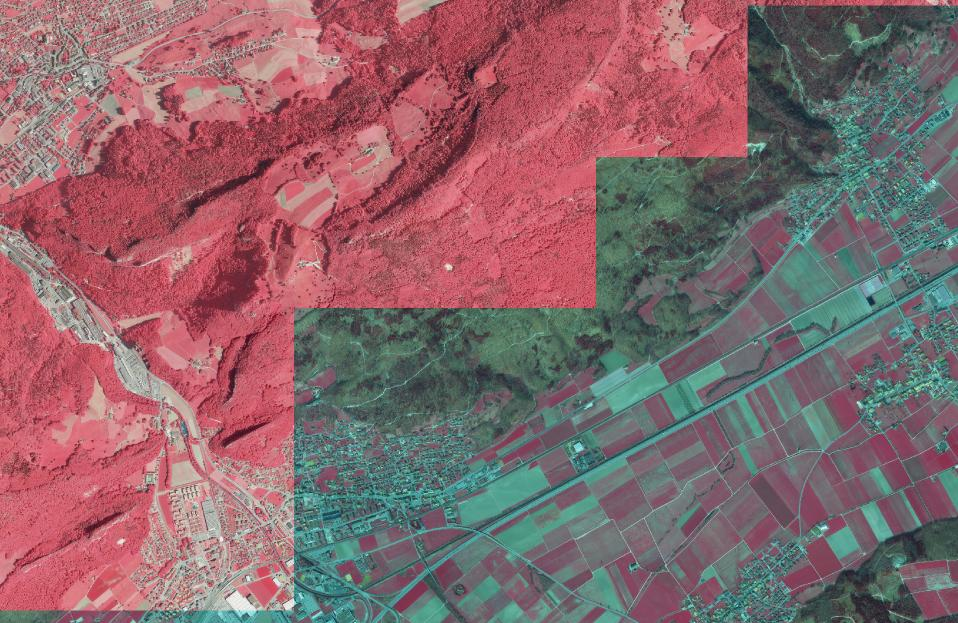
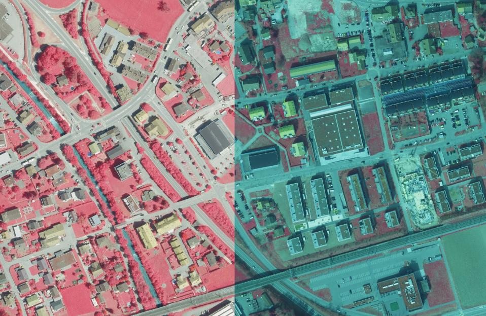
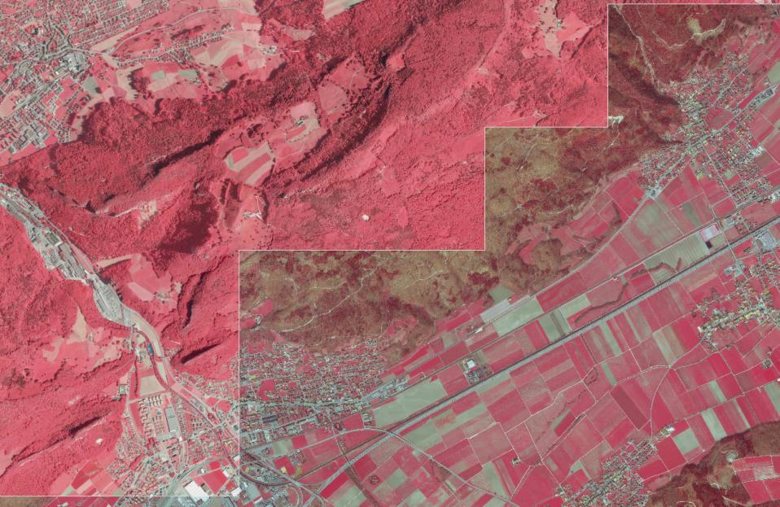
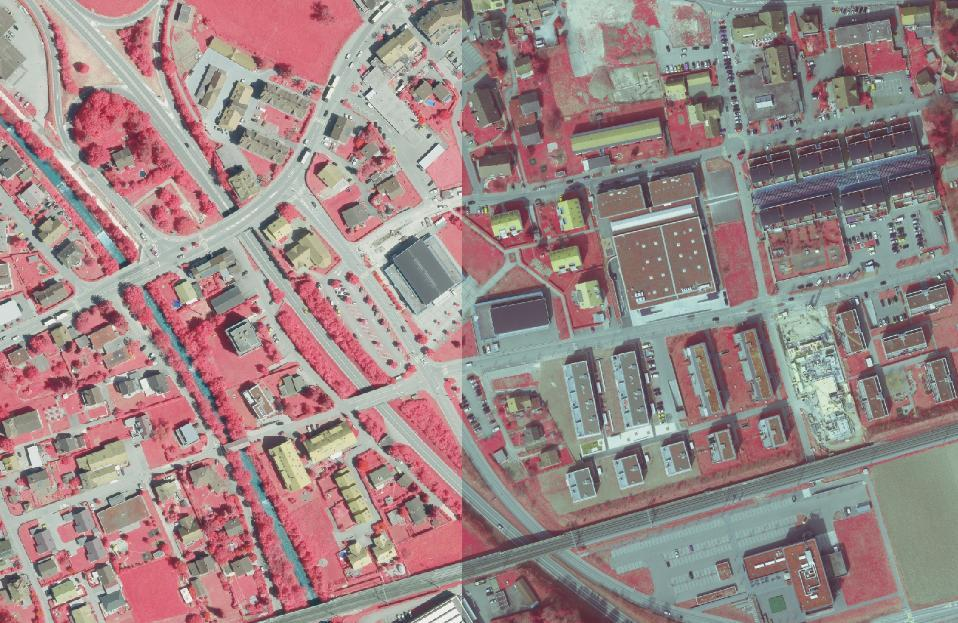

---
= Pimp your Orthophoto
Stefan Ziegler
2014-09-22
:thoth-type: post
:thoth-status: published
:thoth-tags: Orthophoto,Orthofoto,Raster,convert,ImageMagick
:idprefix:
---
Werden Luftbilder zu unterschiedlichen Zeitpunkten geflogen, sind die daraus resultierenden Orthofotos farblich unterschiedlich. Was aber nicht mehr nachzuvollziehen ist, sind Unterschiede wie hier in den FCIR-Orthofotos der Jahre 2012 und 2013:

[%hardbreaks]
Die Orthofotos auf der linken Seite (2012) wurden zwar bei voller Belaubung geflogen jedoch sind die Farbunterschiede zu gross und die Orthofotos auf der rechten Seite (2013) scheinen einen Blaustich zu haben. Was machen?

Die Analyse der Bildhistogramme zeigt, dass insbesondere der rote Kanal (resp. das nahe Infrarot) sehr unterschiedlich ist und einen Shift zwischen den beiden Jahren aufweist.

Hat man nur ein Bild kann man mit Gimp (o.ä.) dran schrauben bis es passt. Hat man aber 467 Kacheln macht das weniger Spass. Mit http://www.imagemagick.org/[ImageMagick] geht das aber wunderbar:

[source]
----
convert -channel R -gamma 2 $INPUT $OUTPUT
----

Mit diesem Befehl wird eine Gammakorrektur im roten Kanal durchgeführt. Mit ein wenig probieren, findet man schnell einen passenden Wert. Das Resultat sieht so aus:

[%hardbreaks]
Der Blauschleier ist nicht mehr so extrem wie vorher. Trotzdem könnte man die Farben sicher noch besser anpassen. +++<del>Den WMS mit den angepassten Orthofotos gibts <a href="http://www.catais.org/wms/orthofoto?REQUEST=GetCapabilities&SERVICE=WMS">hier</a>.</del>+++
