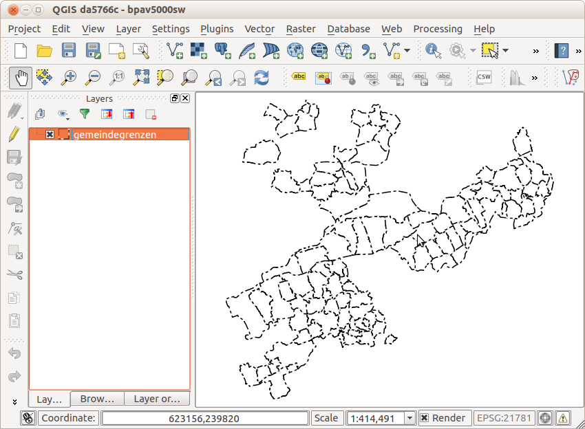

---
= Karten rendern mit PyQGIS
Stefan Ziegler
2014-10-19
:thoth-type: post
:thoth-status: published
:thoth-tags: QGIS,PyQGIS,Basisplan,Amtliche Vermessung
:idprefix:
---
An der FOSSGIS 2013 wurde von Andreas Schmid http://www.fossgis.de/konferenz/2013/programm/attachments/432_fossgis_2013_SchmidQGISServer_Praesentation.pdf[gezeigt] wie mit QGIS der http://www.cadastre.ch/internet/kataster/de/home/services/service/bp.html[Basisplan der amtlichen Vermessung] erstellt werden kann. Der ganze Systemaufbau ist nicht gerade trivial weil für das Rendern des Kartenbildes http://hub.qgis.org/projects/quantum-gis/wiki/QGIS_Server_Tutorial[QGIS Server] eingesetzt wird. Dies setzt z.B. Apache 2 und ein FCGI-Modul voraus. Das eigentliche Ziel der Übung ist aber nicht einen WMS-Dienst anzubieten, sondern aus Vektordaten ein Rasterkartenwerk zu erstellen.

Weil bei Projektstart einige Funktionen in den Python-Bindings von QGIS (PyQGIS) fehlten, konnte nicht dieser Weg gewählt werden, sondern es wurde der Umweg über einen WMS-Dienst als Kartenrenderer gewählt. Die fehlenden Funktionen sind jetzt alle vorhanden und es steht einer Vereinfachung des Herstellungsprozesses nichts mehr im Wege.

Vieles zu PyQGIS steht im http://docs.qgis.org/testing/en/docs/pyqgis_developer_cookbook/[Kochbuch]. Einige Details fehlen aber. Darum folgt nachstehend ein komplettes Beispiel, das zeigt wie man mit einem vorbereiteten QGIS-Projekt die Rasterkarten anhand einer Blatteinteilung erstellen kann *ohne* QGIS manuell starten zu müssen.

Das vorbereitete QGIS-Projekt ist simpel. Es besteht nur aus den Gemeindegrenzen des Kantons Solothurn:

Als erstes müssen zwei Dateien erstellt werden:

* `basisplan.sh`
* `basisplan.py`

`basisplan.sh` macht nichts weiter als den Pfad zu den QGIS-Bibliotheken zu setzen und anschliessend die Pythondatei `basisplan.py` aufzurufen:

[source,xml,linenums]
----
include::basisplan.sh[]
----

`basisplan.py` enthält den interessanteren Teil:

[source,python,linenums]
----
include::basisplan.py[]
----

*Zeilen 2 - 8*: Module werden geladen.

*Zeile 11*: Bei mir funktionieren verschiedene QGIS-Methoden nicht korrekt mit relativen Pfaden, wenn diese direkt reingeschrieben werden (z.B. `"./bpav5000sw.qgs"` für das zu ladende QGIS-Projekt). Wird aber zuerst das aktuelle Verzeichnis (in dem das Skript läuft) ermittelt und dieses für die relativen Pfade verwendet, funktionierts.

*Zeilen 14 - 16*: Zuerst wird eine Qt-Applikation und anschliessend QGIS initialisiert. Der Pfad in Zeile 15 zeigt auf die lokale  QGIS-Installation.

*Zeilen 19 - 21*: Hier wird das vorbereitete QGIS-Projekt geladen. Falls es nicht gefunden wird, ist der Rückgabewert der Methode `QgsProject.instance().read()` `False`.

*Zeilen 24 - 28*: Für das Rendern der Karte müssen zuerst sämtliche Layer des QGIS-Projekts in eine Liste geschrieben werden. Sollen nur die sichtbaren Layer gerendert werden, kann man diese mit `node.isVisible()` ermitteln.

*Zeilen 31 - 34*: Die Blatteinteilung wird als QGIS-Layer zusätzlich geladen.

*Zeilen 37ff*: Für jedes Feature des vorhin geladenen Layers mit der Blatteinteilung wird nun die Rasterkarte erstellt.

*Zeilen 42 - 56*: Aufgrund des Massstabes, Auflösung (DPI) und Ausdehnung des Kartenblattes wird die Grösse (Pixelanzahl) und die Boundingbox der zu erstellenden Rasterkarte berechnet.

*Zeilen 59 - 65*: Die oben ermittelnden Werte werden in einer Settings-Klasse gespeichert, die später der Kartenrenderer verwenden wird. Interessant ist die Zeile 65. Hier können verschiedene Flags angegeben werden. Mit `QgsMapSettings.DrawLabeling` wird dem Renderer mitgeteilt, dass die Labels gezeichnet werden sollen. Ohne das Flag `QgsMapSettings.Antialiasing` werden die Karten ohne http://de.wikipedia.org/wiki/Antialiasing_\(Computergrafik\)[Antialiasing] gezeichnet. Dies ist insbesondere für schwarz-weisse
Rasterkarten sinnvoll, da dann 1-Bit-Karten möglich sind. Die Grösse ist um ein vielfaches kleiner als bei RGB-Bildern und die Karte lässt sich mit jeder beliebigen Farbe einfärben.

Mehrere Flags werden mittels Pipe-Zeichen aneinandergereiht, z.B. mit Antialiasing: `mapSettings.setFlags(QgsMapSettings.Antialiasing | QgsMapSettings.DrawLabeling)`.

*Zeilen 68 - 81*: Als nächstes muss ein `QImage`-Objekt mit der passenden Grösse, Format und Auflösung erstellt werden. Für unseren Fall eignet sich das Format `QImage.Format_Mono` bestens, denn es erstellt das gewünschte 1-Bit-Rasterbild. Für Farbbilder eignet sich z.B. `QImage.Format_RGB32`. Alle möglichen Formate sind http://qt-project.org/doc/qt-4.8/qimage.html#Format-enum[hier] beschrieben.

Der Kartenrenderer wird auf Zeile 76 gestartet. Die darauffolgende Zeile ist wichtig, da sonst - ohne auf das Ende zu warten - das _unfertige_ Bild physisch auf die Festplatte geschrieben wird.

Nachdem das Bild fertig gerendert ist, wird es an einem gewünschten Ort gespeichert.

*Zeile 84*: Ohne das explizite Löschen des zusätzlich geladenen Layers verabschiedet sich mein Skript mit einem `Segmentation fault`.

*Zeile 87*: QGIS wird geschlossen und alle verwendeten Layer werden gelöscht (siehe Kommentar zu Zeile 84).

Die Renderzeit eines Kartenblattes ist abhängig von der Anzahl der Layer, der Komplexität der Symbologie und der Grösse (Pixelanzahl). Am schnellsten sind schwarz-weisse Karten, die ohne Antialiasing gezeichnet werden. Farbige Karten sind ebenfalls schneller ohne als mit Antialiasing.

Die hier vorgestellte Lösung kann den Herstellungsprozess des Basisplanes der amtlichen Vermessung vereinfachen, da kein WMS-Dienst verwendet wird. Zudem eignet sich diese Lösung wegen der mächtigen Symbologiemöglichkeiten und Flexibilität von QGIS ebenfalls für das Herstellen von Rasterkarten jeglicher Art.

Das QGIS-Beispielprojekt inkl. Shell- und Pythonskript gibt es link:../../../data/karten-rendern-mit-pyqgis/qgisrenderer1.zip[hier].
