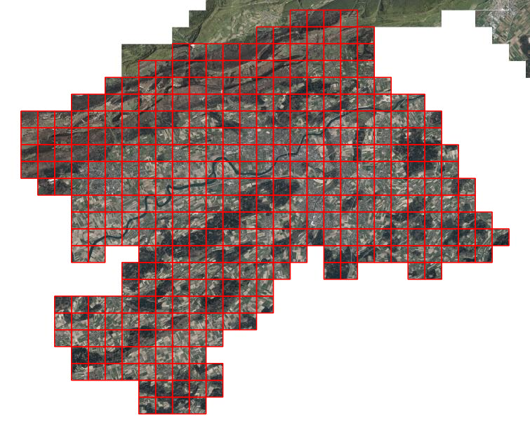
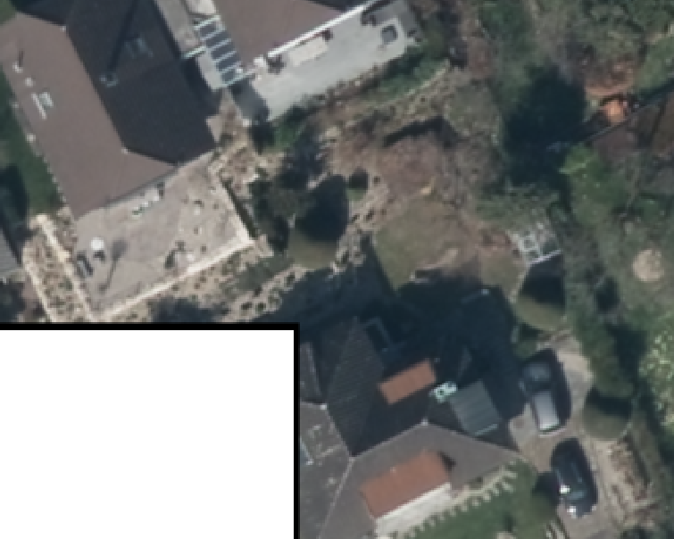

Mit dem http://www.swisstopo.admin.ch/internet/swisstopo/de/home/products/software/products/chenyx06.html[NTv2-CHENyx06-Datensatz]  lassen sich beliebige Datenformate (Vektor und Raster) transformieren. So unterstützt z.B. http://sourcepole.ch/ntv2-transformations-with-qgis[QGIS] seit der Version 2.2 diese Möglichkeit der Datumstransformation. Die Genauigkeit dieser Methode ist im Kanton Solothurn nur marginal schlechter als die strenge Transformation mit dem FINELTRA-Algorithmus. Für die allermeisten Darstellungen am Bildschirm oder für die Transformation von Rasterdaten reicht die Genauigkeit völlig aus.

Ein NTv2-Datensatz kann in verschiedenen WMS-Servern auch dazu verwendet werden Transformationen on-the-fly durchzuführen (z.B. QGIS Server, http://docs.geoserver.org/latest/en/user/advanced/crshandling/coordtransforms.html[GeoServer]). Will man aber trotzdem die Rasterdaten nicht nur on-the-fly transformieren, sondern sie auch physisch vorliegen haben, kann man das mit einem kleinen Skript und http://www.gdal.org[GDAL] machen. Oftmals reicht für nicht-hochauflösende Rasterdaten z.B. eine Translation um +2 Mio / +1 Mio. Eine andere Variante ist die strenge Transformation der Metadaten (&laquo;Worldfile&raquo;). Für hochauflösende Rasterdaten funktioniert das nur noch bedingt.

Viele der Rasterdaten liegen in einem nahtlosen Mosaik vor (z.B. Orthofotos). Nach der Transformation sollen weiterhin keine Lücken und Überlappungen zwischen den einzelnen Kacheln sichtbar sein. Um das zu erreichen wird zuerst eine Shapedatei mit den einzelnen Kacheln als Polygon erstellt. Im Kanton Solothurn sind das 1km2-Kacheln:

Dieser sogenannte Tileindex wird mit `gdaltindex` erstellt:

[source]
----
gdaltindex -write_absolute_path ortho2014.shp *.tif
----

Dabei werden sämtliche Tiff-Dateien in dem Verzeichnis berücksichtigt. Mit der Option `-write_absolute_path` wird im Attribut _location_ in der Shapedatei _ortho2014.shp_ der absolute Pfad der Tiff-Dateien gespeichert.

Jetzt ist es Zeit für das kleine Pythonskript, dass schlussendlich nichts Anderes macht als für jede dieser Kacheln ein `gdal_warp`-Befehl mit passenden Parameter zusammenzustellen und auszuführen:

[source,python,linenums,indent=0]
----
include::warp_ntv2.py[]
----

*Zeilen 4 - 5*: Benötigte Module werden geladen.

*Zeilen 7 - 8*: Es ist möglich neben EPSG-Codes für Transformation mit GDAL auch eigene proj4-Definitionen als Parameter zur übergeben. Bei der Verwendung von NTv2-Gittern ist das ein bisschen hakelig. Es gibt viele Varianten. Viele davon führen zu falschen Resultaten, zwei davon führen zu richtigen Resultaten. Abhängig davon welcher http://www.swisstopo.admin.ch/internet/swisstopo/de/home/products/software/products/chenyx06.html[NTv2-Datensatz] (_chenyx06a.gsb_ oder _chenyx06etrs.gsb_) verwendet wird. Langer Rede kurzer Sinn: Das hier ist eine Kombination, die korrekt transformiert.

*Zeile 12 - 13*: Die Shapedatei mit der Kacheleinteilung wird geöffnet und ein Layer wird angelegt.

*Zeilen 15 -16*: Die For-Schleife bearbeitet jede Kachel einzeln. Zuerst wird das Attribut _location_ ausgelesen. Es beinhaltet den kompletten absoluten Pfad der einzelnen Tiff-Datei. Davon verwenden wir aber später nur das Verzeichnis, da wir in ein Unterverzeichnis die resultierenden Tiff-Dateien speichern wollen.

*Zeilen 17 - 18*: Die Geometrie der Kachel wird ausgelesen und die _Envelope_ (Tupel mit den min/max Koordinatenwerten) berechnet.

*Zeilen 20 - 23*: Aus der _Envelope_ lesen wir die minimalen X- resp. Y-Werte. Die resultierenden Kacheln sollen wie die Ausgangskacheln &laquo;schöne&raquo; Kilometerkacheln sein. Dazu wird einfach 2 Mio. resp. 1 Mio dazugerechnet. Weil der `int`-Befehl abrundet (?), muss den Koordinatenwerten ein kleiner Wert dazu addiert werden, um keine falschen Ganzzahleswerte zu bekommen.

*Zeilen 25 - 26*: Aus den Koordinatenwerten wird der Dateinnamen der neuen Kacheln bestimmt.

*Zeilen 28 - 33*: Hier geschieht die Zauberei. Als Ausgangsdatei wird nicht die einzelne Kacheln verwendet sondern _immer_ die vrt-Datei (Diese muss u.U. vorgängig noch http://www.gdal.org/gdalbuildvrt.html[erstellt] werden). GDAL sieht jetzt nur eine einzelne, flächendeckende Rasterdatei. Somit muss nur noch der Ausschnitt gewählt werden, der aus dieser einzelnen Rasterdatei ausgeschnitten werden soll. Dieser Ausschnitt wurde ja bereits in den Zeilen 20 - 23 ermittelt. Das Resultat wird wiederum in einer Tiff-Datei gespeichert.

*Zeilen 35 - 39*: Anschliessend werden in der neuen GeoTiff-Datei noch korrekte Metadaten zum Koordinatensystem gespeichert und es werden interne Overview gerechnet.

Das Resultat sind einzelne Orthofotokacheln, die sich weder überlappen noch sind Lücken zwischen den Kacheln vorhanden. Die Übergänge sind wie im Ausgangsmaterial nicht sichtbar. Einzig am Perimeterrand sind kleine schwarze Ränder sichtbar. Diese entstehen weil im Ausgangsmaterial in diesem Bereich _keine_ Daten vorhanden sind. Liegt das Ausgangsmaterial im Bezugsrahmen LV95 vor und wird in den Bezugsrahmen LV03 transformiert, dürfte dieses Phänomen nicht auftreten.

Der Transformationsprozess dauerte für 384 Kacheln circa 1h 45m. Ein Qualitätsverlust aufgrund des Resamplings ist _nicht_ feststellbar.
