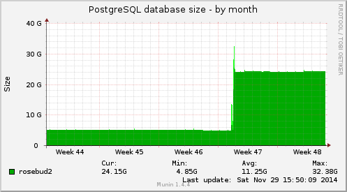
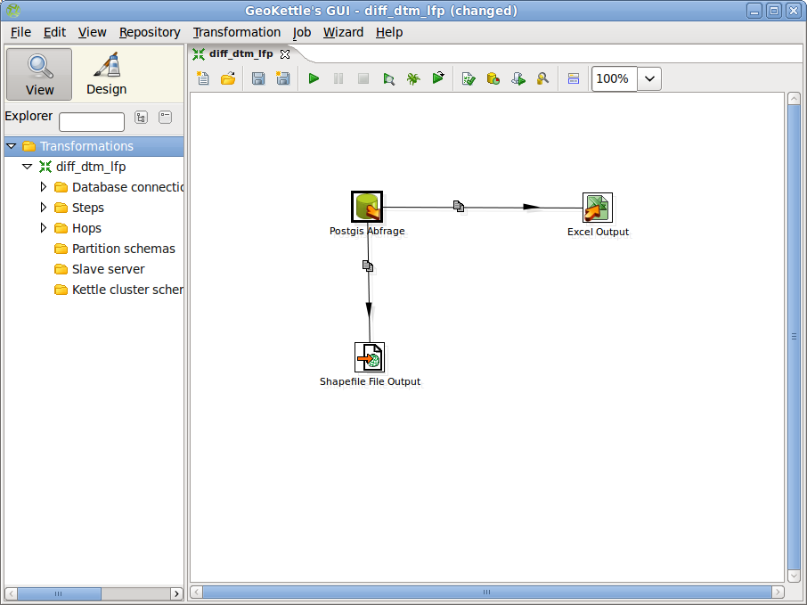
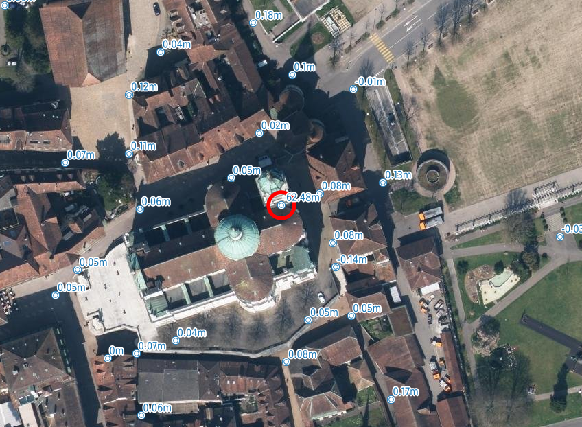

---
= Fun with GeoKettle Episode 2
Stefan Ziegler
2014-11-29
:thoth-type: post
:thoth-status: published
:thoth-tags: GeoKettle,ETL,PDI,Kettle,LiDAR,DTM,PostGIS
:idprefix:
---
Eigentlich geht es hier eher um http://postgis.net/docs/RT_reference.html[PostGIS Raster] als um http://geokettle.org/[GeoKettle]. GeoKettle wird jedoch am Schluss noch für einen kleinen Arbeitsschritt verwendet. Darum sei der Titel erlaubt.

Der Kanton Solothurn hat dieses Jahr eine http://www.catais.org/geodaten/ch/so/kva/hoehen/2014/[LiDAR-Befliegung] über sein ganzes Kantonsgebiet durchführen lassen. Neben den Rohdaten wurden abgeleitete Produkte (z.B. DTM, DOM etc.) hergestellt. Als *eine* Plausibilitätskontrolle sollen die Fixpunkte der amtlichen Vermessung mit dem 50cm-DTM verglichen werden. Möglichkeiten wie man das machen kann, gibts viele. Ich habe mich für PostGIS Raster entschieden, um ein wenig Praxis darin zu bekommen.

Zuerst muss das DTM mit dem Befehl http://postgis.net/docs/using_raster_dataman.html#RT_Raster_Loader[raster2pgsql] in PostGIS importiert werden:

[source,xml,linenums]
----
raster2pgsql -d -s 21781 -I -C -M -F -r /opt/Geodaten/ch/so/kva/hoehen/2014/dtm/*.tif -t 100x100 av_lidar_2014.dtm | psql -d rosebud2
----

Mit diesem Befehl werden sämtliche GeoTiff-Dateien im Verzeichnis `/opt/Geodaten/ch/so/kva/hoehen/2014/dtm/` in die Tabelle `dtm` im Schema `av_lidar_2014` importiert.

* `-d`: Vorhandene Tabelle wird gelöscht und neu angelegt.
* `-s 21781`: Den Daten wird das Koordinatensystem EPSG:21781 zugewiesen.
* `-I`: Es wird ein Index für die Tabelle erzeugt.
* `-C`: Verschiedene Constraints werden hinzugefügt.
* `-M`: Nach dem Import wird ein `vacuum analyze` ausgeführt.
* `-F`: Es wird eine Spalte mit dem Dateinamen in der Tabelle hinzugefügt.
* `-r`: Weiterer Constraint.
* `-t`: Die Grösse der Kacheln in welche die Ausgangsdaten geschnitten und in der Datenbank gespeichert werden. Die Grösse der Kacheln ist entscheidend für die http://duncanjg.wordpress.com/2013/09/21/effect-of-tile-size-and-data-storage-on-postgis-raster-query-times/[Ausführungsdauer] der Abfragen, die später gemacht werden. Für unseren Anwendungsfall ist es sinnvoll die Kachelgrösse eher klein zu wählen.

Das dauert je nach Datenmenge ein paar Minuten und braucht ordentlich Speicherplatz in der Datenbank (DTM und DOM, je 1066 km2):

Das wirklich Schöne an Postgis Raster ist, dass man völlig unkompliziert Vektor- und Rasterdaten gleichzeitig/gemeinsam abfragen kann. Uns interessiert die Höhe aus dem DTM an der Stelle wo ein Fixpunkt der amtlichen Vermessung vorhanden ist:

[source,sql,linenums]
----
SELECT p.ogc_fid, p.nummer, p.kategorie, p.geometrie, ST_X(p.geometrie) as x, ST_Y(p.geometrie) as y,
   p.hoehe as h_lfp, ST_Value(r.rast, p.geometrie) as h_dtm,
   (ST_Value(r.rast, p.geometrie) - p.hoehe) as diff, p.bfsnr
FROM av_avwmsde_t.cppt as p, av_lidar_2014.dtm as r
WHERE ST_Intersects(r.rast, p.geometrie)
AND p.hoehe IS NOT NULL
AND p.kategorie IN ('LFP1', 'LFP2', 'LFP3');
----

Die ganze Magie besteht aus zwei Funktionen:

* `ST_Value(r.rast, p.geometrie)`: Diese Funktion liefert für eine Koordinate (p.geometrie) den Zellenwert des Rasters (r.rast) zurück.
* `ST_Intersects(r.rast, p.geometrie)`: Funktioniert grundsätzlich gleich wie das Vektorpendant.

Alles andere ist Beigemüse.

Das Resultat wird als Shapedatei und als Exceldatei abgespeichert. Dafür verwenden wir GeoKettle. Die GeoKettle-Transformation sieht dann völlig unspektakulär so aus:

Und das Resultat? Unter Berücksichtigung der Randbedingungen (50cm-DTM, Fixpunkt teilweise unter Schacht etc.) stimmen die resultierenden Differenzen positiv:

Klar gibt es grössere Differenzen (Fixpunkt auf Gebäude oder Kunstbaute, Kirchenspitze etc.). Diese sind aber praktisch alle erklärbar (und wären auch vorgängig filterbar). Ebenso konnten einige wenige Höhenfehler in den Daten der amtlichen Vermessung gefunden werden.
