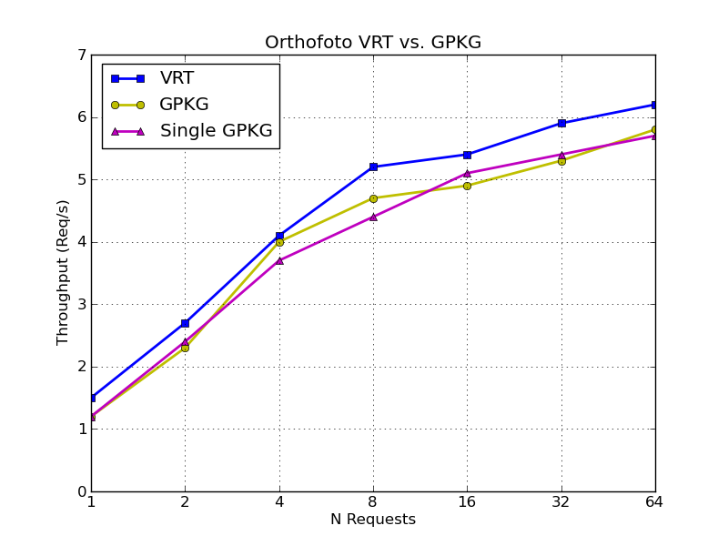

Seit http://osgeo-org.1560.x6.nabble.com/gdal-dev-GDAL-GeoPackage-raster-support-td5177342.html[kurzem] unterstützt GDAL http://www.gdal.org/drv_geopackage_raster.html[Geopackage Raster], was ziemlich cool ist. Jetzt man kann man z.B. sämtliche Orthofotos des Kantons Solothurn (1993 bis 2014) in eine http://www.catais.org/geodaten/ch/so/kva/orthofoto/orthofoto.gpkg[85 GB grosse SQLite-Datenbank] packen.

Und weil mehr oder weniger gilt &laquo;Kann es GDAL, so kann es auch QGIS.&raquo;, soll hier kurz die Performance von QGIS Server anhand eines Orthofoto-WMS verglichen werden. Momentan wird aus vielen einzelnen GeoTIFF-Dateien eine VRT-Datei erstellt und diese in QGIS geladen. Bis zum Massstab 1:20'000. Für kleinere Massstäbe wird ein 5m-Orthofoto verwendet. Ab diesem Massstab sieht man praktisch keinen Unterschied mehr zwischen Originalkacheln (12.5cm) und 5m-Orthofoto. Als Resampling-Methode wird &laquo;average&raquo; mit Faktor 2 verwendet. Insgesamt sind es drei VRT-Dateien sowie drei 5m-Orthofotos (für die Jahre 2012-2014).

Zum Vergleich werden zwei Varianten mit Geopackage herangezogen:

. Pro Jahr eine Geopackage-Datei (zwischen 5 und 10 GB).
. Eine einzige Geopackage-Datei mit sämtlichen Orthofotos (inkl. abgeleiteten Produkten, circa 85 GB)

Mit folgenden Befehlen und Parametern wurden die GPKG-Dateien erstellt:

[source,xml,linenums]
----
gdal_translate --config OGR_SQLITE_SYNCHRONOUS OFF -co APPEND_SUBDATASET=YES -co RASTER_TABLE=ch.so.agi.orthofoto.2014.rgb -co TILE_FORMAT=PNG_JPEG -of GPKG /home/stefan/Geodaten/ch/so/kva/orthofoto/2014/rgb/12_5cm/ortho2014rgb.vrt /home/stefan/tmp/orthofoto.gpkg
gdaladdo --config OGR_SQLITE_SYNCHRONOUS OFF -oo TABLE=ch.so.agi.orthofoto.2014.rgb -r average /home/stefan/tmp/orthofoto.gpkg 2 4 8 16 32 64 128 256
----

Das Testsetup war gleich wie bei http://sogeo.ch/blog/2014/01/29/qgis-server-vs-qgis-server/[anderen QGIS Server Performance Tests].

Das Resultat sieht so aus:

Anscheinend ist es völlig egal, ob drei einzelne GPKG-Dateien oder eine sehr grosse GPKG-Datei verwendet wird. Der ganz leichte Geschwindigkeitsvorteil von VRT gegenüber GPKG lässt sich beliebig wiederholen. Interessant ist aber die Tatsache, dass bei den GPKG-Varianten beinahe kein average-Resampling notwendig ist/wäre (Geschwindigkeitsfaktor circa 2.5). Da sehen die gerenderten Bilder auch mit &laquo;nearest neighbour&raquo; ganz ordentlich aus. Ganz im Gegensatz dazu die VRT-Variante, die sichtbar an visueller Qualität verliert ohne average-Resampling.
