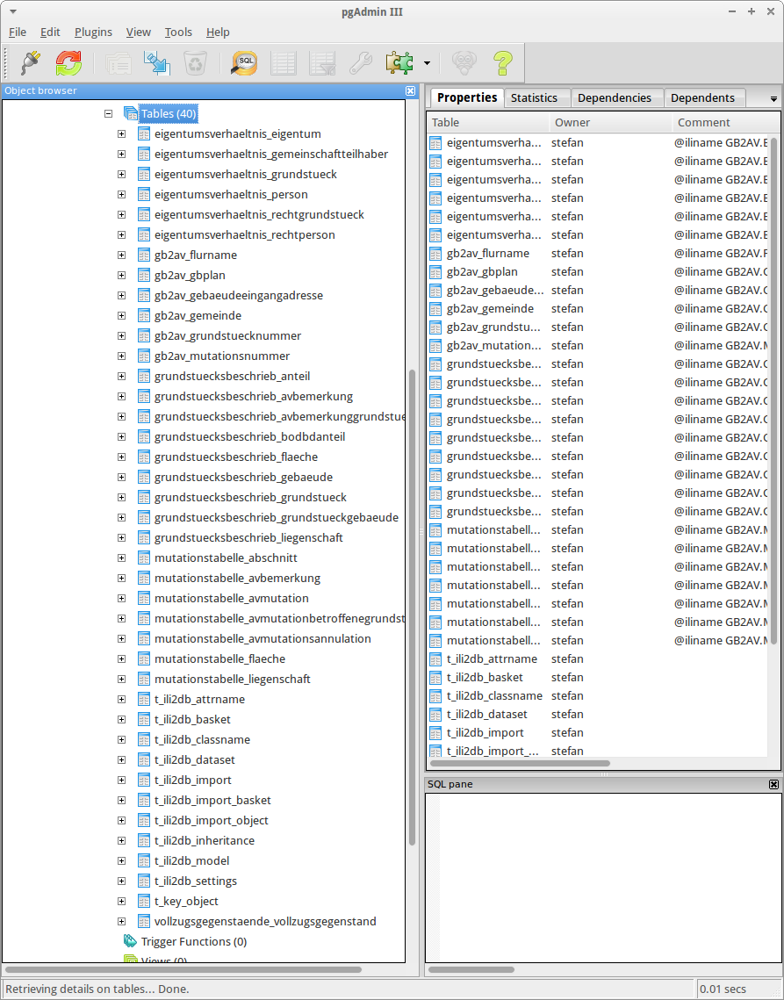
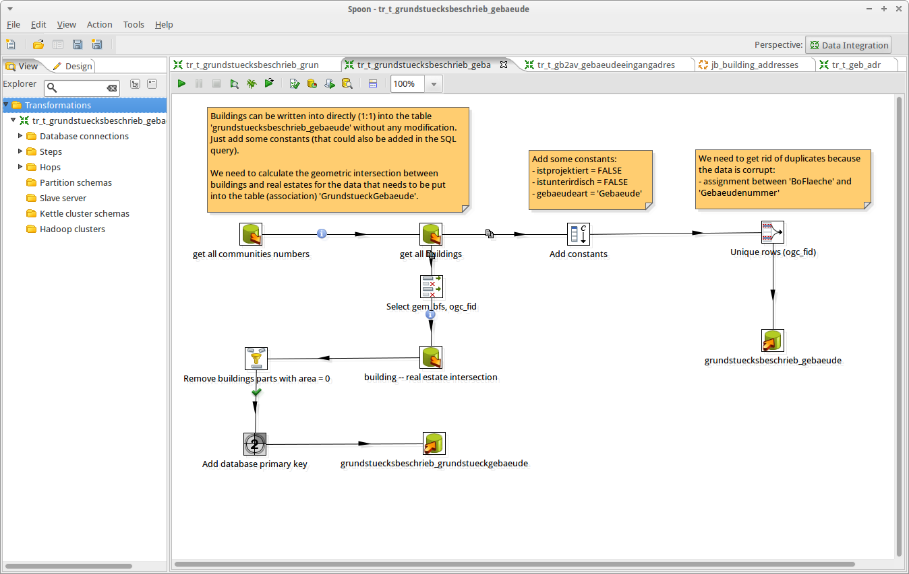

---
= Interlis leicht gemacht #1
Stefan Ziegler
2015-05-09
:thoth-type: post
:thoth-status: published
:thoth-tags: INTERLIS,ili2pg,Grundbuch,AVGBS,Kettle,GeoKettle
:idprefix:
---
Im Kanton Solothurn wird gegenwärtig die http://www.cadastre.ch/internet/gb/de/home/egris/doc/definitionen_und_schnittstellen.html[AVGBS] eingeführt. Die Gebäudeadressen sollen nicht von den einzelnen Nachführungsgeometern an das Grundbuch geliefert werden, sondern durch das http://www.agi.so.ch[Amt für Geoinformation]. Die Daten der amtlichen Vermessung - aus denen die Lieferung erstellt wird - liegen wochenaktuell als Kopie zentral in einer PostgreSQL/PostGIS-Datenbank beim Amt für Geoinformation.

Das Datenmodell http://models.geo.admin.ch/BJ/KS3-20060703.ili[GB2AV] (aka «Kleine Schnittstelle»), das die auszutauschenden Daten zwischen dem Grundbuch und der amtlichen Vermessung beschreibt, ist in INTERLIS 2.2 geschrieben. Uiuiui, INTERLIS 2... Vererbung und so. Noch nie wirklich was mit gemacht. Bisweilen immer nur INTERLIS 1. Anstatt nur Trockenübungen, ergibt sich hier und jetzt die Gelegenheit etwas Praktisches mit INTERLIS 2 zu machen. Wie kommen jetzt also die Gebäudeadressen aus unserer zentralen Datenbank ins Grundbuch? Oder anders gefragt: Wie erstelle ich diese INTERLIS 2-Transferdatei?

Das Erstellen der INTERLIS 2-Transferdatei besteht aus zwei wesentlichen Schritten: _Datenumbau_ und _Formatumbau_. Zuerst müssen die Gebäudeadressen so umgebaut werden, damit sie dem AVGBS-Modell entsprechen. Das passiert in der Datenbank. Der zweite Schritt ist dann nur noch ein Export aus der Datenbank in die INTERLIS 2-Transferdatei. Also ein Formatumbau vom Datenbankformat in das INTERLIS 2 Austauschformat.

Der Datenumbau ist ein Umbau der Daten vom Modell der amtlichen Vermessung in das AVGBS-Modell in der Datenbank. Das leere AVGBS-Modell (also die verschiedenen Tabellen) in der Postgis-Datenbank erzeugt mir die Software http://www.eisenhutinformatik.ch/interlis/ili2pg/[ili2pg]. Die Software wird zum jetzigen Zeitpunkt weiterentwickelt: Dokumentation (Programmoptionen, Abbildungsregeln von Klassen, Vererbungsstrategie), Umgang mit Kreisbogen.

Folgender Aufruf erzeugt ein Datenbankschema mit leeren Tabellen:

[source,xml,linenums]
----
java -Xms128m -Xmx2048m -jar ili2pg.jar --schemaimport --dbhost localhost --dbport 5432 --dbdatabase xanadu --dbschema av_avgbs --dbusr stefan --dbpwd ziegler12 --models GB2AV --modeldir ./ --nameByTopic
----
* `--schemaimport`: Es werden keine Daten importiert sondern lediglich leere Tabellen erzeugt.
* `--models`: Das zu verwendende Interlismodell (oder mehrere Interlismodelle).
* `--modeldir`: Verzeichnisse, wo die Interlismodelle liegen (oder Repository-URL).
* `--nameByTopic`: Die Tabellen werden nach dem Schema `Topicname_Klassenname` erzeugt.

Aus dem objektorientierten Interlismodell wurden nach gewissen Regeln in der relationalen Datenbank Tabellen erzeugt. Das Verständnis für die Abbildung des Modelles in der Datenbank braucht vielleicht ein wenig Übung. Aber hat man das UML-Diagramm, das Interlismodell und die Tabellen in der Datenbank vor Augen, lernt man das relativ schnell.

Für den eigentlichen Datenumbau - also das Abfüllen der vorher erstellen, leeren Tabellen mit den in der Datenbank vorhandenen Daten der amtlichen Vermessung - verwende ich http://community.pentaho.com/projects/data-integration/[Kettle]. Leider scheint das Projekt http://geokettle.org/[GeoKettle] nicht mehr aktiv zu sein. Da bei diesem Datenumbau keine Geometrien umher geschoben werden müssen, kann man auch das «normale» Kettle verwenden. Exemplarisch eine Transformation:

In dieser Kettle-Transformation werden sämtliche Gebäude aus den Daten der amtlichen Vermessung in die Tabelle/Klasse `Gebaeude` des Topics `Grundstuecksbeschrieb` geschrieben. Der nötige Verschnitt «Gebäude - Liegenschaft» für die Association `GrundstueckGebaeude` (ebenfalls als Tabelle in der Datenbank abgebildet) wird in der Datenbank gerechnet. Analog wird der Datenumbau für die anderen Klassen und Strukturen gemacht.

Wenn jetzt alle benötigen Daten in die neuen Tabellen umgebaut wurden, kann der Formatumbau ausgelöst werden. Beim Formatumbau hilft mir wiederum die Software `ili2pg`:

[source,xml,linenums]
----
java -jar ili2pg.jar --export --dbhost localhost --dbport 5432 --dbdatabase xanadu --dbschema av_avgbs --dbusr stefan --dbpwd ziegler12 --models GB2AV grundstuecksbeschrieb.xtf
----

Ein Verzeichnis, wo sich das Interlismodell befindet, muss man nicht mehr angeben, da das Modell in einer zusätzlichen Tabelle beim Schemaimport mit importiert wurde.

Das Ergebnis des Exportes ist eine INTERLIS 2-Transferdatei. Beim Überprüfen stellt man fest, dass die Daten aber zweimal vorhanden sind: einmal im Topic `Grundstuecksbeschrieb` und ein zweites Mal im Topic `Mutationstabelle`. Das Topic `Mutationstabelle` erbt sämtliche Klassen des Topics `Grundstuecksbeschrieb`. Beim Export weiss `ili2pg` nicht zu welchen Topic die Daten gehören und schreibt sie bei beiden. Dieses Verhalten muss in einer Weiterentwicklung geändert werden.

Dieses Vorgehen eignet sich auch hervorragend für die Umsetzung von minimalen Geodatenmodellen im Rahmen des https://www.admin.ch/opc/de/classified-compilation/20050726/index.html[GeoIG], wie Peter Staub in seinem http://www.gl.ch/documents/Whitepaper_UmsetzungMGDM.pdf[Whitepaper] eindrücklich zeigt.
