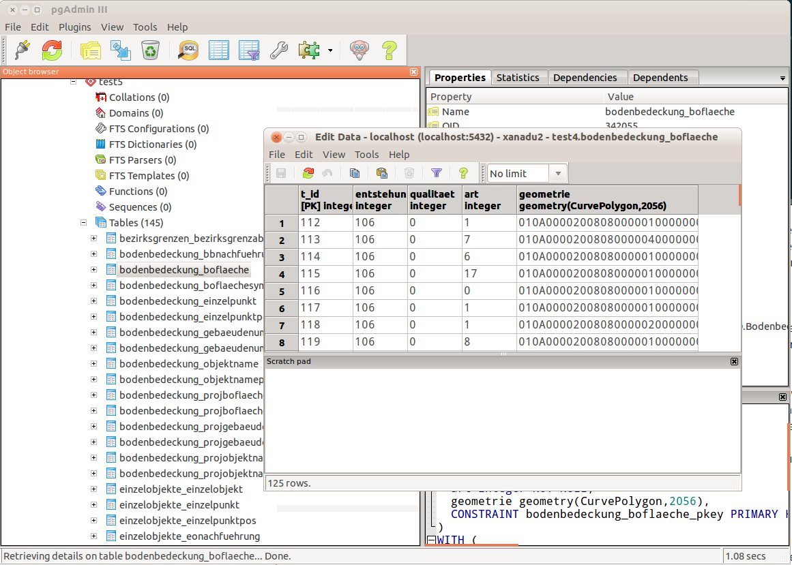

---
= Interlis leicht gemacht #2
Stefan Ziegler
2015-06-09
:thoth-type: post
:thoth-status: published
:thoth-tags: INTERLIS,ili2pg,Java
:idprefix:
---
Im http://sogeo.ch/blog/2015/05/09/interlis-leicht-gemacht-number-1/[letzten Beitrag] habe ich gezeigt, wie man einfach und effizient mit einem Kommandozeilenbefehl und dem Java-Tool http://www.eisenhutinformatik.ch/interlis/ili2pg/[ili2pg] aus INTERLIS-Modellen eine Datenbankstruktur anlegen kann.

Das Schöne an Java und an ili2pg ist, dass man diese Funktionalität jetzt auch in eigenen Java-Code und dementsprechend in einen eigenen Importprozess einbinden kann. Eventuell müssen ja vorgängig Daten bearbeiten werden oder nach dem Import müssen weitere Prozessierungen vorgenommen werden.

Wie das geht? Ganz einfach: Einzig die drei Jar-Dateien `ili2c.jar`, `ili2pg.jar` und `postgresql-9.1-901.jdbc4.jar` müssen im Klassenpfad sein. Mit einer IDE seiner/ihrer Wahl kein Problem. Das kann man sich sogar zusammenklicken.

Ein minimales Java-Programm zum Importieren einer ITF-Datei sieht wie folgt aus:

[source,java,linenums]
----
include::ili2pg_test.java[]
----

Man benötigt lediglich zwei Klassen: eine Konfigurationsklasse `Config` und die eigentliche Importklasse `Ili2db`. Mittels der Konfigurationsklasse steuert man verschiedene Parameter _und_ in welchen Datenbanktyp importiert werden soll. Dies ist nötig, um gewisse Unterschiede zwischen den Datenbanktypen abzufangen resp. anders zu behandeln.

*Zeilen 1 - 22*: Diese Zeilen sollten eigentlich selbsterklärend sein.

*Zeilen 24 - 26*: Hier wird der Konfigurationsklasse mitgeteilt, dass es sich bei der Datenbank um PostgreSQL/Postgis handelt. Dies hat Auswirkungen auf die Konvertierung der Geometrie und auf das Erstellen der SQL-Befehle.

*Zeilen 28 - 29*: Mit der Methode `setNameOptimization("topic")` werden die Datenbanktabellennamen zusammengesetzt aus Topic- und Klassennamen (verbunden mit einem Untertrich): `topic_class`. Mit der Methode `setMaxSqlNameLength("60")` wird die maximale Länge der SQL-Namen auf 60 Zeichen gesetzt. Das Setzen der maximalen Länge ist wichtig, da der Prozess sonst abbricht.

*Zeilen 31 - 32*: Wird was anderes als LV03 (EPSG:21781) importiert, muss das hier mittels EPSG-Code definiert werden.

*Zeile 34*: Hier wird die zu importierende Interlis-Datei angegeben.

*Zeilen 36 - 37*: +++<del>Warum das manuelle Zusammensetzen der Datenbankurl noch nötig ist, ist mir nicht ganz klar. Eigentlich kennt die Konfigurationsklasse bereits alle angaben, die dazu benötig werden.</del>+++

*Zeilen 40 - 41*: Zu guter Letzt kann die Importklasse instanziiert werden und der Importprozess kann gestartet werden.

Falls keine Fehlermeldungen in der Konsole erscheinen, sollten die Daten erfolgreich importiert worden sein:

