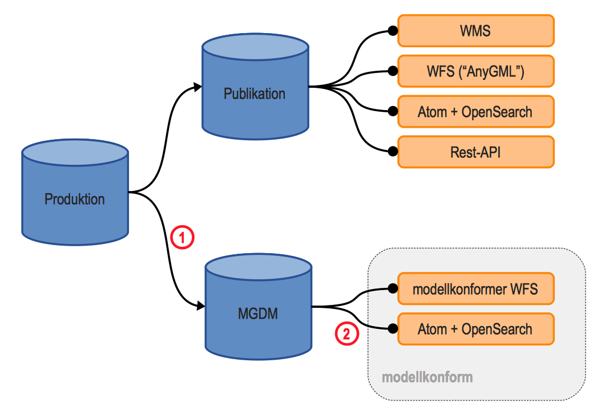
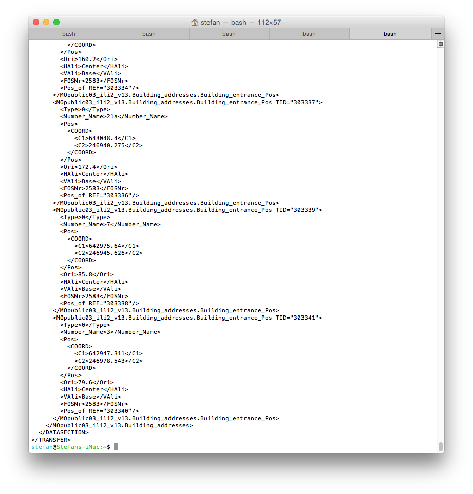
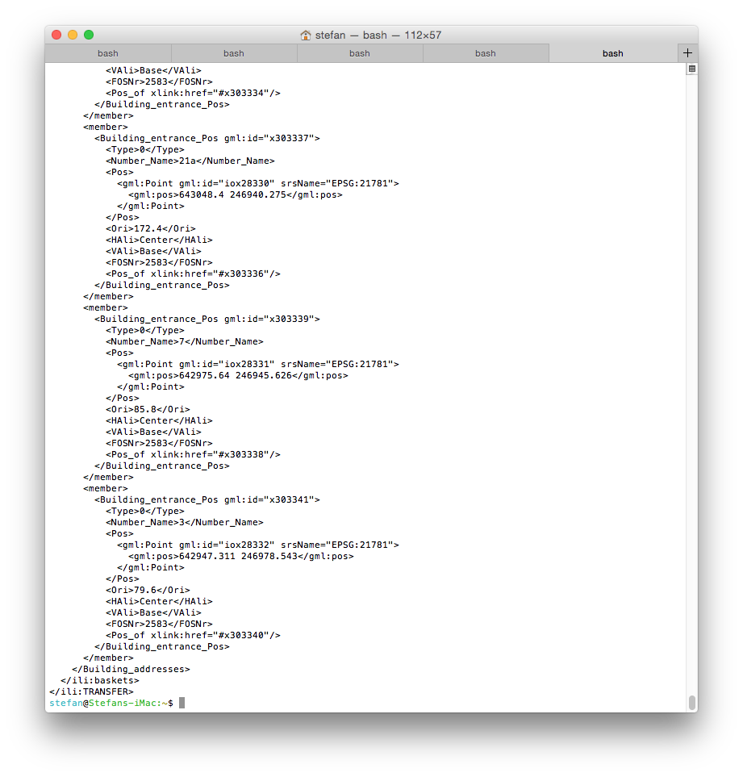

---
= Interlis leicht gemacht #3
Stefan Ziegler
2015-08-09
:thoth-type: post
:thoth-status: published
:thoth-tags: INTERLIS,ili2pg,Java
:idprefix:
---
Das GeoIG resp. die https://www.admin.ch/opc/de/classified-compilation/20071088/index.html#a34[GeoIV sieht Downloaddienste] für Geobasisdaten vor. Kurzum heisst das, dass diese Geobasisdaten _dienstebasiert_ und _modellkonform_ zum Download bereitgestellt werden. Modellkonform bedeutet - sehr einfach ausgedrückt - entweder INTERLIS/XTF oder http://www.ech.ch/vechweb/page?p=dossier&documentNumber=eCH-0118[INTERLIS/GML]. INTERLIS/GML hat den Vorteil, dass man es, im Gegensatz zu INTERLIS/XTF, sinnvoll mittels WFS bereitstellen kann. Dienstebasiert bedeutet, dass nicht bloss ein einfacher Downloadlink publiziert wird, sondern dass zusätzlich zum Link eine Serviceschicht darüber gestülpt wird.

Gedanken über das modellkonforme Bereitstellen von Geodaten hat sich http://inspire.ec.europa.eu/[INSPIRE] auch schon gemacht. Als Lösungen für Downloaddienste werden zwei Alternativen http://inspire.ec.europa.eu/documents/Network_Services/Technical_Guidance_Download_Services_v3.1.pdf[vorgeschlagen]: WFS und Atom + OpenSearch (AtOS). Informationen zu Atom + OpenSearch findet man vor allem in http://www.weichand.de/masterarbeit/Masterarbeit_Weichand.pdf[zwei] https://www.geoportal.nrw.de/application-informationen/inspire/dokumente/images/Masterthesis_Rohrbach.pdf[Masterarbeiten]. Bei Atom + OpenSearch können die (Geo)daten dateibasiert und vordefiniert heruntergeladen werden. Um dem Servicegedanken gerecht zu werden und nicht bloss stupide HTTP-Links zu publizieren, muss noch eine Schicht drüber gelegt werden. Diese pflanzt dem Ganzen ein wenig Intelligenz ein.

Setzt man sich mit der modellkonformen Bereitstellung von Geodaten auseinander, darf man zum Schluss kommen, dass die Atom + OpenSearch Lösung einfacher und effizienter für eine GDI umsetzbar ist. Zudem schlägt man zwei Fliegen mit einer Klappe:  neben modellkonformen Daten können ebenfalls nicht-modellkonforme Daten und Rasterdaten mittels Atom + OpenSearch bereitgestellt werden können. WFS kann natürlich trotzdem eingesetzt werden. In diesem Fall aber nicht für die modellkonforme Bereitstellung. Die gerade eben diskutierten Datenflüsse lassen sich grob wie folgt darstellen:

[%hardbreaks]
Das Schema zeigt die beiden Schritte (1) _Datenumbau_ und (2) _Formatumbau_. Der Datenumbau kann z.B. mit einem ETL-Werkzeug oder auch mit SQL-Befehlen durchgeführt werden. Für den Formatumbau eignet sich ja hervorragend http://www.eisenhutinformatik.ch/interlis/ili2pg/[ili2pg]. Der Formatumbau bei der Variante WFS übernimmt der WFS-Server selbst. Nun könnte man zum Schluss kommen, dass die Variante AtOS weniger aktuell als die WFS-Variante ist: Der WFS greift live auf die Daten des MGDM-Topfs zu wohingegen bei AtOS die Datei z.B. einmal pro Tag mit ili2pg physisch produziert wird. Nun, dem ist nicht so. Eine elegante Lösung ist der Einsatz der ili2pg-Bibliotheken als https://de.wikipedia.org/wiki/Servlet[Servlet]. Damit kann der Formatumbau erst beim Aufruf der URL, z.B. `http://www.example.com/2583_schoenenwerd.xtf`, ausgeführt werden. Als _Proof of Concept_ soll die amtliche Vermessung der Gemeinde Schönenwerd im Datenmodell http://www.cadastre.ch/internet/kataster/de/home/manuel-av/service/mopublic.html[MOpublic] mittels Servlet erzeugt werden.

Als erstes brauchen wir einen Servlet-Container. Anstelle von Java kann man auch - um ein paar Zeichen zu sparen - Groovy einsetzen und sich mit  http://www.eclipse.org/jetty/[Jetty] was zusammenbasteln:

[source,groovy,linenums]
----
include::webServer.groovy[]
----

Interessant sind wahrscheinlich folgende Zeilen:

*Zeile 7*: Groovy hat mit http://docs.groovy-lang.org/latest/html/documentation/grape.html[Grape] ein effizientes _Dependency Management_. Fehlt die gewünschte Bibliothek auf dem System, wird sie einmalig heruntergeladen und gespeichert.

*Zeile 13*: Hier teilen wir dem Server mit, dass bei allen Requests das Servlet `IliExport` aufgerufen werden soll.

Das Formatumbau/Export-Servlet sieht dann wie folgt aus:

[source,groovy,linenums]
----
include::IliExport.groovy[]
----

*Zeilen 1 -2*: Weil JDBC-Treiber anders geladen werden, müssen wir Grape speziell konfigurieren. Brauchen wir spezielle Mavenrepositories müssen wir diese ebenfalls angeben (Zeile 2).

*Zeilen 26 - 34*: Sämtliche Requests werden auf dieses Servlet umgeleitet (siehe oben). Der URL-Aufruf entspricht ja eigentlich einem Download einer statischen Datei (INTERLIS/XTF-Datei der Gemeinde Schönenwerd), dh. der Request sieht in unserem Fall wie folgt aus: `http://localhost:8080/2583_schoenenwerd.xtf`. Die dazugehörigen Daten liegen in der Datenbank in einem Schema. In welchem Schema steht aber nicht in der URL, sondern das müssen wir mittels Mapping herausfinden. In diesem einfachen Proof of Concept stehen die benötigten Informationen in einer `Map`. Anstelle der `Map` ist natürlich auch eine Meta-DB o.ä. vorstellbar. Neben des Speicherortes (Datenbankschema) müssen wir noch den Interlis-Modellnamen kennen.

*Zeilen 36 - 66*: Die INTERLIS/XTF-Datei wird erzeugt und in ein temporäres Verzeichnis geschrieben (= Formatumbau).

*Zeilen 68 - 81*: Die gerade eben erzeugte Datei wird an den Klienten gestreamt.

Um den Browser nicht zu arg zu belasten (bei 25 MB XML) verwenden wir cURL in der Konsole, um die Datei herunterzuladen:

[source,xml,linenums]
----
curl http://localhost:8080/2583_schoenenwerd.xtf | xmllint --format -
----

Mit `xmllint` wird das heruntergeladene XML noch schön formatiert. Der Formatumbau dauert für die Gemeinde Schönenwerd circa fünf Sekunden und das Resultat kann sich sehen lassen:

Ein Vorteil von ili2pg ist, dass es neben INTERLIS/XTF auch INTERLIS/GML exportieren kann. Der Anwender muss nur *drei* Buchstaben ändern (.xtf -> .gml):

[source,xml,linenums]
----
curl http://localhost:8080/2583_schoenenwerd.gml | xmllint --format -
----

Wiederum fünf Sekunden später erfreuen wir uns über die GML-Datei:

Je nach Situation (Komplexität und Methode) könnte man auch den Datenumbau (1) gerade beim Aufruf erledigen. In unserem Fall wird der Datenumbau mit SQL-Befehlen gemacht und dauert weniger als eine Sekunde.

Eleganter wäre sicher auch wenn man auf das Zwischenspeichern in einer temporären Datei verzichten könnte und ili2pg direkt zum Klienten streamen könnte. Dann muss man auch nicht mehr den Knorz in den Zeilen 68 - 81 durchführen. Soweit ich das verstehe, dürfte das möglich sein, da die darunterliegende Klasse http://www.eisenhutinformatik.ch/iox-ili/javadocs/ch/interlis/iom_j/xtf/XtfWriter.html[XtfWriter] dies bereits unterstützt.

Und sollte aus ili2pg irgendwann einmal ein ili2GeoPackage werden, können auch Nicht-PostgreSQL-Anwender diese Bibliotheken verwenden. Man muss bloss den Datenumbau aus dem proprietären System nach GeoPackage machen und den Rest übernimmt ili2GeoPackage...
