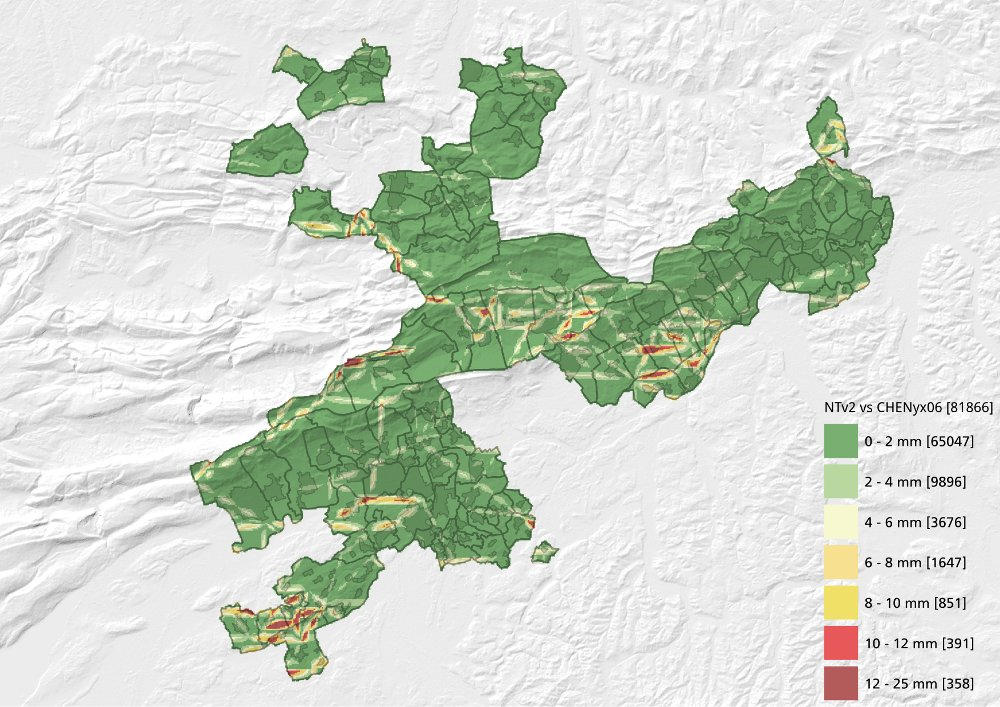
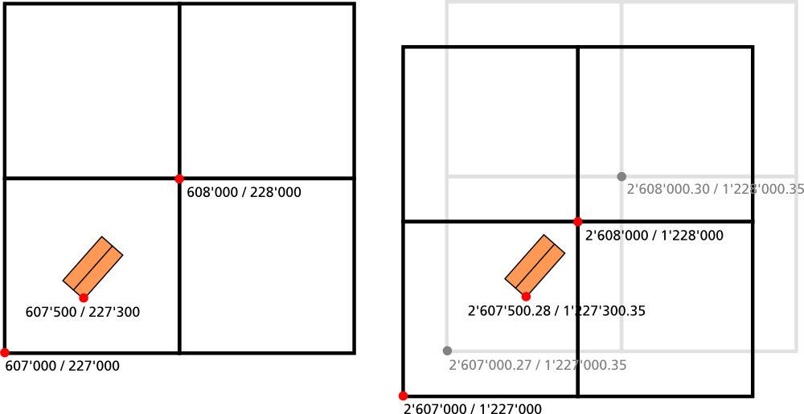

Im Frühjahr 2014 liess der Kanton Solothurn eine LiDAR-Befliegung über das http://www.sogis1.so.ch/map/lidar[gesamte Kantonsgebiet] durchführen. Die Daten wurden, wie von uns gewünscht, im Bezugsrahmen LV03 geliefert. Nicht die sinnvollste Entscheidung... Der Bezugsrahmenwechsel steht definitiv vor der Tür und falls wir wollen, dass die Rohdaten in Zukunft noch verwendet werden, müssen wir wohl oder übel auch die 1'066 LAZ-Dateien transformieren.

Für die Transformation stehen - je nach Genauigkeit der Daten - verschiedene Transformationsmethoden zur Verfügung. Eine davon ist die Transformation mittels NTv2-Gitter. Anstelle der Dreiecke wird hier ein regelmässiges Gitter verwendet. Die Differenz zwischen der Transformation mittels Dreiecksvermaschung und NTv2-Gitter ist im Kanton Solothurn sehr klein:

Die Abbildung zeigt die Differenzen eines 100 m x 100 m Rasters. In drei sehr kleinen Gebieten wird die maximale Abweichung von 25 mm erreicht. Der Mittelwert ist 1.3 mm, der Median bloss 0.6 mm. Die Genauigkeit der LiDAR-Daten liegt im einstelligen bis tiefen zweistelligen Zentimeterbereich. Für die Transformation genügt das NTv2-Gitter also vollkommen.

Eine Bedingung an die transformierten Daten ist, dass sie ebenfalls wieder in Quadratkilometer-Kacheln mit &laquo;schönen&raquo; Boundingbox-Koordinaten vorliegen:

Das Bild zeigt exemplarisch vier Kacheln. Im linken Teil sind diese vier Kacheln im Bezugsrahmen LV03 gezeichnet. Im rechten Teil (Bezugsrahmen LV95) sind die transformierten Kacheln grau gezeichnet. Diese &laquo;hässlichen&raquo; Koordinaten sind aber für die Kacheleinteilung nicht erwünscht, sondern die &laquo;schönen&raquo; runden Koordinaten. Das bedeutet, dass die graue Kachel mit dem Gebäude neu in vier Kacheln zu liegen kommt. Anders formuliert: Das Gebäude liegt in einer neuen Kachel, die Daten aus vier alten Kacheln beinhaltet.

Die Software muss also etwas Ähnliches wie GDAL mit seinem http://www.gdal.org/drv_vrt.html[vrt-Treiber] anbieten. Dann kann man  genau gleich vorgehen wie bereits mit den http://sogeo.ch/blog/2014/11/15/bezugsrahmenwechsel-transformation-von-rasterdaten-number-1/[Orthofotos].

http://www.pdal.io/[PDAL] ist ein relativ neues Projekt. Es ist eine Bibliothek für «translating and manipulating point cloud data». Was GDAL für 2D-Pixel-Daten heute ist, will PDAL für multidimensionale Punkte werden.

Zuerst muss ein Tileindex für sämtliche Kacheln http://www.pdal.io/apps.html#tindex-command[erzeugt] werden:

[source,xml,linenums]
----
find /home/stefan/mr_candie_nas/Geodaten/ch/so/agi/hoehen/2014/lidar/ -maxdepth 1 -iname "*.laz" | pdal tindex tileindex.gpkg -f "GPKG" --a_srs EPSG:21781 --t_srs EPSG:21781 --fast_boundary --stdin --lyr_name tileindex
----

Der Befehl sucht alle Dateien mit der Endung `*.laz` und schreibt die Boundingbox in eine GeoPackage-Datei. Mit der Option `--a_srs EPSG:21781` wird den LiDAR-Daten ein Koordinatensystem zugewiesen. Ob die LiDAR-Daten bereits mit einem Koordinatensystem versehen sind, lässt sich mit dem http://www.pdal.io/apps.html#info-command[`pdal info`-Befehl] herausfinden:

[source,xml,linenums]
----
pdal info --metadata LAS_592228.laz
----

liefert:

[source,json,linenums]
----
{
  "filename": "LAS_592228.laz",
  "metadata":
  {
    "comp_spatialreference": "",
    "compressed": true,
    "count": 14347366,
    "creation_doy": 312,
    "creation_year": 2014,
    "dataformat_id": 1,
    "dataoffset": 329,
    "filesource_id": 0,
    "global_encoding": "AAA=",
    "header_size": 227,
    "major_version": 1,
    "maxx": 592999.98999999999,
    "maxy": 228999.98999999999,
    "maxz": 2134.52,
    "minor_version": 2,
    "minx": 592000,
    "miny": 228000,
    "minz": 918.08000000000004,
    "offset_x": -0,
    "offset_y": -0,
    "offset_z": -0,
    "project_id": "00000000-0000-0000-0000-000000000000",
    "scale_x": 0.01,
    "scale_y": 0.01,
    "scale_z": 0.01,
    "software_id": "TerraScan",
    "spatialreference": "",
    "system_id": ""
  },
  "pdal_version": "1.0.0.b1 (git-version: 1dce22)"
}
----

Hat die Datei bereits ein Koordinatensystem, sieht der Output so aus:

[source,json,linenums]
----
{
  "filename": "LAS_592228.laz",
  "metadata":
  {
    "comp_spatialreference": "PROJCS[\"CH1903 / LV03\",GEOGCS[\"CH1903\",DATUM[\"CH1903\",SPHEROID[\"Bessel 1841\",6377397.155,299.1528128,AUTHORITY[\"EPSG\",\"7004\"]],TOWGS84[674.4,15.1,405.3,0,0,0,0],AUTHORITY[\"EPSG\",\"6149\"]],PRIMEM[\"Greenwich\",0,AUTHORITY[\"EPSG\",\"8901\"]],UNIT[\"degree\",0.0174532925199433,AUTHORITY[\"EPSG\",\"9122\"]],AUTHORITY[\"EPSG\",\"4149\"]],PROJECTION[\"Hotine_Oblique_Mercator_Azimuth_Center\"],PARAMETER[\"latitude_of_center\",46.95240555555556],PARAMETER[\"longitude_of_center\",7.439583333333333],PARAMETER[\"azimuth\",90],PARAMETER[\"rectified_grid_angle\",90],PARAMETER[\"scale_factor\",1],PARAMETER[\"false_easting\",600000],PARAMETER[\"false_northing\",200000],UNIT[\"metre\",1,AUTHORITY[\"EPSG\",\"9001\"]],AXIS[\"Y\",EAST],AXIS[\"X\",NORTH],AUTHORITY[\"EPSG\",\"21781\"]]",
    "compressed": true,
    "count": 14347366,
    "creation_doy": 224,
    "creation_year": 2015,
    "dataformat_id": 3,
    "dataoffset": 2181,
    "filesource_id": 0,
    "global_encoding": "AAA=",
    "header_size": 227,
    "major_version": 1,
    "maxx": 592999.98999999999,
    "maxy": 228999.98999999999,
    "maxz": 2134.52,
    "minor_version": 2,
    "minx": 592000,
    "miny": 228000,
    "minz": 918.08000000000004,
    "offset_x": 0,
    "offset_y": 0,
    "offset_z": 0,
    "project_id": "00000000-0000-0000-0000-000000000000",
    "scale_x": 0.01,
    "scale_y": 0.01,
    "scale_z": 0.01,
    "software_id": "PDAL 1.0.0.b1 (e412bd)",
    "spatialreference": "PROJCS[\"CH1903 / LV03\",GEOGCS[\"CH1903\",DATUM[\"CH1903\",SPHEROID[\"Bessel 1841\",6377397.155,299.1528128,AUTHORITY[\"EPSG\",\"7004\"]],TOWGS84[674.4,15.1,405.3,0,0,0,0],AUTHORITY[\"EPSG\",\"6149\"]],PRIMEM[\"Greenwich\",0,AUTHORITY[\"EPSG\",\"8901\"]],UNIT[\"degree\",0.0174532925199433,AUTHORITY[\"EPSG\",\"9122\"]],AUTHORITY[\"EPSG\",\"4149\"]],PROJECTION[\"Hotine_Oblique_Mercator_Azimuth_Center\"],PARAMETER[\"latitude_of_center\",46.95240555555556],PARAMETER[\"longitude_of_center\",7.439583333333333],PARAMETER[\"azimuth\",90],PARAMETER[\"rectified_grid_angle\",90],PARAMETER[\"scale_factor\",1],PARAMETER[\"false_easting\",600000],PARAMETER[\"false_northing\",200000],UNIT[\"metre\",1,AUTHORITY[\"EPSG\",\"9001\"]],AXIS[\"Y\",EAST],AXIS[\"X\",NORTH],AUTHORITY[\"EPSG\",\"21781\"]]",
    "system_id": "PDAL"
  },
  "pdal_version": "1.0.0.b1 (git-version: 1dce22)"
}
----

Die Option `--t_srs` beschreibt das Koordinatensystem des zu erzeugenden Tileindexes. Mit `--fast_boundary` wird die Boundingbox nicht aus den Daten selbst eruiert, sondern es werden die Koordinaten aus den Metadaten verwenden. Und ja, es ist massiv schneller.

Anschliessend an die Erstellung des Tileindexes, kann mittels Pythonskript, einer For-Schleife und dreier PDAL-Befehlen das gewünschte Resultat berechnet werden:

[source,python,linenums]
----
include::reframe_lidar.py[]
----

Das Grundprinzip resp. -vorgehen steht bereits http://sogeo.ch/blog/2014/11/15/bezugsrahmenwechsel-transformation-von-rasterdaten-number-1/[hier]. Interessant sind bloss die drei PDAL-Aufrufe:

*Zeilen 48 - 50*: Es wird aus dem Tileindex eine etwas (`BUFFER` = 2 Meter) grössere Kachel ausgeschnitten. Es muss nur soviel mehr sein, dass wir anschliessend an die Transformation garantiert &laquo;schöne&raquo; LV95-Koordinaten ausschneiden können. Mit `pdal tindex` und der Option `--merge` können Daten, die in einem Tileindex vorliegen, zusammengefügt werden. Zusätzlich gibt es die Option `--bounds` mit der nur ein ganz bestimmtes Rechteck gemerged resp. ausgeschnitten werden kann. Leider - so wie ich es verstanden habe - werden jeweils zuerst sämtliche vom Rechteck betroffene Kacheln komplett zusammengefügt und erst anschliessend ausgeschnitten. Das schlägt sich einerseits in der Geschwindigkeit und andererseits im RAM-Verbrauch nieder. In Normalfall sind ja neun Kacheln betroffen, die zuerst zusammengefügt werden müssen. Das braucht circa 9 GB RAM.

*Zeilen 53 - 54*: Nach dem Zusammenfügen und Ausschneiden können die Daten mit dem NTv2-Grid transformiert werden. Dazu verwendet man den Befehl `pdal translate`.

*Zeilen 58 - 59*: Zu guter Letzt müssen die transformierten Daten auf die &laquo;schönen&raquo; Koordinaten zurechtgeschnitten werden. Zudem kann in diesem Schritt das Koordinatensystem in den Metadaten sauber gesetzt werden (`--a_srs EPSG:2056` und `--t_srs EPSG:2056`). Sonst stehen da die hässlichen PROJ4-Strings der NTv2-Transformation drin. Für das Zuschneiden kann der Befehl `pdal translate` mit der Option `--bounds` verwendet werden.

Das Resultat sind jetzt 1'066 LiDAR-Kacheln mit &laquo;schönen&raquo; Boundingbox-Koordinaten in LV95.

Die ganze Rechnerei dauert aber ein wenig. Liegen die Daten lokal auf der SSD vor, dauert das Prozedere für eine Kachel circa 150 Sekunden. Mein Setup war aufgrund des Platzbedarfs leider ziemlich übel: Die Daten liegen auf einem NAS, das via WLAN an den Computer angebunden ist. Gerechnet wird in einer virtuellen Maschine, in der das NAS mit `sshfs` gemounted ist. So rechnete das fast 4 Tage vor sich hin. Also fast doppelt so lange.

Hätte man jedoch genügend RAM, könnte man den Prozess leicht parallelisieren. Man muss bloss das Skript x-mal anstossen und die For-Schleife dürfte nicht den gleichen Tileindex als Input haben.

Der Prozess selbst konnte leicht optimert werden, indem beim Zwischenschritt nicht mit der Option `-c` komprimiert wurde. Ebenfalls gewinnbringend wirkt sich der Einsatz von `--bounds` anstelle `--polygon` aus. Will man also bloss ein Rechteck ausscheiden und nicht ein beliebiges Polygon reicht `--bounds` allemal und `pdal` muss in diesem Fall keine teuren http://trac.osgeo.org/geos/[GEOS]-Operationen verwenden.
