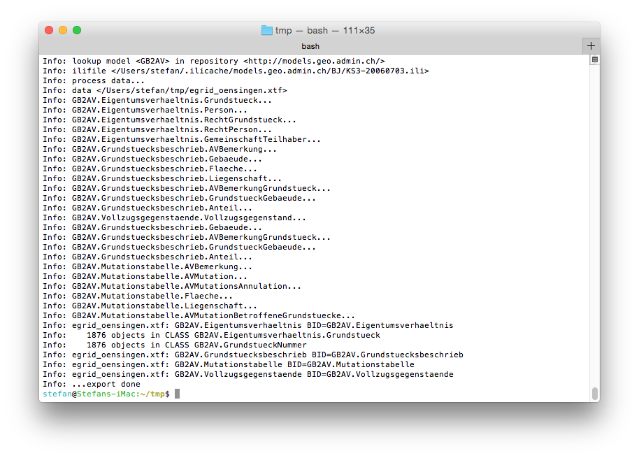
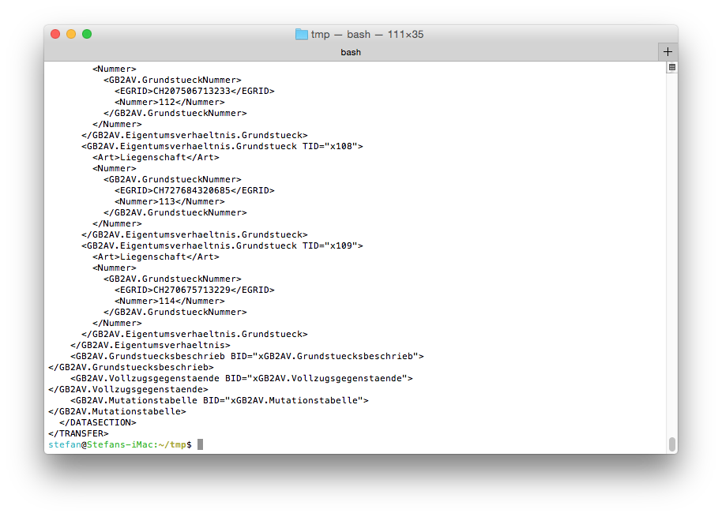

---
= Interlis leicht gemacht #4
Stefan Ziegler
2015-08-30
:thoth-type: post
:thoth-status: published
:thoth-tags: INTERLIS,ili2pg,Java,Groovy,AVGBS
:idprefix:
---
Wir sind momentan dabei im Kanton Solothurn die http://models.geo.admin.ch/BJ/KS3-20060703.ili[AVGBS] einzuführen. In einem Pilotprojekt sollen verschiedene Geschäftsfälle durchgespielt werden. Dafür müssen in der amtlichen Vermessung die Grundstücke das Attribut &laquo;EGRIS_EGRID&raquo; führen. Im Grundbuch wird der EGRID bereits geführt. Eine Liste aller Grundstücke (inkl. EGRID) kann vom Grundbuch als CSV-Datei exportiert werden. Die Frage lautet also nun: Wie kommen die EGRID aus dem Grundbuch in die amtliche Vermessung beim Nachführungsgeometer?

Eine Variante ist das manuelle Abfüllen des EGRID im AV-Erfassungssystem. Bei fast 2000 Grundstücken in der Pilotgemeinde macht das wenig Spass, ist fehleranfällig und wird ewig dauern. Mmmmh, es geht hier doch um AVGBS. Warum erstellen wir nicht eine AVGBS-Datei, die der Nachführungsgeometer in seinem System einlesen kann? Gesagt, getan. Mit einem kleinen http://www.groovy-lang.org/[Groovy]-Skript und http://www.eisenhutinformatik.ch/interlis/ili2pg/[ili2pg] wird das TOPIC `Eigentumsverhaeltnis` mit der CLASS `Grundstueck` erstellt, abgefüllt und anschliessend in einer INTERLIS-Datei dem Nachführungsgeometer zur Verfügung gestellt. Dieser kann die INTERLIS-Datei einlesen und der EGRID wird den Grundstücken in seinem System zugewiesen.

Der komplette Prozess kann in vier Schritte unterteilt werden:

. Erstellen der INTERLIS-Modellstruktur in der Datenbank
. Importieren der CSV-Datei mit den EGRID in die Datenbank
. Abfüllen der in Schritt (1) erstellten Tabellen mit den benötigten Informationen
. Exportieren der INTERLIS-Datei

[source,groovy,linenums]
----
include::egrid.groovy[]
----

*Zeilen 34 - 61*: Im ersten Schritt wird das Schema, in dem die INTERLIS-Modellstruktur angelegt wird, gelöscht (falls es existiert). Anschliessend werden mit ili2pg die leeren Tabellen in der Datenbank angelegt. Mehr Informationen zu den Konfigurationsparametern gibts http://sogeo.ch/blog/2015/06/09/interlis-leicht-gemacht-p2/[hier].

*Zeilen 66 - 86*: Die Daten aus der CSV-Datei müssen in die Datenbank importiert werden, um anschliessend Abfragen durchführen zu können. Ein eleganter Weg die Daten zu importieren, ist die Verwendung eines http://www.postgresql.org/docs/9.4/static/file-fdw.html[Foreign Data Wrappers] für Textdateien. Die Kenntnis über die Struktur (also die Spalten der CSV-Datei und das verwendete Trennzeichen) reicht, um mit einem `CREATE FOREIGN TABLE` die Daten zu «importieren». Mit `assert` wird geprüft, ob auch wirklich alles importiert wurde.

*Zeilen 91 - 136*: Anschliessend können mit SQL-Befehlen die AV-Daten mit den importierten Grundbuchdaten verknüpft werden und das gewünschte Ergebnis in die passenden Tabellen (aus Schritt 1) gespeichert werden. Verwendet werden http://www.postgresql.org/docs/9.4/static/queries-with.html[Common Table Expressions]. Somit fallen die x-fach verschachtelten Subqueries weg.

Aus dem TOPIC `Eigentumsverhaeltnis` interessiert eigentlich nur die CLASS `Grundstueck`. Die Klasse verwendet jedoch eine STRUCTURE, die in der relationalen Datenbank in einer weiteren Tabelle abgebildet wird. So müssen Daten in zwei Tabellen geschrieben werden.

Auch hier überprüfen wir wieder auf Vollständigkeit: In beiden Tabellen, in die wir Daten geschrieben haben, müssen genau gleich viele Objekte vorhanden sein, wie in der Ausgangstabelle (Liegenschaften der amtlichen Vermessung).

Die selbständigen und dauerenden Rechte fehlen in der Abfrage, können aber genau gleich behandelt werden.

*Zeilen 141 - 142*: Zu guter Letzt exportieren wird unsere Arbeit in eine INTERLIS/XTF-Datei.

Die Log-Informationen des Exportprozesses sehen schon mal gut aus:

Ein kurzer Blick in die INTERLIS/XTF-Datei zeigt das gewünschte Resultat:

