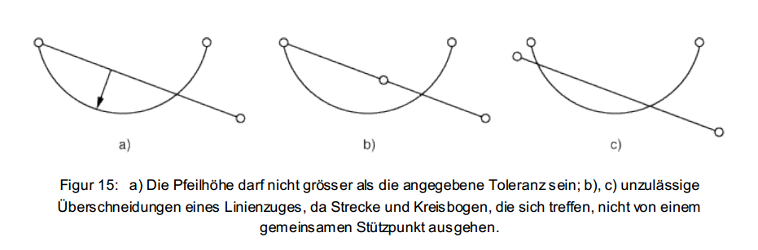
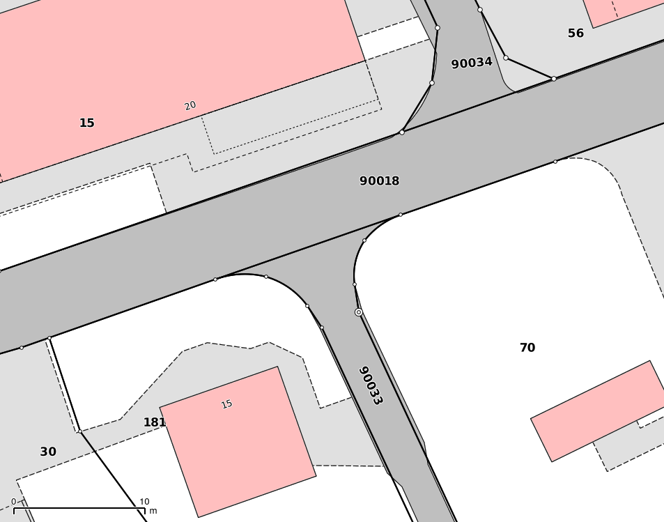
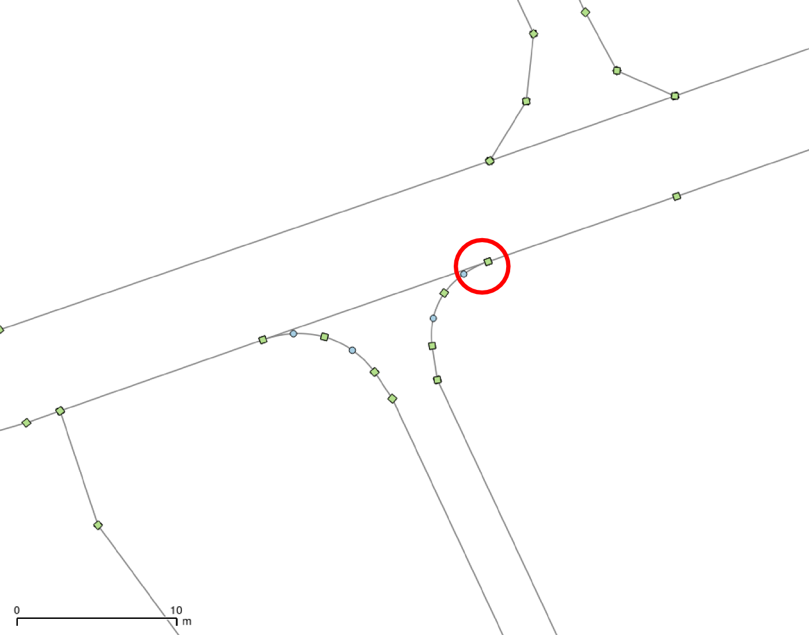
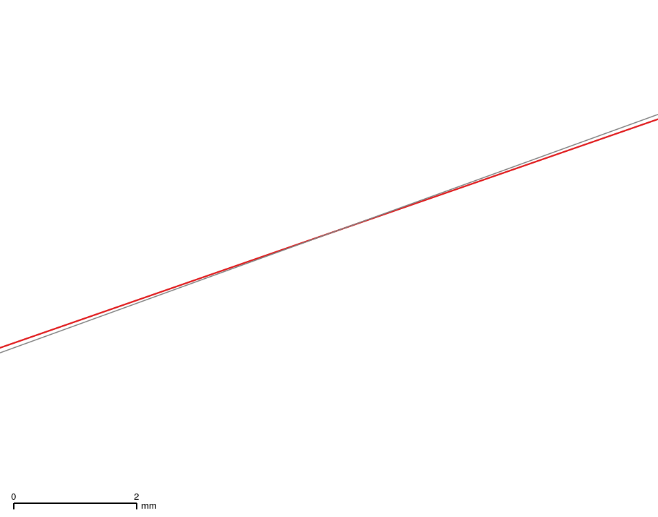
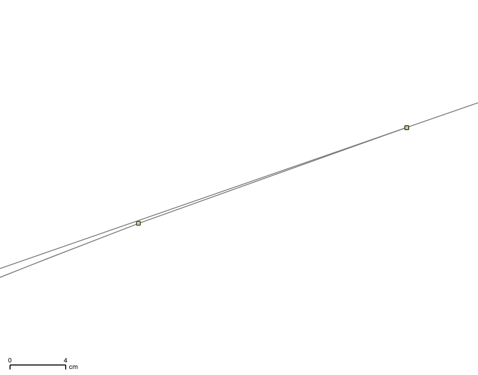
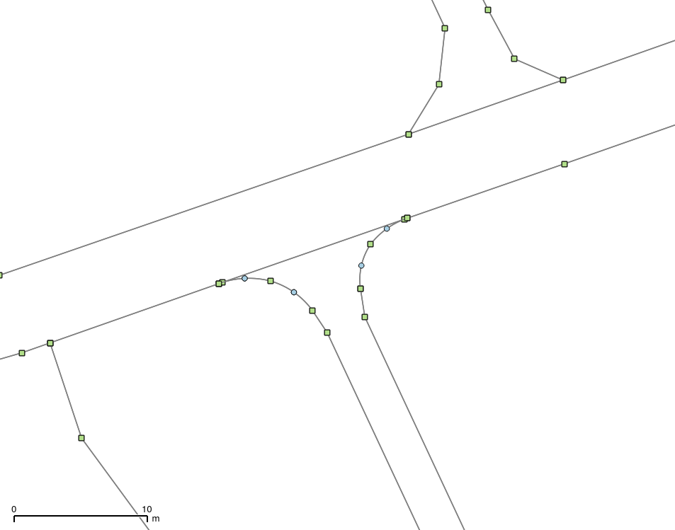

---
= Interlis leicht gemacht #5
Stefan Ziegler
2015-10-03
:thoth-type: post
:thoth-status: published
:thoth-tags: INTERLIS,ili2pg,Java,QGIS
:idprefix:
---
Overlaps in INTERLIS. Eine leidige Geschichte. Im http://www.interlis.ch/interlis2/docs23/ili2-refman_2006-04-13_d.pdf[Referenzhandbuch] ist auf den Seiten 49 und 50 beschrieben was erlaubt ist. Fairerweise muss man erwähnen, dass das Verbieten von Overlaps im INTERLIS-Modell das Problem aber trotzdem nicht lösen würde. Möglich blieben Overlaps (aka Self-Intersections) aus rein numerischen Gründen. Hier die erläuternde Skizze aus dem Handbuch ((c) by KOGIS, CH-3084-Wabern, http://www.kogis.ch[www.kogis.ch]):

Das Problem mit Overlaps ist, dass Geometrien mit solchen im OGC Simple Feature Universum http://www.postgis.net/docs/ST_IsValid.html[nicht gültig] sind und beim Prozessieren für nicht zuverlässige Resultate sorgen oder auch zu gar keinen.

Solche Overlaps sind unter anderem häufig in der amtlichen Vermessung bei Einlenkern anzutreffen:

Soweit sieht das ganz gut aus. Um das Ganze übersichtlicher zu gestalten, lassen wir alles weg, was nicht Liegenchaften sind und markieren die Stützpunkte. Die grünen Quadrate kennzeichnen die Linienstützpunkte `LIPT` und die blauen Kreise die Bogenstützpunkte `ARCP`:

Sieht eigentlich immer noch gut aus. Zoomt man jetzt aber beim rechten Einlenker (roter Kreis) stark rein, wird die Self-Intersection sichtbar. Eine der beiden Linien ist rot eingefärbt, um das Kreuzen (= Self-Intersection = Overlap) der Linien besser sichtbar zu machen:

Wie ging man bis anhin mit diesem Problem um? Eine Variante ist die einzelnen Linienstücke während des INTERLIS-Importes neu zu verknoten. Dort wo sich die Linien kreuzen wird ein neuer Stützpunkt gerechnet und anschliessend wird polygoniert. Dabei entsteht ein klitzekleines Polygon. Für den Umgang mit diesem Polygon gibts wiederum ein paar Varianten:

* Es wird gelöscht. Unschön, da jetzt eine Lücke im Datensatz entsteht (bei Areas).
* Es wird dem &laquo;Ursprungs&raquo;-Polygon zugewiesen. Unschön, da jetzt ein Multipolygon entsteht resp. entstehen muss. Das INTERLIS-Datenmodell sieht aber unter Umständen keine Multipolygone vor (Constraints in der Datenbank lassen grüssen).
* Es wird dem Nachbarpolygon mit der längsten gemeinsamen Kanten zugewiesen. Unschön, da jetzt der Endpunkt des &laquo;Ursprungs&raquo;-Polygons nicht mehr am &laquo;Ursprungs&raquo;-Endpunkt zu liegen kommt. In der amtlichen Vermessung würde das bedeuten, dass auf diesem Stützpunkt des Polygons kein Grenzpunkt liegt obwohl doch eigentlich einer da sein sollte.

In der neusten Version von http://www.eisenhutinformatik.ch/interlis/ili2pg/[ili2pg] wurde eine bessere Variante implementiert. Um die Topologie (wenn man das so nennen darf) resp. die Nachbarschaftsbeziehungen zwischen den Polygonen besser einzuhalten wird auf dem Kreisbogen in genügend grossem Abstand (abhängig vom erlaubten OVERLAP-Wert im INTERLIS-Datenmodell) von der tangential zulaufenden Gerade ein neuer Stützpunkt gerechnet. Von diesem neuen Stützpunkt wird anschliessend ein kleines Geradenstück bis zum Endpunkt gezogen. Vielleicht sagt ein Bild mehr als 1'000 komplizierte Worte:

Rausgezoomt wird die neue Situation nochmals deutlicher sichtbar:

Teil dieses Weiterentwicklungspaketes von ili2pg war ebenfalls die Unterstützung der Flächenbildung unter Beibehaltung der Kreisbogengeometrien. Diese werden neu nicht mehr segmentiert, sondern das Resultat eines INTERLIS1-Importes in die Postgis-Datenbank sind Geometrien vom Typ `COMPOUNDCURVE` und `CURVEPOLYGON`. Mit dem Programmparameter `--strokeArcs` können Kreisbogen weiterhin segmentiert werden.

Diese Weiterentwicklungen wurden finanziell unterstützt durch die Kantone http://www.be.ch/agi[Bern], http://geo.gl.ch/[Glarus] und http://www.agi.so.ch[Solothurn] und durch die Firma http://www.eisenhutinformatik.ch/[Eisenhut Informatik AG] ausgeführt. Besten Dank!
