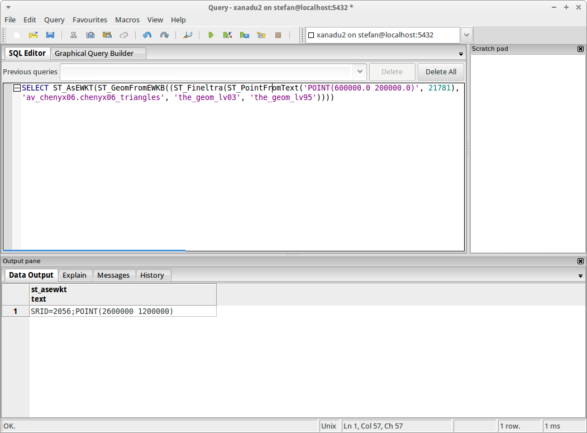
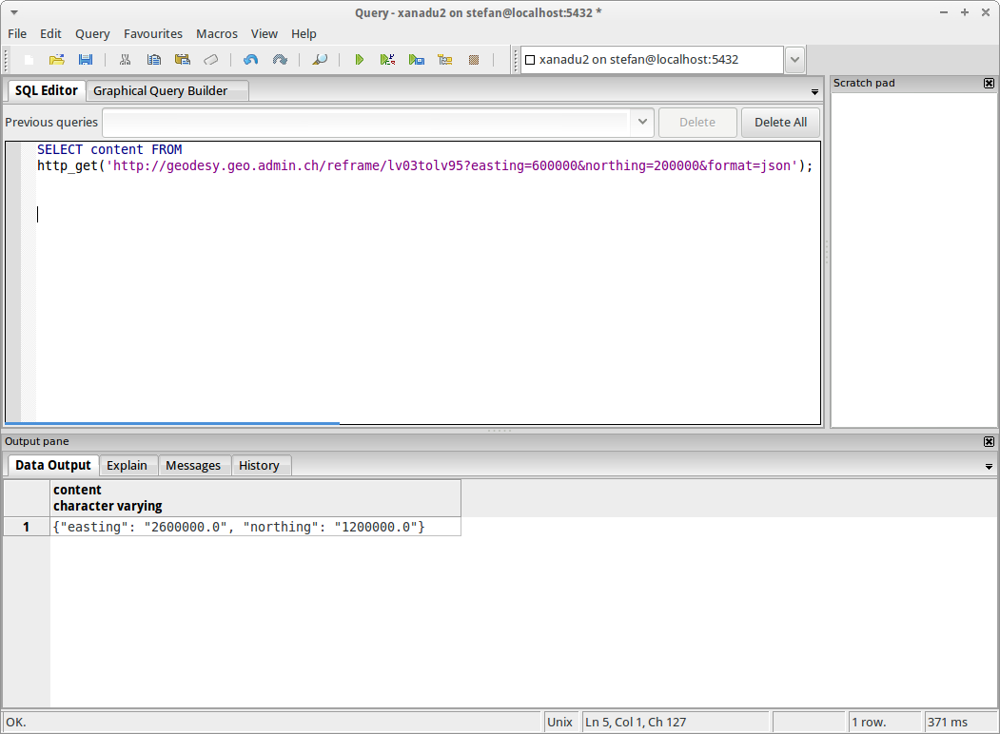
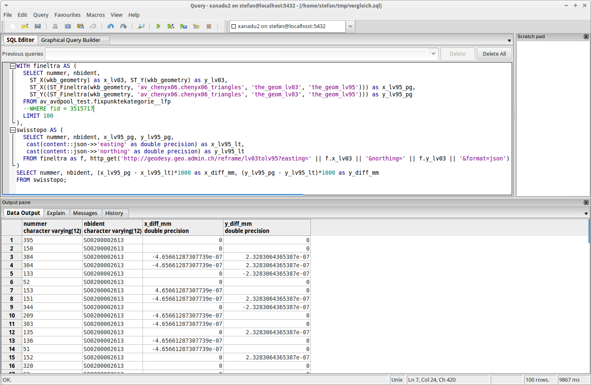
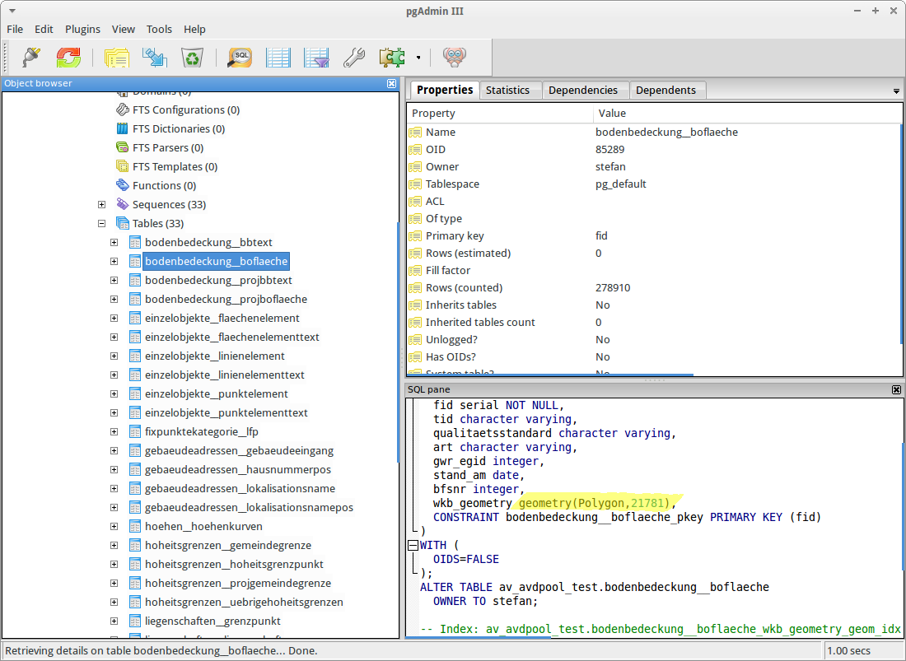
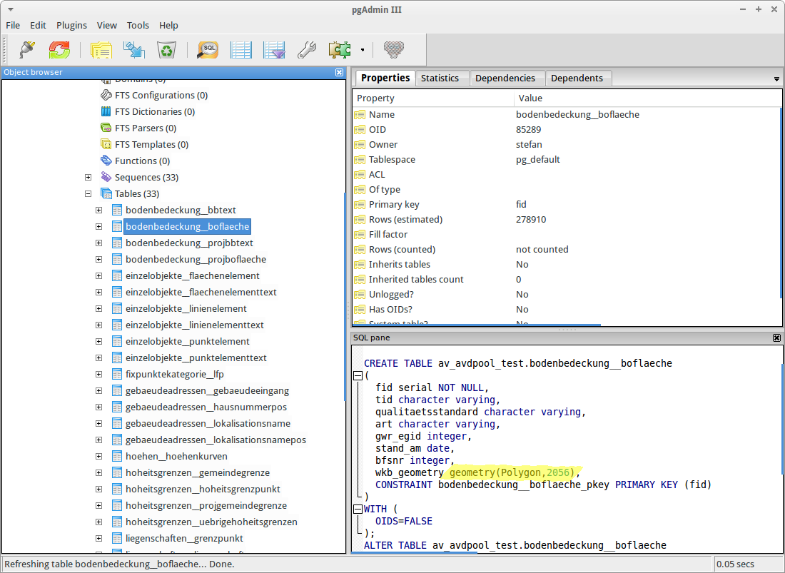

Sandro Santilli hat eine https://github.com/strk/fineltra)[erste Version] der http://sogeo.ch/blog/2015/09/17/bezugsrahmenwechsel-postgis-to-the-rescue/[ST_Fineltra Funktion] für PostGIS zum Testen freigegeben. Um die Funktion verwenden zu können, sind zwei Schritte notwendig:

* Installieren der neuen Funktion
* Importieren der Dreiecksvermaschung in die Datenbank

Das Installieren der Funktion funktioniert unter Ubuntu 14.04 problemlos. Hat man sowieso bereits die üblichen &laquo;GIS-Tools&raquo; (PostgreSQL/Postgis, gdal/ogr etc.) installiert, fehlt anscheinend nur das dev-Paket von _liblwgeom_:

[source,xml,linenums]
----
sudo apt-get install liblwgeom-dev
----

Anschliessend kann gemäss der Installationsanleitung im https://github.com/strk/fineltra/blob/master/README.md[README] vorgegangen werden:

[source,xml,linenums]
----
git clone https://github.com/strk/fineltra.git
cd fineltra
./autogen.sh
./configure
make
sudo make install
----

Die Funktion ist eine PostgreSQL-Extension und kann für die gewünschte Datenbank aktiviert werden:

[source,xml,linenums]
----
sudo -u postgres psql -d xanadu2 -c "CREATE EXTENSION fineltra;"
----

Der zweite Schritt ist der Import der Dreiecksvermaschung. Eine Spatialite-Datei mit einer Tabelle mit sämtlichen Dreiecken in beiden Bezugsrahmen gibts https://drive.google.com/uc?export=download&id=0B6Qb5JteUzxLRUtwLVhWVkdpdDQ[hier]. Vor Jahren habe ich diese aus den Shapedateien von Swisstopo erstellt. Der Import in die Datenbank ist ein einfacher ogr2ogr-Befehl. Leider scheint das mit einer Version kleiner 2.0 nicht wirklich gut zu funktionieren, weil die Tabelle zwei Geometriespalten aufweist. Bei mir werden nur die Sachattribute importiert. Mit ogr2ogr >= 2.0 reicht aber folgender Befehl:

[source,xml,linenums]
----
ogr2ogr -f "PostgreSQL" PG:"dbname='xanadu2' host='localhost' port='5432' user='stefan' password='ziegler12'" chenyx06.sqlite chenyx06 -lco SCHEMA=av_chenyx06 -nln chenyx06_triangles
----

Die Tabelle mit den Dreiecken *muss* beide Bezugsrahmen beinhalten. Es ist *nicht* möglich die Funktion `ST_Fineltra` mit Dreiecksgeometrien aus verschiedenen Tabelle zu bedienen.

Das Schema `av_chenyx06` muss bereits existieren. Ansonsten muss es manuell angelegt werden:

[source,xml,linenums]
----
sudo -u postgres psql -d xanadu2 -c "CREATE SCHEMA av_chenyx06 AUTHORIZATION stefan;"
----

Es ist unbedingt darauf zu achten, dass die Geometrietabellen einen Geometrieindex aufweisen. Bei mir werden diese beim Import mit ogr2ogr automatisch erzeugt. Falls dies nicht der Fall ist:

[source,xml,linenums]
----
sudo -u postgres psql -d xanadu2 -c "CREATE INDEX ON av_chenyx06.chenyx06_triangles USING GiST (the_geom_lv03);"
----

Hat das geklappt, kann es ans Testen gehen. Die Syntax ist sowohl im https://github.com/strk/fineltra/blob/master/README.md[README] wie auch im http://sogeo.ch/blog/2015/09/17/bezugsrahmenwechsel-postgis-to-the-rescue/[vorangegangen Beitrag] erläutert.

Ok, das ist jetzt noch keine Wissenschaft. Aber es scheint zu funktionieren. Die erste Frage muss aber sein: &laquo;Stimmt die Transformation überhaupt?&raquo; Um dies zu beantworten, vergleichen wir die Resultate aus zwei unabhängigen Transformationen. Einmal transformieren wir einen Testdatensatz mit der neuen `ST_Fineltra`-Funktion und einmal mit einem http://www.swisstopo.admin.ch/internet/swisstopo/en/home/products/software/products/m2m/lv03tolv95.html[offiziellen Transformationsdienst] der Swisstopo.

Diesen Vergleich können wir auch innerhalb der Datenbank machen. Dazu verwenden wir die https://github.com/pramsey/pgsql-http[PostgreSQL-Extension `http`]. Mit dieser Extension wird PostgreSQL zu einem HTTP-Client. Bevor man das jetzt produktiv wirklich nutzen will, sollte man unbedingt das https://github.com/pramsey/pgsql-http/blob/master/README.md#why-this-is-a-bad-idea[Kapitel &laquo;Why This is a Bad Idea&raquo;] im README lesen.

Die Installation ist simpel:

[source,xml,linenums]
----
git clone https://github.com/pramsey/pgsql-http.git
cd pgsql-http
make
sudo make install
----

Und anschliessend:

[source,xml,linenums]
----
sudo -u postgres psql -d xanadu2 -c "CREATE EXTENSION http;"
----

Ein Testaufruf zeigt folgendes:

Mit den http://www.postgresql.org/docs/9.3/static/functions-json.html[JSON-Funktionen] von PostgreSQL kann man einfach auf die einzelnen Rückgabewerte zugreifen. Als Testdatensatz wählen wir die Fixpunkte aus der amtlichen Vermessung. Weil jetzt für jeden Fixpunkt ein HTTP-GET-Request gemacht wird, dauert das ein Weilchen:

[source,sql,linenums]
----
WITH fineltra AS (
  SELECT nummer, nbident,
    ST_X(wkb_geometry) as x_lv03, ST_Y(wkb_geometry) as y_lv03,
    ST_X((ST_Fineltra(wkb_geometry, 'av_chenyx06.chenyx06_triangles', 'the_geom_lv03', 'the_geom_lv95'))) as x_lv95_pg,
    ST_Y((ST_Fineltra(wkb_geometry, 'av_chenyx06.chenyx06_triangles', 'the_geom_lv03', 'the_geom_lv95'))) as y_lv95_pg
  FROM av_avdpool_test.fixpunktekategorie__lfp
  --WHERE fid = 3515717
  LIMIT 100
),
swisstopo AS (
  SELECT nummer, nbident, x_lv95_pg, y_lv95_pg,
   cast(content::json->>'easting' as double precision) as x_lv95_lt,
   cast(content::json->>'northing' as double precision) as y_lv95_lt
  FROM fineltra as f, http_get('http://geodesy.geo.admin.ch/reframe/lv03tolv95?easting=' || f.x_lv03 || '&northing=' || f.y_lv03 || '&format=json')
)
SELECT nummer, nbident, (x_lv95_pg - x_lv95_lt)*1000 as x_diff_mm, (y_lv95_pg - y_lv95_lt)*1000 as y_diff_mm
FROM swisstopo;
----

Das Resultat sieht vielversprechend aus:

Die Differenzen bewegen sich also in einem völlig irrelevanten Bereich. Um sicher zu sein, müssen auch noch weitere Geometrietypen (Linien und Polygone) überprüft werden.

Zu guter Letzt soll die Performanz getestet werden. Dazu werden alle Tabellen der amtlichen Vermessung des Kantons Solothurn in einem MOpublic-ähnlichen Datenmodell in die Datenbank importiert. Eine GeoPackage-Datei des gesamten Kantons kann http://www.catais.org/geodaten/ch/so/agi/av/mopublic/gpkg/lv03/d/kanton.gpkg[hier] heruntergeladen und mit folgendem ogr2ogr-Befehl in die Datenbank importiert werden:

[source,xml,linenums]
----
ogr2ogr -f "PostgreSQL" PG:"dbname='xanadu2' host='localhost' port='5432' user='stefan' password='ziegler12'" -lco SCHEMA=av_avdpool_test kanton.gpkg
----

In das Schema `av_avdpool_test` wurden 33 Tabellen importiert. Alle im Bezugrahmen LV03:

In einem Groovy-Skript reicht jetzt eigentlich eine einzige For-Schleife. Aus der View `geometry_columns` werden alle zu transformierenden Tabellen identifiziert und diese transformiert:

[source,groovy,linenums]
----
include::brw_postgis.groovy[]
----

Die Transformation einer Datenbanktabelle ist die Query in den Zeilen 38 - 40. Dies ist der einfachst mögliche Fall. Gibt es aber `Rules` und/oder `Triggers` etc. in der Tabelle, müssen diese wahrscheinlich vorher ausgeschaltet und nach der Transformation eingeschaltet werden. Das genaue Vorgehen muss geprüft werden.

Die gleichen 33 Tabellen liegen nun im Bezugsrahmen LV95 vor:

Die Geschwindigkeit ist verblüffend: Für sämtliche Tabellen braucht das Skript bloss circa 140 Sekunden. Die Transformation der  Bodenbedeckung mit circa 280'000 Polygonen dauert nur 25 Sekunden (Ubuntu 14.04 in einer VirtualBox auf einem 2jährigen iMac mit SSD).
