---
= Interlis leicht gemacht #6
Stefan Ziegler
2015-11-28
:thoth-type: post
:thoth-status: published
:thoth-tags: INTERLIS,ili2pg,Java,QGIS
:idprefix:
---
Die http://www.cadastre.ch/internet/kataster/de/home/av.html[Eidgenössische Vermessungsdirektion] aggregiert verschiedene Metadaten der amtlichen Vermessung. Dazu zähle ich:

* http://models.geo.admin.ch/V_D/LowDistortionAreas_LV95_ili2.ili[Spannungsarme Gebiete]
* http://models.geo.admin.ch/V_D/AMO_Grafik_LV95_e.ili[Stand der amtlichen Vermessung]
* http://models.geo.admin.ch/V_D/AMO_Grafik_LV95_PNF.ili[Stand der Periodischen Nachführung]

Die Daten werden von den Kantonen an die V+D geliefert und anschliessend werden sie publiziert:

+++<iframe src='https://map.geo.admin.ch/embed.html?topic=ech&lang=de&bgLayer=ch.swisstopo.swissimage&layers_opacity=0.75,0.75,0.75&X=249600.00&Y=628300.00&zoom=2&layers=ch.swisstopo-vd.spannungsarme-gebiete,ch.swisstopo-vd.geometa-periodische_nachfuehrung,ch.swisstopo-vd.geometa-standav&layers_visibility=false,true,false' width='100%' height='500' frameborder='0' style='border:0'></iframe>+++

Der &laquo;Stand der amtlichen Vermessung&raquo; war der erste Metadatensatz, den die Kantone liefern mussten. Das http://models.geo.admin.ch/V_D/AMO_Grafik_LV95_e.ili[dazugehörige INTERLIS-Modell] ist einfach und besteht aus zwei Tabellen: `Actual_Status` und `Actual_Status_Geometry`. Die Herausforderung zu diesem Zeitpunkt war aber: Wie kriege ich meine Daten in eine INTERLIS-Transferdatei? Die Lösung war dann nicht so prickelnd: Ich schrieb einen 1:1-Prozessor, der mir die Transferdatei erstellt. Ein Geknorze sondergleichen.

Heute geht das mit http://www.eisenhutinformatik.ch/interlis/ili2pg/[ili2pg] und http://www.qgis.org[QGIS] viel leichter und eleganter:

. Schema mit Tabellen in PostgreSQL/Postgis anlegen
. Daten erfassen
. Daten exportieren

Die Schritte (1) und (3) übernimmt ili2pg für uns. Die Daten erfassen müssen wir schon noch selber. Mit http://www.qgis.org[QGIS] macht aber auch diese Arbeit Spass und geht leicht von der Hand. QGIS hat sehr mächtige http://docs.qgis.org/2.8/en/docs/user_manual/working_with_vector/vector_properties.html#fields-menu[Formularfunktionen] und man kann sich damit so etwas wie eine &laquo;Fachschale&raquo; zusammenklicken.

Für den Datensatz &laquo;Stand der Periodischen Nachführung&raquo; soll nun der ganze Prozess exemplarisch durchgespielt werden. Zuerst legen wir mit ili2pg die leeren Tabellen in der Datenbank an:

[source,xml,linenums]
----
java -jar ili2pg.jar --schemaimport --dbhost localhost --dbport 5432 --dbdatabase rosebud2 --dbusr stefan --dbpwd ziegler12 --defaultSrsAuth EPSG --defaultSrsCode 2056 --createGeomIdx --createEnumTabs --nameByTopic --strokeArcs --dbschema av_pnf_stand_amo --modeldir http://models.geo.admin.ch --models AMO_Grafik_LV95_PNF
----

Mit den Optionen `--defaultSrsAuth EPSG` und `--defaultSrsCode 2056` wird ili2pg mitgeteilt, dass die Geometrie-Tabellen in der Datenbank im Bezugsrahmen LV95 angelegt werden sollen. `--createEnumTabs` erstellt für Aufzähltypen eine eigene Tabelle. Diese Aufzähltyp-Tabellen sind später wichtig für die Arbeit mit QGIS.

Das Resultat sieht relativ unspektakulär aus:

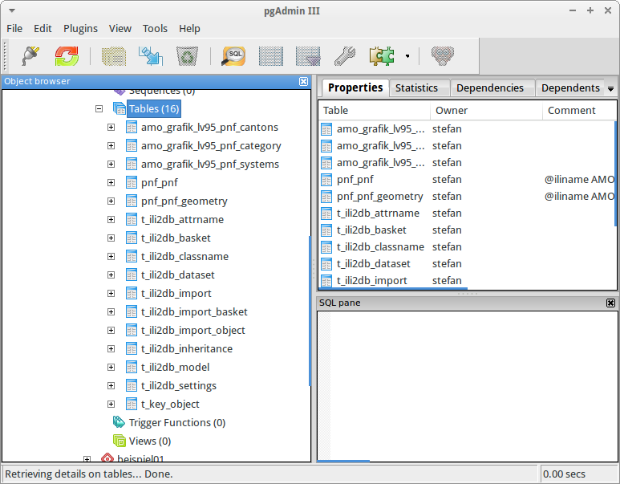

Es gibt zwei Tabellen im Modell resp. in der Datenbank: `pnf_pnf` und `pnf_pnf_geometry`. Die erste Tabelle beinhaltet alle Sachattribute, die zweite die Geometrie dazu. Zusätzlich wird in der Datenbank für jeden Aufzähltyp eine Tabelle angelegt. Der Inhalt der Tabelle `amo_grafik_lv95_pnf_cantons` sieht - wenig überraschend - so aus:

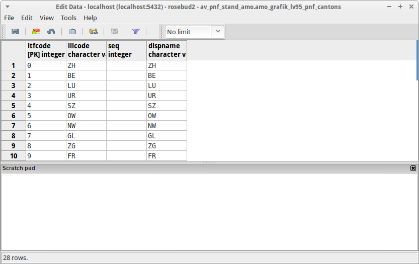

Das Gute an ili2pg ist, dass man nachträglich auch ein paar Veränderungen/Verfeinerungen in den Datenbanktabellen vornehmen darf, die dem Datenerfasser das Leben erleichtern:

Das Modell gibt vor, dass die Kombination der Attribute `canton` und `id` eindeutig sein muss. In der Datenbanktabelle fügen wir  einen UNIQUE-Constraint hinzu:

[source,sql,linenums]
----
ALTER TABLE av_pnf_stand_amo.pnf_pnf ADD CONSTRAINT pnf_pnf_ili_unique UNIQUE (canton, id);
----

Des Weiteren erstellen wir zwei Sequenzen, damit der Primary Key in den Tabellen automatisch nachführt wird:

[source,sql,linenums]
----
-- sequence for t_id "pnf_pnf"
CREATE SEQUENCE av_pnf_stand_amo.pnf_t_id_seq;
ALTER TABLE av_pnf_stand_amo.pnf_pnf ALTER COLUMN t_id SET DEFAULT nextval('av_pnf_stand_amo.pnf_t_id_seq');
ALTER TABLE av_pnf_stand_amo.pnf_pnf ALTER COLUMN t_id SET NOT NULL;
ALTER SEQUENCE av_pnf_stand_amo.pnf_t_id_seq OWNED BY av_pnf_stand_amo.pnf_pnf.t_id;

-- sequence for t_id "pnf_pnf_geometry"
CREATE SEQUENCE av_pnf_stand_amo.pnf_geometry_t_id_seq;
ALTER TABLE av_pnf_stand_amo.pnf_pnf_geometry ALTER COLUMN t_id SET DEFAULT nextval('av_pnf_stand_amo.pnf_geometry_t_id_seq');
ALTER TABLE av_pnf_stand_amo.pnf_pnf_geometry ALTER COLUMN t_id SET NOT NULL;
ALTER SEQUENCE av_pnf_stand_amo.pnf_geometry_t_id_seq OWNED BY av_pnf_stand_amo.pnf_pnf_geometry.t_id;
----

Somit wäre Schritt (1) erledigt und wir können die Daten in QGIS erfassen. Für die Datenerfassung in QGIS werden die Tabellen der Aufzähltypen, die eigentlichen Datentabellen sowie ein Datensatz der Gemeindegrenzen benötigt:

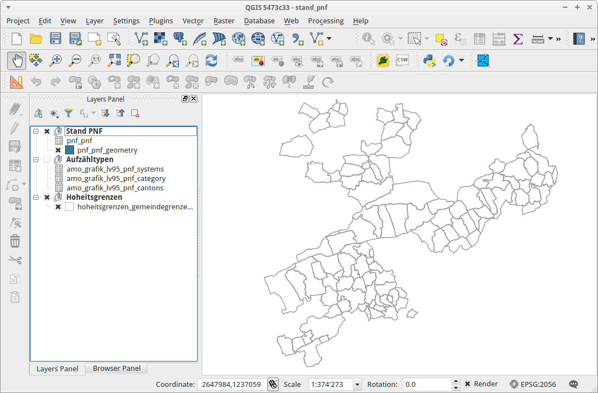

Zuallererst muss die http://blog.vitu.ch/10112013-1201/qgis-relations[Relation] zwischen dem Layer `pnf_pnf` und `pnf_pnf_geometry` hergestellt werden. Somit weiss QGIS, dass die beiden Tabellen mit einer 1:n-Relation verknüpft sind:

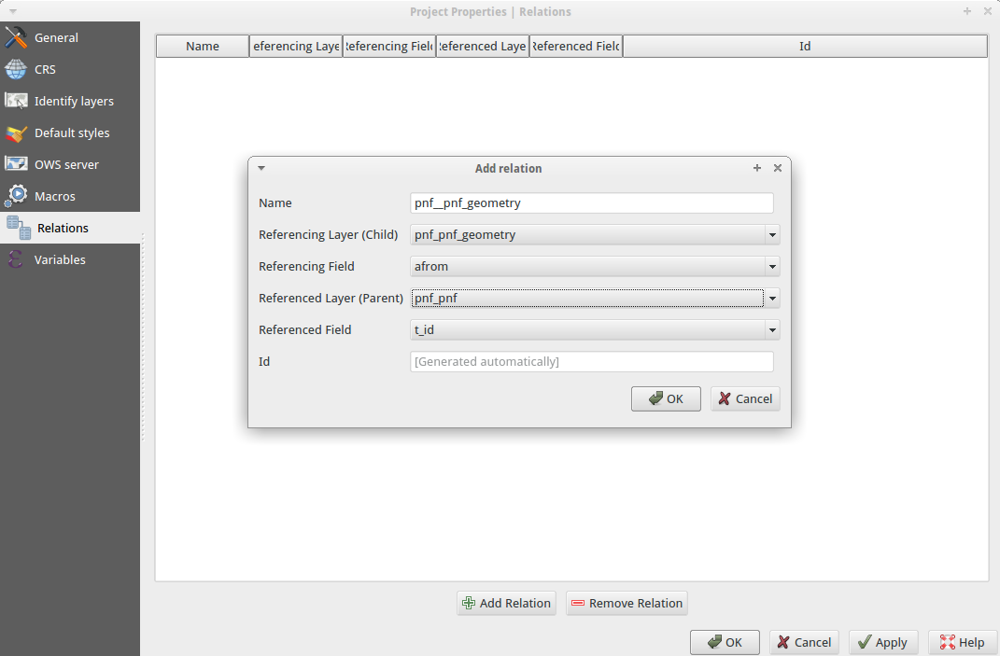

Anschliessend basteln wir uns mit den verschiedenen Editwidgets ein schönes Formular für die effiziente Datenerfassung:

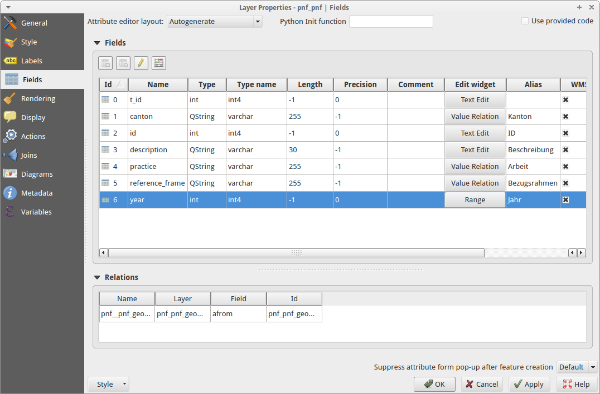

Für die Attribute `canton`, `practice` und `reference_frame` ist das Editwidget vom Typ &laquo;Value Relation&raquo; zu wählen. Als Inputlayer wählen wir die jeweilige Aufzähltyp-Tabelle, z.B. bei `cantons` ist der Layer `amo_grafik_lv95_pnf_cantons` zu wählen. Für das Attribut `year` wählen wir den Typ &laquo;Range&raquo; und wählen den Bereich gemäss INTERLIS-Modell (2000 bis 2100).

Anstelle der automatisch generierten Eingabemake, kann man sich mit Drag 'n' Drop seine eigene Maske zusammenstöpseln. Wir verwenden diese Möglichkeit, um die 1:n-Relation in dieser Eingabemaske nicht darzustellen:

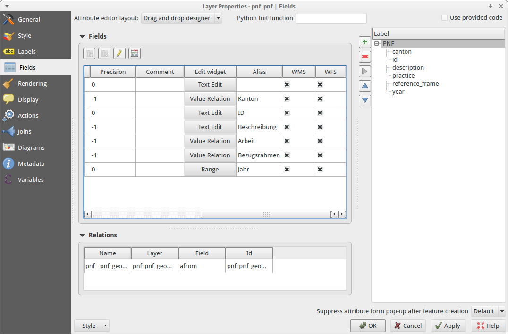

Wenn wir anschliessend ein Feature im Layer `pnf_pnf` erfassen, sieht das Formular wie folgt aus:

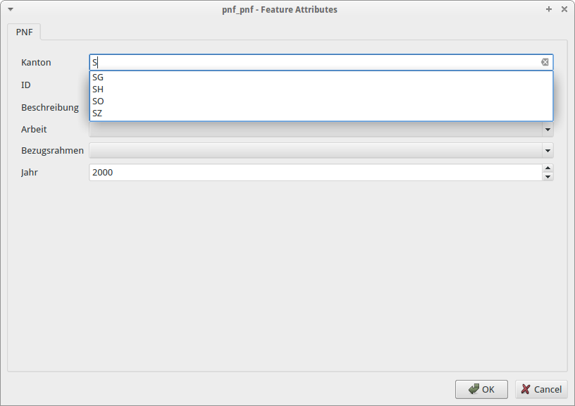

Beim Attribut `cantons` haben wir den Typ &laquo;Value Relation&raquo; gewählt. Standardmässig erscheint bei diesem Typ eine Combobox. Wählt man jedoch die Option &laquo;Use Completer&raquo; erscheint keine Combobox, sondern es werden mögliche Werte aus der Aufzähltyp-Tabelle live vorgeschlagen. Dank den Editwidget-Typen wie &laquo;Value Relation&raquo; oder &laquo;Range&raquo; können so unnötige Tippfehler bei der Datenerfassung vermieden werden resp. es können gar keine nicht vorhandene Werte eingetippt werden.

Eine vollständig ausgefüllte Eingabemaske:

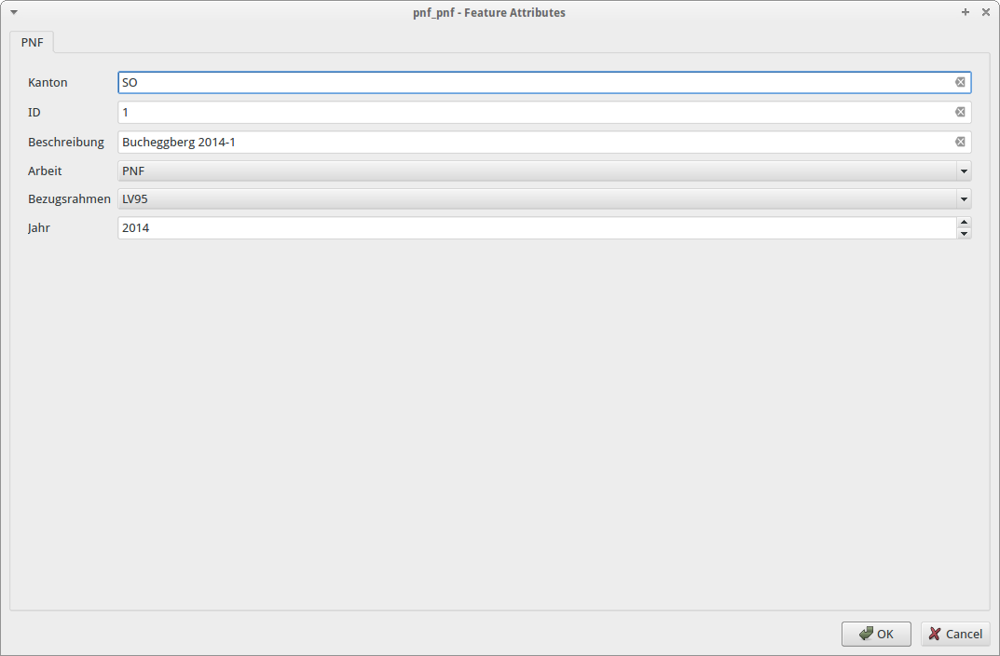

Als nächstes müssen wir zu diesem PNF-Objekt den dazugehörigen Perimeter erfassen. Als Vorarbeit haben wir in QGIS die Relation definiert: Jedes PNF-Objekt kann gemäss INTERLIS-Modell mehrere Perimeter aufweisen. Also eine klassische 1:n-Beziehung. Interessant ist aber die Frage: wie kann ich einen Perimeter (den ich der Tabelle `pnf_pnf_geometry` erfassen muss) korrekt einem Objekt der Tabelle `pnf_pnf` zuweisen?

Dazu wählen wir für den Layer `pnf_pnf_geometry` beim Attribut `afrom` (entspricht dem Fremdschlüssel) den Widgettyp &laquo;Relation Reference&raquo;:

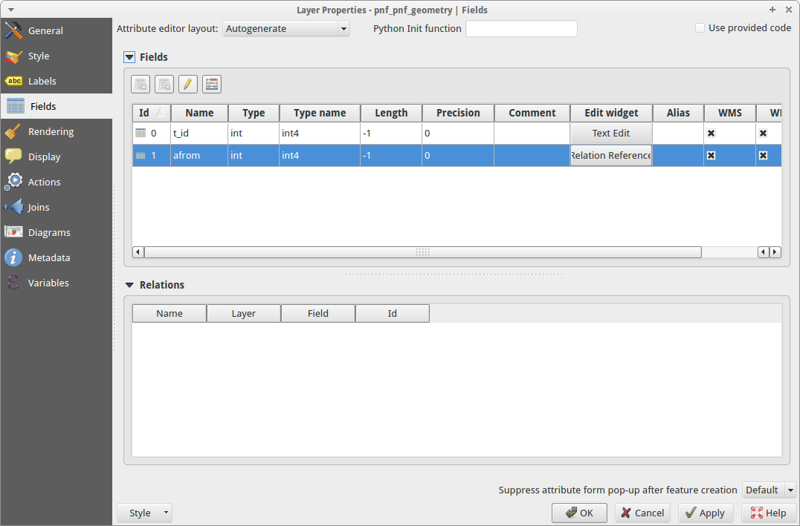

Die Datenerfassung läuft dann wie folgt ab: Wir kopieren eine oder mehrere Gemeindegrenzen aus dem Layer mit den Gemeindengrenzen in den Layer `pnf_pnf_geometry`. Anschliessend erfassen wir dazu die Daten. In diesem Fall ist das nur der Primary Key `t_id` (interessiert uns ja nicht, da dieser automatisch vergeben wird) und das &laquo;Beziehungsattribut&raquo; (aka Fremdschlüssel) `afrom`. Mit einer Combobox kann man das Objekt des Layers `pnf_pnf` auswählen, dem man die Geometrie zuweisen will.

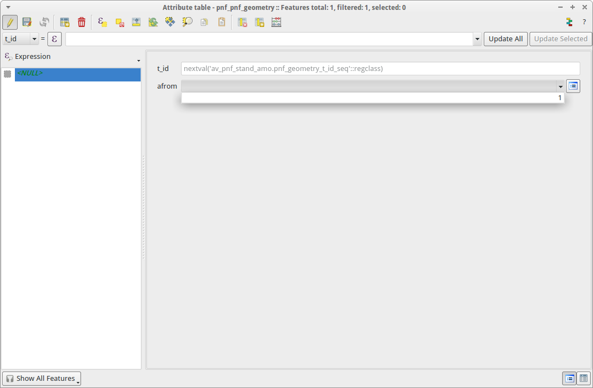

Blöd nur, dass da bloss der Primary Key steht. Damit kann man meistens nichts anfangen. Viel besser wäre es, wenn man ein anderes Attribut darstellen könnte. Kann man. Ändern kann man das bei den Einstellungen im &laquo;Relation Reference&raquo;-Widget bei &laquo;Display expression&raquo;. Standardmässig steht da `COALESCE("t_id", '<NULL>')`. Anstelle von `t_id` schreibt man das gewünschte Attribut hin. In unserem Fall `description`:

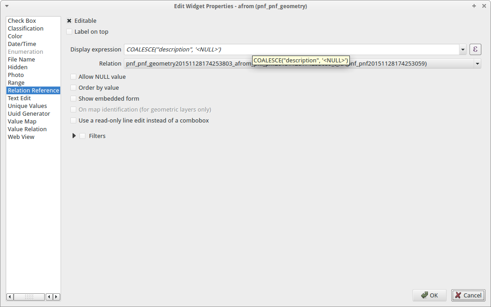

Möglich sind auch Kombinationen der Attribute resp. alles was http://docs.qgis.org/2.8/en/docs/user_manual/working_with_vector/expression.html[QGIS Expressions] hergibt. Die Zuweisung der Geometrie zu einem Objekt ist jetzt viel einfacher:

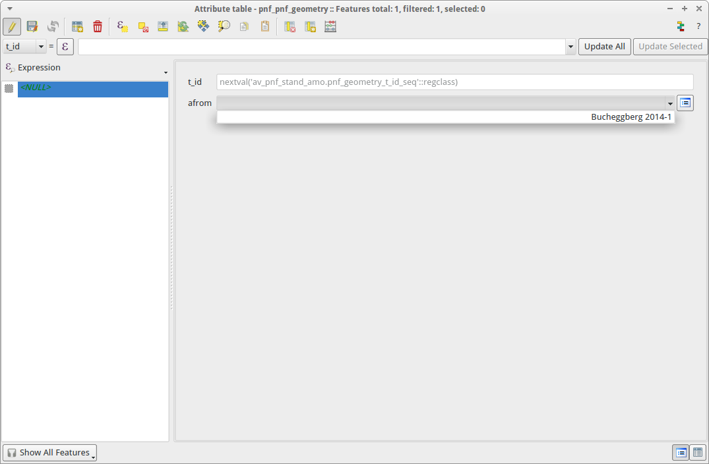

Die Geometrien möchte ich pro Jahr anders einfärben. Dazu müsste das Attribut `year` im Layer `pnf_pnf_geometry` vorhanden sein. Dieses Attribut ist aber im &laquo;Parent&raquo;-Layer `pnf_pnf` vorhanden. Früher hat man sich dann mit einer View o.ä. geholfen. Das ist nicht mehr nötig. Mit der Kombination aus  https://docs.qgis.org/2.8/en/docs/user_manual/working_with_vector/field_calculator.html[Feldrechner] und QGIS Expressions kann man virtuelle Felder mit Attributwerten aus anderen Layern erstellen. Die dazu benötige Expression: `attribute(get_feature('pnf_pnf','t_id',afrom),'year')`. Die Syntax ist unter Umständen ein klein wenig gewöhnungsbedürftig:

Die erste Funktion `get_feature` holt sich ein Feature aus einem anderen Layer (hier: `pnf_pnf`). Der zweite und dritte Funktionsparameter beschreiben die jeweiligen Attribute der beiden Layer über die gejoined werden soll. Achtung: beim layereigenen Attribut sind keine Quotes notwendig. Die zweite Funktion `attribute` extrahiert aus dem gefundenen &laquo;Fremd&raquo;-Feature ein Attribut. Der Parameter ist der Attributsname.

Das Ergebnis dieser Expression in Kombination mit dem Feldrechner ist ein virtuelles Feld im Layer `pnf_pnf_geometry`, das ich zum Einfärben oder Beschriften verwenden kann:

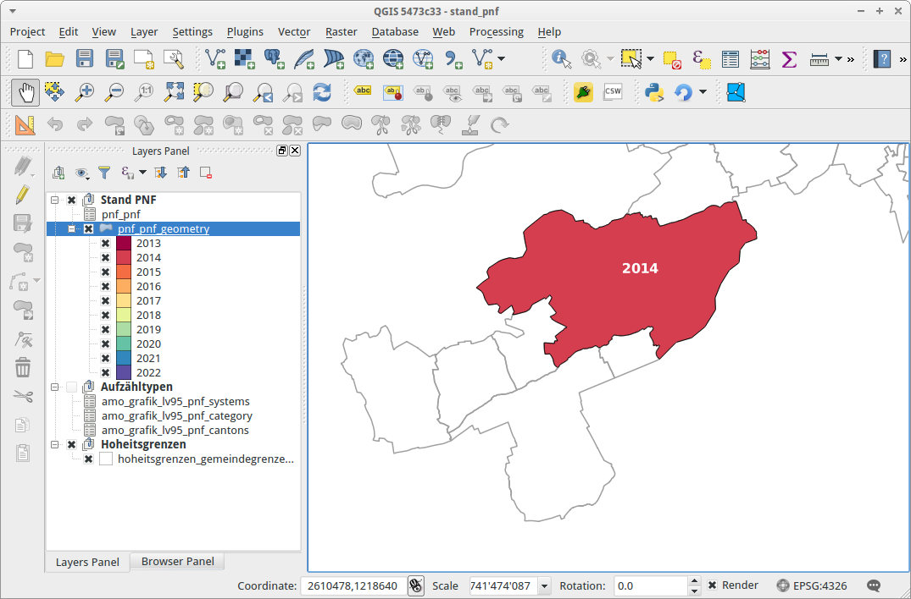

Sind alle PNF-Objekte und die dazugehörigen Perimeter erfasst, kann mit ili2pg die INTERLIS-Transferdatei erzeugt werden:

[source,xml,linenums]
----
java -jar ili2pg.jar --export --dbhost localhost --dbport 5432 --dbdatabase rosebud2 --dbusr stefan --dbpwd ziegler12 --defaultSrsAuth EPSG --defaultSrsCode 2056 --createGeomIdx --createEnumTabs --nameByTopic --strokeArcs --dbschema av_pnf_stand_amo --modeldir http://models.geo.admin.ch --models AMO_Grafik_LV95_PNF stand_pnf_20151118.itf
----

Das Resultat ist eine modellkonforme INTERLIS1-Transferdatei:

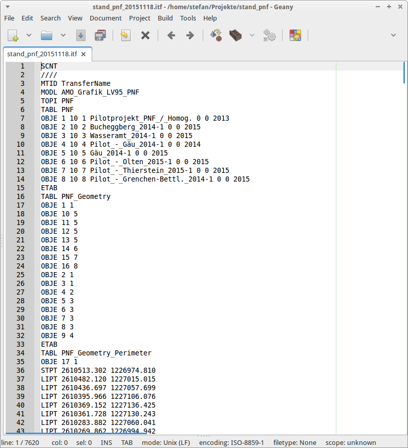

Es hat sich dann leider herausgestellt, dass die Lieferung aber pro PNF-Jahr erfolgen muss, dh. in jedem ITF dürfen nur PNF-Objekte resp. -Perimeter eines Jahres vorhanden sein. Und zusätzlich verwirrend: Das Attribut `reference_frame` beschreibt den Bezugsrahmen der erfassten Geometrien und nicht den Bezugsrahmen in dem die Periodische Nachführung durchgeführt worden ist. Nun gut. Was ich definitiv nicht will, ist pro Jahr ein DB-Schema. Aus diesem Grund erstelle ich ein &laquo;export&raquo;-Schema, das ich mit ein paar simplen SQL-Befehlen für jeweils ein Jahr abfülle und anschliessend mit ili2pg exportiere:

[source,sql,linenums]
----
DELETE FROM av_pnf_stand_amo_export.pnf_pnf_geometry;
DELETE FROM av_pnf_stand_amo_export.pnf_pnf;

INSERT INTO av_pnf_stand_amo_export.pnf_pnf (t_id, canton, id, description, practice, reference_frame, year)
SELECT t_id, canton, id, description, practice, reference_frame, year
FROM av_pnf_stand_amo.pnf_pnf
WHERE year = 2015;

INSERT INTO av_pnf_stand_amo_export.pnf_pnf_geometry (t_id, afrom, perimeter)
SELECT g.t_id as t_id, g.afrom, g.perimeter
FROM av_pnf_stand_amo.pnf_pnf as p, av_pnf_stand_amo.pnf_pnf_geometry as g
WHERE p.t_id = g.afrom
AND p.year = 2015;
----

Fazit: Was früher knorzig und mühsam war, geht heute mit den richtigen Werkzeugen ruckzuck und entspannt vonstatten.
