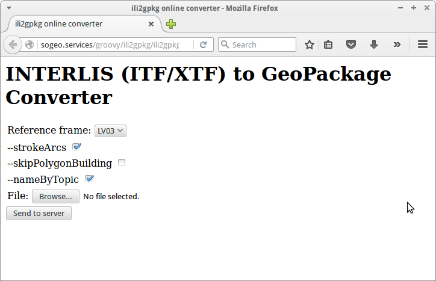
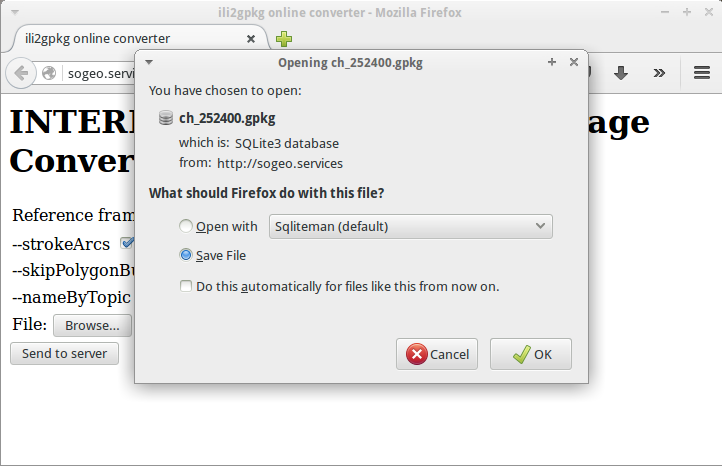
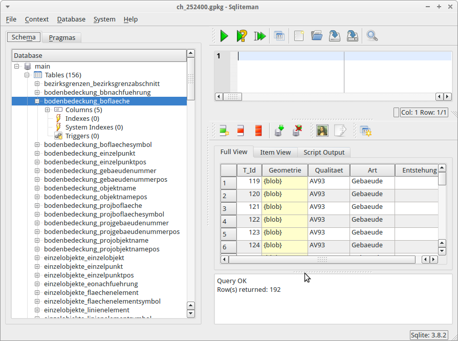
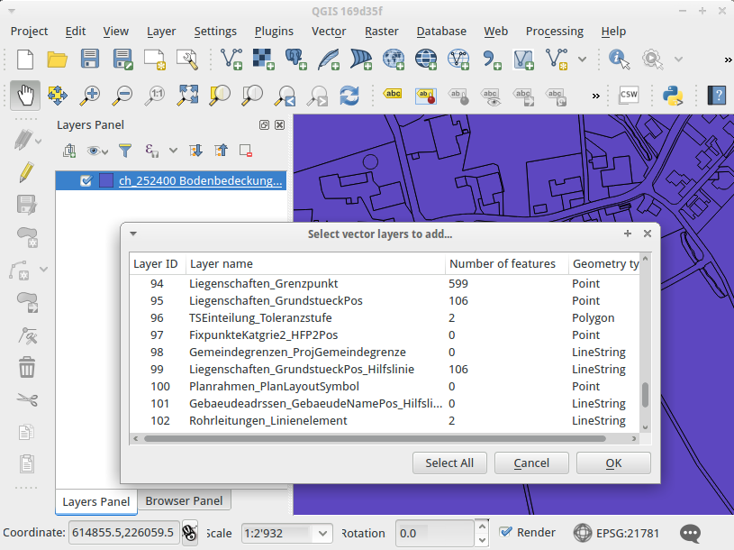

---
= Interlis leicht gemacht #7
Stefan Ziegler
2016-02-11
:thoth-type: post
:thoth-status: published
:thoth-tags: INTERLIS,ili2gpkg,ili2pg,Java,Tomcat,Servlet
:idprefix:
---
Seit https://github.com/claeis/ili2db/commit/85d167e0c4fd491567cd8e8bab3bd9f8e7a85eed[kurzem] gibt es neu auch http://www.eisenhutinformatik.ch/interlis/ili2gpkg/[ili2gpkg]. Damit kann aus einer INTERLIS-Transferdatei schnell und ohne eine PostgreSQL-Datenbank am Laufen zu haben eine GeoPackage-Datei erstellt werden. Diese kann dann in http://www.qgis.org[QGIS] oder ArcGIS visualisert und bearbeitet werden. Der Befehl zum Erstellen des GeoPackages ist praktisch identisch dem Befehl zum Importieren in eine PostGIS-Datenbank:

[source,xml,linenums]
----
java -jar ili2gpkg.jar --import --nameByTopic --modeldir http://models.geo.admin.ch --models DM01AVCH24D --dbfile av_solothurn.gpkg ch_260100.itf
----

Im Prinzip stehen die gleichen Optionen wie bei http://www.eisenhutinformatik.ch/interlis/ili2pg/[ili2pg] zur Verfügung. Einige gibt es natürlich nicht, z.B. die DB-Connection-Parameter. Die werden einfach durch den Filenamen-Parameter ersetzt: `--dbfile`. Natürlich ist man dabei nicht nur auf das Erstellen (= Lesen von INTERLIS) von GeoPackage-Dateien beschränkt. Man kann ebenso aus GeoPackage-Dateien INTERLIS-Transfer-Dateien erstellen. Dazu in einem späteren Beitrag mehr.

Eine Anwendungsmöglichkeit unter vielen ist z.B. ein kleiner Webdienst, wo man eine INTERLIS-Transferdatei hochladen kann und als Antwort die GeoPackage-Datei bekommt. Klassischerweise würde man hier ein Java-Servlet schreiben. Fürs Prototyping erstelle ich aber ein http://docs.groovy-lang.org/latest/html/documentation/servlet-userguide.html[Groovlet]. Man kann sich das auf dem Web/Servlet-Container so einrichten, dass alle in einem Ordner liegende `*.groovy`-Dateien als Servlet resp. eben als Groovlet ausgeführt werden. Zum Rumspielen noch ganz praktisch.

Als erstes brauchen wir das Upload-Formular. Dazu reichen ein paar Zeichen Groovy, das uns das benötigte HTML erstellt:

[source,groovy,linenums]
----
include::ili2gpkg.groovy[]
----

Das sind ganz schön nach 90er-Jahre aus, aber es fehlt schliesslich auch jegliches Styling:

Von den unzähligen Programmoptionen lassen wir nur vier zu, die der Anwender via Webformular auswählen kann:

* `--defaultSrsCode`: Entweder LV03 oder LV95.
* `--skipPolygonBuilding`: Falls gewünscht, wird die Flächenbildung für Polygone nicht gemacht und es bleiben &laquo;Spaghetti&raquo;-Daten. Dies kann sehr praktisch für die Verifikation von Datenlieferungen sein. Bei der Flächenbildung http://www.sogeo.services/blog/2015/10/03/interlis-leicht-gemacht-number-5.html[bereinigt] ili2gpkg zulässige Overlaps, um OGC-konforme Geometrien zu erhalten. Um jedoch wirklich die Original-Geometrien zu erhalten und diese bei Grenzfällen besser beurteilen zu können, lohnt es sich manchmal nur die Linien zu betrachten.
* `--strokeArcs`: Kreisbogen werden segmentiert.
* `--nameByTopic`: Die Tabellen in der GeoPackage-Datenbank werden nach dem Muster `Topicname_Classname` benannt.

Wie man dem Groovy-Skript resp. der HTML-Datei entnehmen kann, ist `do_ili2gpkg.groovy` das Groovy-Skript, das beim Senden aufgerufen wird. Dieses übernimmt die eigentliche Umwandlung INTERLIS -> GeoPackage:

[source,groovy,linenums]
----
include::do_ili2gpkg.groovy[]
----

*Zeilen 1 - 9*: Die notwendigen Bibliotheken werden mittels http://docs.groovy-lang.org/latest/html/documentation/grape.html[Grape] einmalig heruntergeladen. Die `*.jar`-Dateien landen dann im `.groovy/grapes/`-Verzeichnis des Apache-Tomcat-Users und nicht etwa im `lib`-Verzeichnis von Apache-Tomcat selbst. Der Befehl `@GrabConfig(systemClassLoader = true)` scheint nicht notwendig zu sein, wenn das Skript als Groovlet in Apache Tomcat läuft.

*Zeilen 11 - 28*: Notwendige Imports werden gemacht. Für den File-Upload verwenden wir die Apache-Commons-Bibliotheken. Ab http://docs.oracle.com/javaee/6/tutorial/doc/glrbb.html[Servlet-Spezifikation 3.0] gibt es dafür native Unterstützung. Heruntergebrochen auf ein Groovlet habe ich das aber nicht zum Laufen gebracht. Daher wird hier wieder die old-school-Methode verwendet.

*Zeile 37*: Die maximale Grösse der Upload-Datei ist auf 10MB beschränkt.

*Zeilen 49 - 58*: &laquo;Normale&raquo; Parameter aus dem HTML-Formular werden in einer `Map` gespeichert. Sie werden später für die Konfiguration von ili2gpkg verwendet.

*Zeilen 59 - 92*: Die gelieferte Datei wird entgegengenommen und in einem temporären Verzeichnis gespeichert.

*Zeilen 99 - 119*: Hier findet die eigentliche Umwandlung der INTERLIS-Transferdatei in die GeoPackage-Datei statt. Die `Config`-Klasse wird mit den übermittelten Parameter aus dem HTML-Formular in einer separaten Methode konfiguriert. Ein INTERLIS-Modell oder ein -Repository kann nicht übermittelt werden. Das Modell wird aus der Transferdatei selber ermittelt (Zeile 148) und in den drei hardcodierten Repositories gesucht.

*Zeilen 121 - 140*: Zu guter Letzt wird die GeoPackage-Datei an den Browser zurückgesendet. Der Benutzer muss sie nur noch speichern.

Das Resultat sieht genauso aus wie wir es von ili2pg gewohnt sind. Nur halt in einer GeoPackage-Datei:

Anschauen kann man sich das Resultat anschliessend in QGIS:

*Achtung*: ili2gpkg setzt den _Layer-Extent_ gemäss dem INTERLIS-Modell. Beim CH-Modell der amtlichen Vermessung entspricht das der Bounding-Box der gesamten Schweiz. Wenn man in QGIS &laquo;Zoom to Layer Extent&raquo; wählt, zoomt QGIS auf die gesamte Schweiz. Einerseits verwirrend, andererseits eigentlich korrekt. Aber darüber kann man sich sicher lange unterhalten.

In Apache Tomcat sind drei Anpassungen vorzunehmen. Einerseits muss konfiguriert werden, dass alle `*.groovy`-Dateien eines Verzeichnisses als Groovlet ausgeführt werden. Dies wird in der `web.xml`-Datei gemacht (im Root-Element):

[source,xml,linenums]
----
<servlet>
    <servlet-name>Groovy</servlet-name>
    <servlet-class>groovy.servlet.GroovyServlet</servlet-class>
</servlet>

<servlet-mapping>
    <servlet-name>Groovy</servlet-name>
    <url-pattern>*.groovy</url-pattern>
</servlet-mapping>
----

Zudem wollen wir dieses Verzeichnis an einem beliebigen Ort im Filesystem haben und nicht unterhalb des Tomcat-Installationsverzeichnisses. Dazu setzen wir einen &laquo;Context Path&raquo; in der Datei `server.xml` unter `<Host>`:

[source,xml,linenums]
----
<Host name="localhost"  appBase="webapps"
      unpackWARs="true" autoDeploy="true">

  <!-- SingleSignOn valve, share authentication between web applications
       Documentation at: /docs/config/valve.html -->
  <!--
  <Valve className="org.apache.catalina.authenticator.SingleSignOn" />
  -->

  <!-- Access log processes all example.
       Documentation at: /docs/config/valve.html
       Note: The pattern used is equivalent to using pattern="common" -->
  <Valve className="org.apache.catalina.valves.AccessLogValve" directory="logs"
         prefix="localhost_access_log" suffix=".txt"
         pattern="%h %l %u %t &quot;%r&quot; %s %b" />

 <!-- Groovlets -->
 <Context path="/groovy/ili2gpkg" docBase="/home/stefan/Projekte/ili2gpkg_service/scripts" reloadable="true"/>

</Host>
----

Einzig die Zeilen 17 und 18 stammen von mir, alles Andere sind Default-Einstellungen. Der Eintrag bewirkt jetzt, dass der Request http://.../groovy/ili2gpkg/mein_skript.groovy (Attribut `path`) im Verzeichnis gemäss dem Attribut `docBase` das Groovy-Skript `mein_skript.groovy` sucht und, sofern vorhanden, ausführt.

Als letztes muss noch die `groovy-all-x.y.z.jar` in das `lib`-Verzeichnis von Apache Tomcat kopiert werden. Dieses Groovy-&laquo;Sorglos&raquo;-Paket liegt dem http://groovy-lang.org/download.html[Download] bei.

+++<del>Ein Live-Beispiel gibt es <a href=" http://www.sogeo.services/groovy/ili2gpkg/ili2gpkg.groovy">hier</a>(mspublic / mspublic).</del>+++ Ein erweitertes Beispiel findet sich http://sogeo.services/ili2gpkg[hier].
