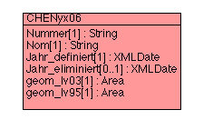
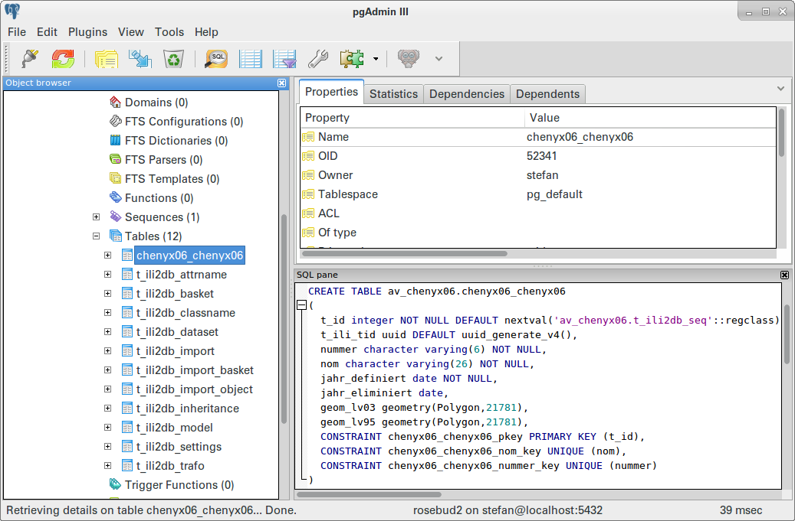
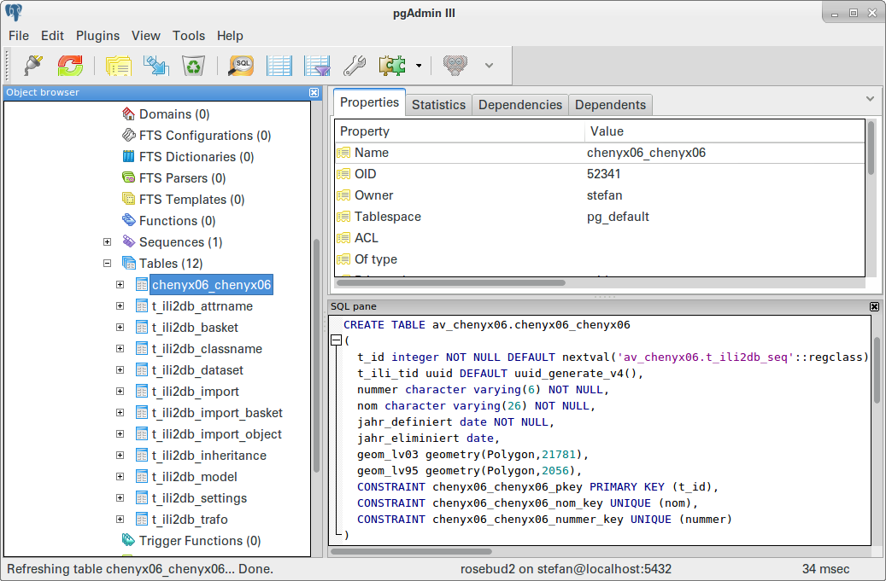

---
= Interlis leicht gemacht #8
Stefan Ziegler
2016-05-29
:thoth-type: post
:thoth-status: published
:thoth-tags: INTERLIS,ili2pg,Java,LV95,CHENyx06,Bezugsrahmenwechsel
:idprefix:
---
Für PostGIS-Anwender, die den http://www.swisstopo.admin.ch/internet/swisstopo/de/home/topics/survey/lv95/lv03-lv95.html[Bezugsrahmenwechsel] noch durchführen müssen, steht ja eine geniale http://blog.sogeo.services/blog/2015/10/04/bezugsrahmenwechsel-st-fineltra-in-action.html[Datenbankfunktion] zur Verfügung, um die Daten wirklich innerhalb der Datenbank transfomieren zu können und nicht ein Drittwerkzeug bemühen zu müssen.

Als Transformationsgrundlage zwischen den beiden Bezugsrahmen dient die nationale Dreiecksvermaschung http://www.swisstopo.admin.ch/internet/swisstopo/de/home/topics/survey/lv95/lv03-lv95/chenyx06.html[CHENyx06]. Swisstopo stellt dafür eine DLL zur Verfügung. Die https://github.com/strk/fineltra/[PostGIS-Funktion] kann aber nichts mit dieser DLL anfangen, sondern erfordert die Dreiecksdefinitionen in beiden Bezugsrahmen als Polygon in einer einzigen Datenbanktabelle (was nebenbei bemerkt die Funktion enorm flexibel macht). Leider ist die Definition dieser Dreiecksvermaschung nirgends auffindbar. Ich habe einzig eine https://www.dropbox.com/s/8mphf6c912ha1z1/chenyx06.sqlite?dl=0[Spatialite-Datenbank], die ich aus Shape-Dateien zusammengeschustert habe, die ich vor Jahren bei swisstopo bestellt habe. Wäre die Definition nicht sogar ein https://www.admin.ch/opc/de/classified-compilation/20071096/index.html#a4[Geobasisdatensatz]?

Egal. Um aber die Dreiecksdefinition vom Spatialite-Joch zu befreien und den Import in die PostGIS-Datenbank vermeintlich einfacher zu gestalten, habe ich mir kurzerhand ein klitzekleines INTERLIS-Datenmodell zusammengebaut:

Der Datenumbau von der bereits bestehenden Datenbanktabelle (http://blog.sogeo.services/blog/2015/10/04/bezugsrahmenwechsel-st-fineltra-in-action.html[resultierend] aus einem `ogr2ogr`-Import der Spatialite-Datenbank nach PostGIS) in die leere mit `ili2pg` angelegten Datenbanktabelle ist simpel:

[source,sql,linenums]
----
INSERT INTO av_chenyx06.chenyx06_chenyx06 (nummer, nom, jahr_definiert, jahr_eliminiert, geom_lv03, geom_lv95)
SELECT num, nom, to_date(jahr_def::varchar, 'YYYY'), NULL::date AS jahr_elim, 
       ST_SnapToGrid(the_geom_lv03, 0.001), 
       ST_SnapToGrid(the_geom_lv95, 0.001)
FROM av_chenyx06.chenyx06_triangles;
----

Die UML-Datei gibt es http://blog.sogeo.services/data/interlis-leicht-gemacht-number-8/SO_CHENyx06_2016-05-27.uml[hier], das INTERLIS-Modell  http://blog.sogeo.services/data/interlis-leicht-gemacht-number-8/SO_CHENyx06_2016-05-27.ili[hier] und die exportierte INTERLIS-Transferdatei http://blog.sogeo.services/data/interlis-leicht-gemacht-number-8/SO_CHENyx06.xtf[hier]. Es wurde bewusst nur eine Tabelle mit zwei Geometriespalten modelliert, da ja genau diese Konstellation von der ST_Fineltra-Funktion erwartet wird.

Ohne gross zu überlegen, kann man jetzt mit http://www.eisenhutinformatik.ch/interlis/ili2pg/[`ili2pg`] die INTERLIS-Datei in die PostgreSQL-Datenbank importieren:

[source,xml,linenums]
----
java -jar ili2pg.jar --dbhost localhost --dbport 5432 --dbdatabase rosebud2 --dbusr stefan --dbpwd ziegler12 --defaultSrsAuth EPSG --defaultSrsCode  21781 --createGeomIdx --strokeArcs --createUnique --nameByTopic --dbschema av_chenyx06 --modeldir "http://models.geo.admin.ch;." --models SO_CHENyx06_20160527 --import SO_CHENyx06.xtf
----

Da sollten jetzt zwei Optionen ins Auge stechen: `--defaultSrsAuth` resp. `--defaultSrsCode`. Damit geben wir der Datenbank an, um welches Bezugssystem es sich handelt. In unserem Fall haben wir nun das Problem, das wir zwei unterschiedliche Bezugssysteme in einer einzigen Tabelle im INTERLIS-Modell haben. Dh. `ili2pg` importiert beiden Geometrien als LV03:

Auch die einzelnen Geometrien selbst sind als LV03 codiert. Folgende Abfrage

[source,sql,linenums]
----
SELECT ST_AsEWK(geom_lv95) FROM av_chenyx06.chenyx06_chenyx06 LIMIT 1;
----

ergibt:

[source,sql,linenums]
----
"SRID=21781;POLYGON((2619108.994 1266953.473,2624004.381 1265802.492,2619830.525 1263811.084,2619108.994 1266953.473))"
----

PostgreSQL/PostGIS wäre nicht PostgreSQL/PostGIS wenn die Rettung nicht bloss ein Einzeiler wäre:

[source,sql,linenums]
----
ALTER TABLE av_chenyx06.chenyx06_chenyx06 
  ALTER COLUMN geom_lv95 TYPE geometry(Polygon, 2056) 
    USING ST_SetSRID(geom_lv95, 2056);
----

Dieser Einzeiler setzt einerseits die korrekte SRID für die Tabelle als auch für jedes einzelne Feature ohne irgendetwas zu transformieren. Das Resultat der vorherigen Query ist:

[source,sql,linenums]
----
"SRID=2056;POLYGON((2619108.994 1266953.473,2624004.381 1265802.492,2619830.525 1263811.084,2619108.994 1266953.473))"
----

Und die Definition der Tabelle sieht jetzt wie gewünscht aus:

Das Problem mit den unterschiedlichen Bezugssystemen tauchte natürlich bereits beim Herstellen der INTERLIS-Transferdatei auf. Dabei wurde die leere Tabelle mit `--schemaimport` angelegt. Das Vorgehen war anschliessend identisch.
