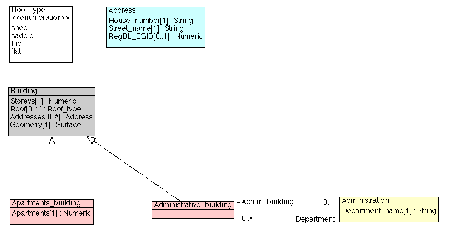
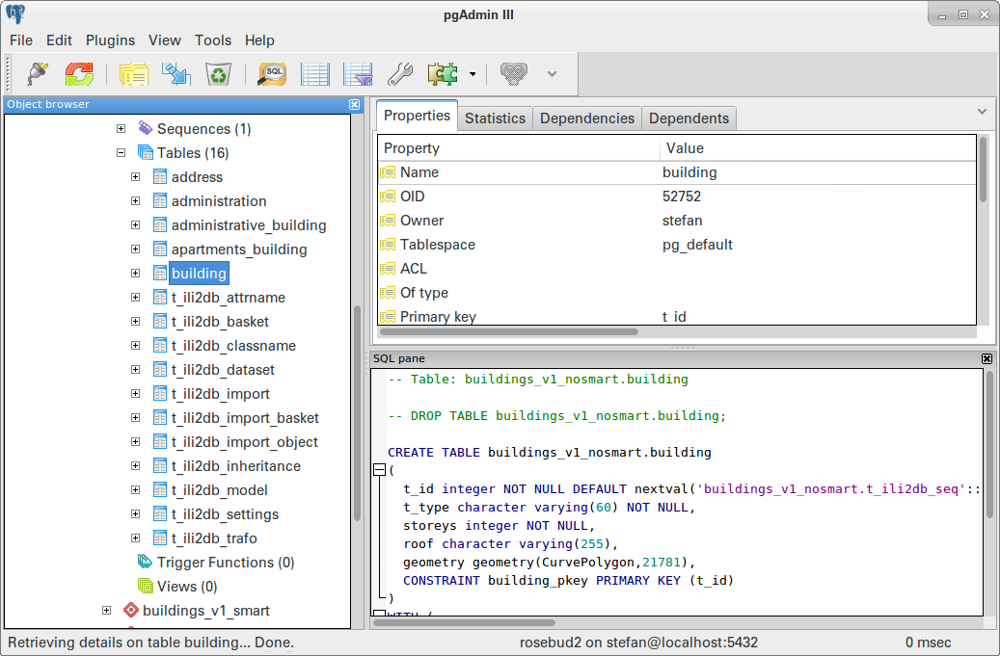
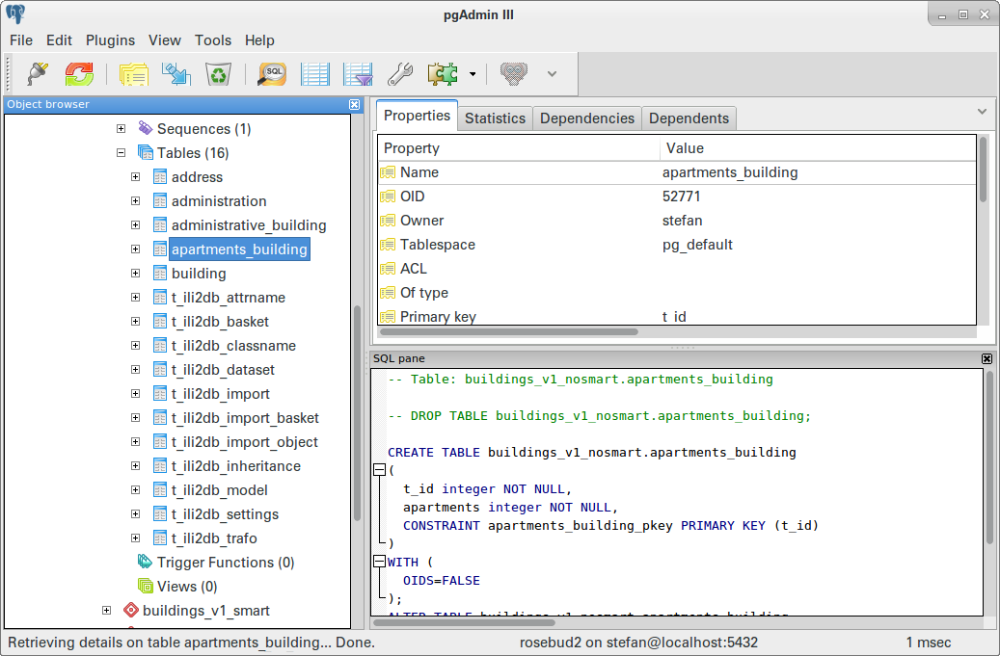
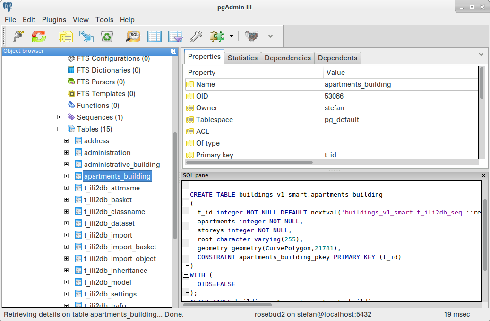
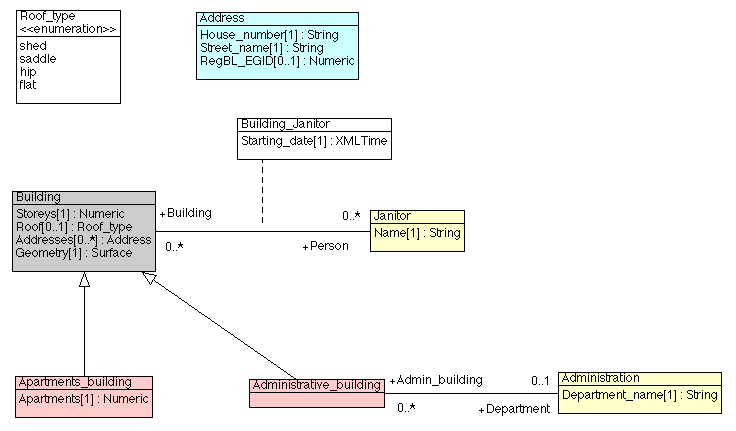
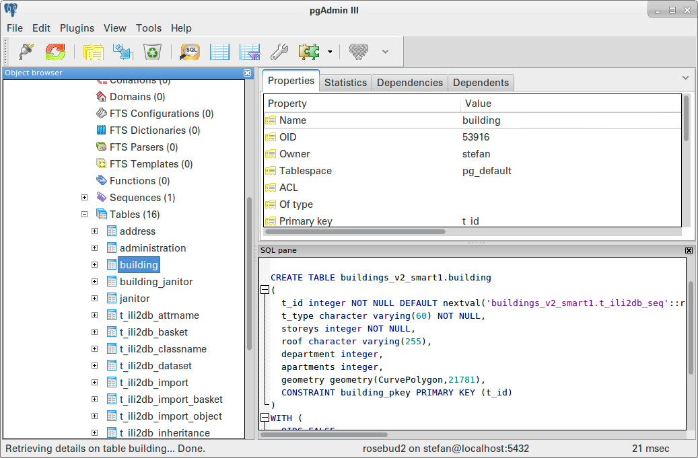
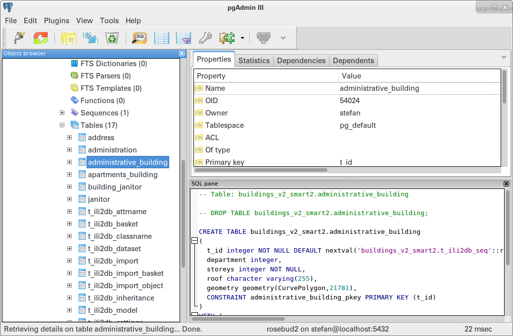

---
= Interlis leicht gemacht #10
Stefan Ziegler
2016-06-13
:thoth-type: post
:thoth-status: published
:thoth-tags: INTERLIS,Java,ORM,ili2pg,ili2db,ili2gpkg
:idprefix:
---
http://www.eisenhutinformatik.ch/interlis/ili2pg/[Ili2pg] unterstützt neu drei Vererbungsstrategien. Vererbungsstrategien sind keine Erfindung von INTERLIS oder dergleichen, sondern so alt wie das O/R-Mapping selbst. Im Internet gibt es tonnenweise Material zum Nachlesen. Wie so oft, kann Wikipedia die erste https://de.wikipedia.org/wiki/Objektrelationale_Abbildung[Anlaufstelle] sein.

Seit der Version https://github.com/claeis/ili2db/commit/2cb22eb3fc4f719f27a94089694a5383017b46bb[2.5.0] unterstützt 
`ili2pg` zwei Vererbungsstrategien. Vorher kannte `ili2pg` &laquo;nur&raquo; die sogenannte NewClass-Strategie. Dabei wird für jede Klasse (abstrakt und konkret) eine Tabelle in der Datenbank angelegt. Die zweite Vererbungsstrategie ist die sogenannte &laquo;smarte&raquo; Vererbung. Sie ist eine Mischung aus verschiedenen Strategien. Ganz neu in der Version https://github.com/claeis/ili2db/commit/fb309f2a6b42d71663e78a525d39c65ce291e98d[3.1.0] ist eine weitere smarte Vererbungsstrategie hinzugekommen.

In der https://github.com/claeis/ili2db/blob/master/docs/ili2db.rst[Dokumentation] von `ili2db` sind die Strategien erläutert. Anhand eines Beispieles zeige ich wie das konkret in der Datenbank aussieht. Als Beispiel-Modell verwende ich das gleiche Modell (http://blog.sogeo.services/data/interlis-leicht-gemacht-number-10/Buildings_V1.uml[uml], http://blog.sogeo.services/data/interlis-leicht-gemacht-number-10/Buildings_V1.ili[ili]), das bereits im https://bitbucket.org/edigonzales/ili2pg_workshop[ili2pg-Workshop] verwendet wurde:

Bei der Klasse _Building_ handelt es sich um eine abstrakte Klasse. Die beiden Klassen _Apartments___building_ und _Administrative___building_ sind daraus spezialisierte Klassen.

Zuerst wird das INTERLIS-Modell mit der NewClass-Strategie in der Datenbank abgebildet:

[source,xml,linenums]
----
java -jar ili2pg.jar --dbhost 10.0.1.10 --dbdatabase rosebud2 --dbusr stefan --dbpwd ziegler12 --noSmartMapping --dbschema buildings_v1_nosmart --schemaimport --modeldir . --models Buildings_V1
----

Die Option `--noSmartMapping` ist notwendig, weil `ili2pg` standardmässig eine smarte Vererbungsstrategie wählt. In der Datenbank wird nun für *jede* Klasse (sei sie abstrakt oder nicht) *eine* Tabelle angelegt:

In der Tabelle __apartments_building__ ist neben dem Primärschlüssel einzig das zusätzliche Attribut _apartments_ vorhanden:

Die Verknüpfung zwischen der Tabelle _building_ und __apartments_building__ wird anhand des gleichen Primärschlüsselwertes gemacht. Mit der NewClass-Strategie verteilt sich ein INTERLIS-Objekt auf verschiedene Datenbank-Tabellen.

Wenn man jetzt die smarte Vererbung mit folgendem Befehl anwendet:

[source,xml,linenums]
----
java -jar ili2pg.jar --dbhost 10.0.1.10 --dbdatabase rosebud2 --dbusr stefan --dbpwd ziegler12 --smart1Inheritance --dbschema buildings_v1_smart1 --schemaimport --modeldir . --models Buildings_V1
----

werden die Klassen wie folgt abgebildet:

Die abstrakte Klasse _building_ wird nicht mehr in der Datenbank als Tabelle abgebildet. Sämtliche Eigenschaften der abstrakten Klassen sind jetzt als Attribute der spezialisierten Klassen resp. der Tabellen vorhanden.

Das Beispiel-Modell wird nun um eine weitere Klasse erweitert (http://blog.sogeo.services/data/interlis-leicht-gemacht-number-10/Buildings_V2.uml[uml], http://blog.sogeo.services/data/interlis-leicht-gemacht-number-10/Buildings_V2.ili[ili]). Jedes Haus braucht einen oder mehrere Hausmeister:

Die abstrakte Klasse __building__ wird in diesem Fall von einer anderen Klasse referenziert. Wird das Modell mit der gleichen Option `--smart1Inheritance` abgebildet, ergibt sich folgendes Bild:

Die &laquo;Gebäude&raquo;-Klassen werden jetzt mit einer SuperClass-Strategie abgebildet: sämtliche Informationen sind in einer einzigen _building_-Tabelle vorhanden resp. müssen dort erfasst werden.

Mit der neusten Variante der Vererbung `--smart2Inheritance` kann man aber wieder eine SubClass-Strategie fahren:

Warum das jetzt alles? Warum diese verschiedenen Varianten? Der Benutzer soll eben wählen können, welche Strategie er für die Abbildung seines INTERLIS-Modells in der relationalen Datenbank wählt. Geht es um Datenerfassung in einer GIS-Anwendung, wählt er unter Umständen eine andere Variante als jemand, der bestehende Daten in ein anderes INTERLIS-Modell umbauen muss. Ein Anderer wiederum muss möglichst schnell Daten exportieren können. Für diesen Einsatzzweck sollte man wahrscheinlich die Variante mit möglichst wenig teuren Datenbankoperationen wählen.

Wichtig ist vor allem, dass der Anwender weiss, wie die Strategien funktionieren und wie `ili2pg` die INTERLIS-Modelle in der Datenbank abbildet.
