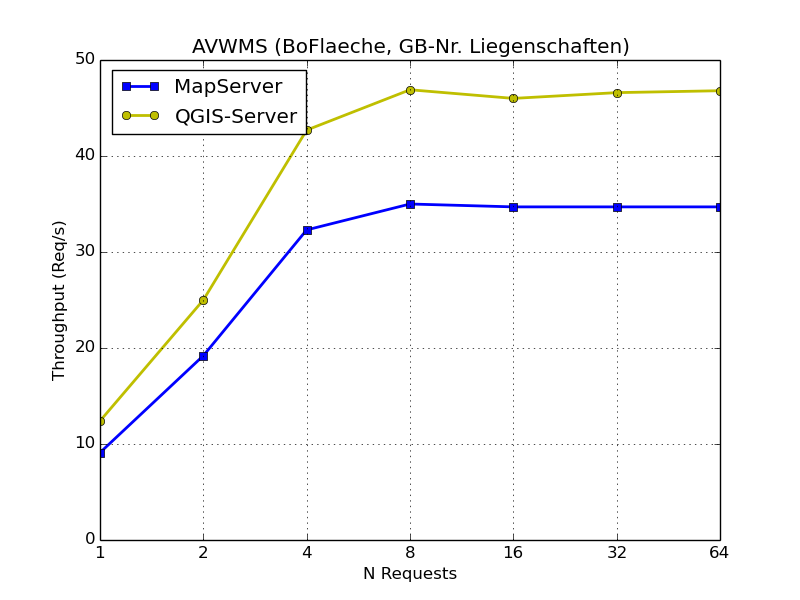
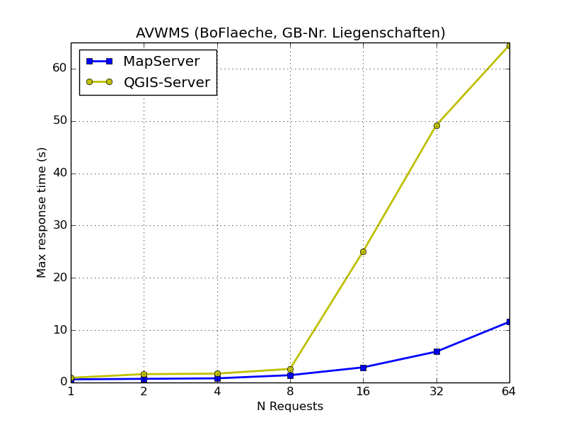
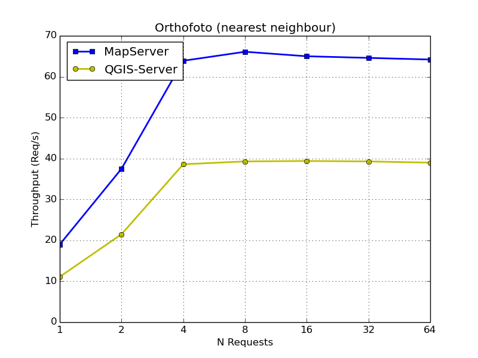
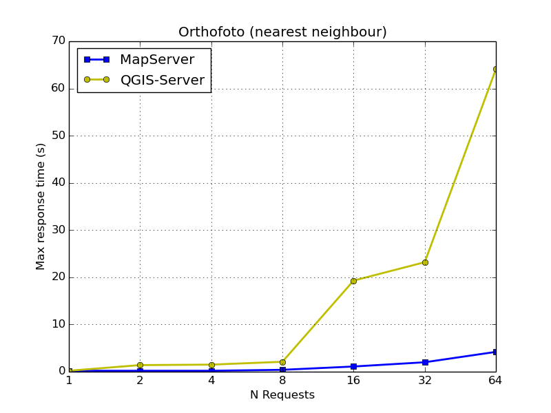
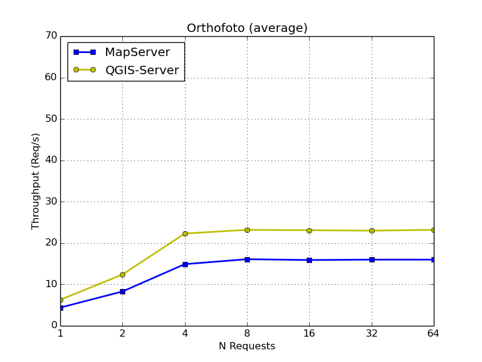
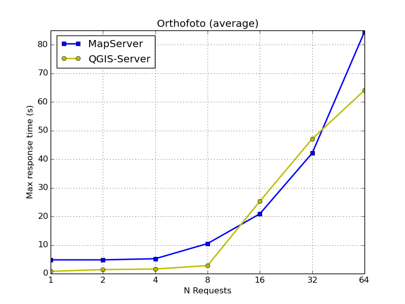

---
= QGIS Server vs. MapServer
Stefan Ziegler
2016-06-20
:thoth-type: post
:thoth-status: published
:thoth-tags: QGIS,QGIS-Server,WMS,Benchmark,MapServer
:idprefix:
---
Bei http://www.agi.so.ch[uns] steht ein grösser Umbau der GIS-Infrastruktur im Web an. Da darf natürlich auch die Diskussion über den zukünftigen Kartenserver nicht fehlen. Zurzeit - &laquo;historisch gewachsen&raquo; - setzen wir drei (3) WMS-Server ein: MapServer, GeoServer und QGIS Server. Nach dem Umbau soll es nur einer sein. GeoServer scheidet als erstes aus. Wir haben damit einfach am wenigsten Erfahrung. Bleiben noch MapServer und QGIS Server. MapServer setzen wir seit Tag 1 ein, haben also reichlich Erfahrung. Bei QGIS Server schätzen wir z.B. die umfangreichen Funktionen in verschiedenen Bereichen, die allesamt direkt auch im Web verwendbar und vor allem sichtbar werden.

Als eine kleine Hilfe bei der Entscheidungsfindung habe ich kurzerhand ein WMS-Shootout gemacht. 

Disclaimer: Bis vor vier Tagen habe ich noch nie irgendetwas mit MapServer gemacht. QGIS verwende ich seit circa Version 0.7.

Das Benchmarking-Setup sah wie folgt aus:

* Server bei server4you.de (i5-4xxx irgendwas) mit SSD.
* Daten und WMS-Server auf dem gleichen Server.
* Benchmarking-Tool: _jmeter_.
* Drei Benchmarks:
 - AVWMS (bestehend aus Bodenbedeckung, Liegenschaften und Liegenschaftsnummern).
 - Orthofoto (Kantone BL, BS und nördlicher Teil von Kanton SO). Resampling &laquo;nearest neighbour&raquo;. 
 - Orthofoto (dito). Resampling &laquo;average&raquo;. 
* Pro Benchmarks jeweils 1, 2, 4, 8, 16, 32 und 64 parallele Requests.
* Bei allen Tests jeweils drei Durchgänge.
* MapServer (7.0.1) bewusst nur als CGI.
* QGIS Server (master) als FCGI (`FcgidMaxProcesses 10`, `FcgidMaxProcessesPerClass 10`).
* Alle Einstellungen möglichst out-of-the-box.

Die Resultate habe ich jeweils in zwei Charts gepackt: Einmal den Throughput (Requests pro Sekunde) und einmal die maximale Antwortzeit.

*AVWMS:*

QGIS Server ist in diesem Vergleich schneller. Auffallend ist aber das Hochschnellen der maximalen Antwortzeit wenn mehr als zehn gleichzeitige Requests gemacht werden. Als FCGI-Laie klingt das jetzt noch plausibel, da wir ja in den FCGI-Einstellungen eben nur maximal zehn Prozesse zulassen.

*Orthofoto (&laquo;nearest neighbour&raquo;):*

MapServer ist hier deutlich vor QGIS Server. Und auch hier wieder die relativ hohen maximalen Antwortzeiten von QGIS Server.

*Orthofoto (&laquo;average&raquo;):*

Überraschung, Überraschung: QGIS Server liegt hier plötzlich vor MapServer. Diesen Sachverhalt haben wir früher bereits mal - ohne Benchmarking - festgestellt. Ebenso hat MapServer hier auch Probleme mit langen Antwortzeiten.

Einen klaren Gewinner gibt es mit diesem eher simplen Benchmarking nicht. Neben der puren Geschwindigkeit ist für uns auch wichtig, wie pflegeleicht die Software ist. Und da ist (für uns jedenfalls) MapServer, der auch als purer CGI-Prozess gute Performance liefert, einfacher zu handhaben (&laquo;fire and forget&raquo;). Bei QGIS Server haben wir bezüglich FCGI unsere Bedenken. Nicht, dass das per se schlecht wäre, nur haben wir da weniger (= kein) Know-How.

Weitere Faktoren sind z.B. die kartografischen Möglichkeiten. Da hinkt MapServer gefühlt Lichtjahre hinterher. Einfache Sachen sind anscheinend http://lists.osgeo.org/pipermail/mapserver-users/2016-June/079079.html[nicht möglich]. Dass QGIS nativ auch die Ankerpunkte gemäss INTERLIS (&laquo;hali&raquo; und &laquo;vali&raquo;) unterstützt und MapServer nicht, ist nur noch ein kleines Detail. Handkehrum kann man mit MapServer garantiert 99% sämtlicher Kartendarstellungen mehr als befriedigend lösen.

Entscheide sind noch keine gefallen. Sollten aber bald.
