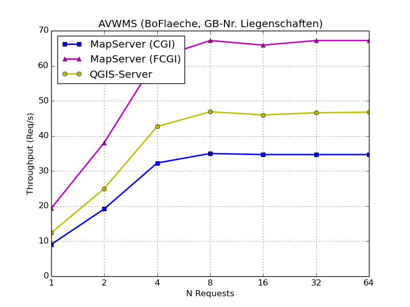
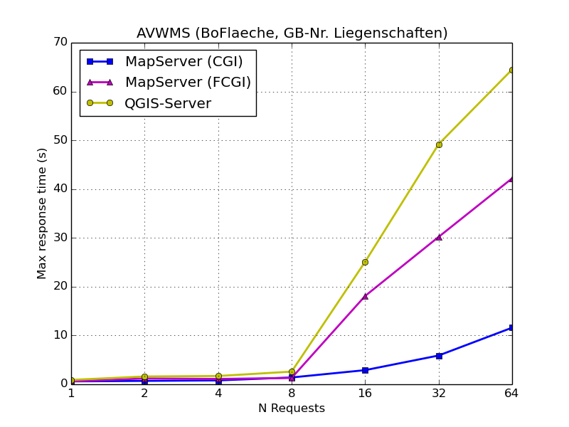
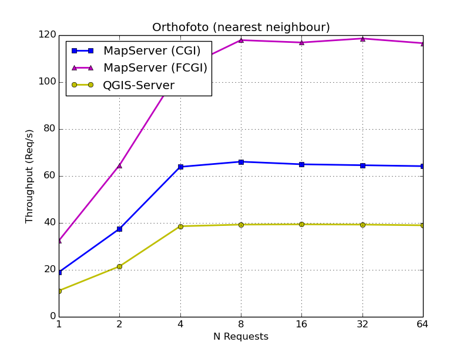
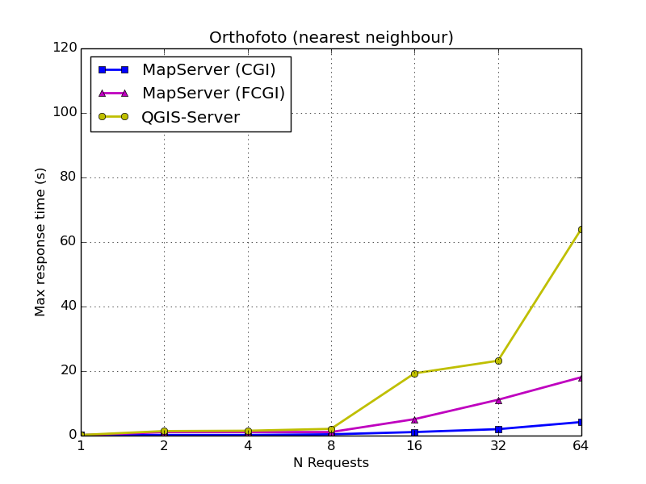
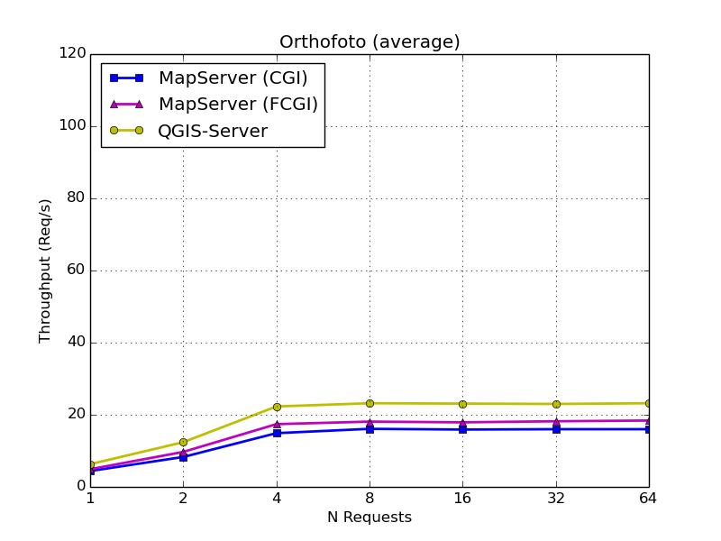
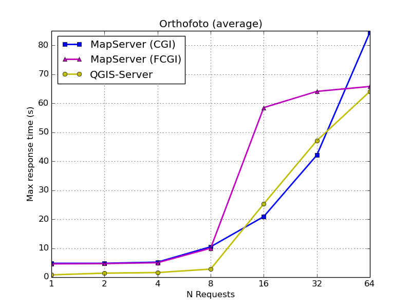

---
= QGIS Server vs. MapServer - Revisited
Stefan Ziegler
2016-06-21
:thoth-type: post
:thoth-status: published
:thoth-tags: QGIS,QGIS-Server,WMS,Benchmark,MapServer
:idprefix:
---
Auf vielfachen Wunsch hier noch die Resultate mit MapServer als FCGI. AVWMS und Orthofoto (&laquo;nearest neighbour&raquo;) sind dann schon eine andere Hausnummer. Jedoch zeigt sich dann bei den maximalen Antwortzeiten ein ähnliches Verhalten wie bei QGIS Server. Der FCGI-Experte würde wahrscheinlich (?) sagen: &laquo;Logisch!&raquo;.

*AVWMS:*

*Orthofoto (&laquo;nearest neighbour&raquo;):*

*Orthofoto (&laquo;average&raquo;):*

