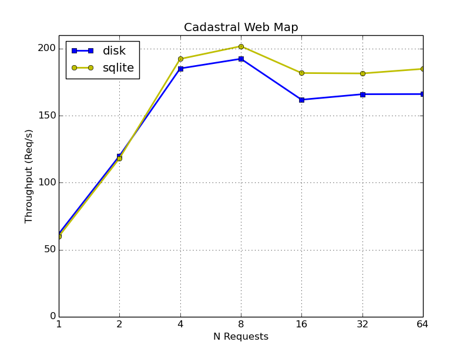
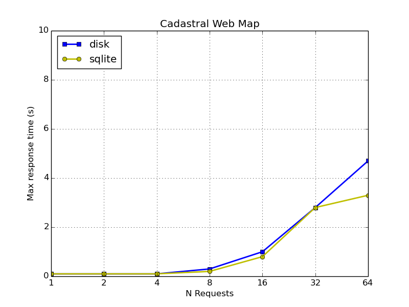
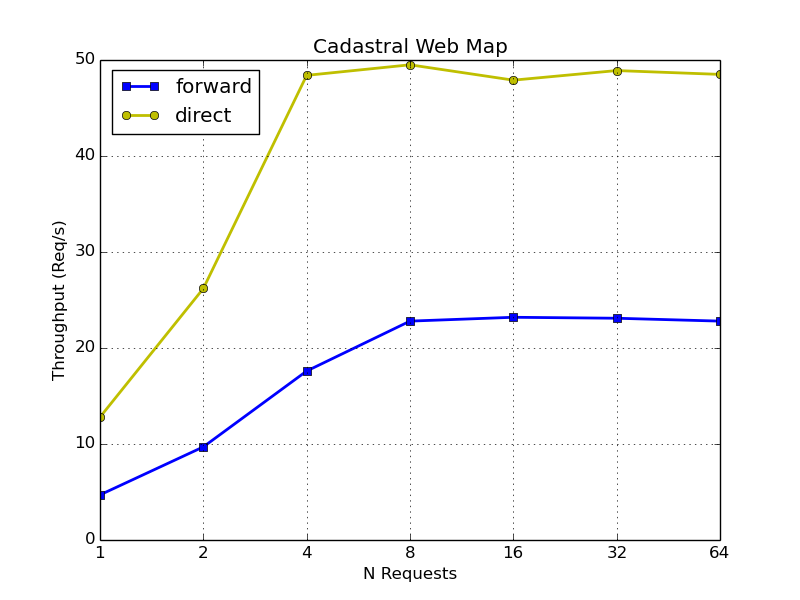

Historisch betrachtet sind http://www.agi.so.ch[wir] ein &laquo;Ein-Request-ein-Bild-WebGIS-Kanton&raquo;. Was heisst das? Bei all unseren eingesetzten WebGIS-Klienten wurde nach einer Benutzer-Interaktion (also Zoomen, Pannen etc.) ein einziges Bild vom Server zurückgeliefert. Auch wenn das Bild aus mehreren Kartenlayern zusammengesetzt ist. Wie so alles im Leben hat das Vor- und Nachteile. State-of-the-art ist es gefühlt heute nicht mehr. Will man z.B. die Transparenz eines Kartenlayers ändern, löst das einen neuen Request aus und der Server muss ein neues Bild rendern. Er übernimmt eine Aufgabe, die heute locker ein Browser schafft.

Beim Einsatz von https://github.com/qgis/QGIS-Web-Client[QGIS-Webclient] kamen dann auch noch Performance-Probleme hinzu. Aus diesem Grund haben wir begonnen die Hintergrundkarten (wie Orthofoto, Basisplan, etc.) zu kacheln und diese Kacheln vorzuhalten (aka https://de.wikipedia.org/wiki/Web_Map_Tile_Service[WMTS]). Als WMTS-Server verwenden wir http://mapserver.org/mapcache/index.html[MapCache]. MapCache unterstützt verschiedene http://mapserver.org/mapcache/caches.html[_Cache Types_]. Ohne gross zu studieren, haben wir dann das vermeintlich Einfachste gewählt: http://mapserver.org/mapcache/caches.html#disk-caches[_Disk caches_]. Dabei werden einfach alle Kacheln direkt auf dem Filesystem gespeichert. Die http://mapserver.org/mapcache/caches.html#disk-caches[Projektdokumentation] macht da eine relativ klare Ansage: 

&laquo;The disk based cache is the simplest cache to configure, and the one with the the fastest access to existing tiles. It is ideal for small tile repositories, but will often cause trouble for sites hosting millions of tiles, as the number of files or directories may rapidly overcome the capabilities of the underlying filesystem.&raquo; 

Und so ist es dann natürlich auch gekommen. Welches ist das sinnvollste Filesystem? Ok, Rücksprache mit der Informatik-Abteilung und speziell ein Laufwerk erstellen, formatieren und mounten...

Als weiterer _Cache type_ gibt es auch http://mapserver.org/mapcache/caches.html#sqlite-caches[_SQLite caches_]. Bei dieser Variante werden sämtliche Kacheln in einer SQLite-Datenbank gespeichert. Was jetzt natürlich auf einen Schlag die ganze Filesystem-Diskussion beendet plus das Deployment vereinfacht: Einfach irgendwo seeden und die SQLite-Datei an den passenden Ort kopieren. Die Kachel wird als _Blob_ in der Datenbank-Tabelle gespeichert. Nachteilig sind gemäss http://mapserver.org/mapcache/caches.html#sqlite-caches[Dokumentation]:

&laquo;The SQLite based caches are a bit slower than the disk based caches, and may have write-locking issues at seed time if a high number of threads all try to insert new tiles concurrently.&raquo; 

Nicht ganz klar sind mir die &laquo;write-locking issues at seed time&raquo;. Heisst das, dass - falls sie auftreten - Kacheln &laquo;verloren&raquo; gehen oder die Seeding-Performance zusammenbricht? Um das zu klären, müsste man auf der http://mapserver.org/community/lists.html[Mailingliste] nachfragen.

In erster Linie geht es mir um die Frage wie gross der Performance-Unterschied der beiden _Cache types_ ist. Sind _Disk caches_ so massiv schneller, dass _SQLite caches_ ein No-go sind? Um diese Frage zu beantworten, habe ich auf meinen http://blog.sogeo.services/blog/2016/06/20/qgis-server-vs-mapserver.html[Testsystem] eine WMS-Karte je einmal mit _Disk caches_ und _SQLite caches_ geseedet und anschliessend mit http://jmeter.apache.org/[_jmeter_] die Performance gemessen. Dabei habe ich wiederum http://mapserver.org/mapcache/services.html#ogc-wms-service[WMS-Requests] gemacht, die MapCache aber aus den vorher geseedeten Kacheln zusammensetzt. Das ist zwar ein Zusatzaufwand, der eigentlich nichts mit den _Cache types_ zu tun hat, aber ich denke, das ist für unsere Anforderungen vernachlässigbar (und an absoluten Zahlen sind wir weniger interessiert).

Das Seeding selbst scheint bei beiden Typen gleich schnell zu sein. 

Für die WMS-Requests gibt es wieder altbackene Charts:

Interessanterweise sind bei mir die _SQLite caches_ sogar klein wenig schneller. Faszinierend ist der Vergleich zu den nicht-aus-geseedeten-Kacheln-zusammengesetzten Live-WMS-Requests. Als Vergleich habe ich neben dem wirklich direkten Zugriff auf den WMS-Server auch noch MapCache als Proxy (`<full_wms>forward</full_wms>`) dazwischengeschaltet:

