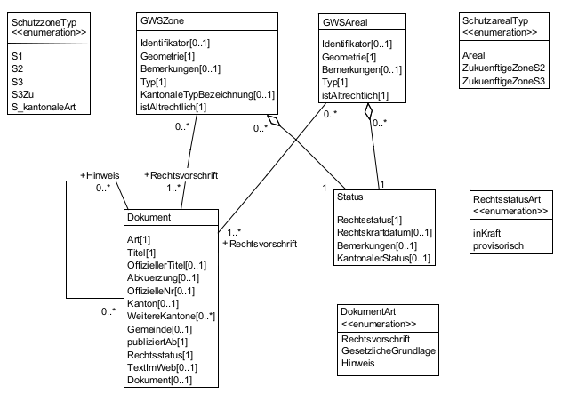
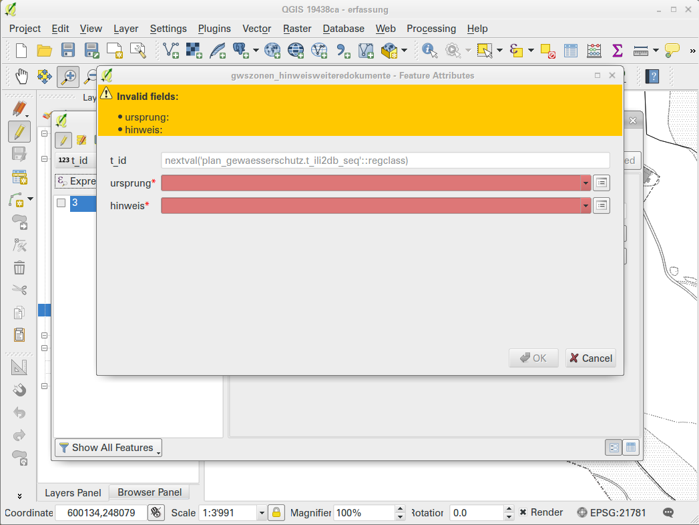
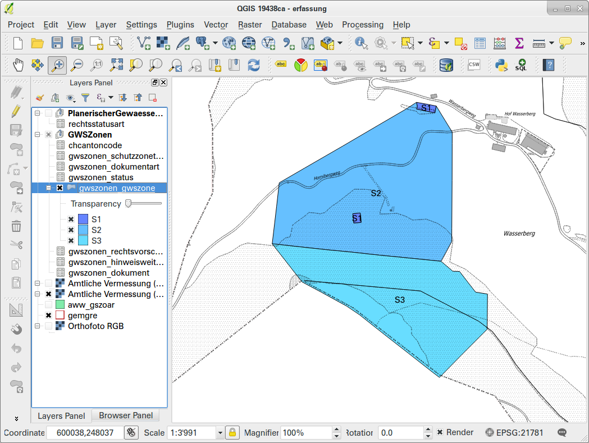
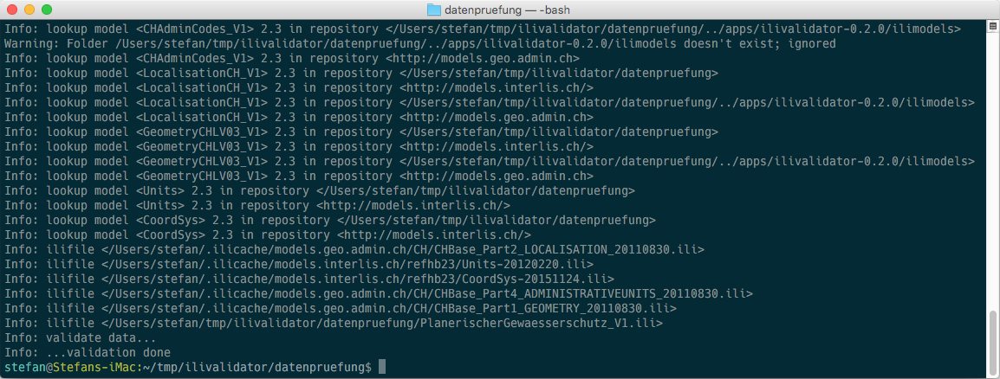
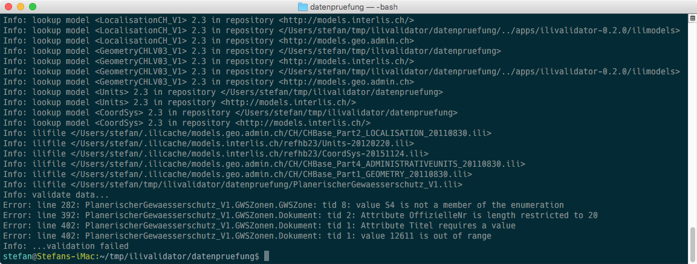
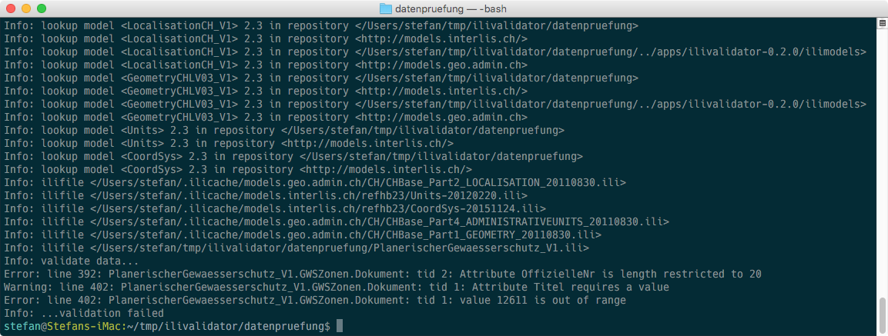

---
= Interlis leicht gemacht #11
Stefan Ziegler
2016-07-18
:thoth-type: post
:thoth-status: published
:thoth-tags: INTERLIS,Java,ilivalidator,ili2pg,ili2gpkg
:idprefix:
---
Getreu dem Motto &laquo;Release early, release often&raquo; gibt es jetzt bereits die zweite Version von https://github.com/claeis/ilivalidator[`ilivalidator`] - dem OpenSource INTERLIS-Checker - zum https://github.com/claeis/ilivalidator/releases[Ausprobieren].

Um nicht immer die amtliche Vermessung als Testbeispiel zu verwenden, bastle ich mir zuerst ein paar Daten zusammen. Dazu baue ich vorhandene Daten des Kantons Solothurn in das Modell &laquo;http://models.geo.admin.ch/BAFU/PlanerischerGewaesserschutz_V1.ili[Planerischer] http://www.bafu.admin.ch/umwelt/12877/15717/15735/index.html?lang=de[Gewässerschutz]&raquo; des BAFU um.

Als erstes mache ich mit http://www.eisenhutinformatik.ch/interlis/ili2pg/[`ili2pg`] einen Schemaimport und lege leere Tabellen an, die ich später mit http://blog.sogeo.services/data/interlis-leicht-gemacht-number-11/2016-qgis-ili2pg-workshop_v03.pdf[QGIS-Forms-and-Relations-Magie] abfüllen werde. Ein Datenumbau mit SQL reicht leider nicht, da ich - zum Testen von `ilivalidator`  - zusätzliche Daten erfassen will, die in den vorhandenen Daten des Kantons noch nicht vorhanden sind.

[source,xml,linenums]
----
java -jar ili2pg.jar --dbhost localhost --dbdatabase rosebud2 --dbport 5432 --dbusr stefan --dbpwd ziegler12 --defaultSrsAuth EPSG --defaultSrsCode 21781 --modeldir http://models.geo.admin.ch --models PlanerischerGewaesserschutz_V1 --smart1Inheritance --expandMultilingual --createGeomIdx --createEnumTabs --nameByTopic --strokeArcs --createFkIdx --schemaimport --dbschema plan_gewaesserschutz
----

Abfüllen werde ich nicht das ganze Modell, sondern nur das Topic &laquo;GWSZonen&raquo;. Und auch nur die Zonen der &laquo;https://www.baerschwil.ch/reglemente?file=tl_files/downloads/reglemente/Schutzzonenreglement%20Wasserbergquellen.pdf[Stöckli- und Wasserbergquelle]&raquo; in der Gemeinde Bärschwil. Betroffen sind die Klassen &laquo;GWSZone&raquo;, &laquo;Status&raquo; und &laquo;Dokument&raquo;. Zusätzlich müssen einige Assoziationen erfasst werden. Mit http://www.qgis.org[QGIS] geht das sehr elegant. Neu werden MANDATORY resp. NOT NULL Attribute farblich hervorgehoben:

Für meinen Geschmack schon sehr viel Farbe. Aber wenigstens fällt es auf...

Die vier erfassten Zonen der Quelle sehen so aus:

Mit `ili2pg` können die erfassten Daten in eine INTERLIS/XTF-Datei exportiert werden:

[source,xml,linenums]
----
java -jar ili2pg.jar --dbhost localhost --dbdatabase rosebud2 --dbport 5432 --dbusr stefan --dbpwd ziegler12  --modeldir http://models.geo.admin.ch --models PlanerischerGewaesserschutz_V1 --disableValidation --export --dbschema plan_gewaesserschutz gewaesserschutz.xtf
----

Mit _xmllint_ kann die XML-Datei noch für das/mein Auge schöner formatiert werden:

[source,xml,linenums]
----
xmllint --format gewaesserschutz.xtf -o gewaesserschutz.xtf
----

Die daraus resultierende http://blog.sogeo.services/data/interlis-leicht-gemacht-number-11/gewaesserschutz.xtf[INTERLIS/XTF-Datei] kann mit `ilivalidator` mit einem einfachen Befehl in der Konsole gegenüber dem konzeptionellen INTERLIS-Modell geprüft werden:

[source,xml,linenums]
----
java -jar ilivalidator.jar gewaesserschutz.xtf
----

Wurden keine Fehler gefunden, erscheinen folgende Zeilen in der Konsole:

In die http://blog.sogeo.services/data/interlis-leicht-gemacht-number-11/gewaesserschutz_mit_fehler.xtf[INTERLIS/XTF-Datei] baue ich nun bewusst vier Fehler ein. Und zwar vier Fehler, die `ilivalidator` bereits jetzt schon finden sollte:

 * Fehlendes MANDATORY-Attribut &laquo;Titel&raquo; in der Klasse &laquo;Dokument&raquo;.
 * Zu langes Text-Attribut &laquo;OffizielleNr&raquo; in der Klasse &laquo;Dokument&raquo;. Erlaubt sind nur 20 Zeichen.
 * Falscher numerischer Wert für das Attribut &laquo;Gemeinde&raquo; in der Klasse &laquo;Dokument&raquo;. Erlaubt ist eine Zahl zwischen 0 und 9999.
 * Falscher Aufzähltyp für das Attribut &laquo;Art&raquo; in der Klasse &laquo;GWSZone&raquo;.

Ein erneuter Aufruf von `ilivalidator` liefert in der Konsole folgendes Resultat:

Es sollten mindestens zwei Dinge auffallen:

* Es gibt neu in der Konsole vier Zeilen, die mit `Error` beginnen.
* Die letzte Zeile endet mit `Info: ...validation failed` Anstelle von `Info: ...validation done`

Die vier Error-Zeilen geben auch Auskunft über die Art des Fehler und bei welchem Objekt (`tid`) der Fehler auftritt. Ebenfalls liefert `ilivalidator` die Zeilenummer. Bei XML ist diese aber oftmals nicht wahnsinnig hilfreich. Die Fehlermeldungen sind soweit sehr verständlich.

Die Meldungen auf der Konsole können auch in eine Logdatei geschrieben werden:

[source,xml,linenums]
----
java -jar ilivalidator.jar --log result.log gewaesserschutz.xtf
----

Es besteht zudem die Möglichkeit die Meldungen in ein bewusst sehr einfach gehaltenes https://raw.githubusercontent.com/claeis/ilivalidator/master/docs/IliVErrors.ili[INTERLIS-Modell] zu schreiben. Das Modell ist auf &laquo;Shapefile-Niveau&raquo;, dh. der Benutzer muss nicht mühsam Daten umbauen, um sie visualisieren zu können.

[source,xml,linenums]
----
java -jar ilivalidator.jar --xtflog result.xtf gewaesserschutz.xtf
----

Mit http://www.eisenhutinformatik.ch/interlis/ili2gpkg/[`ili2gpkg`] könnte jetzt die resultierende Log-XTF-Datei in eine GeoPackage-Datei umgewandelt werden, um die Fehler und Warnungen in QGIS anzeigen zu lassen.

Manchmal möchte man aber Fehler in der Transfer-Datei tolerieren oder sogar ignorieren. Dazu gibt es bereits jetzt schon die Möglichkeit dies über eine https://github.com/toml-lang/toml[TOML-Datei] zu steuern. In http://blog.sogeo.services/data/interlis-leicht-gemacht-number-11/gewaesserschutz.toml[meiner TOML-Konfiguration] schalte ich die type-Prüfung des Attributes &laquo;Art&raquo; in der Klasse &laquo;GWSZone&raquo; aus. Dh. es wird nicht mehr geprüft, ob der Wert des Attributes im Aufzähltyp vorkommt. Zudem stufe ich die MANDATORY-Prüfung des Attributes &laquo;Titel&raquo; in der Klasse &laquo;Dokument&raquo; zu einer Warnung herunter. Der Aufruf mit einer TOML-Konfiguration ist wie folgt:

[source,xml,linenums]
----
java -jar ilivalidator.jar --config gewaesserschutz.toml gewaesserschutz.xtf
----

Neu werden nur noch drei Fehler gefunden, wobei ein Fehler nur als Warnung attribuiert ist:

Die Steuerung kann auch direkt im Datenmodell mit https://github.com/claeis/ilivalidator/blob/master/docs/ilivalidator.rst#interlis-metaattribute[Metaattributen vorgenommen] werden.

In der https://github.com/claeis/ilivalidator/blob/master/docs/ilivalidator.rst[Anleitung] zu `ilivalidator` gibt es noch mehr Tipps &amp; Tricks und ein kleines Beispiel-Datenmodell mit Datensatz.

So geht INTERLIS-Datenprüfung im 21. Jahrhundert.
