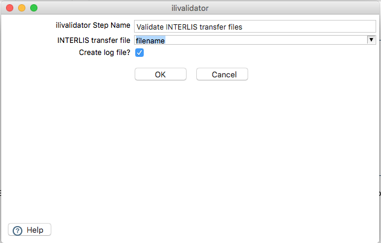
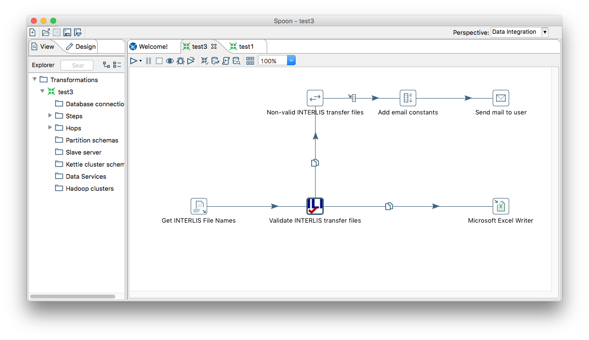

---
= Interlis leicht gemacht #12
Stefan Ziegler
2016-09-11
:thoth-type: post
:thoth-status: published
:thoth-tags: INTERLIS,Java,ilivalidator,Kettle,PDI
:idprefix:
---
Der Open Source INTERLIS-Checker https://github.com/claeis/ilivalidator[`ilivalidator`] entwickelt sich prächtig. Mittlerweile kann man bereits die Version 0.3.0 https://github.com/claeis/ilivalidator/releases[herunterladen]. Ganz https://github.com/claeis/ilivalidator/commit/bb8e7fd0f03956439a1e93a484f96a220e9cf084[neu] ist, dass die Methode `runValidation()` einen Rückgabewert besitzt. Der Rückgabewert ist `true`, falls die Prüfung erfolgreich war resp. `false`, falls nicht. Somit wird es einfacher, wenn man `ilivalidator` als Programmbibliothek einsetzen will und verschiedene weitere Schritte vom Resultat der Prüfung abhängig machen will. Diese neue Funktion wird in der nächsten Version verfügbar sein.

Will nicht &laquo;bloss&raquo; eine INTERLIS-Transferdatei prüfen (z.B. mit einem simplen https://sogeo.services/ilivalidator/upload.xhtml[Webservice]), sondern eine ganzes Verzeichnis mit Daten prüfen und Logdateien von nicht bestandenen Prüfungen mit einer E-Mail verschicken, schreibt man entweder ein kleines Skript oder aber man verwendet spezielle Software dazu. http://community.pentaho.com/projects/data-integration/[Kettle] ist so eine typische ETL-Software. Daten rumkopieren, Verzeichnisse auslesen und E-Mails verschicken gehören zum Standard eines solchen Werkzeuges. Es fehlt bloss die INTERLIS-Prüfung. Weil sich Kettle einfach erweitern lässt und dazu noch mit Java geschrieben ist, passt das alles sehr gut zusammen.

Eine Erweiterungsmöglichkeit von Kettle ist die &laquo;User Definied Java Class&raquo; (UDJC). Damit lässt sich ein Transformation-Step mit Java-Code relativ einfach und effizient selber schreiben:

[source,java,linenums]
----
import org.interlis2.validator.Validator;
import ch.ehi.basics.settings.Settings;

private FieldHelper inputField = null;
private Settings settings = null;

public boolean processRow(StepMetaInterface smi, StepDataInterface sdi) throws KettleException
{
	Object[] r = getRow();

	if (r == null) {
		setOutputDone();
		return false;
	}

	if (first) {
		first = false;
		// get the input and output fields
		inputField = get(Fields.In, "filename");

		// Default settings for ilivalidator.
		settings = new Settings();
		settings.setValue(Validator.SETTING_ILIDIRS, Validator.SETTING_DEFAULT_ILIDIRS);
	}

	String value = inputField.getString(r);
	logBasic("INTERLIS transfer file: " + value);

	boolean ret = Validator.runValidation(value, settings);
	logBasic("Validation successful? " + ret);

	return true;
}
----

Einzig die Java-Bibliotheken von `ilivalidator` muss man in das `lib/`-Verzeichnis von Kettle kopieren. Als Proof-Of-Concept ist das ideal und funktioniert einwandfrei. Wenn man aber mehr Steuerungsmöglichkeiten will oder aber den Transformation-Step einfacher verfügbar machen will, dient sich die zweite Erweiterungsmöglichkeit an: ein Plugin.

Für den Bezugsrahmenwechsel habe ich für GeoKettle vor längerer Zeit ein http://blog.sogeo.services/blog/2014/02/09/fun-with-geokettle-episode-1.html[Plugin] geschrieben. Der Nachteil von Plugins ist, dass man sich da ein wenig reinkämpfen muss und unter anderem in die https://www.eclipse.org/swt/widgets/[SWT]-Hölle abtauchen muss. Mit viel Copy/Paste vom Bezugsrahmenwechsel-Plugin habe ich einen ersten Wurf eines `ilivalidator`-Plugins geschrieben. Dieses lässt sich jetzt sehr bequem wie alle anderen Transformation-Steps in Kettle nutzen. Als Input erwartet das Plugin den Namen einer INTERLIS-Transferdatei. Und es kann mittels Checkbox gewählt werden, ob ein Logfile erzeugt werden soll:

Das Plugin fügt dem Datenstrom ein Attribut `valid` hinzu. Je nach Resultat der Prüfung ist der Wert dieses Attributes `true` oder `false` (also der Rückgabewert der Methode `runValidation()`). Zusätzlich wird auch das Attribut `logfile` hinzugefügt. Der Wert ist der Name der erzeugten Logdatei. Schöner wäre es natürlich, wenn man die Namen dieser neuen Attribute selber wählen könnte. Zudem fehlen noch weitere Optionen von `ilivalidator`, wie z.B. der XTF-Logfile-Output oder ein sauberer Umgang mit den INTERLIS-Modelablagen. Momentan wird einfach die INTERLIS-Compiler-Standard-Variante verwendet.

Als Beispiel-Workflow will ich ein ganzes Verzeichnis mit INTERLIS-Dateien prüfen und die Logdateien, der nicht erfolgreichen Prüfugen per E-Mail verschicken. Sämtliche Prüfungen sollen in eine Excel-Datei geloggt:

Diesen Workflow kann man sich jetzt einfach in Kettle zusammenklicken. Tricky war noch das Verschicken der E-Mails. Zuerst müssen E-Mail-Credentials dem Datenstrom hinzugefügt werden. Das geht mit dem `Add constants`-Step. Im `Mail`-Step muss man dann für seinen E-Mail-Provider die richtigen Parameter finden. Für GMail ist das der Port 465 für SSL. Als `Authentification user` muss nicht die ganze E-Mail-Adresse angegeben werden, sondern nur das vor dem at-Zeichen. Um die Logfiles als Attachement zu verschicken, muss man `Dynamic filenames` anwählen und das Feld mit dem Logfile-Namen auswählen. Eventuell muss man in den GMail-Einstellungen die Option &laquo;Access for less secure apps&raquo; einschalten.

Abgesehen von der normalen Frickelei mit Kettle (die Doku ist aber sehr informativ), lässt sich mit wenig Aufwand eine ganze Prozesskette zum Prüfen von INTERLIS-Dateien auf die Beine stellen. Vorausgesetzt natürlich das `ilivalidator`-*Plugin* hält, was es verspricht.

Ein erster Wurf des Plugins kann man http://blog.sogeo.services/data/interlis-leicht-gemacht-number-12/kettle-ilivalidator.zip[hier] herunterladen. Den Quellcode gibt es https://git.sogeo.services/stefan/ilivalidator-kettle[hier]. Die Zip-Datei enthält sowohl das Plugin selbst wie auch die benötigten `ilivalidator`-Bibliotheken. Die Zip-Datei kopiert man entpackt im `plugins/`-Ordner von Kettle und schon sollte der `ilivalidator`-Step in der Kategorie `Validation` von Kettle sichtbar sein. Die `antlr`-Bibliothek von `ilivalidator` ist nicht in der Zip-Datei enthalten. Mit dieser gibt es ein Problem, da in Kettle selbst bereits eine andere Version vorhanden ist. 

Leider habe erst nach der Copy/Paste-Orgie festgestellt, dass die https://help.pentaho.com/Documentation/6.0/0R0/0V0/010[Plugin-Dokumention] (seit kurzem?) von Kettle gar nicht so übel ist. Es gibt sogar eine https://help.pentaho.com/Documentation/6.0/0R0/0V0/010/035[Richtlinie], wie man die Icons designen soll. Das Template-Plugin findet sich im https://github.com/pentaho/pdi-sdk-plugins[Github-Repository]. Ich muss da definitiv nochmals über die Bücher, da mein Copy/Paste-Plugin auf einer sehr alten Kettle-Version basiert.

