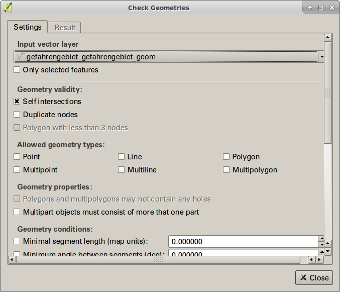
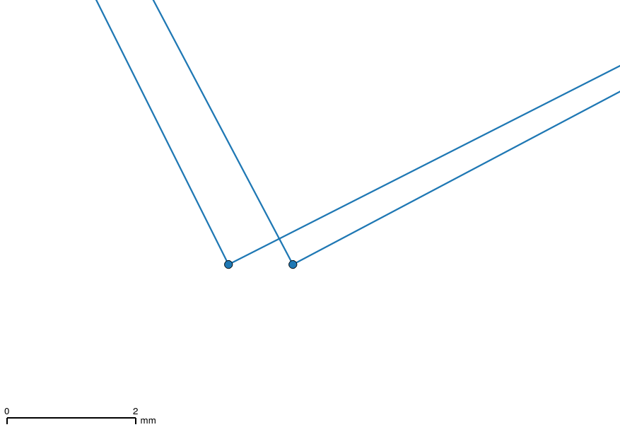

---
= Interlis leicht gemacht #13
Stefan Ziegler
2016-10-23
:thoth-type: post
:thoth-status: published
:thoth-tags: INTERLIS,Java,ili2db,ili2pg,ili2gpkg
:idprefix:
---
Von den letzten Wochen sind mir zwei frustrierende INTERLIS-Erlebnisse in Erinnerung geblieben. Nicht wegen INTERLIS selbst, nicht wegen der investierten Zeit, sondern viel mehr wegen der mangelnden Datenhygienie resp. der mangelnde technischen Datenqualität. INTERLIS = gute Datenqualität. Stimmt so nicht. Und das ist dann doch erstaunlich nach über 20 Jahren INTERLIS... 

Wenn man versucht mit http://www.eisenhutinformatik.ch/interlis/ili2pg/[`ili2pg`] diese Daten in die Datenbank zu importieren, kommt es zu Fehlermeldungen. Schlimmstenfalls gibt es eine `java.lang.NullPointException`, was so nicht wirklich aussagekräftig ist und definitiv nicht der Weisheit letzter Schluss ist. Das Verhalten der Software in diesen Situationen resp. die Fehlermeldung werden in Zukunft sicher noch besser werden (müssen).

Das Tüpfelchen auf dem Frustrations-i war aber die Aussage (wobei ich die Aussage voll und ganz nachvollziehen kann): 

_&laquo;I'm a bit puzzled...I spent quite some time on trying a new procedure to integrate cadastral data. I wanted to use interlis, but it seems not possible at the moment, what a pity.&raquo;_

Nun denn, um nicht nur rumzufrustrieren, im Folgenden ein paar konstruktive Tipps und Tricks zur Fehlersuche in den Daten.

*Fehlermeldung lesen*

Klingt blöd, ist aber so. Unter Umständen ist die Fehlermeldung relativ lang und der interessante Teil steht ganz zu Beginn:

[source,java,linenums]
----
Error: Object 12216773 at (line 6751147,col 0)
Error:   ERROR: duplicate key value violates unique constraint "pipelines_linear_element_posname_pkey"
  Detail: Key (t_id)=(1100350) already exists.
Error: Object 12216773 at (line 6751148,col 0)
Error:   ERROR: current transaction is aborted, commands ignored until end of transaction block
Error: Object 12216773 at (line 6751149,col 0)
Error:   ERROR: current transaction is aborted, commands ignored until end of transaction block
Error: Object 12216773 at (line 6751150,col 0)
Error:   ERROR: current transaction is aborted, commands ignored until end of transaction block
Error: Object 12216773 at (line 6751151,col 0)
Error:   ERROR: current transaction is aborted, commands ignored until end of transaction block
Error: Object 12216773 at (line 6751152,col 0)
Error:   ERROR: current transaction is aborted, commands ignored until end of transaction block
Error: Object 12216773 at (line 6751153,col 0)
Error:   ERROR: current transaction is aborted, commands ignored until end of transaction block
Error: Object 12216773 at (line 6751154,col 0)
Error:   ERROR: current transaction is aborted, commands ignored until end of transaction block
Error: Object 12216773 at (line 6751155,col 0)
Error:   ERROR: current transaction is aborted, commands ignored until end of transaction block
Error: Object 12216773 at (line 6751156,col 0)
Error:   ERROR: current transaction is aborted, commands ignored until end of transaction block
Error: Object 12216773 at (line 6751157,col 0)
Error:   ERROR: current transaction is aborted, commands ignored until end of transaction block
Error: Object 12216773 at (line 6751158,col 0)
Error:   ERROR: current transaction is aborted, commands ignored until end of transaction block
Error: Object 12216773 at (line 6751159,col 0)
Error:   ERROR: current transaction is aborted, commands ignored until end of transaction block
Error: Object 12216773 at (line 6751160,col 0)
Error:   ERROR: current transaction is aborted, commands ignored until end of transaction block
Error: Object 12216773 at (line 6751161,col 0)
Error:   ERROR: current transaction is aborted, commands ignored until end of transaction block
Error: Object 12216773 at (line 6751162,col 0)
Error:   ERROR: current transaction is aborted, commands ignored until end of transaction block
Error: Object 12216773 at (line 6751163,col 0)
Error:   ERROR: current transaction is aborted, commands ignored until end of transaction block
Error: Object 12216773 at (line 6751164,col 0)
Error:   ERROR: current transaction is aborted, commands ignored until end of transaction block
Error: Object 12216773 at (line 6751165,col 0)
Error:   ERROR: current transaction is aborted, commands ignored until end of transaction block
Error: Object 12216773 at (line 6751166,col 0)
Error:   ERROR: current transaction is aborted, commands ignored until end of transaction block
Error: Object 12216773 at (line 6751167,col 0)
Error:   ERROR: current transaction is aborted, commands ignored until end of transaction block
Error: Object 12216773 at (line 6751168,col 0)
Error:   ERROR: current transaction is aborted, commands ignored until end of transaction block
Error: Object 12216773 at (line 6751169,col 0)
Error:   ERROR: current transaction is aborted, commands ignored until end of transaction block
Error: Object 12216773 at (line 6751170,col 0)
Error:   ERROR: current transaction is aborted, commands ignored until end of transaction block
Error: Object 12216773 at (line 6751171,col 0)
Error:   ERROR: current transaction is aborted, commands ignored until end of transaction block
Error: Object 12216773 at (line 6751172,col 0)
Error:   ERROR: current transaction is aborted, commands ignored until end of transaction block
Error: Object 12216773 at (line 6751173,col 0)
Error:   ERROR: current transaction is aborted, commands ignored until end of transaction block
Error: Object 12216773 at (line 6751174,col 0)
Error:   ERROR: current transaction is aborted, commands ignored until end of transaction block
Error: Object 12216773 at (line 6751175,col 0)
Error:   ERROR: current transaction is aborted, commands ignored until end of transaction block
Error: Object 12216773 at (line 6751176,col 0)
Error:   ERROR: current transaction is aborted, commands ignored until end of transaction block
Error: Object 12216773 at (line 6751177,col 0)
Error:   ERROR: current transaction is aborted, commands ignored until end of transaction block
Error: failed to query av_mopublic.t_ili2db_seq
Error:   ERROR: current transaction is aborted, commands ignored until end of transaction block
Error: org.postgresql.util.PSQLException: ERROR: current transaction is aborted, commands ignored until end of transaction block
Error:   ERROR: current transaction is aborted, commands ignored until end of transaction block
----

Die zweite Zeile sagt bereits alles aus: irgendetwas mit einem `duplicate key`. In der ersten Zeile schreibt `ili2pg` netterweise sogar die Transfer-ID und die Zeile dieses Objektes in der Transferdatei. Schaut man sich diese Zeile an, wird sofort ersichtlich, was das Problem ist:

[source,java]
----
TABL Linear_element_PosName
OBJE 12216771 8294270 IWB 2614693.048 1268727.154 186.0 1 2 2703
OBJE 12216772 8294270 IWB 2614676.986 1268794.383 175.7 1 2 2703
OBJE 12216773 8294324 IWB 2616025.963 1270865.401 28.1 1 2 2703
OBJE 12216773 8294359 IWB 2616025.963 1270865.401 28.1 1 2 2703
OBJE 12216773 8294390 IWB 2616025.963 1270865.401 28.1 1 2 2703
OBJE 12216773 8294397 IWB 2616025.963 1270865.401 28.1 1 2 2703
...
----

Ein bestimmtes Objekt ist mehrfach in der Transferdatei vorhanden. Was aber das Hauptproblem ist, ist die mehrfach verwendete Transfer-ID (12216773). Das kann so natürlich nicht funktionieren. Da es sich um das http://www.cadastre.ch/internet/kataster/de/home/manuel-av/service/mopublic.html[
_MOpublic_]-Datenmodell handelt, liegt der Verdacht nahe, dass es sich um einen Fehler beim Datenumbau handelt. Insbesondere wenn man sich vergegenwärtigt, wie diese Tabelle entsteht und aus welchen Tabellen des _DM01_-Datenmodells zusammengebastelt wird.

*ili2pg-Optionen*

`ili2pg` hat die Option `--trace`, die während des Imports zusätzliche Informationen in die Konsole schreibt. In Kombination mit der Option `--log fubar.log`, die diese Meldungen in eine Datei schreibt, hat man eine gute Ausgangslage für die Fehlersuche. Ohne `--trace` meldet `ili2pg` folgendes:

[source,java,linenums]
----
Info: ilifile <./NG_NaturgefahrenLV95.ili>
Info: create table structure...
Info: process data file...
Info: data <naturgefahren.itf>
Info: Basket NG_NaturgefahrenLV95.Gefahrengebiet(oid itf0)...
java.lang.NullPointerException
----

Mit `--trace` erfolgt dieser Output:

[source,java,linenums]
----
Info: buildSurfaces(): build surfaces..._itf_geom_Gefahrengebiet, maxOverlaps 0.0 (ItfSurfaceLinetable2Polygon.java:217)
Error: java.lang.NullPointerException
Error:     ch.interlis.iom_j.itf.impl.ItfSurfaceLinetable2Polygon.removeValidSelfIntersections(ItfSurfaceLinetable2Polygon.java:392)
Error:     ch.interlis.iom_j.itf.impl.ItfSurfaceLinetable2Polygon.buildSurfaces(ItfSurfaceLinetable2Polygon.java:230)
Error:     ch.interlis.iom_j.itf.ItfReader2.read(ItfReader2.java:313)
Error:     ch.ehi.ili2db.fromxtf.TransferFromXtf.doit(TransferFromXtf.java:389)
Error:     ch.ehi.ili2db.base.Ili2db.transferFromXtf(Ili2db.java:1786)
Error:     ch.ehi.ili2db.base.Ili2db.runUpdate(Ili2db.java:598)
Error:     ch.ehi.ili2db.base.Ili2db.runImport(Ili2db.java:195)
Error:     ch.ehi.ili2db.base.Ili2db.run(Ili2db.java:175)
Error:     ch.ehi.ili2db.AbstractMain.domain(AbstractMain.java:367)
Error:     ch.ehi.ili2pg.PgMain.main(PgMain.java:71)
----

Immerhin weiss ich jetzt, dass es beim Prozess der Flächenbildung und beim Löschen der http://blog.sogeo.services/blog/2015/10/03/interlis-leicht-gemacht-number-5.html[validen Self-Intersections] Probleme gab. Diese validen Self-Intersections sind wahrscheinlich die Nemesis eines jeden Programmierers: INTERLIS lässt ja bekanntlich unter gewissen Voraussetzungen Self-Intersections zu. In der Datenbank möchte man aber keine nicht-konformen Simple-Feature-Geometrien. Das unter einen Hut zu bringen ist schwierig.

Falls es sich wirklich um ein Problem bei der Flächenbildung / Self-Intersections-Bereinigung handelt, weiss ich aber immer noch nicht *wo* (also geografisch) das Problem liegt. In diesem Moment hilft mir die Option `--skipPolygonBuilding`. Sie verhindert die Flächenbildung und importiert somit nur die Linien, wie sie in der ITF-Datei kodiert sind. Somit kann ich die Daten immerhin in die Datenbank importieren und in einem Desktop-GIS anschauen und prüfen. In http://www.qgis.org[QGIS] gibt es dafür das https://www.qgis.ch/de/ressourcen/anwendertreffen/2015/geometry-cleaning-plugins[Geometry] https://docs.qgis.org/2.14/en/docs/user_manual/plugins/plugins_geometry_checker.html[Checker] Plugin:

Im Moment bin ich nur an den Self-Intersections interessiert. Sämtliche anderen Prüfungen lasse ich links liegen. Das Resultat liefert mir dann die Liniengeometrien mit Self-Intersections. Sind diese zu gross, kann `ili2pg` nicht mehr damit umgehen und auch kein Polygon daraus bilden. Einer der Fehler, die das Plugin aufgedeckt hat:

Ein weiterer häufig auftretender Fehler in (INTERLIS-)Daten sind doppelte Stützpunkte. Auch diese lassen sich im Geometry Checker Plugin entdecken.

*Selber coden*

Bei anderen Daten wurde der Import mit dieser Fehlermeldung verweigert:

[source,java,linenums]
----
Info: Basket MD01MOCH24MN95F.Points_fixesCategorie1(oid itf0)...
Info: Basket MD01MOCH24MN95F.Points_fixesCategorie2(oid itf1)...
Info: Basket MD01MOCH24MN95F.Points_fixesCategorie3(oid itf2)...
Error: failed to build polygons of MD01MOCH24MN95F.Points_fixesCategorie3.Mise_a_jourPFP3.Perimetre
Error:   no polygon
Info: Basket MD01MOCH24MN95F.Couverture_du_sol(oid itf3)...
java.lang.NullPointerException
----

Mit `--trace` sieht die Fehlermeldung so aus:

[source,java,linenums]
----
Info: buildSurfaces(): build surfaces..._itf_geom_Mise_a_jourCS, maxOverlaps 0.05 (ItfSurfaceLinetable2Polygon.java:217)
Info: removeValidSelfIntersections(): valoverlap Intersection overlap 8.527947694197402E-4, coord1 (2559588.499, 1144173.854, NaN), coord2 (2559591.1405376485, 1144172.0968293739, NaN), tid1 4955, tid2 4955, idx1 0, idx2 1, seg1 CIRCULARSTRING (2559591.251 1144171.994, 2559589.951 1144173.036, 2559588.499 1144173.854), seg2 CIRCULARSTRING (2559588.499 1144173.854, 2559589.948 1144173.037, 2559591.247 1144171.998) (ItfSurfaceLinetable2Polygon.java:397)
Info: removeValidSelfIntersections(): valoverlap Intersection overlap 3.728486693480781E-4, coord1 (2556237.844, 1145424.429, NaN), coord2 (2556240.125186811, 1145424.724616642, NaN), tid1 7439, tid2 7439, idx1 2, idx2 0, seg1 CIRCULARSTRING (2556240.715 1145424.465, 2556239.274 1145424.847, 2556237.844 1145424.429), seg2 CIRCULARSTRING (2556237.844 1145424.429, 2556239.38 1145424.846, 2556240.893 1145424.352) (ItfSurfaceLinetable2Polygon.java:397)
Info: removeValidSelfIntersections(): valoverlap Intersection overlap 8.527947694197402E-4, coord1 (2559588.499, 1144173.854, NaN), coord2 (2559591.1405376485, 1144172.0968293739, NaN), tid1 4199, tid2 4199, idx1 0, idx2 1, seg1 CIRCULARSTRING (2559591.251 1144171.994, 2559589.951 1144173.036, 2559588.499 1144173.854), seg2 CIRCULARSTRING (2559588.499 1144173.854, 2559589.948 1144173.037, 2559591.247 1144171.998) (ItfSurfaceLinetable2Polygon.java:397)
java.lang.NullPointerException
    ch.interlis.iom_j.itf.impl.LineSet.buildBoundaries(LineSet.java:51)
    ch.interlis.iom_j.itf.impl.ItfSurfaceLinetable2Polygon.buildSurfaces(ItfSurfaceLinetable2Polygon.java:228)
    ch.interlis.iom_j.itf.ItfReader2.read(ItfReader2.java:313)
    ch.ehi.ili2db.fromxtf.TransferFromXtf.doit(TransferFromXtf.java:389)
    ch.ehi.ili2db.base.Ili2db.transferFromXtf(Ili2db.java:1786)
    ch.ehi.ili2db.base.Ili2db.runUpdate(Ili2db.java:598)
    ch.ehi.ili2db.base.Ili2db.runImport(Ili2db.java:195)
    ch.ehi.ili2db.base.Ili2db.run(Ili2db.java:175)
    ch.ehi.ili2db.AbstractMain.domain(AbstractMain.java:367)
    ch.ehi.ili2pg.PgMain.main(PgMain.java:71)
----

Also irgendwie wieder bei der Flächenbildung aber nicht mehr beim Löschen der Overlaps, sondern beim &laquo;Erstellen der Grenze/Kanten.&raquo; (buildBoundaries) in der Klasse `LineSet`. Der Trick mit `--skipPolygonBuilding` funktioniert hier leider nicht, da weitere Fehler auftauchen und kein Import möglich ist. Was machen? Weil der Quellcode ja öffentlich und frei verfügbar ist, kann ich mir den Code anschauen und vielleicht eine zusätzliche Meldung reinbasteln, die mir sagt, bei welchem Objekt genau das Problem auftaucht.

Besagte Klasse ist nicht im Code von `ili2pg`, sondern sie ist Bestandteil der Bibliothek https://github.com/claeis/iox-ili/[iox-ili]. `ili2pg` wiederum verwendet diese Bibliothek. Das geklonte Projekt ist ruckzuck in https://www.eclipse.org[Eclipse] importiert. Falls ich was ändere, kann ich die notwendige Jar-Datei mit `ant jar` neu erzeugen und in das `libs`-Verzeichnis von `ili2pg` kopieren.

Dank der Fehlermeldung weiss man, dass bei https://github.com/claeis/iox-ili/blob/master/src/main/java/ch/interlis/iom_j/itf/impl/LineSet.java#L51[Zeile 51] der Hund begraben sein muss. In Zeile 51 wird die Methode `getattrobj` aufgerufen. Das Problem liegt also wahrscheinlich beim Objekt `polyline`. Dieses wiederum entsteht ein paar Zeilen weiter oben auf https://github.com/claeis/iox-ili/blob/master/src/main/java/ch/interlis/iom_j/itf/impl/LineSet.java#L48[Zeile 48]. Mit ein paar sinnvollen Debugmeldungen vor- und nachher ist man um einiges schlauer:

[source,java,linenums]
----
EhiLogger.debug("t_id: " + line_tid);			
IomObject polyline=lines.get(line_tid).getattrobj(helperTableGeomAttrName, 0);
EhiLogger.debug("IomObject (polyline): " + polyline);
----

Ein erneuter Aufruf von `ili2pg` liefert neu zusätzlichen Output:

[source,java,linenums]
----
Info: buildBoundaries(): t_id: 98624113 (LineSet.java:49)
Info: buildBoundaries(): IomObject (polyline): null (LineSet.java:51)
java.lang.NullPointerException
    ch.interlis.iom_j.itf.impl.LineSet.buildBoundaries(LineSet.java:55)
    ch.interlis.iom_j.itf.impl.ItfSurfaceLinetable2Polygon.buildSurfaces(ItfSurfaceLinetable2Polygon.java:228)
    ch.interlis.iom_j.itf.ItfReader2.read(ItfReader2.java:313)
    ch.ehi.ili2db.fromxtf.TransferFromXtf.doit(TransferFromXtf.java:389)
    ch.ehi.ili2db.base.Ili2db.transferFromXtf(Ili2db.java:1786)
    ch.ehi.ili2db.base.Ili2db.runUpdate(Ili2db.java:598)
    ch.ehi.ili2db.base.Ili2db.runImport(Ili2db.java:195)
    ch.ehi.ili2db.base.Ili2db.run(Ili2db.java:175)
    ch.ehi.ili2db.AbstractMain.domain(AbstractMain.java:367)
    ch.ehi.ili2pg.PgMain.main(PgMain.java:71)
----

Wie vermutet, ist das `polyline`-Objekt `null`. In der Transferdatei muss man sich jetzt nur das Objekt mit der `t_id` 98624113 anschauen:

[source,java]
----
OBJE 98624113 98624113
ELIN
----

Eine Linie ohne Stützpunkte. Mit dem kann `ili2pg` nicht umgehen und wirft daher eine `java.lang.NullPointerException`. Auch nach dem Löschen dieser leeren Linie hat der Import leider nicht funktioniert. Zu viele andere Modellfehler.

*Was ich mir wünsche*

* Bessere Datenqualität
* Bessere Fehlermeldungen und besserer Umgang mit Fehlern. Das heisst nicht, dass jeder Mumpitz importiert werden soll. Aber diese NullPointerException sind unschön.
* In Zukunft *vor* einer Datenabgabe die Daten z.B. mit https://github.com/claeis/ilivalidator[`ilivalidator`] prüfen *und* anschliessend bereinigen.
