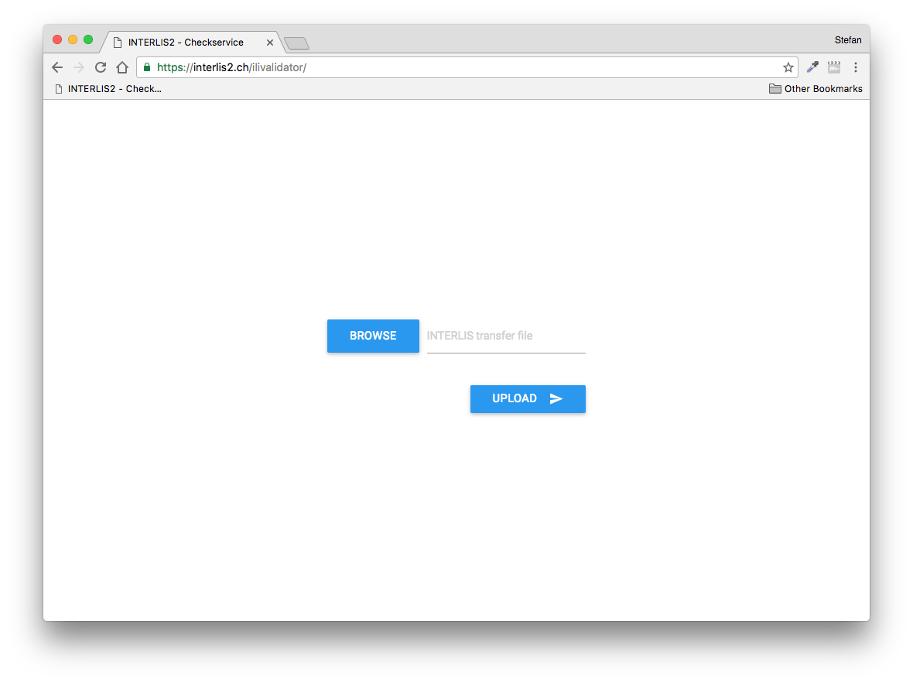
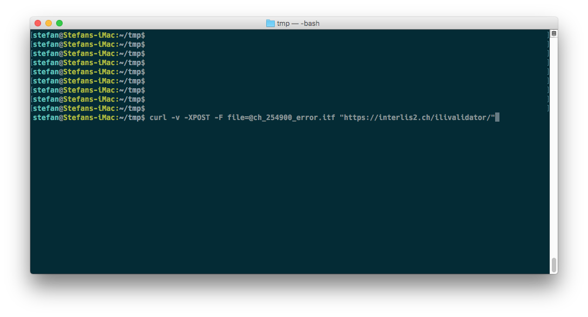
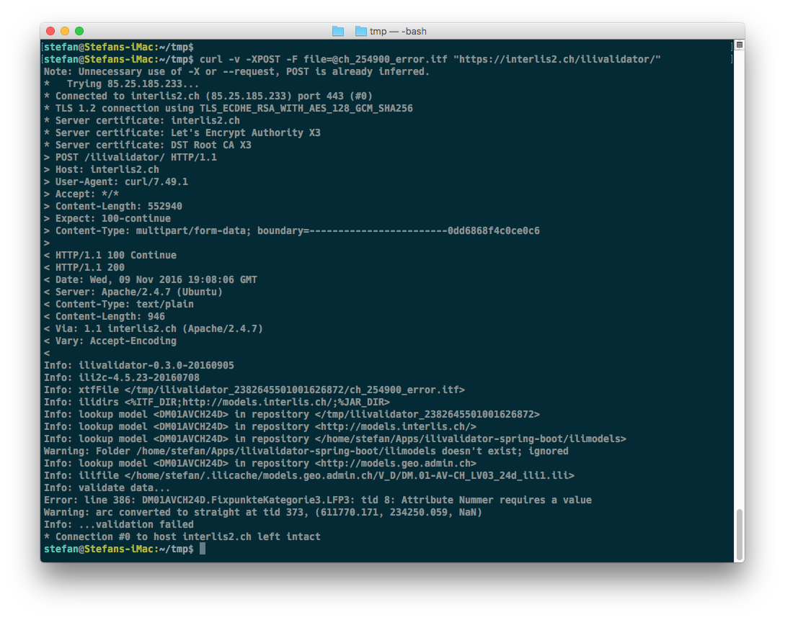
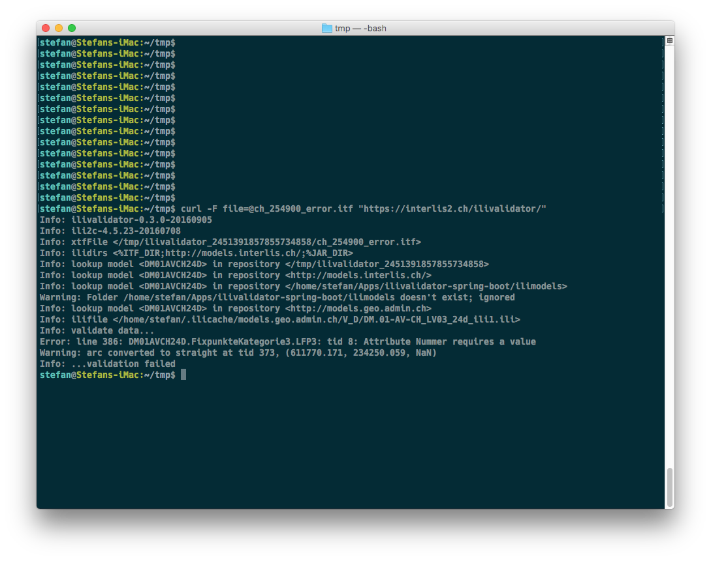
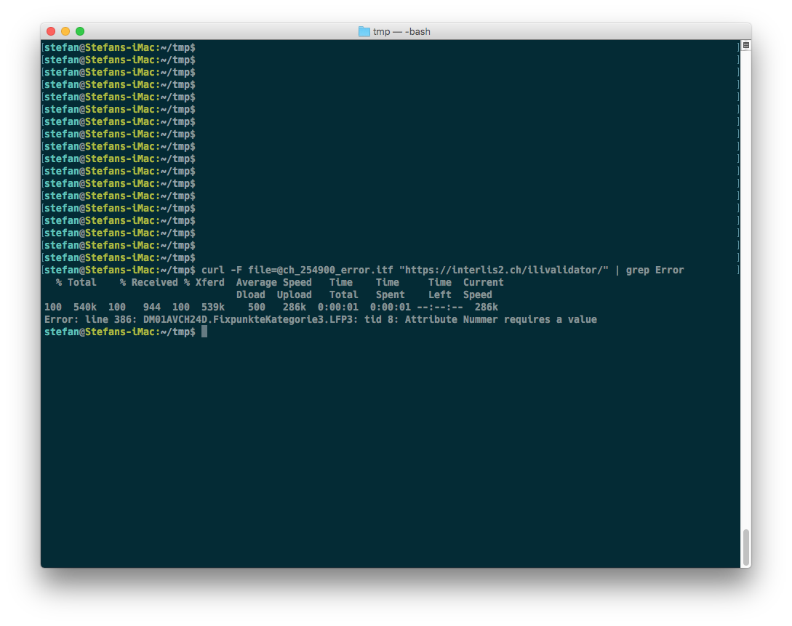
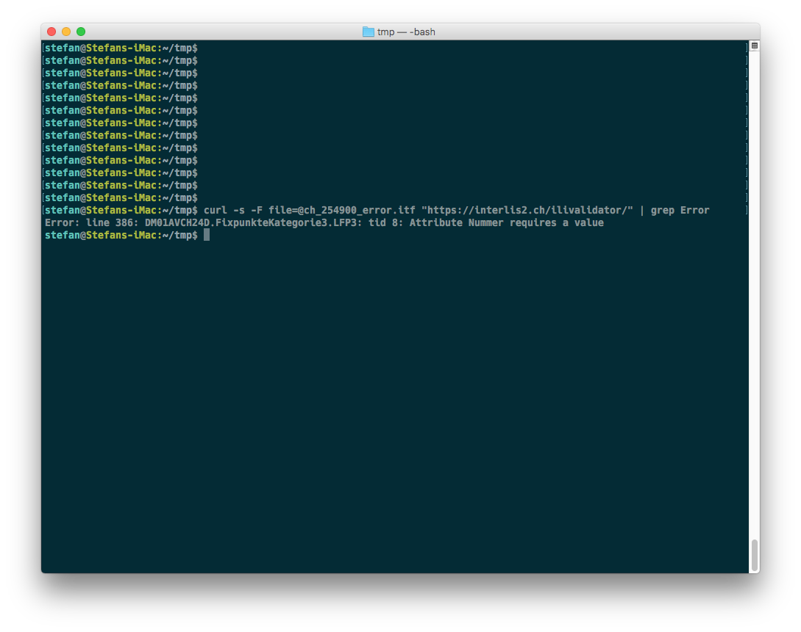

---
= Interlis leicht gemacht #14
Stefan Ziegler
2016-11-09
:thoth-type: post
:thoth-status: published
:thoth-tags: INTERLIS,Java,ilivalidator
:idprefix:
---
Um mit https://en.wikipedia.org/wiki/JavaServer_Faces[JavaServer Faces] &laquo;rumzupröbeln&raquo;, habe ich vor geraumer Zeit kurzerhand einen kleinen https://sogeo.services/ilivalidator/upload.xhtml[Checkerservice] mit den https://github.com/claeis/ilivalidator[`ilivalidator`]-Bibliotheken https://git.sogeo.services/stefan/ilivalidator-jsf[gemacht]. Weil ich auch noch etwas Einfacheres haben wollte, habe ich mit https://projects.spring.io/spring-boot/[Spring Boot] einen &laquo;no-frills&raquo; https://interlis2.ch/ilivalidator/[Webdienst] auf die Beine gestellt:

Die Funktionalität ist eingeschränkt: Das Ein- und Ausschalten von Checks wird nicht unterstützt. Wäre aber z.B. machbar, wenn man ZIP-Dateien mit einer  TOML-Datei hochladen könnte.

Im Fokus stand bei dieser Umsetzung weniger das GUI, sondern vielmehr die Webwendung _ohne_ GUI. Mit `curl` und Konsorten geht das Prüfen von INTERLIS-Dateien so jetzt wunderbar:

Die Syntax ist simpel:

* `-v`: `curl` erzeugt möglichst viel Output.
* `-XPOST`: Es wird ein POST-Request durchgeführt.
* `-F file=@ch_254900_error.itf`: Mit diesem Parameter werden die Daten auf den Server hochgeladen. Dabei entspricht `file` dem Namen des HTML-Input-Elementes vom Typ _file_ der HTML-Webseite. 

Es folgt die URL des Webdienstes (Achtung: Slash am Ende der URL). Wie einfach, effizient und im Prinzip elegant so ein Dienst geschrieben werden kann, sieht man im https://git.sogeo.services/stefan/ilivalidator-spring-boot/src/master/src/ilivalidator/src/main/java/ch/so/agi/interlis/controllers/MainController.java[Quellcode]. Es wird zweimal auf die gleiche URL gemappt. Der einzige Unterschied ist die Request-Methode. Einmal GET und einmal POST. Je nach Request-Methode erscheint entweder die HTML-Webseite oder es wird die Prüfung der hochgeladenen Datei durchgeführt.

In die zu prüfendene INTERLIS-Datei habe ich absichtlich einen Fehler eingepflanzt. Der Output der INTERLIS-Prüfung ist ziemlich unübersichtlich. Vor allem auch wegen des Outputs von `curl` selbst:

Auf der viertletzten Zeile ist der Fehler ersichtlich: Ein LFP3 ohne Nummer. Um das Ganze übersichtlicher zu machen, lassen wir beim nächsten Aufruf den `-v`-Parameter und den Parameter `-XPOST`. `-XPOST` hat zwar keinen Einfluss auf den Output, ist aber überflüssig, da `curl` standardmässig einen POST-Request ausführt. Ist schon übersichtlicher geworden:

Jetzt ist nur noch Output von `ilivalidator` sichtbar. Was mich aber in den allermeisten Fällen überhaupt nicht interessiert, sind die Information zu den Repositories und Programmversionen etc. etc. Oder anders formuliert: Ich will nur die Fehler sehen. Für diesen Usecase reicht ein wenig &laquo;Pipe-und-Grep-Zauber&raquo;:

Der Pipe-Operator `|` leitet die Ausgabe des Befehls (hier `curl`) direkt an einen anderen Befehl. In unserem Fall ist dieser andere Befehl `grep`. Mit _grep_ lassen Dateien etc. nach Texten durchsuchen. Weil wir eben nur an Fehlern interessiert sind, suchen wir nach &laquo;Error&raquo;. Eine Unschönheit gibt es noch: diese Datei-Hochlade-Information. Warum die jetzt plötzlich erscheint, ist mir schleierhaft. Mit einem simplen zusätzlichen `-s` beim `curl`-Befehl verschwindet diese auch noch:

Bei macOS und Linux ist `curl` natürlich mit dabei oder zumindest sofort installiert. Unter Windows ist `curl` jedenfalls auch https://curl.haxx.se/download.html[verfügbar]. Eventuell reicht unter Windows 10 schon die https://msdn.microsoft.com/en-us/commandline/wsl/about[Linux Bash Shell].
