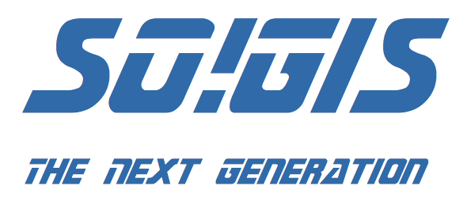
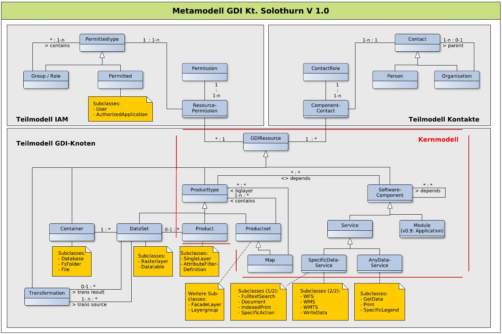

---
= KGDI - The next generation #1
Stefan Ziegler
2016-12-24
:thoth-type: post
:thoth-status: published
:thoth-tags: KGDI,GDI,Metamodell,know your gdi
:idprefix:
---
https://www.so.ch/verwaltung/bau-und-justizdepartement/amt-fuer-geoinformation/geoportal/[Unsere] Geodateninfrastruktur ist circa 16-jährig. So weit, so gut. Das heisst aber auch, dass viele der Komponenten und Prozesse ebenfalls etliche Jahre auf dem Buckel haben. Zu viele Jahre. Die Bedürfnisse und Anforderungen an eine GDI haben sich in diesen 16 Jahren stark verändert. Ein WebGIS-Client sieht heute anders aus und hat andere Funktionen und die Leute sind es sich gewohnt mit solchen exotischen Tools umzugehen. Auch die GIS-Kenntnisse in den Dienststellen ausserhalb einer GIS-Fachstelle sind gewachsen. Und zu guter Letzt darf man langsam zur Einsicht kommen, dass viele Herausforderungen in einer GDI nichts mit &laquo;GIS&raquo; zu tun haben, sondern pure IT ist und dementsprechend nicht durch den GIS-Spezialisten/-Informatiker/-Projektleiter (whatever...) gelöst werden müssen.

Wenn im Kontext der GDI der https://www.so.ch/verwaltung/bau-und-justizdepartement/amt-fuer-geoinformation/lv95/[Bezugsrahmenwechsel] etwas gebracht hat, dann die Einsicht, dass sich in diesen 16 Jahren sehr viel angesammelt. Bei dieser Ansammlung von selbst geschriebener Software, Schnittstellen, Daten etc. fehlt uns oft die Übersicht. Wer braucht noch was? Warum liegt diese Datei hier? Bei vielen eingesetzten Tools, Skripts und dergleichen darf oder muss man getrost sagen: &laquo;End of Life&raquo;. 

Während dieser GIS-Pionierzeit endeten viele Entwicklungen (gefühlt einmal mit jeder Programmiersprache, die es gibt) als Individualkomponente. Das Rad wurde immer und immer wieder neu erfunden. Das macht als Entwickler natürlich Spass, ist aber für den Betrieb so ziemlich unangenehm. Oder wenn für den Bezugsrahmenwechsel jede dieser Individualkomponente geprüft und allenfalls angepasst werden muss. Zudem müssen mit diesem Approach immer mehr Ressourcen in die Aufrechterhaltung des Betriebes gesteckt werden. Interessanterweise wurde auch nie irgendetwas abgekündigt. Es läuft und läuft und läuft. Und es kam/kommt immer mehr.

Mit ein paar kleinen kosmetischen Anpassungen kommt man da nicht mehr raus. Das &laquo;Übel&raquo; muss an der Wurzel gepackt werden. Aus diesem Grund haben wir das Projekt SO!GIS 2.0 gestartet. 

Es hat unter anderem zum Ziel:

* Reduktion der Anzahl und der Heterogenität der GDI-Komponenten
* Erneuerung der veralteten GDI-Komponenten
* Schaffung der Prozesse zur nachhaltigen Weiterentwicklung der GDI
* Definition der konzeptionellen Systemarchitektur für die anschliessenden Umsetzungsprojekte

Einige Fragestellungen werden bereits kräftig bearbeitet oder aber sind zumindest gedanklich ziemlich gediehen. Ein paar Kernideen werden in loser Folge hier beschrieben. 

Ein grosses Thema, das uns absolut beschäftigt, kann man in drei Wörtern zusammenfassen: *&laquo;Know your GDI&raquo;*. Uns ist zwar seit geraumer Zeit bekannt, dass wir die GDI eben nicht genau kennen, aber das Maximum der Unkenntnis wurde - wie erwähnt - beim Bezugsrahmenwechsel erreicht. 

Da liegen auf einem Server ein paar Dutzend MapServer-Mapfiles herum aber niemand weiss, ob es die noch braucht und falls ja, für was genau. Oder der gern gesehene Klassiker: &laquo;Wie schreibt jetzt die Fremdapplikation in unserer Datenbank?&raquo;. Bis heute haben wir das nicht herausgefunden. Fairerweise muss man dazu sagen, dass der Softwarehersteller der Fremdapplikation auch nicht mehr weiss, wie seine Software in unsere Datenbank schreibt... WMS-/WFS-Dienste gibt es en masse. Weil wir aber nicht wissen, wer die intern noch braucht, können wir die massig vorhandenen Redundanzen nicht abbauen. Das zieht dann Fäden: Tabellen und Views, die in den Mapfiles referenziert werden, können auch nicht bearbeitet oder gelöscht werden, weil irgend eine asbach-uralt Software diesen bestimmten WMS-Layer verwendet. Individualkomponente lässt grüssen.

Im Rahmen des Ablösungsprojektes unseres WebGIS-Clients (inkl. Backend) haben wir ein Metamodell entwickelt:

Aus dem Teilmodell _GDI-Knoten_ wird es eine Implementierung in Form einer Webanwendung geben. In dieser Webanwendung wird man Tabellen, Views, Dateien, Dienste etc. erfassen müssen. Einerseits damit sie überhaupt z.B im WMS-Dienst erscheinen und andererseits damit wir wissen wie/was/wo verwendet wird. Kurz zusammengefasst: Was im Metamodell nicht registriert wird, existiert nicht in unserer GDI (und kann gelöscht werden). Detailliertere Informationen gibt es hoffentlich an der nächsten https://fossgis-konferenz.de/2017[FOSSGIS-Konferenz]. Oliver Jeker (als eigentlicher Vater des Metamodelles) hat einen Abstract eingereicht.

Das Metamodell ist also ein erster, unverzichtbarer Schritt, um die GDI zu kennen und zu beherrschen.