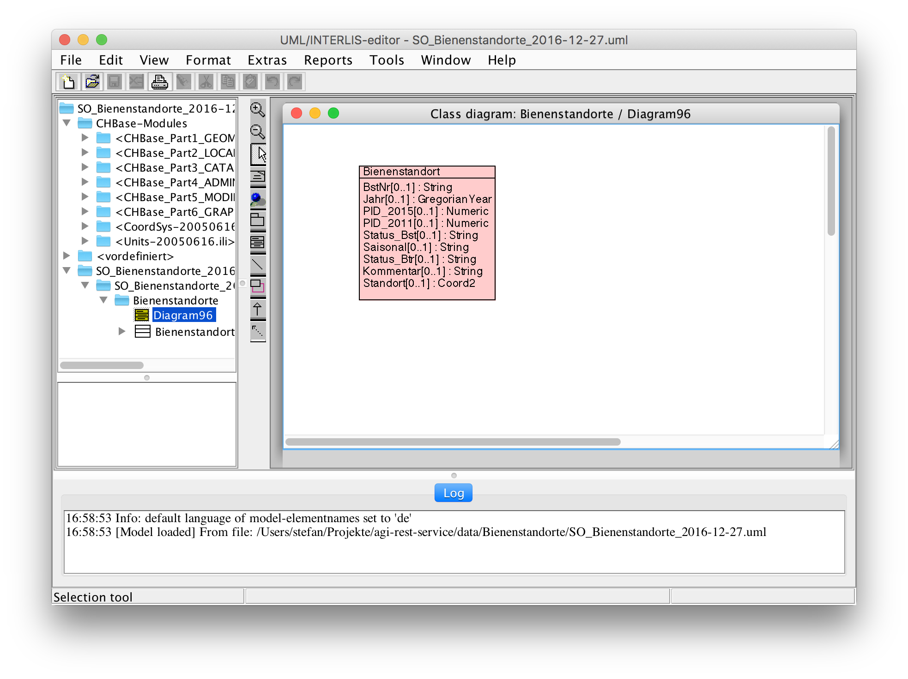
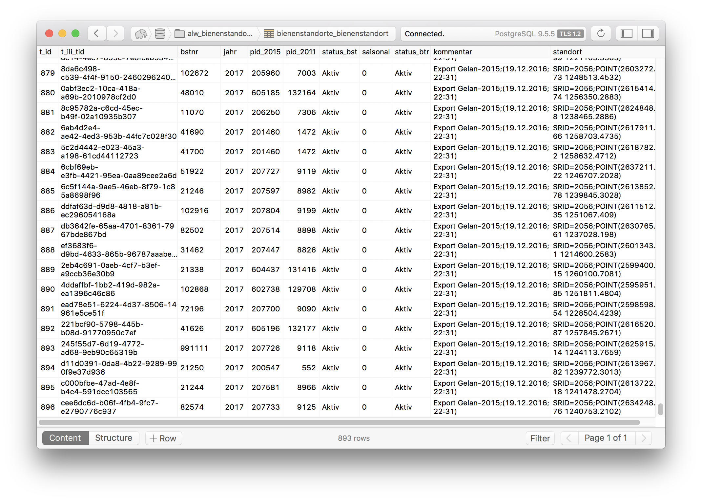

---
= REST-Service mit Spring Boot
Stefan Ziegler
2017-01-01
:thoth-type: post
:thoth-status: published
:thoth-tags: KGDI,GDI,know your gdi,REST,Java,Spring Boot,PostgreSQL,PostGIS
:idprefix:
---
Frameworks, Bibliotheken und dergleichen für REST-Service gibt es wie Sand am Meer. Für http://blog.sogeo.services/blog/2016/12/24/kgdi-the-next-generation-1.html[SO!GIS 2.0] werden wir sicher etwas Anständiges erhalten. Programmiersprachlich wollen wir uns in der möglichen Auswahl aber auf Java und Python beschränken. Als Freund von Java und weil ich die Webdienste für https://sogeo.services/ili2gpkg/[ili2gpkg], https://sogeo.services/freeframe/[Freeframe] und https://interlis2.ch/ilivalidator/[ilivalidator] mit https://projects.spring.io/spring-boot/[Spring Boot] gemacht habe, wollte ich ausprobieren, wie weit und wie gut man im Spring-Universum einen REST-Service zusammenbasteln kann.

Das soll kein Technologie-Vorentscheid sein, sondern mir das Gefühl geben, was geht, wo kann es klemmen, was sind mögliche Stolperfallen etc.

Etwas was mir an Spring Boot gefällt, ist wie schnell man wie sehr wenig Code sehr weit kommt. Praktikabel finde ich ebenfalls, dass man die ganze Anwendung kapseln kann. Ob das genau einem https://blog.codecentric.de/en/2015/01/self-contained-systems-roca-complete-example-using-spring-boot-thymeleaf-bootstrap/[&laquo;Self-Contained-System&raquo;] entspricht, weiss ich zwar nicht, jedoch passt es für mich. Anstelle einer WAR-Datei, die man in einem Servlet-Container deployen muss, kann die Spring Boot-Anwendung mit einem embedded Container ausgeliefert werden.

Ebenfalls interessant ist die Tatsache, dass man ein halbwegs http://docs.spring.io/spring-boot/docs/current/reference/html/deployment-install.html[&laquo;production ready deployment&raquo;] ziemlich einfach hinbekommt. Zumindest auf Linux-Maschinen. Viele Fragestellungen (Logging, Service) kann man elegant konfigurieren.

Für die Umsetzung eines REST-Services mit Spring Boot braucht es je nach Anforderung und Wünschen ein paar weitere https://git.sogeo.services/stefan/agi-rest-service/src/master/src/agi-rest-service/pom.xml[Abhängigkeiten]. Entweder von Spring selbst oder dann halt Klassiker wie z.B. JDBC-Treiber. Erwähnenswert sind http://docs.jboss.org/hibernate/orm/5.2/userguide/html_single/Hibernate_User_Guide.html#spatial[_Hibernate Spatial_] und für das Serialisieren resp. Deserialisieren von Geometrien eine weitere https://github.com/bedatadriven/jackson-datatype-jts[Bibliothek]. 

Als Beispieldatensatz verwende ich die Bienenstandorte des Kantons. Die Datenbanktabelle habe ich in eine Shapedatei gedumped und das Ganze anschliessend in ein kleines INTERLIS-Modell gequetscht. Ganz simpel, nur eine Klasse: 

Für den Demodatensatz ist das unnötig, aber wenn man das Ganze - auch nur aufgrund von Testzwecken - auf verschiedenen Systemen ein paar Mal aufsetzen will/muss, lernt man es zu schätzen, wenn man http://www.eisenhutinformatik.ch/interlis/ili2pg/[plattformunabhängige Werkzeuge] hat, die den Datenimport/-export immer gleich machen:

[source,xml,linenums]
----
java -jar /Users/stefan/Apps/ili2pg-3.5.1/ili2pg.jar --dbhost 192.168.50.4 --dbdatabase xanadu2 --dbusr stefan --dbpwd ziegler12 --dbschema alw_bienenstandorte --disableValidation --nameByTopic --sqlEnableNull --createGeomIdx --createFkIdx --strokeArcs --models SO_Bienenstandorte_20161227 --modeldir "http://models.geo.admin.ch/;." --defaultSrsCode 2056 --import alw_bienenstandorte_20161225.xtf
----

Und schon sind die Bienenstandorte (893 Standorte) in der Datenbank:

Alles was es jetzt für einen funktionierenden REST-Service braucht sind mindestens eine Klasse und ein Interface (natürlich neben den üblichen Spring Boot-Klassen etc.). Als erstes braucht es eine &laquo;resource representation class&raquo;. Nomen est omen: diese Klasse repräsentiert die REST-Ressource. In unserem Fall müssen wir noch ein paar Annotations anbringen, damit Spring Boot weiss, dass es sich um eine Datenbank-Tabelle handelt und wie das Schema und die Tabelle heisst. Schlussendlich ist es aber nicht Anderes als ein POJO. Das Beispiel gibt es https://git.sogeo.services/stefan/agi-rest-service/src/master/src/agi-rest-service/src/main/java/org/catais/rest/domain/ch/so/alw/Bienenstandort.java[hier].

Nun müssen wir ein Repository erstellen indem wir ein Interface https://git.sogeo.services/stefan/agi-rest-service/src/master/src/agi-rest-service/src/main/java/org/catais/rest/repository/ch/so/alw/BienenstandortRepository.java[erweitern]. Interessanterweise müssen wir das Interface selber nicht implementieren. Auch die https://docs.spring.io/spring-data/jpa/docs/current/reference/html/#jpa.query-methods[out-of-the-box Queries] müssen wir nicht implementieren. Hier kommt der Spring-Feenstaub zum Zug. Diese &laquo;findByXXX&raquo;-Abfragen gibt es in Verbindung mit einer Datenbank gratis. Im Interface können wir auch noch den Namen wählen, wie die Ressource angesprochen werden soll. In unserem Fall: `ch.so.alw.bienenstandort`.

Mit der Klasse und dem Interface bekommt man bereits einen funktionierenden REST-Service. Als Zugabe ist dieser REST-Service bereits &laquo;Hypermedia-Driven&raquo; mit dem https://en.wikipedia.org/wiki/Hypertext_Application_Language[HAL-Ausgabeformat]. So in der Gänze verstanden, habe ich diese HATEOAS-Sache jedenfalls noch nicht. Erster Eindruck: da wird dem REST-Service noch bisschen &laquo;Intelligenz&raquo; eingehaucht. Und ebenfalls sind die Resultate gepaged (resp. wurde so definiert im Repository), dh. es werden nicht alle 893 Bienenstandorte auf einmal zurückgeliefert, sondern nur immer 20 Stück und der Client muss die weiteren Pages anfordern:

[source,json,linenums]
----
{
  "_embedded" : {
    "/ch.so.alw.bienenstandort" : [ {
      "bstnr" : "102920",
      "jahr" : 2017,
      "pid_2015" : 207814,
      "pid_2011" : 9209,
      "status_bst" : "Aktiv",
      "saisonal" : "0",
      "status_btr" : "Aktiv",
      "kommentar" : "Export Gelan-2015;(19.12.2016; 22:31)",
      "standort" : {
        "type" : "Point",
        "coordinates" : [ 2612608.4948999994, 1250397.3973999992 ]
      },
      "_links" : {
        "self" : {
          "href" : "http://localhost:8884/v1/rest/layer/ch.so.alw.bienenstandort/4"
        },
        "bienenstandort" : {
          "href" : "http://localhost:8884/v1/rest/layer/ch.so.alw.bienenstandort/4"
        }
      }
    }, {
      "bstnr" : "48016",
      "jahr" : 2017,
      "pid_2015" : 604435,
      "pid_2011" : 131414,
      "status_bst" : "Aktiv",
      "saisonal" : "0",
      "status_btr" : "Aktiv",
      "kommentar" : "Export Gelan-2015;(19.12.2016; 22:31)",
      "standort" : {
        "type" : "Point",
        "coordinates" : [ 2601152.9639, 1258610.9426999986 ]
      },
      "_links" : {
        "self" : {
          "href" : "http://localhost:8884/v1/rest/layer/ch.so.alw.bienenstandort/5"
        },
        "bienenstandort" : {
          "href" : "http://localhost:8884/v1/rest/layer/ch.so.alw.bienenstandort/5"
        }
      }
    }, {
      "bstnr" : "72184",
      "jahr" : 2017,
      "pid_2015" : 601831,
      "pid_2011" : 128795,
      "status_bst" : "Aktiv",
      "saisonal" : "0",
      "status_btr" : "Aktiv",
      "kommentar" : "Export Gelan-2015;(19.12.2016; 22:31)",
      "standort" : {
        "type" : "Point",
        "coordinates" : [ 2597261.348700002, 1228547.4364 ]
      },
      "_links" : {
        "self" : {
          "href" : "http://localhost:8884/v1/rest/layer/ch.so.alw.bienenstandort/6"
        },
        "bienenstandort" : {
          "href" : "http://localhost:8884/v1/rest/layer/ch.so.alw.bienenstandort/6"
        }
      }
    }, {
      "bstnr" : "102924",
      "jahr" : 2017,
      "pid_2015" : 207788,
      "pid_2011" : 9182,
      "status_bst" : "Aktiv",
      "saisonal" : "0",
      "status_btr" : "Aktiv",
      "kommentar" : "Export Gelan-2015;(19.12.2016; 22:31)",
      "standort" : {
        "type" : "Point",
        "coordinates" : [ 2613244.4734000005, 1248688.3872000016 ]
      },
      "_links" : {
        "self" : {
          "href" : "http://localhost:8884/v1/rest/layer/ch.so.alw.bienenstandort/7"
        },
        "bienenstandort" : {
          "href" : "http://localhost:8884/v1/rest/layer/ch.so.alw.bienenstandort/7"
        }
      }
    }, {
      "bstnr" : "102806",
      "jahr" : 2017,
      "pid_2015" : 207826,
      "pid_2011" : 9222,
      "status_bst" : "Aktiv",
      "saisonal" : "0",
      "status_btr" : "Aktiv",
      "kommentar" : "Export Gelan-2015;(19.12.2016; 22:31)",
      "standort" : {
        "type" : "Point",
        "coordinates" : [ 2608493.4569999985, 1247794.4199 ]
      },
      "_links" : {
        "self" : {
          "href" : "http://localhost:8884/v1/rest/layer/ch.so.alw.bienenstandort/8"
        },
        "bienenstandort" : {
          "href" : "http://localhost:8884/v1/rest/layer/ch.so.alw.bienenstandort/8"
        }
      }
    }, {
      "bstnr" : "82568",
      "jahr" : 2017,
      "pid_2015" : 205965,
      "pid_2011" : 7008,
      "status_bst" : "Aktiv",
      "saisonal" : "0",
      "status_btr" : "Aktiv",
      "kommentar" : "Export Gelan-2015;(19.12.2016; 22:31)",
      "standort" : {
        "type" : "Point",
        "coordinates" : [ 2631996.5089999996, 1240138.5654999986 ]
      },
      "_links" : {
        "self" : {
          "href" : "http://localhost:8884/v1/rest/layer/ch.so.alw.bienenstandort/9"
        },
        "bienenstandort" : {
          "href" : "http://localhost:8884/v1/rest/layer/ch.so.alw.bienenstandort/9"
        }
      }
    }, {
      "bstnr" : "72272",
      "jahr" : 2017,
      "pid_2015" : 473947,
      "pid_2011" : 103687,
      "status_bst" : "Aktiv",
      "saisonal" : "0",
      "status_btr" : "Aktiv",
      "kommentar" : "Export Gelan-2015;(19.12.2016; 22:31)",
      "standort" : {
        "type" : "Point",
        "coordinates" : [ 2597749.344300002, 1227845.4373999983 ]
      },
      "_links" : {
        "self" : {
          "href" : "http://localhost:8884/v1/rest/layer/ch.so.alw.bienenstandort/10"
        },
        "bienenstandort" : {
          "href" : "http://localhost:8884/v1/rest/layer/ch.so.alw.bienenstandort/10"
        }
      }
    }, {
      "bstnr" : "41612",
      "jahr" : 2017,
      "pid_2015" : 201334,
      "pid_2011" : 1346,
      "status_bst" : "Aktiv",
      "saisonal" : "0",
      "status_btr" : "Aktiv",
      "kommentar" : "Export Gelan-2015;(19.12.2016; 22:31)",
      "standort" : {
        "type" : "Point",
        "coordinates" : [ 2616852.5084999986, 1258628.4717999995 ]
      },
      "_links" : {
        "self" : {
          "href" : "http://localhost:8884/v1/rest/layer/ch.so.alw.bienenstandort/11"
        },
        "bienenstandort" : {
          "href" : "http://localhost:8884/v1/rest/layer/ch.so.alw.bienenstandort/11"
        }
      }
    }, {
      "bstnr" : "62016",
      "jahr" : 2017,
      "pid_2015" : 605250,
      "pid_2011" : 132231,
      "status_bst" : "Aktiv",
      "saisonal" : "0",
      "status_btr" : "Aktiv",
      "kommentar" : "Export Gelan-2015;(19.12.2016; 22:31)",
      "standort" : {
        "type" : "Point",
        "coordinates" : [ 2609550.3222999983, 1225258.332800001 ]
      },
      "_links" : {
        "self" : {
          "href" : "http://localhost:8884/v1/rest/layer/ch.so.alw.bienenstandort/12"
        },
        "bienenstandort" : {
          "href" : "http://localhost:8884/v1/rest/layer/ch.so.alw.bienenstandort/12"
        }
      }
    }, {
      "bstnr" : "62140",
      "jahr" : 2017,
      "pid_2015" : 207633,
      "pid_2011" : 9020,
      "status_bst" : "Aktiv",
      "saisonal" : "1",
      "status_btr" : "Aktiv",
      "kommentar" : "Export Gelan-2015;(19.12.2016; 22:31)",
      "standort" : {
        "type" : "Point",
        "coordinates" : [ 2609506.3486, 1229524.3418000005 ]
      },
      "_links" : {
        "self" : {
          "href" : "http://localhost:8884/v1/rest/layer/ch.so.alw.bienenstandort/13"
        },
        "bienenstandort" : {
          "href" : "http://localhost:8884/v1/rest/layer/ch.so.alw.bienenstandort/13"
        }
      }
    }, {
      "bstnr" : "102732",
      "jahr" : 2017,
      "pid_2015" : 203788,
      "pid_2011" : 3813,
      "status_bst" : "Aktiv",
      "saisonal" : "0",
      "status_btr" : "Aktiv",
      "kommentar" : "Export Gelan-2015;(19.12.2016; 22:31)",
      "standort" : {
        "type" : "Point",
        "coordinates" : [ 2608305.4657000005, 1250274.4360999987 ]
      },
      "_links" : {
        "self" : {
          "href" : "http://localhost:8884/v1/rest/layer/ch.so.alw.bienenstandort/14"
        },
        "bienenstandort" : {
          "href" : "http://localhost:8884/v1/rest/layer/ch.so.alw.bienenstandort/14"
        }
      }
    }, {
      "bstnr" : "62004",
      "jahr" : 2017,
      "pid_2015" : 602420,
      "pid_2011" : 129390,
      "status_bst" : "Aktiv",
      "saisonal" : "0",
      "status_btr" : "Aktiv",
      "kommentar" : "Export Gelan-2015;(19.12.2016; 22:31)",
      "standort" : {
        "type" : "Point",
        "coordinates" : [ 2604411.054299999, 1223172.8467000015 ]
      },
      "_links" : {
        "self" : {
          "href" : "http://localhost:8884/v1/rest/layer/ch.so.alw.bienenstandort/15"
        },
        "bienenstandort" : {
          "href" : "http://localhost:8884/v1/rest/layer/ch.so.alw.bienenstandort/15"
        }
      }
    }, {
      "bstnr" : "31484",
      "jahr" : 2017,
      "pid_2015" : 602532,
      "pid_2011" : 129502,
      "status_bst" : "Aktiv",
      "saisonal" : "0",
      "status_btr" : "Aktiv",
      "kommentar" : "Export Gelan-2015;(19.12.2016; 22:31)",
      "standort" : {
        "type" : "Point",
        "coordinates" : [ 2604137.3066000007, 1225322.382199999 ]
      },
      "_links" : {
        "self" : {
          "href" : "http://localhost:8884/v1/rest/layer/ch.so.alw.bienenstandort/16"
        },
        "bienenstandort" : {
          "href" : "http://localhost:8884/v1/rest/layer/ch.so.alw.bienenstandort/16"
        }
      }
    }, {
      "bstnr" : "41668",
      "jahr" : 2017,
      "pid_2015" : 207610,
      "pid_2011" : 8995,
      "status_bst" : "Aktiv",
      "saisonal" : "0",
      "status_btr" : "Aktiv",
      "kommentar" : "Export Gelan-2015;(19.12.2016; 22:31)",
      "standort" : {
        "type" : "Point",
        "coordinates" : [ 2601171.401799999, 1256667.4970000014 ]
      },
      "_links" : {
        "self" : {
          "href" : "http://localhost:8884/v1/rest/layer/ch.so.alw.bienenstandort/17"
        },
        "bienenstandort" : {
          "href" : "http://localhost:8884/v1/rest/layer/ch.so.alw.bienenstandort/17"
        }
      }
    }, {
      "bstnr" : "58006",
      "jahr" : 2017,
      "pid_2015" : 605293,
      "pid_2011" : 132274,
      "status_bst" : "Aktiv",
      "saisonal" : "0",
      "status_btr" : "Aktiv",
      "kommentar" : "Export Gelan-2015;(19.12.2016; 22:31)",
      "standort" : {
        "type" : "Point",
        "coordinates" : [ 2639746.5154, 1254536.799800001 ]
      },
      "_links" : {
        "self" : {
          "href" : "http://localhost:8884/v1/rest/layer/ch.so.alw.bienenstandort/18"
        },
        "bienenstandort" : {
          "href" : "http://localhost:8884/v1/rest/layer/ch.so.alw.bienenstandort/18"
        }
      }
    }, {
      "bstnr" : "72284",
      "jahr" : 2017,
      "pid_2015" : 605172,
      "pid_2011" : 132151,
      "status_bst" : "Aktiv",
      "saisonal" : "0",
      "status_btr" : "Aktiv",
      "kommentar" : "Export Gelan-2015;(19.12.2016; 22:31)",
      "standort" : {
        "type" : "Point",
        "coordinates" : [ 2610135.3605000004, 1234627.3381999992 ]
      },
      "_links" : {
        "self" : {
          "href" : "http://localhost:8884/v1/rest/layer/ch.so.alw.bienenstandort/19"
        },
        "bienenstandort" : {
          "href" : "http://localhost:8884/v1/rest/layer/ch.so.alw.bienenstandort/19"
        }
      }
    }, {
      "bstnr" : "31520",
      "jahr" : 2017,
      "pid_2015" : 201191,
      "pid_2011" : 1202,
      "status_bst" : "Aktiv",
      "saisonal" : "0",
      "status_btr" : "Aktiv",
      "kommentar" : "Export Gelan-2015;(19.12.2016; 22:31)",
      "standort" : {
        "type" : "Point",
        "coordinates" : [ 2603626.3046000004, 1221320.3414999992 ]
      },
      "_links" : {
        "self" : {
          "href" : "http://localhost:8884/v1/rest/layer/ch.so.alw.bienenstandort/20"
        },
        "bienenstandort" : {
          "href" : "http://localhost:8884/v1/rest/layer/ch.so.alw.bienenstandort/20"
        }
      }
    }, {
      "bstnr" : "18006",
      "jahr" : 2017,
      "pid_2015" : 605255,
      "pid_2011" : 132236,
      "status_bst" : "Aktiv",
      "saisonal" : "0",
      "status_btr" : "Aktiv",
      "kommentar" : "Export Gelan-2015;(19.12.2016; 22:31)",
      "standort" : {
        "type" : "Point",
        "coordinates" : [ 2628381.2760000005, 1235816.4164999984 ]
      },
      "_links" : {
        "self" : {
          "href" : "http://localhost:8884/v1/rest/layer/ch.so.alw.bienenstandort/21"
        },
        "bienenstandort" : {
          "href" : "http://localhost:8884/v1/rest/layer/ch.so.alw.bienenstandort/21"
        }
      }
    }, {
      "bstnr" : "102936",
      "jahr" : 2017,
      "pid_2015" : 604431,
      "pid_2011" : 131410,
      "status_bst" : "Aktiv",
      "saisonal" : "0",
      "status_btr" : "Aktiv",
      "kommentar" : "Export Gelan-2015;(19.12.2016; 22:31)",
      "standort" : {
        "type" : "Point",
        "coordinates" : [ 2605077.9497000016, 1248073.3953999989 ]
      },
      "_links" : {
        "self" : {
          "href" : "http://localhost:8884/v1/rest/layer/ch.so.alw.bienenstandort/22"
        },
        "bienenstandort" : {
          "href" : "http://localhost:8884/v1/rest/layer/ch.so.alw.bienenstandort/22"
        }
      }
    }, {
      "bstnr" : "41736",
      "jahr" : 2017,
      "pid_2015" : 207669,
      "pid_2011" : 9058,
      "status_bst" : "Aktiv",
      "saisonal" : "0",
      "status_btr" : "Aktiv",
      "kommentar" : "Export Gelan-2015;(19.12.2016; 22:31)",
      "standort" : {
        "type" : "Point",
        "coordinates" : [ 2616021.4771, 1252594.4061999992 ]
      },
      "_links" : {
        "self" : {
          "href" : "http://localhost:8884/v1/rest/layer/ch.so.alw.bienenstandort/23"
        },
        "bienenstandort" : {
          "href" : "http://localhost:8884/v1/rest/layer/ch.so.alw.bienenstandort/23"
        }
      }
    } ]
  },
  "_links" : {
    "first" : {
      "href" : "http://localhost:8884/v1/rest/layer/ch.so.alw.bienenstandort?page=0&size=20"
    },
    "self" : {
      "href" : "http://localhost:8884/v1/rest/layer/ch.so.alw.bienenstandort"
    },
    "next" : {
      "href" : "http://localhost:8884/v1/rest/layer/ch.so.alw.bienenstandort?page=1&size=20"
    },
    "last" : {
      "href" : "http://localhost:8884/v1/rest/layer/ch.so.alw.bienenstandort?page=44&size=20"
    },
    "profile" : {
      "href" : "http://localhost:8884/v1/rest/layer/profile/ch.so.alw.bienenstandort"
    },
    "search" : {
      "href" : "http://localhost:8884/v1/rest/layer/ch.so.alw.bienenstandort/search"
    }
  },
  "page" : {
    "size" : 20,
    "totalElements" : 893,
    "totalPages" : 45,
    "number" : 0
  }
}
----

Diese &laquo;Intelligenz&raquo; macht sich vor allem in der Verlinkung bemerkbar. So werden z.B. die Links auf die nächste und vorherige _Page_ angezeigt oder ein Link auf die vorhandenen Suchanfragen:

[source,json,linenums]
----
{
  "_links" : {
    "findByBstnr" : {
      "href" : "http://localhost:8884/v1/rest/layer/ch.so.alw.bienenstandort/search/findByBstnr{?bstnr,page,size,sort}",
      "templated" : true
    },
    "self" : {
      "href" : "http://localhost:8884/v1/rest/layer/ch.so.alw.bienenstandort/search"
    }
  }
}
----

Nachdem man sich die Zusatzfunktionalitäten ein wenig zu Gemüte geführt hat, kann man mit den bekannten vier Verben Daten abfragen, erfassen, ändern und löschen. 

Daten abfragen / GET:

[source,json,linenums]
----
curl -X GET http://localhost:8884/v1/rest/layer/ch.so.alw.bienenstandort/search/findByBstnr?bstnr=102920
----

Daten erfassen / POST:

[source,json,linenums]
----
curl -H "Content-Type: application/json" -X POST -d '{"bstnr" : "1", "jahr" : 2017, "pid_2015" : 207669, "pid_2011" : 9058, "status_bst" : "Aktiv", "saisonal" : "0", "status_btr" : "Aktiv", "kommentar" : "Export Gelan-2015;(19.12.2016; 22:31)", "standort" : {"type" : "Point", "coordinates" : [ 2600000.123, 1200000.456 ]}}' http://localhost:8884/v1/rest/layer/ch.so.alw.bienenstandort 
----

Daten löschen / PUT:

[source,json,linenums]
----
curl -H "Content-Type: application/json" -X PUT -d '{"bstnr" : "1", "jahr" : 2525, "pid_2015" : 207669, "pid_2011" : 9058, "status_bst" : "Aktiv", "saisonal" : "0", "status_btr" : "Aktiv", "kommentar" : "Export Gelan-2015;(19.12.2016; 22:31)","standort" : {"type" : "Point", "coordinates" : [ 2600000.123, 1200000.456 ]}}' http://localhost:8884/v1/rest/layer/ch.so.alw.bienenstandort/4
----

Daten löschen / DELETE:
[source,json,linenums]
----
curl -X DELETE http://localhost:8884/v1/rest/layer/ch.so.alw.bienenstandort/4
----

Etwas was mir momentan noch nicht klar ist, ist der Umgang mit verschiedenen Koordinatensystemen. Verwendet man als Codierung für die Geometrien GeoJSON gibt keine Möglichkeit mehr das Koordinatensystem https://tools.ietf.org/html/rfc7946[anzugeben]. In der ersten Spezifikation gab es die Möglichkeit, nur hat man das in freier Wildbahn auch nie wirklich gesehen. Wahrscheinlich läuft es darauf hinaus, dass der REST-Service pro Ressource konsquenterweise nur ein Koordinatensystem unterstützen kann. Lieber in sauber nur ein Koordinatensystem als mit viel Geknorze was reinbasteln...

Eine andere Frage ist eher _Spring_-bezogen. Nämlich der Umgang mit räumlichen Abfragen. Grundsätzlich ist dank _Hibernate Spatial_ und der Jackson-Erweiterung für das De-/Serialisieren der Geometrien der Umgang mit Geodaten soweit schmerzlos. Ganz so out-of-the-box scheinen die räumlichen Abfragen nicht zu gehen. Für einen anderen Testdatensatz (die Nachführungskreise der amtlichen Vermessung) habe ich https://git.sogeo.services/stefan/agi-rest-service/src/master/src/agi-rest-service/src/main/java/org/catais/rest/repository/ch/so/agi/AV_NachfuehrungskreisRepository.java[weitere Queries im Repository-Interface] definiert:

[source,json,linenums]
----
{
  "_links" : {
    "findByKreisname" : {
      "href" : "http://localhost:8884/v1/rest/layer/nf_kreis/search/findByKreisname{?kreisname,page,size,sort}",
      "templated" : true
    },
    "findByPerimeter" : {
      "href" : "http://localhost:8884/v1/rest/layer/nf_kreis/search/findByPerimeter{?x,y}",
      "templated" : true
    },
    "findByKreisnameLike" : {
      "href" : "http://localhost:8884/v1/rest/layer/nf_kreis/search/findByKreisnameLike{?kreisname,page,size,sort}",
      "templated" : true
    },
    "self" : {
      "href" : "http://localhost:8884/v1/rest/layer/nf_kreis/search"
    }
  }
}
----

Neben der schicken &laquo;findByKreisnameLike&raquo;-Query, mit der man genau wie bei Datenbanken &laquo;Like&raquo;-Abfragen durchführen kann, habe ich natürlich auch etwas Räumliches definiert. Hier im konkreten Fall etwas Ähnliches wie eine WMS-GetFeatureInfo-Abfrage. Um das mit möglichst wenig Aufwand hinzukriegen, habe ich eine native PostgreSQL/PostGIS-Query im Repository definiert, was jetzt natürlich sehr, sehr, seeeeehr unschön ist. Eine bessere und nachhaltigere Alternative ist das Schreiben von &laquo;Custom Queries&raquo; in dem man ein eigenes Repository-Interface implementiert (was man anscheinend sowieso für read-only Repositories machen muss). Da bin ich mir aber nicht mehr sicher, ob diese Queries noch im _search_-Link auftauchen, was wiederum sehr schade wäre. 

_Fazit:_ Das Spring-Universum liefert schon sehr viel, um effizient REST-Service anbieten zu können. Hier gilt auch ausnahmsweise einmal &laquo;Spatial is (ganz klein wenig) special&raquo;, da man sicher noch für räumliche Abfragen klären muss, wie gut sich das umsetzen liesse. Die interessantere Frage ist aber unabhängig vom eingesetzten Produkt und betrifft den Betrieb/Konfiguration des REST-Services: Welche Tabellen / Views als REST-Service mit welchen Alias-Namen der Attribute angeboten werden, steht in Zukunft in unserem http://blog.sogeo.services/blog/2016/12/24/kgdi-the-next-generation-1.html[Metamodell]. Was man wahrscheinlich nicht möchte, ist das manuelle Erstellen der benötigten Klassen, Interfaces, Rechte etc. im REST-Service. Entweder könnte sich der REST-Service direkt aus dem Metamodell bedienen. Da ist mir jedoch gar nichts bekannt. Oder aber es wird etwas Ähnliches wie einen Code-Generator für diese Objekte geben. Da müssen die Profis ran. TBD.

