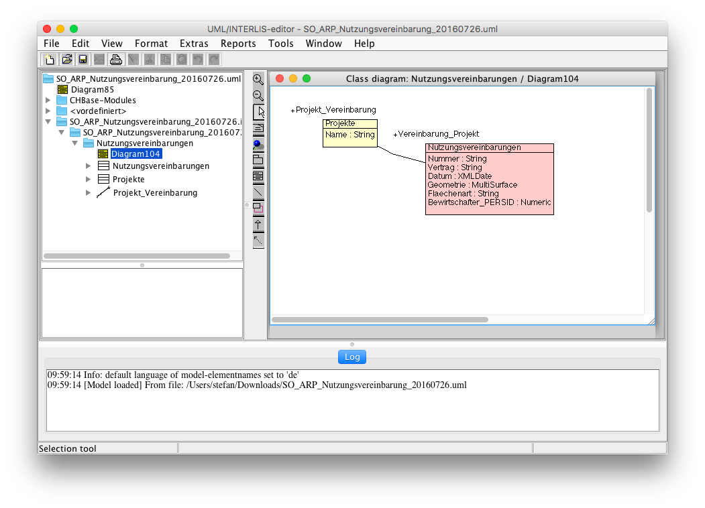
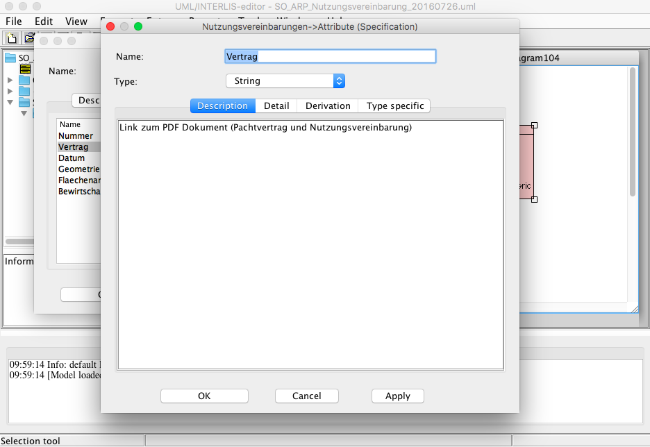
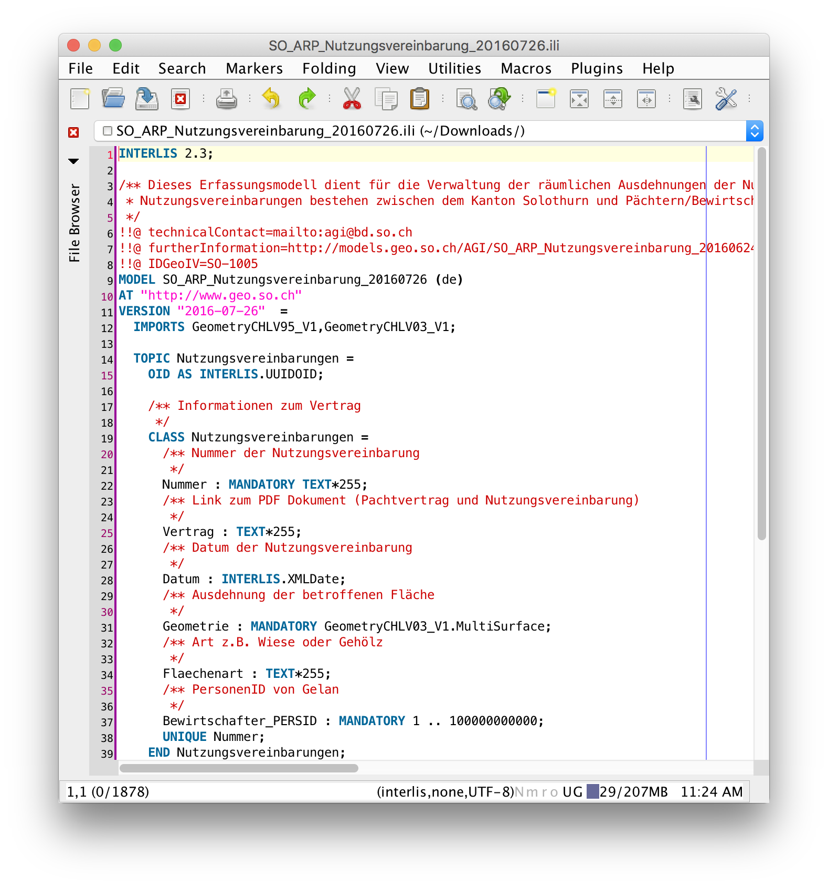
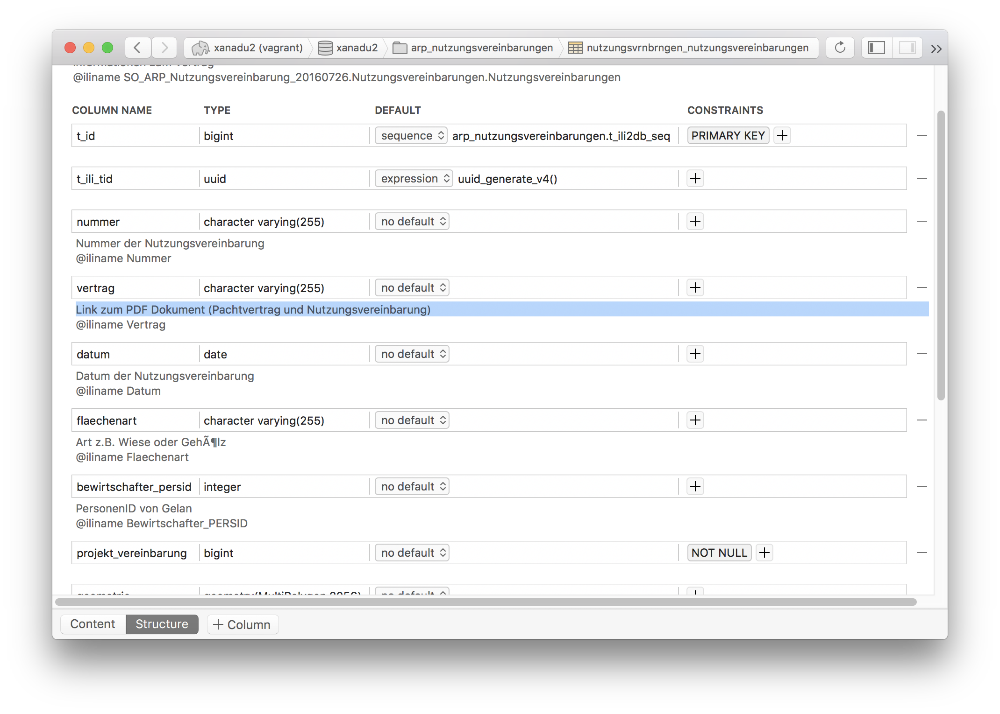
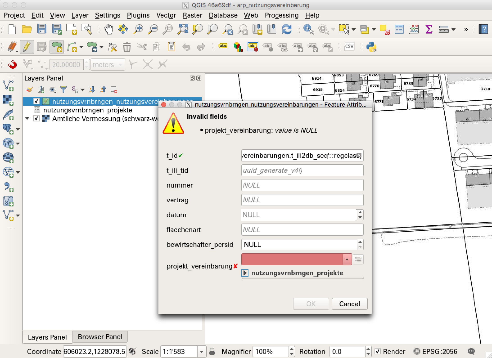
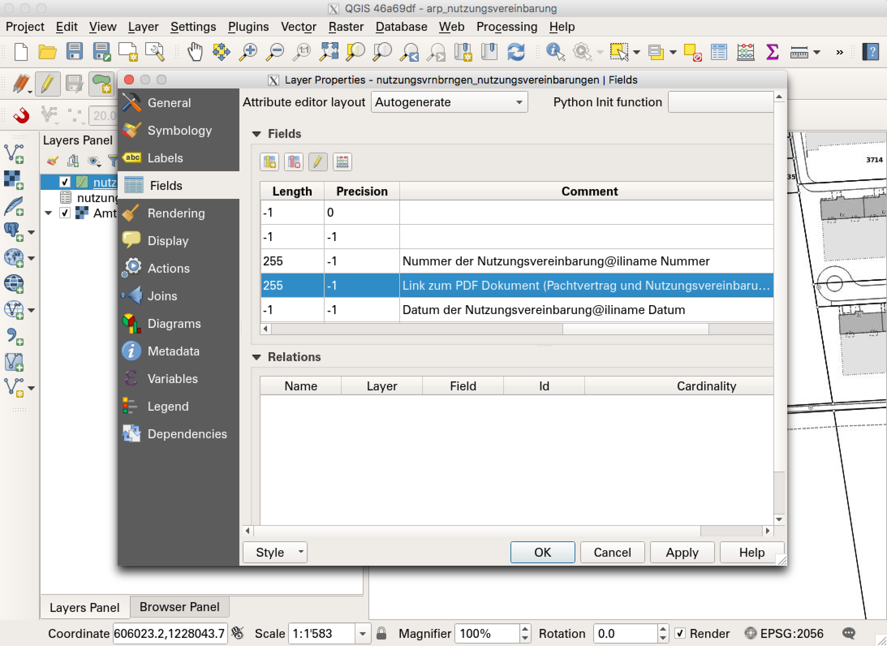

---
= KGDI - The next generation #3
Stefan Ziegler
2017-01-02
:thoth-type: post
:thoth-status: published
:thoth-tags: KGDI,GDI,INTERLIS,Java,ili2pg,ilivalidator,know your gdi
:idprefix:
---
&laquo;Model-driven GDI&raquo; klingt ja schon mal cool. Von wem genau der Begriff stammt, weiss ich leider nicht mehr. Es kann gut sein, dass er sich nach einem Vortrag von https://twitter.com/gl_geoportal[Peter Staub] bei uns herauskristallisiert hat oder vielleicht auch während des Vortrages bereits gefallen ist. Was verstehe ich darunter?

Grundsätzlich dazu gehört der modellbasierte Ansatz mit INTERLIS. Beschrieben wird er, wie auch die Vorzüge von Datenmodellen, im Dokument _Allgemeine Empfehlungen zur Methodik der Definition &laquo;minimaler Geodatenmodelle&raquo;_, das https://www.geo.admin.ch/de/geoinformation-schweiz/geobasisdaten/geodatenmodelle.html[hier] zu finden ist. Diese Gedanken sind ja nicht nur richtig wenn es um minimale Geodatenmodelle des Bundes oder der Kantone geht, sondern sie passen auch wenn es ganz allgemein um Geodatenmodellierung geht (und wenn kein Gesetz es verlangt). Dieser modellbasierte Ansatz soll dann integraler Bestandteil der GDI werden. Da müssen _Prozesse_ und _Technik_ sauber darauf abgestimmt werden. Vor allem braucht es auch ein Ökosystem, damit überhaupt damit gearbeit werden kann.

Früher begann ein Projekt oder ein Erfassung von Daten häufig mit einem Anruf beim AGI mit der Bitte um die Erstellung von ein paar Datenbanktabellen. Gesagt getan: `CREATE TABLE ...`. Es folgte anschliessend ein weiterer Anruf, weil dieses und jenes Attribut in den Tabellen fehlte. 

Oftmals stand auch das Tool im Vordergrund. Es ging fast weniger um die Erfassung von Daten, als um die Entwicklung eines coolen neuen Tools (was für den Entwickler verständlicherweise spannender ist).

Mit der &laquo;model-driven GDI&raquo; sollen jetzt wieder die Daten und die Datenerfassung ins Zentrum gerückt werden. Damit gewinnen wir eine bessere Dokumentation, eine sauberere Strukturierung der einzelnen Teile und ein nachhaltigeres &laquo;Ganzes&raquo;. Klar braucht es dazu auch Tools aber in den allermeisten Fällen geht es zuerst einmal um die Daten und die Strukturierung dieser Daten.

Die Überlegungen wie die Daten strukturiert werden sollen, muss man sich ja sowieso machen. Auch wenn das vielleicht häufig nicht formalisiert stattfindet. Weil man sich die Arbeiten ja eben sowieso machen muss, kann man das daraus folgende Resultat gleich im http://www.umleditor.org/[UML/INTERLIS-Editor] erfassen. Hier ein Beispiel eines Datenmodelles für Nutzungsvereinbarungen des Amtes für Raumplanung:

Wichtig bereits bei diesem Schritt ist das Beschreiben der Attribute und Klassen:

Das vom UML/INTERLIS-Editor erzeugte INTERLIS-Modell kann noch mit weiteren Kommentaren in einem beliebigen Texteditor (hier http://www.jedit.org/[jEdit]) ergänzt werden:

Eine Frage, die schnell auftaucht, ist der Umgang mit benötigten Fremddaten. Häufig braucht man ja Daten, wo der &laquo;Master&raquo; in einem anderen Modell (resp. Schema/Tabelle in der DB) verwaltet werden, z.B. Gemeindegrenzen, Grundstücke etc. Soll man diese jetzt nochmals im eigenen Modell verwalten? Diese Fragestellung ist ein Teil des Modellierungsprozesses und muss dort beantwortet werden. Häufig reicht wahrscheinlich ein Fremdschlüssel. Der Fremdschlüssel kann in diesem Fall entweder ein Sachattribut (amtliche Gemeindenummer) oder die Geometrie selber sein. 

Es lohnt sich auch bereits zu diesem Zeitpunkt Gedanken über die Publikation der Daten zu machen. In erster Linie geht es zwar um die Datenerfassung und diese geschieht tendenziell in einem normalisierten Datenmodell. In den meisten Fällen will man die Daten aber in einer einfacheren, flachgedrückten Form publizieren. Unter Publikation kann das Bereitstellen für anderen Dienststellen verstanden werden (read-only, als Hintergrundlayer in QGIS), die Bereitstellung im WMS / WebGIS oder die Datenabgabe (GeoPackage, DXF etc.). Wenn sich Erfassung und Publikation nicht viel nehmen, darf man wahrscheinlich auch beim (Erfassungs-)Modell Kompromisse eingehen, um sich ein eigenes Publikationsmodell zu sparen. Klare Vorstellungen was publiziert werden soll, dient auch dem Aufdecken allfälliger Fehler in einem Erfassungsmodell.

Ob für das allfällig benötigte, separate Publikationsmodell _immer_ auch mit INTERLIS modelliert werden muss, bedarf noch ein paar weiterführenden Diskussionen und Gedanken. Tendenziell bin ich Freund dieses Ansatzes. Im ersten Blick wirkt es ein wenig übertrieben, wenn man an kleine Modelle denkt, aus denen eine flachgedrückte Tabelle für die Publikation entstehen. Andererseits kann man alles über einen Kamm scheren. Damit entsteht auch kein Wildwuchs. Und wie gesagt, Gedanken wie ich was publizieren will, muss man ja sowieso machen. Sowie auch die Dokumentation. Es ist also nicht so, dass ohne INTERLIS-Publikationsmodell alles 10x mal schneller geht. 

Aus dem INTERLIS-Modell erstelle ich mit einem Einzeiler und http://www.eisenhutinformatik.ch/interlis/ili2pg/[`ili2pg`] die leeren Datenbanktabellen:

[source,xml,linenums]
----
java -jar /Users/stefan/Apps/ili2pg-3.5.1/ili2pg.jar --dbhost 192.168.50.4 --dbdatabase xanadu2 --dbusr stefan --dbpwd ziegler12 --dbschema arp_nutzungsvereinbarungen --disableValidation --nameByTopic --sqlEnableNull --createGeomIdx --createFkIdx --strokeArcs --models SO_ARP_Nutzungsvereinbarung_20160726 --modeldir "http://models.geo.admin.ch/;." --defaultSrsCode 2056 --schemaimport
----

Ein absolutes Goodie ist das Handling von Kommentaren in diesem Ökosystem. Die Kommentare, die man mühelos im GUI des UML/INTERLIS-Editors erfasst hat, werden in der Datenbank abgebildet:

http://qgis.org/[QGIS] passt da wunderprächtig in das gesamte Ökosystem. Dank den sehr https://sogeo.services/slides/qgis_anwendertreffen/2016-qgis-ili2pg-workshop_v03.pdf[mächtigen Formularfunktionen], kann man auch in normalisierten Datenmodellen direkt und bequem Daten erfassen:

Bei kleineren Modellen geht das Zusammenstöpseln der Beziehungen und der richtigen Widget-Typen schnell. Bei grösseren Modellen ist es dann schon brutale Fleissarbeit. Vor allem wenn das Modell nach einer Testphase wieder ändert. Dann muss unter Umständen das gesamte QGIS-Projekt neu erstellt werden. Aus diesem Grund ist eine Arbeitsgruppe zur Zeit an der Entwicklung eines QGIS-Projektgenerators, der dem Menschen bei dieser doch eher mühseligen Arbeiten helfen soll.

Was wir in QGIS wieder entdecken, sind die Kommentare zu den einzelnen Attributen:

Will man die Daten in dieser Form bereitstellen (oder eben dann das Publikationsmodell), lässt sich die erstellte INTERLIS-Transferdatei einfach mit dem https://github.com/claeis/ilivalidator[`ilivalidator`] https://interlis2.ch/ilivalidator/[prüfen].

Für eine &laquo;model-driven GDI&raquo; steht heute ein sich stetig weiterentwickelndes Ökosystem zur Verfügung. Gedankliche und konzeptionelle Ansätze sind auch vorhanden. Sicher müssen Details noch geklärt werden. Meines Erachtens ist der vermeintliche Mehraufwand mehr als gerechtfertig. Die Qualität und Zuverlässigkeit des gesamten Systems wird besser. Ebenso bekommen die Daten, als teuerstes und wertvollstes Gut in der GDI, einen grösseren Stellenwert.

Zu guter Letzt: Löst das Datenmodell (resp. das Transferformat dazu) jetzt das Shapefile ab? Nein. Wenn überhaupt löst GeoPackage das Shapefile ab. Für mich sind INTERLIS-Transferformate und Shapefiles et al. immer noch zwei paar Schuhe...
