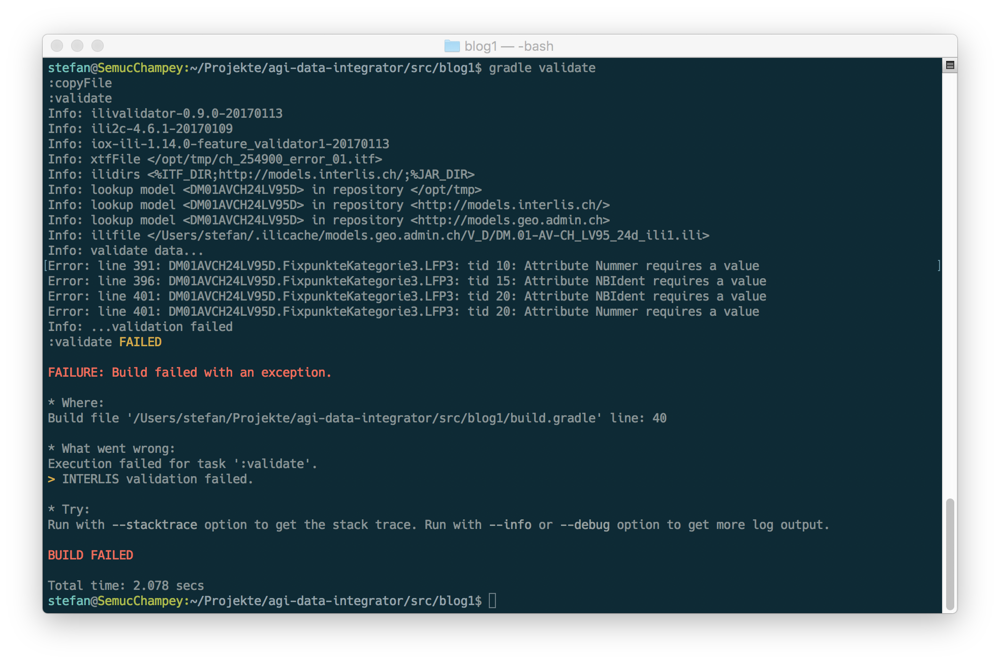

---
= Datenflüsse mit Gradle #1
Stefan Ziegler
2017-01-19
:thoth-type: post
:thoth-status: published
:thoth-tags: KGDI,GDI,Gradle,Groovy,Java,Datenintegration,know your gdi
:idprefix:
---
Datenflüsse sind ja http://blog.sogeo.services/blog/2016/12/29/kgdi-the-next-generation-2.html[momentan bei uns] ein wichtiges Thema. Bereits heute schieben wir tagein tagaus viele Daten umher. Importieren sie und unsere Datenbank, bauen sie um und exportieren sie auch wieder. Und in Zukunft werden Datenflüsse für uns noch zentraler werden. Aus diesem Grund wollen und brauchen wir etwas Generisches und Rock-solides.

Schaut man sich unsere heutigen Anwendungsfälle an, sieht man viele Gemeinsamkeiten:

* Herunterladen / Umherkopieren von Dateien (INTERLIS, Shapefiles, CSV)
* Import der Dateien in die PostgreSQL-Datenbank 
* Umbauen der Daten mit einer SQL-Query in der Datenbank
* Daten aus - juhee - einer Oracle-Datenbank in unsere PostgreSQL-Datenbank importieren.

Das heisst, wir brauchen nicht die eierlegende Wollmilchsau, sondern können uns beschränken auf:

* eine geringe Anzahl an zu unterstützenden Datenformaten. 
* einen Datenumbau in der Datenbank (SQL to the rescue).

Weil wir in Zukunft verschiedene Datenbanken für die verschiedenen Zwecke verwenden wollen, kann der Datenumbau zwar mit SQL in der Quell-Datenbank stattfinden, trotzdem müssen anschliessend die Daten in die Ziel-Datenbank transportiert werden.

An einer höchst konstruktiven Brainstormingsitzung mit http://eisenhutinformatik.ch/[Claude Eisenhut] haben wir über diese ganze generische Datenfluss/-integrationsgeschichte noch weiter räsoniert und versucht solche Prozesse weiter &laquo;auseinanderzubeinlen&raquo;:

Der ganze Prozess ist ein _Job_. Ein _Job_ kann aus mehreren _Steps_ bestehen. Ein _Step_ ist z.B. das Herunterladen von Dateien *oder* das Importieren einer Datei in die Datenbank etc. Ziel sollte es sein, möglichst wiederverwendbare _Steps_ zu haben, die man nur noch aneinanderzureihen hat, um eine zuverlässige Datenintegration inkl. Datenumbau zu erhalten. Der AGI-Mitarbeiter muss also nicht mehr das hundertste Individualskript mit _php4_ oder Python schreiben, sondern muss nur noch _Steps_ zusammenstöpseln und die gewünschten Parameter eintragen.

Für den Datenimport bräuchten wir als _Steps_ ein paar robuste 1:1-Transformatoren, wie z.B. CSV in die Datenbank oder INTERLIS in die Datenbank. Für den Datenumbau braucht es einen DB2DB-Step, dem man einfach SQL übergeben kann und anschliessend das Resultat der Query in die Ziel-Datenbank schreibt. 

Es war schon Aufbruchstimmung als die Diskussion auf das Thema &laquo;Ausführen eines _Jobs_&raquo; kam. Und da fiel das Zauberwort von Claude: &laquo;Ihr könnt auch http://ant.apache.org/[_ant_] verwenden.&raquo; Ein Build-Tool. Das macht ja genau das, was wir wollen. Es hat (voneinander abhängige) einzelne Schritte, die ausgeführt werden, z.B.:

1. Quellcode kompilieren
2. Kompilierte Klassen zu einem Paket/Programm schnüren.
3. Das Programm irgendwo hinkopieren.

Falls das Kompilieren Fehler wirft, wird das Paketieren und Kopieren gar nicht erst ausgeführt. Analog dazu soll bei uns der Importschritt nicht stattfinden, falls beim Herunterladen der Datei ein Fehler auftaucht ist.

Anstelle von _ant_ habe ich mich zum Ausprobieren aber für https://gradle.org/[Gradle] entschieden. Was bekommt sonst noch &laquo;gratis&raquo;:

* Steps (_Tasks_ in Gradle) können einzeln angestossen werden. 
* Ein Job (_Project_) - also ein Build - kann auch innerhalb eines http://www.groovy-lang.org/[_Groovy_]-Skript ausgeführt werden und nicht nur auf der Konsole.
* Eigene _Tasks_ sind einfach selber in _Groovy_ oder Java programmierbar.

Als kleiner Teaser hier ein Build-Skript, das eine INTERLIS-Datei kopiert und anschliessend mit https://github.com/claeis/ilivalidator[`ilivalidator`] prüft:

[source,groovy,linenums]
----
include::build.gradle[]
----

Das Beispiel ist natürlich nicht sonderlich sinnvoll, aber es zeigt ein paar Grundprinzipien ganz gut. Ausführen muss man den Build auf der Konsole mit `gradle validate`, um das ITF zuerst zu kopieren und anschliessend zu validieren. Will man nur validieren ohne vorgänging zu kopieren, kann man den copy-Task auch ausschliessen: `gradle validate -x copyFile`.

Falls die INTERLIS-Datei fehlerfrei ist, wird der Build erfolgreich beendet: `BUILD SUCCESSFUL`. Falls sich Fehler in der INTERLIS-Datei eingeschlichen haben, wird der Build mit `BUILD FAILED` und weiteren Fehlermeldungen beendet:

Die selber geschriebenen _Tasks_ (hier _IlivalidatorTask_) kann man natürlich noch auf verschiedene Weisen auslagern und so wiederverwenden. So würden dann auch noch ein Zeilen zu Beginn des Skripts wegfallen und es blieben die beiden _Tasks_ übrig (7 Zeilen).

Das Ganze ist momentan noch nicht mehr als eine Spielerei. Ob weitere unserer Anforderungen so einfach abgedeckt werden können, muss sich noch zeigen.

Stay tuned for more gradle data integration magic.