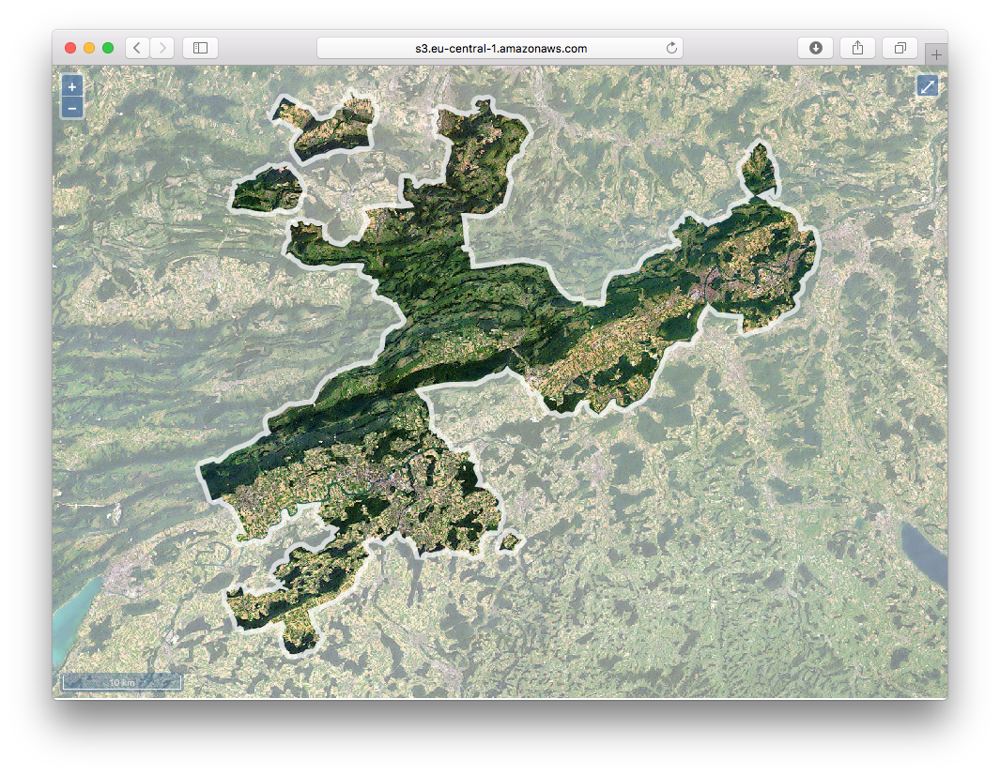
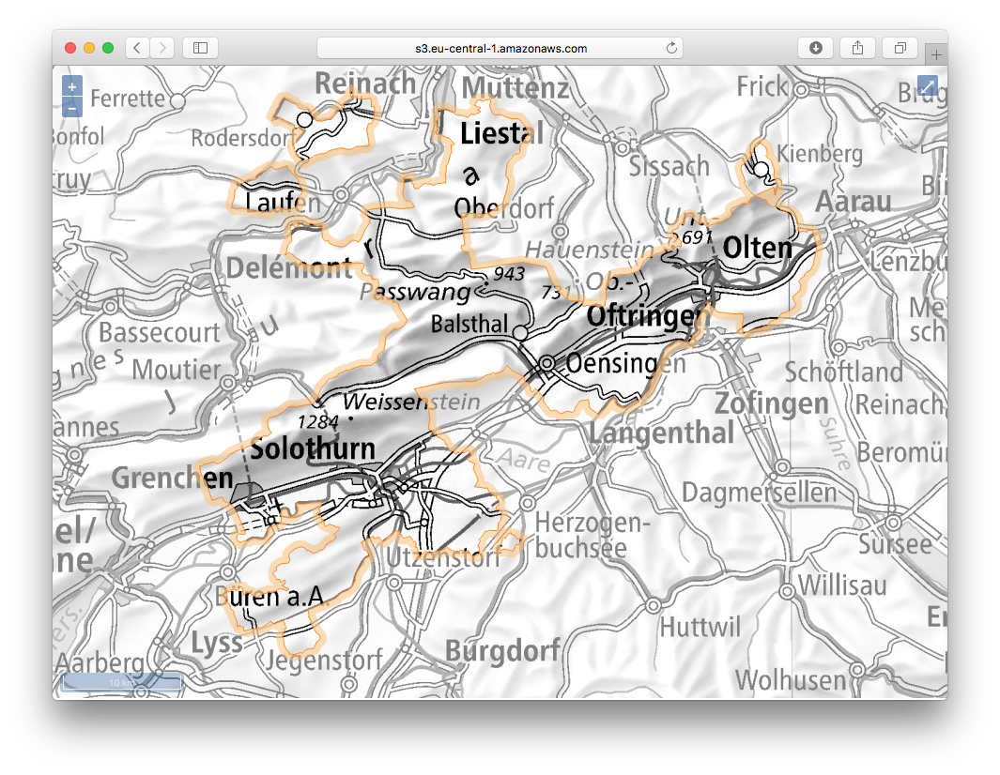

Im Rahmen unseres Infrastrukturprojektes SO!GIS 2.0 bekommen wir einen neuen WebGIS Client. Das ist der passende Zeitpunkt sich um die in die Jahre gekommene https://www.so.ch/?id=9218[Hintergrundkarte] zu kümmern. Circa 10-jährig (gefühlte 50) hat sie eine Ablösung verdient. Entstanden ist sie damals mit dem Aufkommen von Google Maps und dem Umstand, dass das Publizieren der Landeskarten im Internet (uns zu) teuer war. Mit dem https://www.swisstopo.admin.ch/de/wissen-fakten/geoinformation/austausch-unter-behoerden.html[Vertrag &laquo;Geodatenaustausch unter Behörden&raquo;] ist das aber kein Thema mehr und wir müssen uns nicht selber eine neue landeskarten-lose Hintergrundkarte zusammenschustern, sondern können die schönen Landeskarten der swisstopo als Basis verwenden.

Das ganze Vorhaben hat ja etwas von Rumspielen. Ich muss ein paar Varianten (in welcher Zoomstufe welche Landeskarte, wann kommt die amtliche Vermessung, was ist mit Maskierungen etc.) zusammenstellen und diese dann dem Publikum zeigen und Feedback abholen und teilweise wieder einfliessen lassen. Am einfachsten ist es, wenn die neuen Hintergrundkartenvarianten nicht nur im Intranet zur Verfügung stehen, sondern gleich im Internet. Auch macht das die Entwicklung einfacher: einfach schnell etwas von zu Hause ändern ist nicht, wenn man sich noch zweimal einloggen muss und sich dann trotzdem alles nicht super schnell anfühlt durch das mehrfache tunneln etc. Zudem bin ich während des Entwickelns definitiv gerne mein eigener Herr und Meister und will nicht auf einen Root/Admin warten, damit ich eine neue Variante deployen kann. Für das alles gibt es ja &laquo;die Cloud&raquo;.

Ich brauche also etwas, wo ich ein paar Gigabyte Rasterdaten speichern kann und diese per WMS zur Verfügung stellen kann. Dh. es ist die Zeit gekommen, die nicht gerade wenigen Dienste von https://aws.amazon.com/[Amazon Web Services] kennen zu lernen. Viel brauche ich für meine Bedürfnisse zuerst einmal nicht: Plattenplatz und einen Server auf dem ich den WMS-Server (QGIS-Server in meinem Fall) installieren kann. Weil ich den Server nicht 24/7 laufen lassen will und mich sowieso nicht ständig durch das Webinterface von AWS klicken will, brauche ich etwas damit ich meine Server- und Storagedefinitionen maschinell verwalten und ausführen kann. Aus Transparenz- und Dokumentationsgründen sowieso. Dazu dient mir https://www.terraform.io/[Terraform: &laquo;Write, Plan, and Create Infrastructure as Code&raquo;].

Als erstes erstelle ich ein http://docs.aws.amazon.com/AWSEC2/latest/UserGuide/EBSVolumes.html[Volume], um darauf die Landeskarten zu speichern. Das Volume soll dann bei Bedarf in meinen virtuellen Server eingehängt werden, damit der WMS-Server Zugriff auf die Karten hat. Für Terraform reicht es, wenn ich eine einzelne `volume.tf`-Datei schreibe. Terraform ist so gestrickt, dass es sämtliche `*.tf`-Dateien in einem Verzeichnis ausführt.

[source,bash,linenums]
----
provider "aws" {
  region = "eu-central-1"
}

resource "aws_ebs_volume" "lk" {
  availability_zone = "eu-central-1a"
  size = 50
  type = "gp2"
  tags {
    Name = "ch.swisstopo.landeskarten"
  }  
}
----

Die Authentifizerung findet via Access-Keys statt. Da genügt es beide Keys in einem File `credentials` im Ordner `$HOME/.aws/` zu speichern. Ein wichtiges Konzept von Terraform sind die _Resourcen_. In meinem Fall möchte ich eine _Elastic Block Storage_-Resource in der Zone `eu-central-1a`. Das Volume soll 50 GB gross und vom Typ `gp2` (08/15-SSD) sein. Mit Terraform beschreibe ich was das Ziel sein soll und nicht wie ich an das Ziel gelange (also nicht eine Abfolge von Befehlen).

Mit einem einfachen `terraform apply` führt es alle notwendigen Befehle aus und das Resultat ist ein verfügbares Volume, das ich beliebigen virtuellen Servern anhängen kann.

Als nächstes erstelle ich händisch (also im Webinterface) einmalig eine EC2-Instanz, um anschliessend das gerade vorher erstellte Volume einzuhängen und die Landeskarten darauf zu speichern. Ist die EC2-Instanz gestartet, kann ich ebenfalls im Webinterface das Volume einhängen. Zusätzlich zum Einhängen muss ich aber einmalig ein Filesystem auf dem Volume erstellen (`mkfs -t ext4 /dev/xvdg`) und es mounten (`mkdir /opt/geodata && mount -o noacl /dev/xvdg /opt/geodata`). Hat das alles funktioniert, kann ich alle benötigten Rasterdaten auf das Volume kopieren. Zu guter Letzt wird das Volume wieder &laquo;unmounted&raquo; und von der EC2-Instanz &laquo;detached&raquo; und diese terminiert.

Der nächste Schritt ist das automatische Hochfahren eines virtuellen Servers und das Installieren sämtlich benötigter Software, wie z.B QGIS und QGIS-Server aber auch https://wiki.x2go.org/doku.php[x2go-Server], um auf dem Server selber mit QGIS arbeiten zu können und allenfalls Anpassungen an der Definition der Hintergrundkarte vorzunehmen.

Das automatische Hochfahren mache ich natürlich wieder mit einer Terraform-Datei:

[source,bash,linenums]
----
provider "aws" {
  region = "eu-central-1"
}

resource "aws_security_group" "allow_all" {
  name        = "allow_all"
  description = "Allow all inbound traffic"
  
  ingress {
    from_port = 0
    to_port = 65535
    protocol = "tcp"
    cidr_blocks = ["0.0.0.0/0"]
  }

   egress {
    from_port = 0
    to_port = 0
    protocol = "-1"
    cidr_blocks = ["0.0.0.0/0"]
  }
  
  tags {
    Name = "allow_all"
  }
}

# EBS volume must exist.
resource "aws_volume_attachment" "ebs_att" {
  device_name = "/dev/sdg"
  volume_id   = "vol-01a63e9115f061d94"
}

resource "aws_instance" "qgis-gis-server" {
  availability_zone = "eu-central-1a"    
  ami = "ami-1e339e71" 
  instance_type = "t2.xlarge"
  key_name = "aws-demo"
  vpc_security_group_ids = ["${aws_security_group.allow_all.id}"]
  user_data = "${file("qgis-gis-server.conf")}"

  root_block_device {
    volume_type           = "gp2"
    volume_size           = 12
    delete_on_termination = true
  }

  tags {
    Name = "qgis-gis-server"
  }
}

output "public_ip" {
  value = "${aws_instance.qgis-gis-server.public_ip}"
}
----

Ich benötige drei Resourcen: eine zum Definieren einer http://docs.aws.amazon.com/AWSEC2/latest/UserGuide/using-network-security.html[Security Group], eine zum Einhängen des _Volumes_ und natürlich noch eine zum Definieren meiner EC2-Instanz.

Die Security Group ist in meinem Fall sehr offen, da sie so ziemlich alles durchlässt (sowohl Ports wie auch IPs).

Die Volume-Einhäng-Resource muss auf ein bestehendes Volume verweisen. Hier mittels `volume_id`.

Die _aws_instance_-Resource definiert mir meinen virtuellen Server. Wichtig ist das Attribut `key_name`, welches das http://docs.aws.amazon.com/AWSEC2/latest/UserGuide/ec2-key-pairs.html[Key-Pair] definiert, das zum http://docs.aws.amazon.com/AWSEC2/latest/UserGuide/AccessingInstancesLinux.html[Einloggen via SSH] verwendet werden soll. Da die Security Group ja ebenfalls erst erstellt wird, kann ich darauf mit einer Variablen zugreifen: `${aws_security_group.allow_all.id}`.

Die benötigte Software wird unter `user_data` installiert. Das kann entweder ein simples Shell-Skript sein oder ein https://cloud-init.io/[cloud init]-Skript:

[source,bash,linenums]
----
#cloud-config
package_update: true
package_upgrade: true

apt_sources:
 - source: "ppa:x2go/stable"

packages:
 - xfce4 
 - xfce4-whiskermenu-plugin
 - xfce4-terminal
 - thunar-archive-plugin
 - x2goserver 
 - x2goserver-xsession
 - apache2
 - libapache2-mod-fcgid
 - firefox
 - gedit
 - filezilla

runcmd:  
 # Install QGIS and other gis stuff.
 - 'echo "deb http://qgis.org/ubuntugis xenial main" >> /etc/apt/sources.list'
 - 'echo "deb-src http://qgis.org/ubuntugis xenial main" >> /etc/apt/sources.list'
 - 'echo "deb http://ppa.launchpad.net/ubuntugis/ubuntugis-unstable/ubuntu xenial main" >> /etc/apt/sources.list'
 - 'echo "deb-src http://ppa.launchpad.net/ubuntugis/ubuntugis-unstable/ubuntu xenial main" >> /etc/apt/sources.list'
 - apt-key adv --keyserver keyserver.ubuntu.com --recv-key 073D307A618E5811 # qgis
 - apt-key adv --keyserver keyserver.ubuntu.com --recv-key 089EBE08314DF160 # ubuntugis-(un)stable
 - apt-get update
 - apt-get --yes --allow-unauthenticated install qgis python-qgis qgis-plugin-grass qgis-server
 - apt-get --yes install mapcache-tools libapache2-mod-mapcache libmapcache1-dev
 # Copy apache conf file w/ qgis server stuff (fcgi...).
 - git clone https://github.com/edigonzales/somap20-hintergrundkarte.git /tmp/somap20-hintergrundkarte
 - cp /tmp/somap20-hintergrundkarte/terraform/create-gis-ec2-instance/apache/000-default.conf /etc/apache2/sites-available/000-default.conf
 - chown -R ubuntu:ubuntu /tmp/somap20-hintergrundkarte/
 - service apache2 restart
 # Mount EBS volume.
 # Filesystem already exists (mkfs -t ext4 /dev/xvdg).
 - mkdir /opt/geodata
 - mount -o noacl /dev/xvdg /opt/geodata
 - 'echo /dev/xvdg  /opt/geodata ext4 defaults,nofail,rw,user,exec,umask=000 0 0 >> /etc/fstab'
----

Wie man sieht, ist es schlussendlich - oder so wie ich es verwende - auch nicht gross etwas Anderes als ein abstrahiertes Shell-Skript. Viele der `runcmd`-Aufrufe waren notwendig, weil ich es nicht schaffte nicht-ppa-Repositories einfach hinzuzufügen.

Das cloud init-Skript wird jetzt einmalig beim Erstellen des virtuellen Servers ausgeführt. Weil ich den virtuellen Server nach getaner Arbeit immer terminiere, ist das ok. Wenn ich ihn aber nur herunterfahren würde, müsste man sicherstellen, dass das Volume beim Hochfahren gemountet wird.

In der Terraform-Datei kann mit `output` ein beliebiger Output in der Konsole erzeugt werden. Für mich ist natürlich die IP interessant, da ich ja mit x2go darauf zugreifen und arbeiten will.

Mit `terraform plan` kann ich mir anzeigen lassen, was ein allfälliger `apply`-Befehl alles machen würde:

[source,bash,linenums]
----
+ aws_instance.qgis-gis-server
    ami:                                       "ami-1e339e71"
    associate_public_ip_address:               "<computed>"
    availability_zone:                         "eu-central-1a"
    ebs_block_device.#:                        "<computed>"
    ephemeral_block_device.#:                  "<computed>"
    instance_state:                            "<computed>"
    instance_type:                             "t2.xlarge"
    ipv6_address_count:                        "<computed>"
    ipv6_addresses.#:                          "<computed>"
    key_name:                                  "aws-demo"
    network_interface.#:                       "<computed>"
    network_interface_id:                      "<computed>"
    placement_group:                           "<computed>"
    primary_network_interface_id:              "<computed>"
    private_dns:                               "<computed>"
    private_ip:                                "<computed>"
    public_dns:                                "<computed>"
    public_ip:                                 "<computed>"
    root_block_device.#:                       "1"
    root_block_device.0.delete_on_termination: "true"
    root_block_device.0.iops:                  "<computed>"
    root_block_device.0.volume_size:           "12"
    root_block_device.0.volume_type:           "gp2"
    security_groups.#:                         "<computed>"
    source_dest_check:                         "true"
    subnet_id:                                 "<computed>"
    tags.%:                                    "1"
    tags.Name:                                 "qgis-gis-server"
    tenancy:                                   "<computed>"
    user_data:                                 "f61a6ca2bf27043bc9a74c638f0211cf5d7c8e15"
    volume_tags.%:                             "<computed>"
    vpc_security_group_ids.#:                  "<computed>"

+ aws_security_group.allow_all
    description:                           "Allow all inbound traffic"
    egress.#:                              "1"
    egress.482069346.cidr_blocks.#:        "1"
    egress.482069346.cidr_blocks.0:        "0.0.0.0/0"
    egress.482069346.from_port:            "0"
    egress.482069346.ipv6_cidr_blocks.#:   "0"
    egress.482069346.prefix_list_ids.#:    "0"
    egress.482069346.protocol:             "-1"
    egress.482069346.security_groups.#:    "0"
    egress.482069346.self:                 "false"
    egress.482069346.to_port:              "0"
    ingress.#:                             "1"
    ingress.1403647648.cidr_blocks.#:      "1"
    ingress.1403647648.cidr_blocks.0:      "0.0.0.0/0"
    ingress.1403647648.from_port:          "0"
    ingress.1403647648.ipv6_cidr_blocks.#: "0"
    ingress.1403647648.protocol:           "tcp"
    ingress.1403647648.security_groups.#:  "0"
    ingress.1403647648.self:               "false"
    ingress.1403647648.to_port:            "65535"
    name:                                  "allow_all"
    owner_id:                              "<computed>"
    tags.%:                                "1"
    tags.Name:                             "allow_all"
    vpc_id:                                "<computed>"

+ aws_volume_attachment.ebs_att
    device_name:  "/dev/sdg"
    force_detach: "<computed>"
    instance_id:  "${aws_instance.qgis-gis-server.id}"
    skip_destroy: "<computed>"
    volume_id:    "vol-01a63e9115f061d94"
----

Gefällt mir das, reicht ein `terraform apply` und nach ein paar Minuten habe ich meinen WMS-Server mit den Hintergrundkartenvarianten. Will ich etwas anpassen, kann ich mich mittels x2go auf Server einloggen und gleich dort mit QGIS die Kartendefinitionen ändern. Sind alle Arbeiten erledigt, kann man alles mit einem `terraform destroy` terminieren. Damit das erfolgreich ist, muss ich aber vorher das Volume unmounten, sonst erschienen Fehlermeldungen.

Damit nach all der trockenen Theorie noch etwas gezeigt wird, hier eine Variante mit Orthofoto (Landsat) und grauer Hintergrundkarte (die Farben für die Maskierung der grauen Variante stammen von https://services.geo.zg.ch/qwc2[hier]):

Gorbatschow hat ja bekanntlich http://www.zeit.de/wissen/geschichte/2010-03/gorbatschow-sowjetunion[(nicht)] gesagt: &laquo;Wer zu spät kommt, den bestraft das Leben.&raquo; Ich wünschte mir im Umgang mit den ganzen _IaaS_-, _PaaS_-, _SaaS_- etc. pp. -Anbietern etwas mehr Mut und Unverkrampfheit. Es kann helfen effizient und sauber strukturiert Aufgaben zu erledigen. Spass macht es allemal. Mit einer totalen Verweigerungshaltung ist man halt irgendeinmal zu spät.

Github-Repo mit allen Skripts: https://github.com/edigonzales/somap20-hintergrundkarte[somap20-hintergrundkarte].

