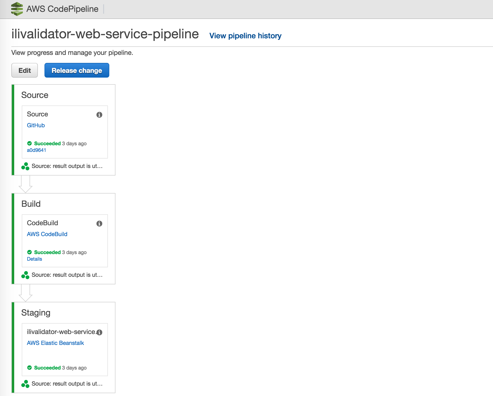
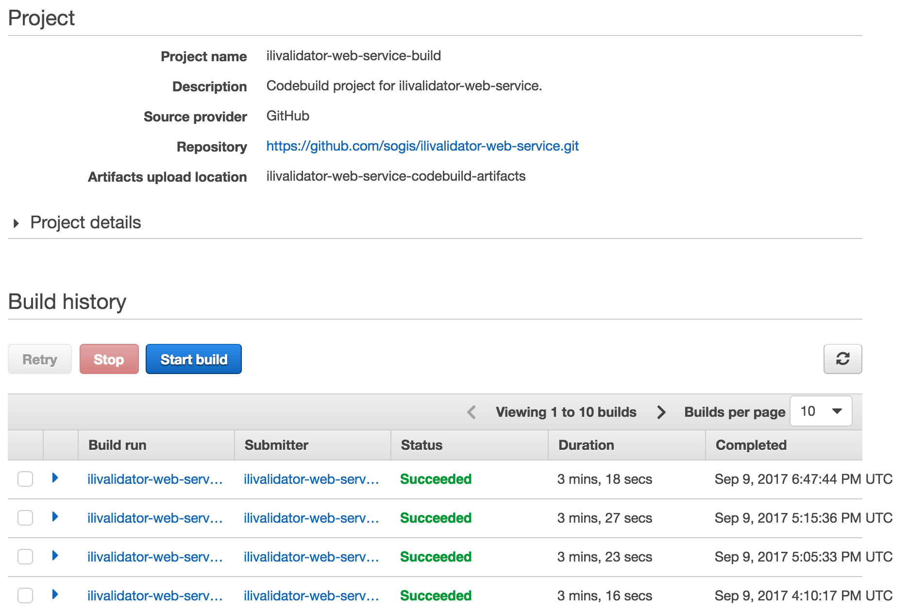
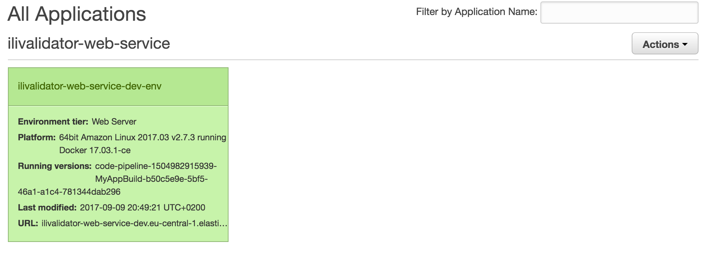

Seit einiger Zeit habe https://interlis2.ch/ilivalidator[hier] einen INTERLIS-Checkservice auf Basis von https://github.com/claeis/ilivalidator[`ilivalidator`] am Laufen. Der Webservice-Teil ist mit https://projects.spring.io/spring-boot/[Spring Boot] umgesetzt. Spring Boot macht das Entwickeln von Spring- und Webanwendungen sehr einfach. Insbesondere das Endprodukt ist ganz praktisch: eine einzige ausführbare JAR-Datei inkl. Servlet-Container. Den ganzen Service in einer einzigen Datei macht das Deployment natürlich auch einiges einfacher. Trotzdem muss ich die JAR-Datei zuerst herstellen, dann auf meinen Server hochladen und den Dienst neu starten. 

Schöner wäre es, wenn jeder Commit automatisch dazu führt, dass die Anwendung kompiliert wird, getestet wird und falls alle Tests durchlaufen, in einer Testumgebung installiert wird. Weil wir zudem momentan total auf https://www.docker.com[_Docker_] abfahren, soll das Ganze als Docker-Image deployed werden.

Umgesetzt werden kann so ein Prozess natürlich auf ganz unterschiedliche Weise mit verschiedensten Werkzeugen. Ich habe mich für https://aws.amazon.com/codepipeline/[AWS CodePipeline] entschieden. So muss ich überhaupt nichts installieren, sondern nur ein paar AWS-Dienste zusammenstöpseln.

In meinem sehr einfachen Fall einer Pipeline, gibt es ingesamt nur drei Schritte:

1. Source: Download des Quellcodes von https://github.com/sogis/ilivalidator-web-service[_Github_].
2. Build: Kompilieren und Testen der Anwendung mittels https://aws.amazon.com/codebuild/[AWS CodeBuild]. Und anschliessendes Herstellen des Docker-Images.
3. Staging: Deployment des Docker-Images auf https://aws.amazon.com/elasticbeanstalk[AWS Elastic Beanstalk].

Grafisch sieht das so aus:

Ich habe gute Erfahrung gemacht mit dem - für mich - kompliziertesten Schritt zu beginnen: Build. AWS CodeBuild kann man dazu verwenden sein Projekt (das auf Github o.ä. liegt) auf einer von AWS automatisch bereitgestellten Umgebung zu kompilieren und zu testen. Konkret heisst das, AWS fährt eine EC2-Instanz hoch und installiert die Programme, die man zum Builden seines Projektes braucht, automatisch. AWS stellt sogenannte Umgebungen als Docker-Image bereit. Diese Umgebungen sind ganz spezifisch für unterschiedliche Programmiersprachen ausgelegt. Man wählt dann das passende Docker-Image für sein Projekt aus (z.B. Java, Android etc.). Oder baut sich selber ein Docker-Image zusammenbauen, falls man spezielle Anforderungen an seine Build-Umgebung hat.

In meinen Fall brauche ich in meiner Build-Umgebung Java und Docker, da ich ja eine Java-Anwendung kompilieren will und anschliessend ein Docker-Image herstellen will. In dieser Kombiniation gibt es das aber nicht. Was aber relativ einfach geht, ist vor dem eigentlichen Builden des Codes noch Software nachzuinstallieren. Dh. ich kann die Docker-Umgebung verwenden und noch zusätzlich Java installieren.

Steuern lässt sich das Ganze über eine einzige Datei `buildspec.yml`, die im https://github.com/sogis/ilivalidator-web-service/blob/master/buildspec.yml[Code-Repository] liegen muss:

[source,yaml,linenums]
----
version: 0.2

env:
  variables:
    JAVA_HOME: "/usr/lib/jvm/java-8-openjdk-amd64"
                
phases:
  install:
    commands:
      - apt-get update -y
      - apt-get install -y software-properties-common
      - add-apt-repository ppa:openjdk-r/ppa
      - apt-get update -y
      - apt-get install -y openjdk-8-jdk
  pre_build:
    commands:
      - echo Logging in to Docker Hub...
      - docker login -u $DOCKER_HUB_USERNAME -p $DOCKER_HUB_PASSWORD
  build:
    commands:
      - echo Starting build `date`
      - chmod +rx -R *
      - ./gradlew clean build
      # git metadata is not available yet when using 
      # codepipeline. At the moment we just use a 
      # date string.
      - APP_VERSION=$(./gradlew -q getVersion | tail -1)
      - docker build -t sogis/ilivalidator-web-service:$APP_VERSION -t sogis/ilivalidator-web-service:latest .
  post_build:
    commands:
      - echo Build completed on `date`
      - echo Pushing the Docker image...
      - docker push sogis/ilivalidator-web-service:$APP_VERSION
      - docker push sogis/ilivalidator-web-service:latest
      - echo Deleting Dockerfile
      - rm Dockerfile
      - sed -i -e "s/IMAGE_TAG/$APP_VERSION/" Dockerrun.aws.json
artifacts:
  files:
    - '**/*'
----

Vieles daran ist selbsterklärend. Der Build-Prozess ist unterteilt in Phasen. In jeder Phase kann man mehr oder weniger beliebige Shell-Kommandos ausführen lassen. In der `install`-Phase installiere ich noch zusätzliche Software. In der `pre-build`-Phase logge ich mich auf https://hub.docker.com[hub.docker.com] ein, damit ich anschliessend mein Image hochladen kann. `$DOCKER_HUB_USERNAME` und `$DOCKER_HUB_PASSWORD` sind Umgebungsvariablen, die z.B. via WebGUI definiert werden können.

Das Kompilieren, Testen (`./gradlew clean build`) und Herstellen des Docker-Images (`docker build ...`) geschieht in der `build`-Phase. Weil mein AWS CodeBuild-Projekt später ein Teil einer Codepipeline wird, muss man ein paar Sachen leider noch frickelig lösen. Beim Kopieren vom Stage- in den Build-Schritt der Codepipeline werden die git-Metadaten nicht mitkopiert, somit kann man leider das Docker-Image nicht mit einem git-sha versehen, sondern nur z.B. mit einem Timestamp. Wenn man das _CodeBuild_-Projekt autark verwenden würde, wäre das nicht der Fall und die git-Sachen wären vorhanden. Zum Builden des Docker-Images braucht es auch ein https://github.com/sogis/ilivalidator-web-service/blob/master/Dockerfile[Dockerfile], das ebenfalls Bestandteil des Codes ist.

In der `post-build`-Phase lade das Docker-Image auf https://hub.docker.com/r/sogis/ilivalidator-web-service/[hub.docker.com] hoch. Interessanterweise hat es bei mir ohne Löschen des Dockerfiles nicht funktioniert (was aber noch nichts heissen muss). Als letztes muss man in dieser Phase die `Dockerrun.aws.json`-Datei so bearbeiten, dass der richtige Tag des Docker-Images drin steht, welches man im nächsten Schritt der Codepipeline auf AWS Elastic Beanstalk deployen will. Im meinem Fall ein simples `sed`-Kommando.

Unter `artifacts` werden sämtliche Dateien wegkopiert. Wenn CodeBuild Bestandteil einer Codepipeline ist, ist mir noch nicht ganz klar, wohin das kopiert wird. Normalerweise irgendwo in einen S3-Bucket. Zum Zwischenlagern quasi. 

Läuft das CodeBuild-Projekt durch (`Succeeded`), kann man sich noch an den _Staging_-Schritt der Codepipeline machen:

Hier mache ich es wieder gleich wie beim _Build_-Schritt. Ich erstelle mir zuerst eine AWS Elastic Beanstalk-Anwendung alleine, dh. eine Anwendung, die noch nicht Bestandteil der Codepipeline ist. Das geht via Browser sehr schnell. Eine Beanstalk-Anwendung kann mehrere Environments haben, was z.B. sehr praktisch für Blue/Green-Deployment ist. In einem solchen Fall kann man ganz einfach die Environments auf Knopfdruck tauschen und fertig.

Zuerst muss man beim Erstellen eines Environments wählen, ob es sich um ein Webserver-Environment oder um ein Worker-Environment handelt. Der INTERLIS-Checkservice ist - nomen est omen - ein Webserver-Environment. Anschliessend wählt man noch die Plattform aus. In meinem Fall `Docker`, weil ich ja ein Docker-Image deployen will. Zu guter Letzt muss man nur noch die https://github.com/sogis/ilivalidator-web-service/blob/master/Dockerrun.aws.json[Dockerrun.aws.json]-Datei hochladen und die Magie beginnt. Nun wird eine EC2-Instanz hochgefahren und noch vieles mehr, was mich aber nicht kümmern muss, da alles sauber automatisch abläuft. Hat das funktioniert, sollte das Environment grün erscheinen und der Service erreichbar sein:

AWS Elastic Beanstalk bietet noch einiges mehr. So kann man z.B. auf Knopfdruck ein Load Balancing und Auto Scaling einrichten. 

Hat man den _Staging_-Schritt und _Build_-Schritt als &laquo;Einzelanwendung&raquo; zum Laufen gebracht, kann man an die Codepipeline gehen. Dort kann man sich durch den Wizard klicken und eigentlich nicht mehr viel falsch machen, da man nur noch bestehende _Build_- resp. _Staging_-Schritte auswählen muss und ganz zu Beginn beim _Source_-Schritt das Github-Repository mit seinem Projekt angeben. Nach dem Speichern der Konfiguration, wird die Pipeline ein erstes Mal ausgeführt. 

Benachrichtigungen kann man mittels https://aws.amazon.com/cloudwatch[_AWS CloudWatch_] sehr detailliert konfigurieren. Und zwar so detailliert, dass ich es momentan doch eher unübersichtlich und nicht intuitiv finde.

Fazit: Mit AWS CodePipeline und weiteren Diensten kann man sich sehr einfach eine saubere CI/CD-Pipeline zusammenklicken, die dazu führt, dass jeder Commit nach erfolgreichen Tests auf einer (Test-)Umgebung zum Laufen kommt.