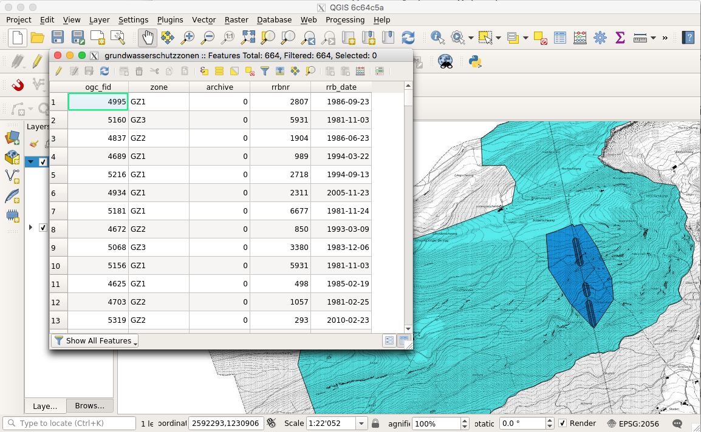

---
= INTERLIS leicht gemacht #18 - Shapefiles validieren
Stefan Ziegler
2018-02-19
:thoth-type: post
:thoth-status: published
:thoth-tags: INTERLIS,Java,ilivalidator,GRETL,Gradle,Shapefiles
:idprefix:
---
Im http://blog.sogeo.services/blog/2018/02/11/datenfluesse-mit-gradle-3.html[letzten Beitrag] habe ich kurz erwähnt, dass wir für https://github.com/sogis/gretl[GRETL] einen Shapefile-Validator-Task http://www.eisenhutinformatik.ch[entwickeln liessen]. Hier nun kurz eine Einführung/Erläuterung dazu.

https://twitter.com/shapefiie[Shapefiles] sind leider nicht wirklich aus der Welt zu schaffen. Auch wir importieren immer noch Shapefiles von externen Dienstleistern in unsere GDI. Jedenfalls bleibt der gute Vorsatz in unseren zukünftigen Datenabgabe _keine_ Shapefiles mehr anzubieten, sondern als besserer Ersatz GeoPackage.

Was wir aber nicht wollen, ist treudoof die fremden Shapefiles in unsere Datenbank importieren. Ein Minimum an - nennen wir es mal - Schemaprüfung wollen wir trotzdem. Analog der Modellprüfung von INTERLIS-Transferdateien. Jetzt könnte man auf die Idee kommen irgendwas mit YAML o.ä. zu frickeln, um zu definieren was in einer Spalte erlaubt ist. Aber es geht viel besser: Schreiben wir doch lieber ein INTERLIS-Modell und definieren dort, was erlaubt ist und was nicht. Dann passt es tiptop zum https://github.com/claeis/ilivalidator[`ilivalidator`], der ebenfalls via http://blog.sogeo.services/blog/2017/04/24/interlis-leicht-gemacht-number-16.html[INTERLIS gesteuert und erweitert] werden kann.

Am einfachsten kann man die Shapefile-Prüfung anhand eines GRETL-Jobs zeigen. Dazu müssen wir zuerst GRETL installieren. Leider ist das https://hub.docker.com/r/sogis/gretl-runtime/[Docker-Image] noch nicht wirklich production-ready. GRETL lässt sich aber ganz einfach aus dem Quellcode kompilieren und installieren (Java und Gradle müssen bereits installiert sein):

`git clone https://github.com/sogis/gretl`

Im `gretl`-Verzeichnis:

`./gradlew clean build install`

Dieser Befehl erstellt das Binary und installiert es in das lokale Maven-Repository. 

Als Beispiel-Shapefile verwende ich unsere http://blog.sogeo.services/data/interlis-leicht-gemacht-number-18/grundwasserschutzzonen.zip[Grundwasserschutzzonen]:

Als nächstes brauchen wir ein INTERLIS-Modell. Der Shapefile-Validator funktioniert so, dass er im Modell eine Klasse sucht, deren Attribute genau den Spaltennamen (Super: endlich wieder unlesbare Attributnamen schreiben im Modell) in der Shapedatei entsprechen (Gross- und Kleinschreibung wird ignoriert). Die gesamte Dokumentation dazu gibt es https://github.com/sogis/gretl/blob/master/docs/user/index.md#shpvalidator[hier]. Ein erster Wurf kann so aussehen:

[source,xml,linenums]
----
INTERLIS 2.3;

!!@ technicalContact=mailto:agi@bd.so.ch
MODEL SO_AFU_Grundwasserschutzzonen_20180213_ShpValidator_20180213 (de)
AT "http://geo.so.ch/models/AFU"
VERSION "2018-02-13"  =
  IMPORTS GeometryCHLV95_V1;

  TOPIC ShpValidatorTopic =

    CLASS ShpValidatorClass =
      ogc_fid : MANDATORY 0 .. 10000000;
      zone : MANDATORY TEXT*20;
      archive : MANDATORY 0 .. 1;
      rrbnr : MANDATORY 1 .. 9999;
      rrb_date : MANDATORY INTERLIS.XMLDate;
      the_geom : MANDATORY GeometryCHLV95_V1.SurfaceWithOverlaps2mm;
    END ShpValidatorClass;

  END ShpValidatorTopic;

END SO_AFU_Grundwasserschutzzonen_20180213_ShpValidator_20180213.
----

Ich erwarte für jedes Attribut einen Wert. Ansonsten ist es noch ziemlich ungeschliffen. Als nächstes brauche ich den GRETL-Job:

[source,groovy,linenums]
----
import ch.so.agi.gretl.api.*
import ch.so.agi.gretl.tasks.*

buildscript {
    repositories {
        mavenLocal()
        maven {
            url "http://jars.interlis.ch"
        }
        maven {
            url "http://download.osgeo.org/webdav/geotools/"
        }
        mavenCentral()
    }
    dependencies {
        classpath group: 'ch.so.agi', name: 'gretl',  version: '1.0.4-SNAPSHOT'
    }
}

apply plugin: 'ch.so.agi.gretl'

task validateGrundwasserschutzzonenShapefile(type: ShpValidator){
    models = "SO_AFU_Grundwasserschutzzonen_20180213_ShpValidator_20180213"
    dataFiles = ["grundwasserschutzzonen.shp"]
}
----

Von Interesse sind eigentlich nur die Zeilen 22 bis 24. Hier wird der Validierungstask definiert. Zwingend ist soweit ich es verstehe nur der Dateinamen. Standardmässig wird als Modellnamen der Name der Shapedatei angenommen. Die Prüfung startet man mit:

`gradle validateGrundwasserschutzzonenShapefile`

Die Daten sollten &laquo;modellkonform&raquo; sein:

[source,java,linenums]
----
> Task :validateGrundwasserschutzzonenShapefile
Info: ilivalidator-1.6.0-5e18cf6587dae29c6452544e5667a1a2edc36574
Info: ili2c-4.7.8-20180208
Info: iox-ili-1.20.3-SNAPSHOT-85c29d5be771feeddc2dc74c1f5a1def73877570
Info: maxMemory 932352 KB
Info: dataFile </Users/stefan/Downloads/shpvalidator/grundwasserschutzzonen.shp>
Info: modelNames <SO_AFU_Grundwasserschutzzonen_20180213_ShpValidator_20180213>
Info: ilidirs <%ITF_DIR;http://models.interlis.ch/;%JAR_DIR/ilimodels>
Info: lookup model <SO_AFU_Grundwasserschutzzonen_20180213_ShpValidator_20180213> in repository </Users/stefan/Downloads/shpvalidator>
Info: lookup model <GeometryCHLV95_V1> 2.3 in repository </Users/stefan/Downloads/shpvalidator>
Info: lookup model <GeometryCHLV95_V1> 2.3 in repository <http://models.interlis.ch/>
Info: lookup model <GeometryCHLV95_V1> 2.3 in repository </Users/stefan/Downloads/shpvalidator/%JAR_DIR/ilimodels>
Info: Folder /Users/stefan/Downloads/shpvalidator/%JAR_DIR/ilimodels doesn't exist; ignored
Info: lookup model <GeometryCHLV95_V1> 2.3 in repository <http://models.geo.admin.ch>
Info: lookup model <CoordSys> 2.3 in repository </Users/stefan/Downloads/shpvalidator>
Info: lookup model <CoordSys> 2.3 in repository <http://models.interlis.ch/>
Info: lookup model <Units> 2.3 in repository </Users/stefan/Downloads/shpvalidator>
Info: lookup model <Units> 2.3 in repository <http://models.interlis.ch/>
Info: ilifile </Users/stefan/.ilicache/models.interlis.ch/refhb23/CoordSys-20151124.ili>
Info: ilifile </Users/stefan/.ilicache/models.interlis.ch/refhb23/Units-20120220.ili>
Info: ilifile </Users/stefan/.ilicache/models.geo.admin.ch/CH/CHBase_Part1_GEOMETRY_20110830.ili>
Info: ilifile </Users/stefan/Downloads/shpvalidator/SO_AFU_Grundwasserschutzzonen_20180213_ShpValidator_20180213.ili>
Info: validate data...
Info: assume unknown/external objects
Info: first validation pass...
Info: second validation pass...
Info: /Users/stefan/Downloads/shpvalidator/grundwasserschutzzonen.shp: SO_AFU_Grundwasserschutzzonen_20180213_ShpValidator_20180213.ShpValidatorTopic BID=b1
Info:     664 objects in CLASS SO_AFU_Grundwasserschutzzonen_20180213_ShpValidator_20180213.ShpValidatorTopic.ShpValidatorClass
Info: ...validation done

BUILD SUCCESSFUL in 1s
1 actionable task: 1 executed
----

Um zu prüfen, ob der Task auch Fehler findet, verändere ich das Modell leicht. Erlaubt sind nun nur noch RRB-Nummer kleiner 7200:

[source,java,linenums]
----
> Task :validateGrundwasserschutzzonenShapefile FAILED
Info: ilivalidator-1.6.0-5e18cf6587dae29c6452544e5667a1a2edc36574
Info: ili2c-4.7.8-20180208
Info: iox-ili-1.20.3-SNAPSHOT-85c29d5be771feeddc2dc74c1f5a1def73877570
Info: maxMemory 932352 KB
Info: dataFile </Users/stefan/Downloads/shpvalidator/grundwasserschutzzonen.shp>
Info: modelNames <SO_AFU_Grundwasserschutzzonen_20180213_ShpValidator_20180213>
Info: ilidirs <%ITF_DIR;http://models.interlis.ch/;%JAR_DIR/ilimodels>
Info: lookup model <SO_AFU_Grundwasserschutzzonen_20180213_ShpValidator_20180213> in repository </Users/stefan/Downloads/shpvalidator>
Info: lookup model <GeometryCHLV95_V1> 2.3 in repository </Users/stefan/Downloads/shpvalidator>
Info: lookup model <GeometryCHLV95_V1> 2.3 in repository <http://models.interlis.ch/>
Info: lookup model <GeometryCHLV95_V1> 2.3 in repository </Users/stefan/Downloads/shpvalidator/%JAR_DIR/ilimodels>
Info: Folder /Users/stefan/Downloads/shpvalidator/%JAR_DIR/ilimodels doesn't exist; ignored
Info: lookup model <GeometryCHLV95_V1> 2.3 in repository <http://models.geo.admin.ch>
Info: lookup model <CoordSys> 2.3 in repository </Users/stefan/Downloads/shpvalidator>
Info: lookup model <CoordSys> 2.3 in repository <http://models.interlis.ch/>
Info: lookup model <Units> 2.3 in repository </Users/stefan/Downloads/shpvalidator>
Info: lookup model <Units> 2.3 in repository <http://models.interlis.ch/>
Info: ilifile </Users/stefan/.ilicache/models.interlis.ch/refhb23/CoordSys-20151124.ili>
Info: ilifile </Users/stefan/.ilicache/models.interlis.ch/refhb23/Units-20120220.ili>
Info: ilifile </Users/stefan/.ilicache/models.geo.admin.ch/CH/CHBase_Part1_GEOMETRY_20110830.ili>
Info: ilifile </Users/stefan/Downloads/shpvalidator/SO_AFU_Grundwasserschutzzonen_20180213_ShpValidator_20180213.ili>
Info: validate data...
Info: assume unknown/external objects
Info: first validation pass...
value 7273 is out of range
line 0: SO_AFU_Grundwasserschutzzonen_20180213_ShpValidator_20180213.ShpValidatorTopic.ShpValidatorClass: tid o116: value 7273 is out of range
value 7273 is out of range
line 0: SO_AFU_Grundwasserschutzzonen_20180213_ShpValidator_20180213.ShpValidatorTopic.ShpValidatorClass: tid o219: value 7273 is out of range
value 7273 is out of range
line 0: SO_AFU_Grundwasserschutzzonen_20180213_ShpValidator_20180213.ShpValidatorTopic.ShpValidatorClass: tid o604: value 7273 is out of range
Info: second validation pass...
Info: /Users/stefan/Downloads/shpvalidator/grundwasserschutzzonen.shp: SO_AFU_Grundwasserschutzzonen_20180213_ShpValidator_20180213.ShpValidatorTopic BID=b1
Info:     664 objects in CLASS SO_AFU_Grundwasserschutzzonen_20180213_ShpValidator_20180213.ShpValidatorTopic.ShpValidatorClass
Info: ...validation failed

FAILURE: Build failed with an exception.

* What went wrong:
Execution failed for task ':validateGrundwasserschutzzonenShapefile'.
> validation failed

* Try:
Run with --stacktrace option to get the stack trace. Run with --info or --debug option to get more log output. Run with --scan to get full insights.

* Get more help at https://help.gradle.org

BUILD FAILED in 1s
----

Mission Accomplished. Fehler gefunden. Man kann das Modell jetzt natürlich noch ein wenig elaborieren:

- Das Attribut `zone` dürte ein Aufzähltyp sein.
- Das Datum des RRB `rrb_date` kann man eingrenzen.

Gesagt getan. Das gepimpte Modell gibt es als http://blog.sogeo.services/data/interlis-leicht-gemacht-number-18/SO_AFU_Grundwasserschutzzonen_20180213_ShpValidator_20180213.ili[ILI] resp. http://blog.sogeo.services/data/interlis-leicht-gemacht-number-18/SO_AFU_Grundwasserschutzzonen_20180213_ShpValidator_20180213.uml[UML].

Da wir uns ja im `ilivalidator`-Universum befinden, kann man das Modell mit Constraints erweitern oder die Prüfungen mittels weiterem Modell (und INTERLIS-Views) und/oder eigenen Java-Prüfmethoden erweitern. In diesem Fall ist das wohl nicht ganz so zwingend, da wir ja in den meisten Fällen das Shapedatei-Validierungsmodell selber schreiben.

Ansonsten gibt es nicht mehr viel zu sagen. Das Modell kann selbstverständlich in eine INTERLIS-Modellablage kopiert werden und wird auch dort gefunden. Dokumentation ist schnell erledigt und dort wo sie hingehört, wenn man ein paar Kommentare ins Modell schreibt. CSV-Dateien können dank des https://github.com/sogis/gretl/blob/master/docs/user/index.md#csvvalidator[CsvValidators] auf die gleiche Art und Weise geprüft werden.