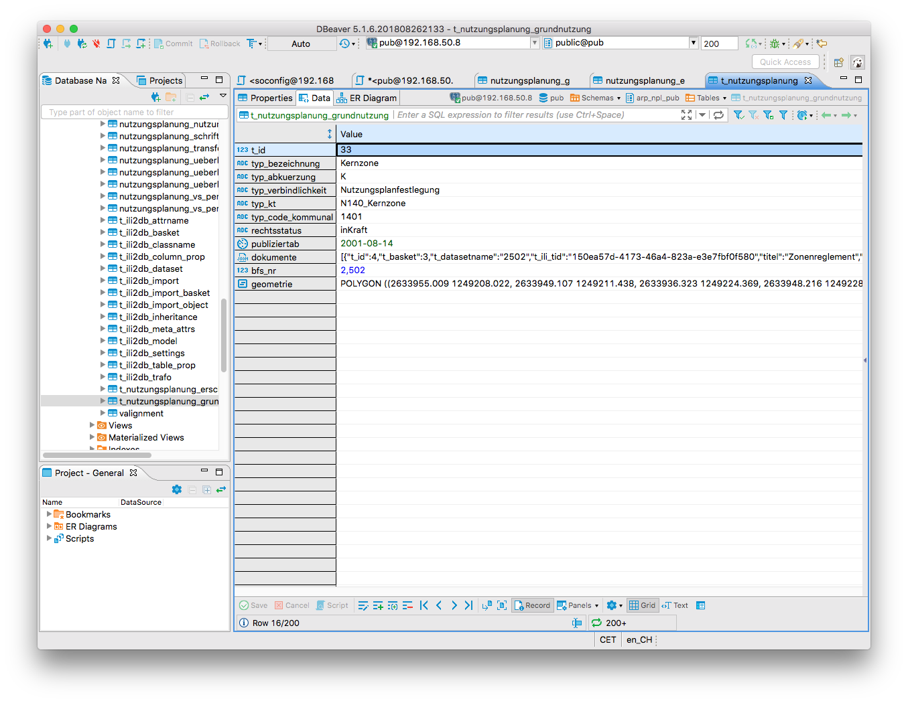
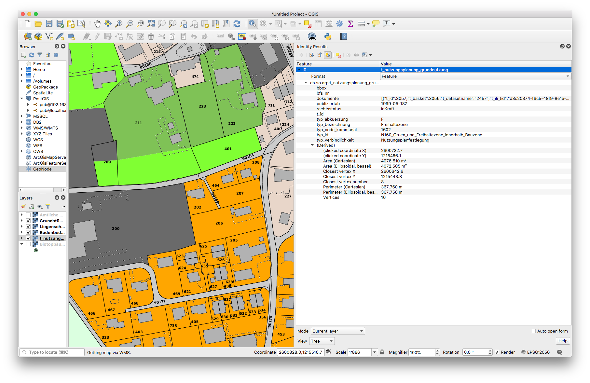
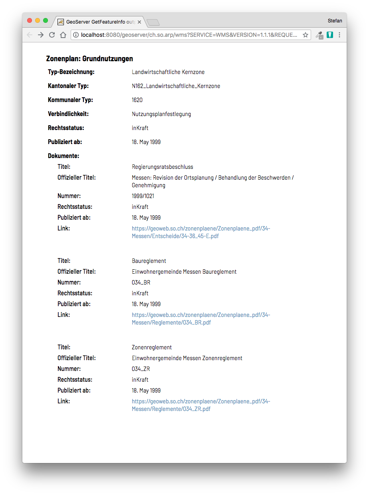
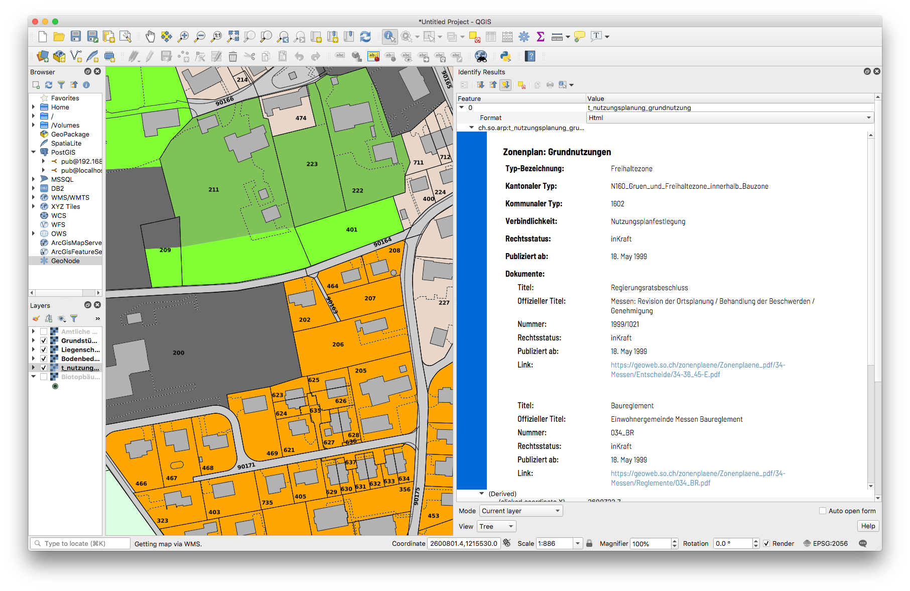

---
= GeoServer Magie #1 - GetFeatureInfo mit Freemarker Templates
Stefan Ziegler
2018-09-10
:thoth-type: post
:thoth-status: published
:thoth-tags: GeoServer,Freemarker,WMS,JSON
:idprefix:
---
Daten werden ja häufig - den Regeln der Kunst entsprechend - in einem normalisierten und relationalen Datenmodell erfasst. Da kann die Geometrie als solches auch schon mal die Nebenrolle spielen. Häufig haben wir den Fall, dass einer Geometrie mehrere Fotos oder PDF zugewiesen werden müssen. Soweit noch nichts Aussergewöhnliches und auch die Umsetzung geht rasch: Dank https://qgis.org/[QGIS], http://interlis.ch/[INTERLIS] und dem https://github.com/opengisch/projectgenerator[QGIS-Projektgenerator] ist die Sache in kürzester Zeit modelliert und die generische Fachschale auf Knopfdruck parat.

Die Diskussion startet aber spätestens wenn man dieses normalisierte Erfassungsmodell in eine für die gebräuchlichen WMS-Softwaren (also QGIS-Server, http://geoserver.org/[GeoServer] und https://mapserver.org/[MapServer]) taugliche Struktur bringen muss. Wenn dieser normalisierte und relationale Ansatz mit QGIS-Desktop und seinen mächtigen Formularfunktionen bei der Datenerfassung noch gut funktioniert, geht das nicht mehr so wirklich mit den genannten WMS-Servern. Diese erwarten eher resp. funktionieren am besten mit flachen und &laquo;dummen&raquo; Tabellen. Man möchte ja bloss z.B. im Web GIS Client auf eine Geometrie klicken und dann soll zumindest als Link jedes Foto oder PDF aufgelistet werden. Wie so oft gibt es hier verschiedene Lösungen. Bei uns als Altlast noch häufig verbreitet: man löst es halt für jeden Layer separat in der Objektabfrage. Das heisst, dass mit einem Mischmasch aus einer Skriptsprache (PHP...) und SQL was zusammengebastelt wird, so dass die Objektabfrage etwa das liefert, was man sich vorstellt. Vorteil: man kann sich selber verwirklichen. Nachteil: man verwirklicht sich selber.

Da wir die Daten sowieso praktisch immer von einem Erfassungsmodell in ein Publikationsmodell umbauen, kann man hier das flachwalzen durchführen. Wie walze ich aber eine 1:n-Beziehung flach? Ich kann die Links zu einem String aggregieren und mit einem Komma oder, falls es der Klient richtig rendern kann, mit einem HTML-Break trennen. Das ist dann einerseits auch nur halb-schön und funktioniert nur solange es sich bei flachzuwalzenden Daten um ein einzelnes Attribut handelt (eben ein Link zu einem Foto) und nicht komplette Objekte. Klar kann man jedes Attribut des Objektes genaus so behandeln aber das führt dann wirklich ins Nirwana.

Und hier kommt JSON ins Spiel. Beim Datenumbau aggregiere ich die Objekte zu einem JSON-Array. Am einfachsten kann man das an einem konkreten Beispiel erläutern: Unser kantonales Nutzungsplanungsmodell orientiert sich am Bundesmodell. Dieses wiederum am https://www.cadastre.ch/de/manual-oereb/publication/instruction.detail.document.html/cadastre-internet/de/documents/oereb-weisungen/Rahmenmodell-de.pdf.html[ÖREB-Rahmenmodell]. Jeder Geometrie wird ein Zonentyp zugewiesen. Jedem Zonentyp können mehrere Dokumente zugewiesen sein. Und um es noch spannender zu machen, gibt es diese Selbsreferenzierung der Dokumente auf sich selber. Als Übergangslösung bis zur Einführung des ÖREB-Katasters möchte man mit einem Klick im Web GIS Client auf eine Geometrie die wichtigsten Informationen präsentiert bekommen, d.h. neben dem Zonentyp sicher sämtliche dazugehörigen Dokumente.

Die Tabelle im Publikationsmodell hat jetzt mindestens eine Geometriespalte, eine Spalte mit dem Zonentyp und eben eine Spalte vom Typ JSON. In dieser Spalte sind sämtliche Dokumente, die für diesen Typ gültig sind als JSON-Array kodiert (Attribut &laquo;dokumente&raquo;):

Wenn man nun ein GetFeatureInfo auf diesen Layer absetzt, muss man sich zuerst entscheiden, was man vom WMS-Server retourniert haben will. Ob die Spezifikation überhaupt ein zwingendes Outputformat vorgibt, entzieht sich meiner Kenntnis, kann aber http://portal.opengeospatial.org/files/?artifact_id=1081&version=1&format=pdf[hier] oder http://portal.opengeospatial.org/files/?artifact_id=14416[hier] nachgelesen werden. Typischer Vertreter der Outputformate sind GML, HTML oder Text. Für jedes dieser Formate wird das JSON-Attribut standardmässig von GeoServer als String ausgeliefert. Somit hätte man noch nicht viel gewonnen. In QGIS sieht das so aus:

Entscheidet man sich, dass das Rendering des GetFeatureInfo-Requests auf dem Server und nicht auf dem Client geschehen soll, kann man HTML als Outputformat wählen. Standardmässig kommt hier in GeoServer eine relativ hässliche Tabelle. Aber jetzt kommt eben die Magie: Mit https://freemarker.apache.org/[Freemarker-Templates] kann ich was Schönes selber http://docs.geoserver.org/stable/en/user/tutorials/freemarker.html[zusammenbasteln]. Der Fokus liegt aber in meinem Fall weniger in &laquo;schön&raquo;, sondern dass ich eben das JSON-Array selber prozessieren kann.

Freemarker ist eine Template Engine, um Text-Output zu generieren. Für die GetFeatureInfo-Templates werden ein Header-, ein Content- und ein Footer-Template benötigt. &laquo;Nomen est Omen&raquo; in diesem Fall. Da man in unserem Fall HTML generieren will, steht im Header hauptsächlich CSS und der Beginn eines HTML-Dokumentes usw. Der Footer schliesst das sauber ab. Im Content-Template kann man das eigentliche Präsentieren des Features abhandeln:

[source,html,linenums]
----
<table class="featureInfo">
  <caption class="featureInfo">Zonenplan: Grundnutzungen</caption>
  <col style="width:30%">
  <col style="width:70%">
  <#list features as feature>
    <#assign attrs = feature.attributes >
    <tr>
      <td><strong>Typ-Bezeichnung:</strong></td>
      <td>${attrs.typ_bezeichnung.value}</td>
    </tr>
    <tr>
      <td><strong>Kantonaler Typ:</strong></td>
      <td>${attrs.typ_kt.value}</td>
    </tr>
    <tr>
      <td><strong>Kommunaler Typ:</strong></td>
      <td>${attrs.typ_code_kommunal.value}</td>
    </tr>
    <tr>
      <td><strong>Verbindlichkeit:</strong></td>
      <td>${attrs.typ_verbindlichkeit.value}</td>
    </tr>
    <tr>
      <td><strong>Rechtsstatus:</strong></td>
      <td>${attrs.rechtsstatus.value}</td>
    </tr>
    <tr>
      <td><strong>Publiziert ab:</strong></td>
      <td>${attrs.publiziertab.value?date('MM/dd/yy')?string["dd. MMMM yyyy"]}</td>
    </tr>
    <tr>
      <td colspan="2"><strong>Dokumente:</strong></td>
    </tr>
        <#if "${attrs.dokumente.value}" != "">
          <#assign documents = "${attrs.dokumente.value}"?eval>
          <#list documents as document>
              <tr>
                <td style="font-weight:500;padding-left:2em;padding-top:0em;">Titel:</td>
                <td style="padding-top:0em;">${document.titel}</td>
              </tr>
              <tr>
                <td style="font-weight:500;padding-left:2em;padding-top:0em;">Offizieller Titel:</td>
                <td style="padding-top:0em;">${document.offiziellertitel}</td>
              </tr>
              <tr>
                <td style="font-weight:500;padding-left:2em;padding-top:0em;">Nummer:</td>
                <td style="padding-top:0em;">${document.offiziellenr}</td>
              </tr>
              <tr>
                <td style="font-weight:500;padding-left:2em;padding-top:0em;">Rechtsstatus:</td>
                <td style="padding-top:0em;">${document.rechtsstatus}</td>
              </tr>
              <tr>
                <td style="font-weight:500;padding-left:2em;padding-top:0em;">Publiziert ab:</td>
                <td style="padding-top:0em;">${document.publiziertab?date('yyyy-MM-dd')?string["dd. MMMM yyyy"]}</td>
              </tr>
              <tr>
                <td style="font-weight:500;padding-left:2em;padding-top:0em;">Link:</td>
                <td style="padding-top:0em;"><a href="${document.textimweb_absolut}" target="_blank">${document.textimweb_absolut}</a></td>
              </tr>
              <tr>
                <td>&nbsp;</td>
                <td></td>
              </tr>
          </#list>
        <#else>
          &nbsp;
        </#if>
  </#list>
</table>
 
----
(Sorry für das hässliche HTML.)

Das Meiste ist ziemlich vorhersehbar. Wichtig ist die Zeile 35, wo mit `<#assign documents = "${attrs.dokumente.value}"?eval>` aus dem JSON-Array-String für Freemarker eine Liste gemacht wird, die man iterieren kann. Heikel resp. wohl ein Bug ist der Umstand, dass JSON-null-Werte zu einer Exception führen. Hier kann man als Workaround beim Datenumbau in PostgreSQL die Funktion `json_strip_nulls()` verwenden, die Attribute mit null-Werten wegputzt.

Das Resultat kann sich meines Erachtes sehen lassen:

In QGIS funktioniert es auch:

Da wir auch unsere Publikationsmodelle mit INTERLIS modellieren, haben wir das Dokumente-Attribut als reinen Text modelliert. In Zukunft kann man das dank einer Erweiterung von https://github.com/claeis/ili2db[`ili2db`] sauberer machen. Die Dokumente werden als BAG OF STRUCTURES modelliert und mit einem Meta-Attribut versehen. Dann weiss `ili2db`, dass es diese BAG OF STRUCTURES als JSON-Attribut in der relationalen Datenbank abbilden muss. Diese Erweiterung wird Ende 2018 verfügbar sein.