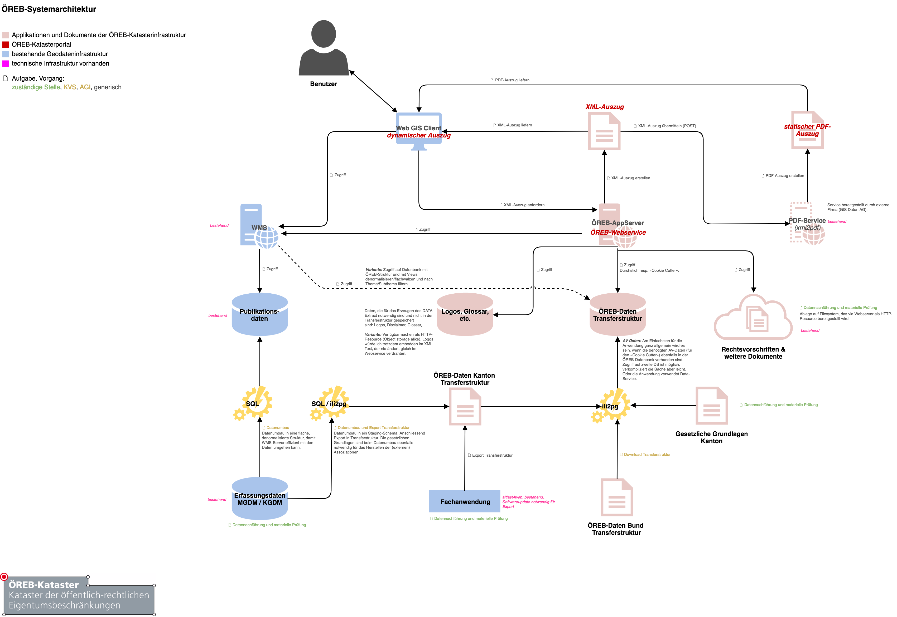
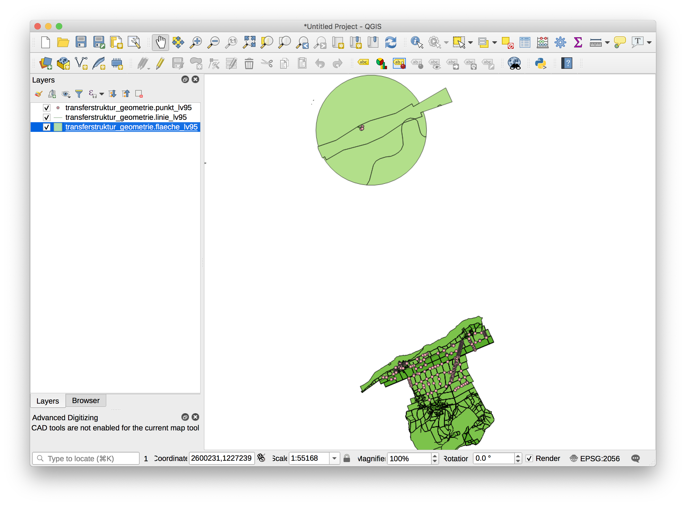

---
= ÖREB-Kataster as a Gradle Script
Stefan Ziegler
2018-10-21
:thoth-type: post
:thoth-status: published
:thoth-tags: ÖREB, ÖREB-Kataster, INTERLIS, ili2db, ili2pg, modellbasiert, QGIS, QGIS-Server, SLD
:idprefix:
---
Seit einigen Jahren investieren wir in fundamentale Werkzeuge, Arbeitsweisen und Basisinfrastrukturen. Es ist als würde die Saat bei der technischen Umsetzung des ÖREB-Katasters langsam aufgehen. Dank (oder trotz?) den vielen Weisungen zum ÖREB-Kataster ist relativ klar was man als Kanton bieten muss. Zentral ist der https://www.cadastre.ch/de/manual-oereb/publication/instruction.detail.document.html/cadastre-internet/de/documents/oereb-weisungen/OEREB-XML-Aufruf_de.pdf.html[ÖREB-Webservice]. Dieser ist das Fleisch am Knochen. Er stellt ein paar einfache Funktionen (wie z.B. EGRID mittels Koordinate eruieren) zur Verfügung, ist aber ebenso verantwortlich für den Output des https://www.cadastre.ch/de/services/publication.detail.document.html/cadastre-internet/de/documents/oereb-weisungen/OEREB-Data-Extract_de.pdf.html[XML-/JSON-Auszugs] und des https://www.cadastre.ch/de/manual-oereb/service/extract/static.html[statischen Auszuges (PDF)].

Eine der Fragestellungen für den Kanton ist wie und mit welchen Mitteln man das umsetzt. Um das Fuder nicht zu überladen, lassen wir den dynamischen Auszug mal weg. Das wird sowieso eine Speziellanfertigung für den jeweilig eingesetzten Web GIS Client. Oder man nimmt gleich so etwas wie den https://oerebview.apps.be.ch[Smart-Auszug]. 

Mir gefiel immer der Gedanke eines gemeinsamen Rahmenmodelles. Wenn man das vom Ende her denkt, ist der XML-Auszug nämlich nichts anderes als das Umformatieren des Resultates einer Datenbankabfrage. Die Datenbankabfrage selber entspricht einer absolut klassischen GIS-Aufgabe: Dem Ausstanzen eines Polygons (in unserem Fall eines Grundstückes) aus einer Datenbanktabelle mit den aggretierten ÖREB-Daten von Bund und Kanton. Und wenn wir schon dabei sind, ist das etwa das einzige Mal, dass es hier um Geoinformation geht und nicht bloss um gewöhnliches Datenmanagement. 

Mit diesem Grundgedanken kann man sich dann an eine grobe Systemarchitektur machen. Die technischen und organisatorischen Rahmenbedinungungen bei uns sind:

- PostgreSQL/PostGIS-Datenbanken
- INTERLIS-Werkzeuge vorhanden. Daten können mit `ili2pg` und `ilivalidator` einfachst importiert, exportiert und validiert werden.
- http://blog.sogeo.services/blog/2018/02/11/datenfluesse-mit-gradle-3.html[_GRETL/Jenkins_] als Orchestrierungswerkzeug für beliebige Prozesse
- Datenumbauten (kantonale Struktur -> ÖREB-Transferstruktur) werden mit SQL gemacht

Aus diesen Rahmenbedinungungen und ein wenig überlegen, folgt die folgende Architektur:

ÖREB-Bundesdaten werden heruntergeladen und in die ÖREB-Katasterdatenbank mit `ili2pg` importiert. Gleich behandelt werden kantonale Themen (z.B. KbS), die in einer Fachanwendung nachgeführt werden. Diese Fachanwendung ist für das Bereitstellen der ÖREB-Transferstruktur verantwortlich. Weitere kantonale Daten (z.B. Nutzungsplanung) werden modelläquivalent in einer Erfassungsdatenbank vorgehalten. Mit SQL werden diese Daten in die modelläquivalente Transferstruktur in einem Staging-Schema in der Erfassungsdatenbank gebracht und mit Verweisen auf die gesetzlichen Grundlagen angereichert. Dies verbucht man hauptsächlich unter Fleissarbeit, wobei hier natürlich Besonderheiten und Datenfehler das Leben schwer machen können. Sind sie umgebaut werden sie mit `ili2pg` in die Transferstruktur exportiert, mit `ilivalidator` geprüft und anschliessend in die ÖREB-Katasterdatenbank - wo bereits die Bundesdaten warten - importiert. 

Verweise auf gesetzliche Grundlagen und zuständige Stellen sind etwas, was wahrscheinlich selten in kantonalen Geodatensätzen bereits vorhanden sind. Diese Daten können in einem separaten Datenbankschema in der Erfassungsdatenbank aktuell gehalten werden. Die passenden Teilmodelle im Rahmenmodell gibt es ja, um modelläquivalente Strukturen in der Datenbank anzulegen und anschliessend mit QGIS nachzuführen. Der Nachführungsauwand dürfte sich vor allem bei den gesetzlichen Grundlagen in Grenzen halten. Bei Bedarf können die Daten wieder exportiert werden und in der ÖREB-Katasterdatenbank ausgetauscht werden.

Um den XML-Auszug erstellen zu können, fehlen noch ein paar Kleinigkeiten (die in der Transferstruktur nicht vorhanden sind) wie Logos, Glossar etc. Dazu schreibt man sich ein kleines INTERLIS-Modell und erfasst die notwendigen Daten in der Erfassungsdatenbank, exportiert die Daten und importiert sie in der ÖREB-Katasterdatenbank.

Um das eher theoretische Konzept zur Architektur mit was Greifbaren zu untermauern, habe ich mir mit GRETL ein paar Tasks zusammengeschustert, die mit den Bundesdaten und Nutzungsplanungsdaten (im kantonalen Modell) den Prozess durchspielen (https://github.com/edigonzales/oereb-kataster[Github-Repository]):

1. Erstellen und Initialisieren der Datenbank-Schemas mit Sekundärdaten (Gesetzliche Grundlagen, zuständige Stellen, Annex Modell mit Logos, Glossar etc.)
2. Download und Import der Bundesdaten und der amtlichen Vermessung in die ÖREB-Datenbank und der kantonalen Daten (Nutzungpslanung) in die Erfassungsdatenbank.
3. Datenumbau Nutzungsplanung: Kantonales Modell -> Transferstruktur
4. Export der Nutzungsplanung in die Transferstruktur und Import in die ÖREB-Katasterdatenbank

Erwähnenswert ist das (**PRE-ALPHA!**) Erstellen der einzelnen Symbole für den Legendeneintrag. Diese werden mittels `GetLegendGraphic`-Request erstellt. Zuvor muss jedoch ein `GetStyles`-Request erfolgen, um die Namen der Symbol-Regel zu kennen. Wahrscheinlich kommt man nicht umher hier gewisse Abmachungen mit der zuständigen Stelle bei der Erarbeitung der Legenden zu treffen, damit die Maschine auch wieder die Zuordnung zum Legendeneintrag in der Datenbank machen kann.

Notwendig - wenn man das mal durchspielen will - ist https://www.vagrantup.com/[Vagrant], Java und https://gradle.org/[Gradle]. Vagrant wird für die Datenbanken und QGIS-Server benötigt. Gradle für das Ausführen der GRETL-Tasks. https://plugins.gradle.org/plugin/ch.so.agi.gretl[GRETL] selber wird vom Gradle-Plugin-Repository automatisch heruntergeladen.

Folgende Befehle sind auszuführen:
[source,html,linenums]
----
vagrant up
----

Warten bis virtuelle Maschine hochgefahren ist, anschliessend:

[source,html,linenums]
----
gradle createSchemaOereb importFederalCodesets importFederalLegalBasis importCantonalLegalBasisToOereb createSchemaOerebAuszugAnnex createSchemaOerebNutzungsplanung importFederalLegalBasisToOerebNutzungsplanung importCantonalLegalBasisToOerebNutzungsplanung importResponsibleOfficesToOerebNutzungsplanung createOerebNutzungsplanungViews createSchemaNutzungsplanung createSchemaAmtlicheVermessung
gradle replaceFederalData replaceCantonalLandUsePlansData replaceCadastralSurveyingData importOerebAuszugAnnex
gradle deleteStaging insertStaging updateLegendEntrySymbols
gradle exportLandUsePlansToXtf replaceOerebNutzungsplanung
----

(Kann je nach Entwicklungsstand auch mal nicht funktionieren.)

Hat alles geklappt sind jetzt sowohl die vorhandenen vier Bundesdatensätze wie auch die Nutzungsplanung in der ÖREB-Katasterdatenbank vorhanden und können z.B. in QGIS angezeigt werden:

Hat man die ÖREB-Daten in einer Datenbank, fehlt noch der ÖREB-Webservice, der mir PDF- und XML-Auszug liefert. Ich bin ein Freund des Gedankens, dass der Service selber nur XML (oder JSON) liefern soll resp. das PDF soll aus dem XML erstellt werden. Verhindert werden soll, dass unterschiedliche Abfragen für die jeweilige Herstellung eines Formates verwendet werden müssen. Das XML ist die &laquo;single source of truth&raquo;. Für das Herstellen eines PDF-Auszuges aus einem XML, gibt es den https://github.com/geocloud/oereb_xml_pdf_service[XML2PDF-Service], der in einem Schwergewichtsprojekt noch elaboriert wurde.

Wenn es einzig noch um den XML-Auszug geht, kann man etwas selber machen oder etwas bestehendes nehmen, wie z.B. https://github.com/camptocamp/pyramid_oereb[pyramid_oereb]. Bei pyramid_oereb müsste man wohl die modelläquivalente Struktur nochmals umbauen in die eigene Datenbankstruktur. Wenn man etwas selber macht, ist man natürlich freier. Als Proof-of-Concept und als Entscheidungsgrundlage, ob es etwas vorhandenes werden soll oder ob noch Effort in eine Entwicklung gesteckt werden soll, habe ich mir einen Webservice zusammengeschustert, der funktional natürlich völlig unvollständig ist: 

Muss man XML erstellen, gibt es verschiedene Möglichkeiten dies zu tun. In unserem Fall sind http://schemas.geo.admin.ch/V_D/OeREB/[XML Schema Definitionen] vorhanden. Mit XML-Binding kann man automatisch Java-Klassen ableiten lassen. Das hat den Vorteil, dass ich mich als Programmierer nicht um das eigentliche Formatieren kümmern muss, sondern ich muss nur die Java-Klassen korrekt mit Daten abfüllen. Eine andere Variante wäre das Arbeiten mit einer Templating Engine. 

Das automatische Herstellen der Java-Klassen mit `xjc` war - diplomatisch formuliert - spannend. Das ist vor allem darauf zurückzuführen, dass im ExtractData-Schema für die Geometrie-Kodierung GML verwendet wird. Von den insgesamt circa 420 Klassen, sind 357 Klassen GML-spezifisch. Notwendig für das erfolgreiche Erstellen der Klassen sind einige Konfigurationsdateien (für die GML-Besonderheiten), die man Gott sei Dank mit ein wenig Googlen im Internet findet.

Der https://github.com/edigonzales/oereb-kataster/tree/master/web-service[Service] selber wurde mit https://spring.io/projects/spring-boot[Spring Boot] gemacht. Cloned man das https://github.com/edigonzales/oereb-kataster.git[Repository] reicht nach dem Wechseln in das `web-service`-Verzeichnis:

[source,html,linenums]
----
./gradlew bootRun
----

um den Webservice zu starten. Funktional umgesetzt ist, wie bereits erwähnt, wenig (war vor einem Jahr schon mal https://github.com/edigonzales/oereb-web-service[weiter]).

Was funktioniert ist die Suche nach einem EGRID mittels Koordinate:

[source,html,linenums]
----
http://localhost:8888/oereb/getegrid/xml/?XY=2598098,1225627
----

Und das Anzeigen der betroffenen resp. nicht betroffenen und nicht vorhandenen ÖREB-Themen, dem Datum und dem Flavour beim Extract-Aufruf:

[source,html,linenums]
----
http://localhost:8888/oereb/extract/reduced/xml/geometry/CH870672603279 (Flughafen Grenchen)
http://localhost:8888/oereb/extract/reduced/xml/geometry/CH933273065885 (nur Nutzungsplanung)
----

Meine Fazit: Identifiziert man die einzelne Teile und Prozesse des grossen Ganzen, zeigt sich schnell, dass vieles mit unseren vorhandenen Bordmitteln (aka Legobausteinen) effizient und transparent gelöst werden kann. Hilfreich ist hier sicher einmal mehr der modellbasierte Ansatz und ein unverkrampfter Umgang mit INTERLIS und Datenumbauten mit SQL (was mich immer wieder überrascht...). Ebenso hilft das tägliche Mantra: &laquo;Spatial is not special&raquo;, was sich nochmals zeigen wird, wenn es um die Frage geht &laquo;ÖREBlex: ja oder nein?&raquo; (to be continued).