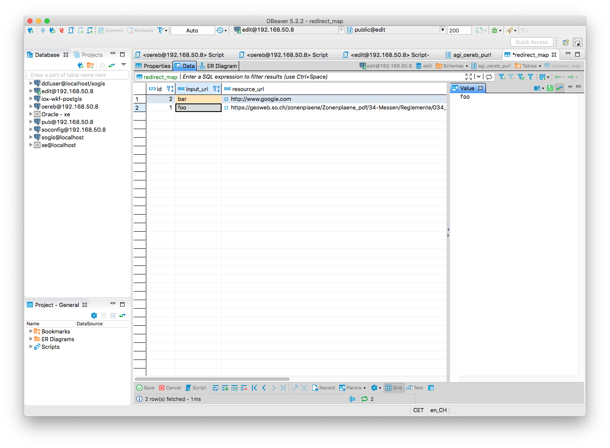

Die Frage aus dem http://blog.sogeo.services/blog/2018/10/21/oereb-kataster-1-as-a-gradle-script.html[letzten Beitrag] &laquo;ÖREBlex: ja oder nein?&raquo; ist  falsch gestellt. Es geht nicht direkt um die Anschaffung von OEREBlex, sondern vielmehr wie Dokumente im kantonalen ÖREB-Gesamtsystem (nennen wir es mal so) in den Daten eingebunden werden.

Der Gedanke, dass die Geobasisdaten mit den Rechtsvorschriften eine Einheit bilden und so die Eigentumsbeschränkung unmittelbar beschreiben, finde ich gut und plausibel. Das Transferstrukturteilmodell des Rahmenmodells und daran angelehnte MGDM und wohl einige KGDM bilden diese Aussage ab. Ganz vereinfacht sieht das so aus:

Bei der modellbasierten Numerisierung der Nutzungsplanung war für uns - losgelöst vom Thema ÖEREB-Kataster - wichtig, dass neben den Geometrien eben auch die dazugehörigen Rechtsvorschriften und Beschlussdokumente miterfasst werden. Das kantonale Nutzungsplanungsmodell (resp. in letzter Konsequenz eben das Rahmenmodell) lässt dies zu. Gemäss der Abbildung von oben entspricht die Klasse `Eigentumsbeschränkung` in diesem Fall der Klasse `Typ` im kantonalen Modell.

Bestehende Ortsplanungen zu digitalisieren und die Verknüpfung mit Dokumenten herzustellen, die existieren und als HTTP-Ressource verfügbar sind, ist keine Hexerei. Die Herausforderung beginnt erst, wenn die Dokumente noch nicht existieren. Z.B. der Beschluss-RRB, Zonen- und Baureglemente oder allfällige Gestaltungspläne sind noch nicht vorhanden, falls eine komplette Ortsplanungsrevision oder Teilrevision gemacht wird. Erst recht ist die zukünftige URL noch nicht bekannt. Und so wie ich es verstanden habe, kommt hier ÖREBlex ins Spiel. Es kann unter anderem als &laquo;Bündelungsschicht&raquo; wie auch als Blick in die Zukunft dienen. D.h. man macht ein Päckli und das Päckli bekommt eine URL. Im Päckli selber muss noch kein Dokument vorhanden sein. Der Datenerfasser muss jetzt zu seinem `Typ` bloss einen Link erfassen. Ob die Dokumente, die für diese Eigentumsbeschränkung bereits vorhanden sind oder nicht, spielt keine Rolle. Dem Päckli kann man nun bei Abschluss den Beschluss-RRB und Rechtsvorschriften zuweisen.

Neben den auf der Hand liegenden Vorteilen, geht für mich hier aber die Einheit zwischen Geometrie und Rechtsvorschrift verloren. Zumindest auf der Persistenzschicht. Wenn wir das so machen würden und ein Kunde das KGDM der Nutzungsplanung bezieht, bekommt er die Geometrien und Typen, die auf einen Link zeigen, der mir eine Liste (oder XML, HTML, ...) mit weiteren Links zu den Dokumenten zurückliefert. Der Kunde muss mit diesen Rückgaberesultaten umgehen können und braucht dazu wohl oder übel weitere Software oder Skripte. Darum: Dokumente gehören gleichberechtigt zu den Geometrien in ein Datenmodell (sei es KGDM, MDGM oder in die Transferstruktur).

Will man das, braucht es wohl mehr organisatorische Koordination, was ich aber für machbar halte. Ein technisches Problem ist der Umgang mit der URL der zu verlinkenden aber noch nicht vorhandenen Dokumenten. Ab einem gewissen Zeitpunkt bei einer Ortsplanung, dürfte man wohl wissen, welche Dokumente entstehen werden. Frage: Was für Möglichkeiten gibt es, das nicht vorhandene Dokument resp. die URL zum nicht vorhandenen Dokument im Modell zu erfassen:

- Jemand erstellt ein Dummy-PDF und stellt es als HTTP-Ressource bereit.
- Man definiert zusammen Konventionen und garantiert die Einhaltung dieser Konventionen, z.B. Link zur HTTP-Ressource besteht aus BFS-Nummer, Typ des Dokumentes etc.

Oder man verwendet das Prinzip der http://bibpurl.oclc.org/faq.html[PURL]: Eine PURL ist http://bibpurl.oclc.org/faq.html#toc1.2[funktional eine URL]. Anstelle der direkten URL auf das Dokument, erfasst/verlinkt man die PURL. Die PURL zeigt auf einen Server, der die zur PURL passende URL heraussucht und anschliessend ein simples HTTP redirect ausführt. Soweit technisch nichts neues. Was es nun braucht, ist jemand der dem Datenerfasser die PURL bei Bedarf liefert und wenn das Dokument vorhanden ist, dieses auf der Fileablage o.ä. ablegt. Garantiert werden muss das P = Persistent. Die PURL darf sich nicht ändern, sonst gewinnt man genau nichts.

Solange das Dokumente noch nicht real exisitert, liefert der PURL-Server den Statuscode 404 zurück. Wenn das Dokument vorhanden ist, wird ein Redirect mit Statuscode 302 gemacht.

Wie bekomme ich einen PURL-Server? Im Grundsatz braucht es sehr wenig: https://httpd.apache.org/[Apache] und eine Datenbank. Rewriten und Redirecten kann Apache mit dem `mod_rewrite` https://httpd.apache.org/docs/current/mod/mod_rewrite.html[Modul]. Völlig unpraktikabel wäre die Verwaltung der Redirects von PURL auf die URL direkt in der Apache-Config Datei. Apache kennt die https://httpd.apache.org/docs/current/mod/mod_rewrite.html[Direktive] `RewriteMap`. Diese Direktive definiert externe Funktionen im Kontext von `RewriteRule` und `RewriteCond`. So kann man als Datenquelle eine Textdatei angeben oder auch ein externes Programm (ganz allgemein), das via `STDIN` und `STDOUT` kommuniziert. Für unseren Anwendungsfall ist das Einbinden einer Datenbank verheissungsvoll. Dazu braucht Apache das https://httpd.apache.org/docs/2.4/mod/mod_dbd.html[Modul] `mod_dbd`. Mehr nicht.

Unter der Annahme, dass auf einem Ubuntu-Rechner Apache und PostgreSQL bereits vorhanden sind, braucht es folgendes:

[source,html,linenums]
----
sudo apt-get install libaprutil1-dbd-pgsql
sudo a2enmod rewrite
sudo a2enmod dbd
sudo /etc/init.d/apache2 restart
----

Unter Umständen muss der Datenbanktreiber in das modules-Verzeichnis von Apache kopiert werden:

[source,html,linenums]
----
sudo cp /usr/lib/x86_64-linux-gnu/apr-util-1/apr_dbd_pgsql*  /usr/lib/apache2/modules/
----

Die Apache-Config-Datei muss ergänzt werden:

Folgende Befehle sind auszuführen:
[source,html,linenums]
----
<Directory /var/www/html>
        Options Indexes FollowSymLinks
        AllowOverride All
        Require all granted
</Directory>

<IfModule mod_rewrite.c>
    DBDriver pgsql
    DBDParams "hostaddr=192.168.50.8 user=ddluser password=ddluser dbname=edit"
    DBDMin 4
    DBDKeep 8
    DBDMax 20
    DBDExptime 300

    RewriteEngine on

    RewriteMap data "dbd:select resource_url from agi_oereb_purl.redirect_map where input_url=%s"

    RewriteCond ${data:$1} =""
    RewriteRule ^/(.*) - [R=404,L]
    RewriteCond ${data:$1} !=""
    RewriteRule ^/(.*) ${data:$1} [R=302]
</IfModule>
----

Vieles ist selbsterklärend. `RewriteMap` macht die Abfrage in der Datenbank mit `%s`= Pfad der URL. Dies http://bibpurl.oclc.org/faq.html#toc1.4[entspricht] dem `name`-Teil der PURL. Die Query liefert die URL zum Dokument zurück.

Falls die Query nichts findet (Zeile 19), wird der Statuscode 404 vom Webserver zurückgeliefert (Zeile 20). Wird etwas gefunden (Zeile 21), wird ein Redirect zum Dokument ausgeführt (Zeile 22).

Testhalber habe ich zwei Dummyrecords in der Tabelle erfasst:

Mit `curl` kann man die Abfragen testen und sich die Statuscodes ausgeben lassen:

[source,html,linenums]
----
curl -X HEAD -I  http://192.168.50.8/foo
----

liefert:

[source,html,linenums]
----
HTTP/1.1 302 Found
Date: Tue, 23 Oct 2018 18:59:26 GMT
Server: Apache/2.4.29 (Ubuntu)
Location: https://geoweb.so.ch/zonenplaene/Zonenplaene_pdf/34-Messen/Reglemente/034_ZR.pdf
Content-Type: text/html; charset=iso-8859-1
----

Wird ein Dokument nicht gefunden, soll 404 ausgeliefert werden:

[source,html,linenums]
----
curl -X HEAD -I  http://192.168.50.8/fubar
----

liefert:

[source,html,linenums]
----
HTTP/1.1 404 Not Found
Date: Tue, 23 Oct 2018 19:00:15 GMT
Server: Apache/2.4.29 (Ubuntu)
Content-Type: text/html; charset=iso-8859-1
----

Der Blick in die Zukunft kann mit dem Prinzip PURL gemacht werden. Es muss dafür nicht eine teure Spezialsoftwarelösung her, die für etwas entwickelt wurde, für das es Lösungen gibt, die sehr einfach und entsprechend transparent sind. Eine einfache Lösung mit Apache und PostgreSQL passt zu unserer Organisation, die sich mit beiden Produkten bestens auskennt und bereits täglich im Einsatz hat. 