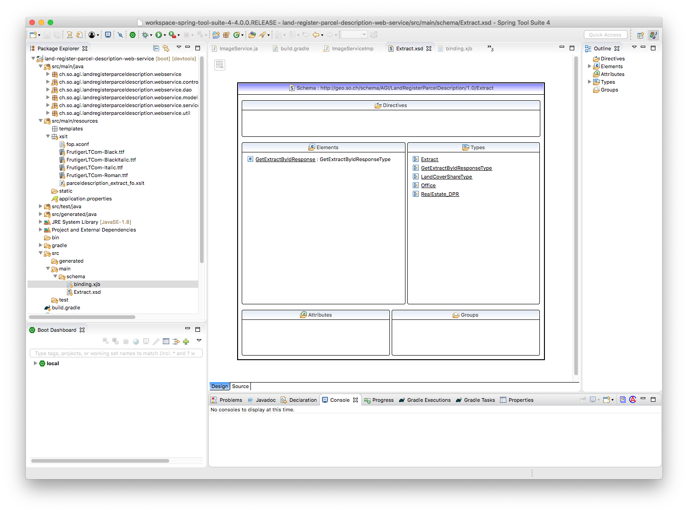
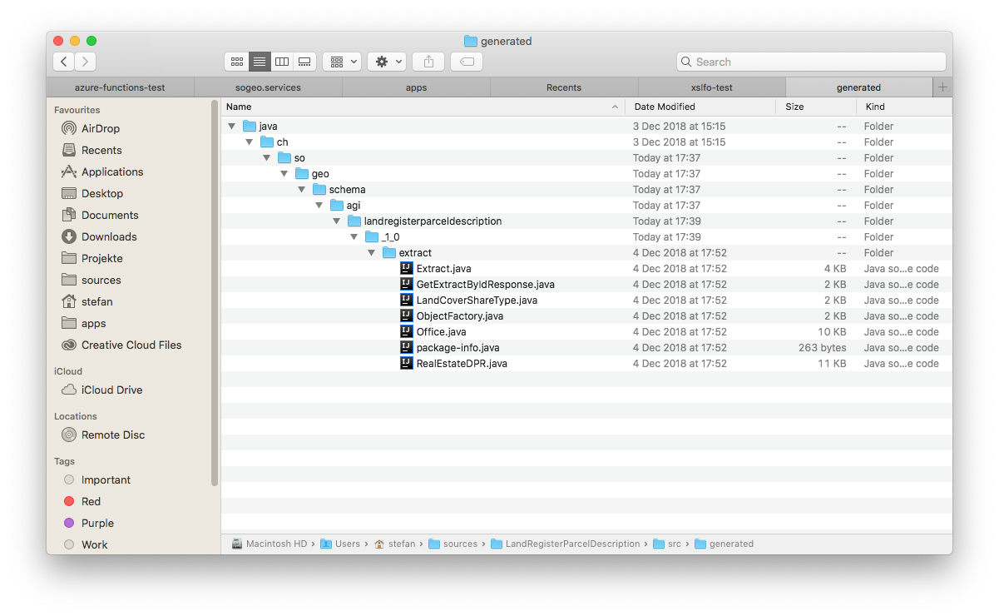
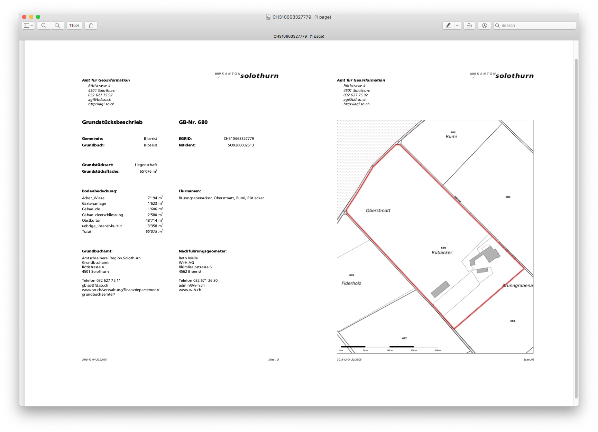

---
= XSLT / XSL-FO #1 - Mein Hammer. Wo sind die Nägel?
Stefan Ziegler
2018-12-09
:thoth-type: post
:thoth-status: published
:thoth-tags: Java,XSLT,XSL-FO,XML,Apache,FOP,JasperReports,Spring Boot, Spring
:idprefix:
---
Wie wahrscheinlich bei vielen anderen auch, gibt es bei uns für verschiedene Layer im Web GIS Client zusätzliche PDF-Auszüge. Wir nennen sie Objektblätter und sie sind in der Regel einem einzelnen Objekt zugewiesen. Oder anders formuliert: Die Informationen eines Objektes werden aufgehübscht und angereichtert mit z.B. Fotos und einem Übersichtskärtli in einer PDF-Datei gerendert. 

- Geotope: https://geo.so.ch/map/?k=3e1f80c22[Kartenausschnitt] / https://geo.so.ch/api/v1/document/geotope?feature=2430&x=2607404.7787109376&y=1230195.9923828125&crs=EPSG%3A2056[Objektblatt]
- Grundstücksbeschrieb: https://geo.so.ch/map/?k=8f1c3a50e[Kartenausschnitt] / https://geo.so.ch/api/v1/document/grundstuecksbeschrieb?feature=281000848&x=2608143.5842610677&y=1225612.3837890625&crs=EPSG%3A2056[Objektblatt]

In einigen Fällen ist der PDF-Auszug nicht direkt an ein Objekt gebunden, sondern vielmehr abhängig vom Ort, wo der Benutzer in die Karte geklickt hat. In diesem Fall ähnelt es dem ÖREB-Auszug. Wobei die Unterschiede im Prinzip egal sind, da es schlussendlich praktisch auf das Gleiche herauskommt. Der Benutzer klickt in die Karte, im Hintergrund werden die Daten zusammengesucht und anschliessend als PDF zurückgeliefert.

Für diesen Arbeitsschritt setzen wir zur Zeit https://community.jaspersoft.com/project/jasperreports-library[JasperReports] ein. Damit können wir auf Datenbanken und Filesysteme (für Fotos etc.) zugreifen. Ebenfalls möglich sind WMS-Request, um die Übersichtskarten ins PDF zu bringen. Soweit funktioniert das ganz passabel. Der grösste Mehrwert ist jedenfalls, dass wir im Gegensatz zu früher die PDF-Auszüge immer gleich machen.

Der ÖREB-Kataster mit seinem https://www.cadastre.ch/de/manual-oereb/publication/instruction.detail.document.html/cadastre-internet/de/documents/oereb-weisungen/OEREB-XML-Aufruf_de.pdf.html[Webservice] hat da einen leicht saubereren Ansatz: Es gibt einen &laquo;Rohdatenoutput&raquo; in den Formaten XML und JSON, und einen &laquo;lesbaren&raquo; Output im PDF-Format. Ich habe natürlich genau nichts gewonnen, wenn ich das XML und das PDF komplett separiert herstelle. Sinnvoller ist es das XML als Input für das PDF zu verwenden. Dann weiss ich haargenau, dass sowohl XML wie auch das PDF auf den selben Daten beruhen und nicht durch unterschiedliche Datenbankqueries oder Businesslogik im Webservice zustande gekommen sind. 

Am Beispiel unseres Grundstückbeschriebs habe ich den &laquo;ÖREB-Auszugs-Ansatz&raquo; komplett durchgespielt:

1. Erstellen des XML-Schemas
2. XML-Output mit https://de.wikipedia.org/wiki/Java_Architecture_for_XML_Binding[JAXB]
3. Transformieren der XML-Datei in eine XSL-FO-Datei mit einem XSLT-Prozessor (https://www.saxonica.com[Saxon]).
4. Umwandeln/Formatieren der XSL-FO-Datei in ein PDF mit einem Formatting Objects Processor (https://xmlgraphics.apache.org/fop/[Apache Fop]).

Das Ganze noch eingepackt in eine http://spring.io/projects/spring-boot[Spring Boot] Applikation, damit ähnliche Aufrufe wie beim ÖREB-Webservice möglich sind.

Das http://blog.sogeo.services/data/xsltxslfop1/Extract.xsd[XSD] kann man sich in Eclipse zusammenklicken. Nach längerem Suchen habe ich nichts besseres gefunden (jedenfalls nichts kostenloses):



JAXB erlaubt es mir mich _nicht_ um das XML-Format zu kümmern. Ich kann mich auf die eigentliche Businesslogik konzentrieren, in diesem Fall auf das Zusammensuchen der Informationen in der Datenbank für das gewählte Grundstück und muss diese Informationen bloss in dumme Java-Klassen schreiben. Das Umformatieren der Java-Objekte nach XML übernimmt JAXB. Dafür muss ich als erstes  aus dem XML-Schema die Java-Klassen herstellen. Dazu reicht folgender Aufruf:

```
xjc -b binding.xjb -extension Extract.xsd
```

Die `-b`-Option ist notwendig, damit das XML-Rootelement korrekt annnotiert wird. Fehlt die Option wirft Spring Boot auf den ersten Blick eine nicht ganz einfach verständliche Fehlermeldung. Das Resultat des Aufrufes sind in meinem Fall sechs Java-Klassen:



Für http://www.gradle.org[Gradle] gibt es ein https://plugins.gradle.org/plugin/org.unbroken-dome.xjc[xjc-Plugin]. Die Anwendung ist einfach:

[source,html,linenums]
----
xjcGenerate {
    source = fileTree('src/main/schema') { include '*.xsd' }
    bindingFiles = fileTree('src/main/schema') { include '*.xjb' }
    outputDirectory = file('src/generated/java')
    extension = true
}
----

Es steht jetzt ein `xjcGenerate`-Task zur Verfügung.

Was jetzt folgt ist das Zusammensuchen der Informationen mit ein paar SQL-Queries und das https://github.com/edigonzales/LandRegisterParcelDescription/blob/master/src/main/java/ch/so/agi/landregisterparceldescription/webservice/services/GetExtractByIdResponseTypeServiceImpl.java[Abfüllen und Zusammenstöpseln] der soeben erstellen Java-Klassen. Dem https://github.com/edigonzales/LandRegisterParcelDescription/blob/master/src/main/java/ch/so/agi/landregisterparceldescription/webservice/controllers/MainController.java#L46[Spring Boot Controller] reicht als Return-Value sogar nur eine &laquo;Root-Klasse&raquo; und er macht das Marshalling automatisch. Der Aufruf

```
http://localhost:8887/parcel/extract/xml/CH310663327779
```

liefert das folgende http://blog.sogeo.services/data/xsltxslfop1/CH310663327779.xml[XML] zurück: (Das base64-Encoding der Bilder habe ich hier gekürzt. Im verlinkten http://blog.sogeo.services/data/xsltxslfop1/CH310663327779.xml[XML] sind sie vorhanden.)

[source,xml,linenums]
----
<?xml version="1.0" encoding="UTF-8" standalone="yes"?>
<GetExtractByIdResponse xmlns="http://geo.so.ch/schema/AGI/LandRegisterParcelDescription/1.0/Extract">
  <Extract>
    <CantonalLogo>iVBORw0KGgoAAAANSUhEUgAABLAAAACBCAAAAAD1IxwIAAAABGdBTUEAALGPC/xhBQAADPNpQ0NQa0NHQ29s....</CantonalLogo>
    <ResponsibleOffice>
      <Name>Amt für Geoinformation</Name>
      <OfficeAtWeb>http://agi.so.ch</OfficeAtWeb>
      <Email>agi@bd.so.ch</Email>
      <Street>Rötistrasse</Street>
      <Number>4</Number>
      <PostalCode>4501</PostalCode>
      <City>Solothurn</City>
      <Phone>032 627 75 92</Phone>
    </ResponsibleOffice>
    <RealEstate>
      <Number>680</Number>
      <IdentND>SO0200002513</IdentND>
      <EGRID>CH310663327779</EGRID>
      <LocalNames>Brunngrabenacker, Oberstmatt, Rumi, Rütiacker</LocalNames>
      <LandCoverShare>
        <Type>Acker_Wiese</Type>
        <Area>7194</Area>
      </LandCoverShare>
      <LandCoverShare>
        <Type>Gartenanlage</Type>
        <Area>1623</Area>
      </LandCoverShare>
      <LandCoverShare>
        <Type>Gebaeude</Type>
        <Area>1606</Area>
      </LandCoverShare>
      <LandCoverShare>
        <Type>Gebaeudeerschliessung</Type>
        <Area>2580</Area>
      </LandCoverShare>
      <LandCoverShare>
        <Type>Obstkultur</Type>
        <Area>48714</Area>
      </LandCoverShare>
      <LandCoverShare>
        <Type>uebrige_Intensivkultur</Type>
        <Area>3358</Area>
      </LandCoverShare>
      <SurveyorOffice>
        <Name>Reto Meile</Name>
        <OfficeAtWeb>www.w-h.ch</OfficeAtWeb>
        <Email>admin@w-h.ch</Email>
        <Line1>W+H AG</Line1>
        <Street>Blümlisalpstrasse</Street>
        <Number>6</Number>
        <PostalCode>4562</PostalCode>
        <City>Biberist</City>
        <Phone>032 671 26 30</Phone>
      </SurveyorOffice>
      <LandRegisterOffice>
        <Name>Amtschreiberei Region Solothurn</Name>
        <OfficeAtWeb>www.so.ch/verwaltung/finanzdepartement/grundbuchaemter/</OfficeAtWeb>
        <Email>gb.so@fd.so.ch</Email>
        <Line1>Grundbuchamt</Line1>
        <Street>Rötistrasse</Street>
        <Number>4</Number>
        <PostalCode>4501</PostalCode>
        <City>Solothurn</City>
        <Phone>032 627 75 11</Phone>
      </LandRegisterOffice>
      <Type>Liegenschaft</Type>
      <Municipality>Biberist</Municipality>
      <SubunitOfLandRegister>Biberist</SubunitOfLandRegister>
      <LandRegistryArea>65076</LandRegistryArea>
      <Map>iVBORw0KGgoAAAANSUhEUgAACGYAAAoDCAYAAAB/VcSAAACAAElEQVR42uzdBZiUVfs/cLeXhWVZukGlVLo7pQQE6....</Map>
    </RealEstate>
    <CreationDate>2018-12-08T18:01:10.592+01:00</CreationDate>
  </Extract>
</GetExtractByIdResponse>
----

Das Umwandeln der XML-Datei in die PDF-Datei geschieht in zwei Schritten. Der erste Schritt ist das Transformieren der XML-Datei in eine XSL-FO-Datei (ebenfalls eine XML-Datei), welche die eigentlichen Anweisungen (Layout, Styling etc.) enthält, damit ein FO-Prozessor aus dieser Zwischen-XML-Datei das PDF rendern kann. Ohne grosse Erfahrung ist es einfacher, das ganze Rumtransformieren zuerst stand-alone auf der Konsole zu machen und die Integration in die Spring Boot Applikation erst zu machen, wenn man etwas funktionierendes hat.

Für den ersten Schritt verwende ich https://www.saxonica.com/welcome/welcome.xml[Saxon] als XSLT-Prozessor. Das Wichtigste für die Umwandlung ist aber ein http://blog.sogeo.services/data/xsltxslfop1/parceldescription_extract_fo.xslt[Stylesheet] (*.xslt), das die Anweisung für die Transformation enthält:

[source,xml,linenums]
----
<?xml version="1.0" encoding="UTF-8"?>
<xsl:stylesheet xmlns:xsl="http://www.w3.org/1999/XSL/Transform" xmlns:fo="http://www.w3.org/1999/XSL/Format" xmlns:extract="http://geo.so.ch/schema/AGI/LandRegisterParcelDescription/1.0/Extract" exclude-result-prefixes="extract" version="1.0">
  <xsl:output method="xml" indent="yes"/>
  <xsl:decimal-format name="swiss" decimal-separator="." grouping-separator="'"/>
  <xsl:template match="extract:GetExtractByIdResponse">
    <fo:root xmlns:fo="http://www.w3.org/1999/XSL/Format" xmlns:xsd="https://www.w3.org/2001/XMLSchema" xmlns:xsi="http://www.w3.org/2001/XMLSchema-instance">
      <fo:layout-master-set>
        <fo:simple-page-master master-name="mainPage" page-height="297mm" page-width="210mm" margin-top="12mm" margin-bottom="12mm" margin-left="15mm" margin-right="12mm">
          <fo:region-body margin-top="45mm" background-color="#FFFFFF"/>
          <fo:region-before extent="40mm" background-color="#FFFFFF"/>
          <fo:region-after extent="10mm" background-color="#FFFFFF"/>
        </fo:simple-page-master>
      </fo:layout-master-set>
      <xsl:apply-templates/>
    </fo:root>
  </xsl:template>
  <xsl:template match="extract:Extract">
    <fo:page-sequence master-reference="mainPage" id="my-sequence-id">
      <fo:static-content flow-name="xsl-region-before">
        <fo:block>
          <fo:block-container absolute-position="absolute" top="6.7mm" left="0mm" line-height="1em" background-color="#FFFFFF">
            <fo:block font-size="10pt" font-style="italic" font-weight="700" font-family="Frutiger">
              <xsl:value-of select="extract:ResponsibleOffice/extract:Name"/>
            </fo:block>
            <fo:block font-size="10pt" font-style="italic" font-weight="400" font-family="Frutiger" margin-left="6mm" margin-top="1mm">
              <fo:block>
                <xsl:value-of select="extract:ResponsibleOffice/extract:Street"/>
                <xsl:text> </xsl:text>
                <xsl:value-of select="extract:ResponsibleOffice/extract:Number"/>
              </fo:block>
              <fo:block>
                <xsl:value-of select="extract:ResponsibleOffice/extract:PostalCode"/>
                <xsl:text> </xsl:text>
                <xsl:value-of select="extract:ResponsibleOffice/extract:City"/>
              </fo:block>
              <fo:block>
                <xsl:value-of select="extract:ResponsibleOffice/extract:Phone"/>
              </fo:block>
              <fo:block>
                <xsl:value-of select="extract:ResponsibleOffice/extract:Email"/>
              </fo:block>
              <fo:block>
                <xsl:value-of select="extract:ResponsibleOffice/extract:OfficeAtWeb"/>
              </fo:block>
            </fo:block>
          </fo:block-container>
          <fo:block-container absolute-position="absolute" top="0mm" left="123mm" background-color="#FFFFFF">
            <fo:block>
              <fo:external-graphic height="6.7mm" width="60mm" content-width="scale-to-fit" content-height="scale-to-fit">
                <xsl:attribute name="src">
                  <xsl:text>url('data:</xsl:text>
                  <xsl:text>image/png;base64,</xsl:text>
                  <xsl:value-of select="extract:CantonalLogo"/>
                  <xsl:text>')</xsl:text>
                </xsl:attribute>
              </fo:external-graphic>
            </fo:block>
          </fo:block-container>
        </fo:block>
      </fo:static-content>
      <fo:static-content flow-name="xsl-region-after">
        <fo:table table-layout="fixed" width="100%" margin-top="4mm" font-size="7pt" font-style="italic" font-weight="400" font-family="Frutiger">
          <fo:table-column column-width="50%"/>
          <fo:table-column column-width="50%"/>
          <fo:table-body>
            <fo:table-row>
              <fo:table-cell>
                <fo:block>
                  <xsl:value-of select="format-dateTime(extract:CreationDate,'[Y0001]-[M01]-[D01] [H01]:[m01]:[s01]')"/>
                </fo:block>
              </fo:table-cell>
              <fo:table-cell text-align="right">
                <fo:block>Seite <fo:page-number/>/<fo:page-number-citation-last ref-id="my-sequence-id"/></fo:block>
              </fo:table-cell>
            </fo:table-row>
          </fo:table-body>
        </fo:table>
      </fo:static-content>
      <xsl:apply-templates select="extract:RealEstate"/>
    </fo:page-sequence>
  </xsl:template>
  <xsl:template match="extract:RealEstate">
    <fo:flow flow-name="xsl-region-body">
      <fo:block-container wrap-option="wrap" hyphenate="false" hyphenation-character="-" font-weight="700" font-size="14pt" font-family="Frutiger">
        <fo:table table-layout="fixed" width="100%">
          <fo:table-column column-width="90mm"/>
          <fo:table-column column-width="90mm"/>
          <fo:table-body>
            <fo:table-row>
              <fo:table-cell>
                <fo:block>Grundstücksbeschrieb</fo:block>
              </fo:table-cell>
              <fo:table-cell>
                <fo:block>GB-Nr. <xsl:value-of select="extract:Number"/></fo:block>
              </fo:table-cell>
            </fo:table-row>
          </fo:table-body>
        </fo:table>
      </fo:block-container>
      <fo:block-container wrap-option="wrap" hyphenate="false" hyphenation-character="-" font-weight="400" font-size="10pt" font-family="Frutiger">
        <fo:table table-layout="fixed" width="100%" margin-top="8mm">
          <fo:table-column column-width="40mm"/>
          <fo:table-column column-width="30mm"/>
          <fo:table-column column-width="20mm"/>
          <fo:table-column column-width="40mm"/>
          <fo:table-column column-width="30mm"/>
          <fo:table-body>
            <fo:table-row>
              <fo:table-cell font-weight="700" padding-top="2mm">
                <fo:block>Gemeinde:</fo:block>
              </fo:table-cell>
              <fo:table-cell text-align="right" padding-top="2mm">
                <fo:block>
                  <xsl:value-of select="extract:Municipality"/>
                </fo:block>
              </fo:table-cell>
              <fo:table-cell text-align="right" padding-top="2mm">
                <fo:block/>
              </fo:table-cell>
              <fo:table-cell font-weight="700" padding-top="2mm">
                <fo:block>EGRID:</fo:block>
              </fo:table-cell>
              <fo:table-cell text-align="right" padding-top="2mm">
                <fo:block>
                  <xsl:value-of select="extract:EGRID"/>
                </fo:block>
              </fo:table-cell>
            </fo:table-row>
            <fo:table-row>
              <fo:table-cell font-weight="700" padding-top="2mm">
                <fo:block>Grundbuch:</fo:block>
              </fo:table-cell>
              <fo:table-cell text-align="right" padding-top="2mm">
                <fo:block>
                  <xsl:value-of select="extract:SubunitOfLandRegister"/>
                </fo:block>
              </fo:table-cell>
              <fo:table-cell text-align="right" padding-top="2mm">
                <fo:block/>
              </fo:table-cell>
              <fo:table-cell font-weight="700" padding-top="2mm">
                <fo:block>NBIdent:</fo:block>
              </fo:table-cell>
              <fo:table-cell text-align="right" padding-top="2mm">
                <fo:block>
                  <xsl:value-of select="extract:IdentND"/>
                </fo:block>
              </fo:table-cell>
            </fo:table-row>
          </fo:table-body>
        </fo:table>
      </fo:block-container>
      <fo:block-container wrap-option="wrap" hyphenate="false" hyphenation-character="-" font-weight="400" font-size="10pt" font-family="Frutiger">
        <fo:table table-layout="fixed" width="100%" margin-top="12mm">
          <fo:table-column column-width="40mm"/>
          <fo:table-column column-width="30mm"/>
          <fo:table-body>
            <fo:table-row>
              <fo:table-cell font-weight="700" padding-top="2mm">
                <fo:block>Grundstücksart:</fo:block>
              </fo:table-cell>
              <fo:table-cell text-align="right" padding-top="2mm">
                <fo:block>
                  <xsl:value-of select="extract:Type"/>
                </fo:block>
              </fo:table-cell>
            </fo:table-row>
            <fo:table-row>
              <fo:table-cell font-weight="700" padding-top="2mm">
                <fo:block>Grundstücksfläche:</fo:block>
              </fo:table-cell>
              <fo:table-cell text-align="right" padding-top="2mm">
                <fo:block line-height-shift-adjustment="disregard-shifts"><xsl:value-of select="format-number(extract:LandRegistryArea, &quot;#'###&quot;, &quot;swiss&quot;)"/> m<fo:inline baseline-shift="super" font-size="60%">2</fo:inline></fo:block>
              </fo:table-cell>
            </fo:table-row>
          </fo:table-body>
        </fo:table>
      </fo:block-container>
      <fo:block-container wrap-option="wrap" hyphenate="false" hyphenation-character="-" font-weight="400" font-size="10pt" font-family="Frutiger">
        <fo:table table-layout="fixed" width="100%" margin-top="12mm">
          <fo:table-column column-width="90mm"/>
          <fo:table-column column-width="90mm"/>
          <fo:table-body>
            <fo:table-row>
              <fo:table-cell font-weight="700" padding-top="2mm">
                <fo:block>Bodenbedeckung:</fo:block>
              </fo:table-cell>
              <fo:table-cell font-weight="700" padding-top="2mm">
                <fo:block>Flurnamen:</fo:block>
              </fo:table-cell>
            </fo:table-row>
            <fo:table-row>
              <fo:table-cell font-weight="400" padding-top="1mm">
                <fo:block>
                  <fo:table table-layout="fixed" width="100%" margin-top="0mm">
                    <fo:table-column column-width="50mm"/>
                    <fo:table-column column-width="20mm"/>
                    <fo:table-column column-width="10mm"/>
                    <fo:table-body border-width="0pt" border-style="solid">
                      <xsl:for-each select="extract:LandCoverShare">
                        <xsl:sort select="extract:Type"/>
                        <fo:table-row border-width="0pt" border-style="solid">
                          <fo:table-cell padding-top="1mm"><fo:block><xsl:value-of select="extract:Type"/></fo:block>
                       </fo:table-cell>
                          <fo:table-cell padding-top="1mm"><fo:block text-align="right"><xsl:value-of select="format-number(extract:Area, &quot;#'###&quot;, &quot;swiss&quot;)"/></fo:block>
                       </fo:table-cell>
                          <fo:table-cell padding-top="1mm"><fo:block margin-left="1mm" line-height-shift-adjustment="disregard-shifts">m<fo:inline baseline-shift="super" font-size="60%">2</fo:inline></fo:block>
                       </fo:table-cell>
                        </fo:table-row>
                      </xsl:for-each>
                      <fo:table-row border-width="0pt" border-style="solid" font-weight="400" font-style="italic">
                        <fo:table-cell padding-top="1mm"><fo:block>Total</fo:block>
                        </fo:table-cell>
                        <fo:table-cell padding-top="1mm"><fo:block text-align="right"><xsl:value-of select="format-number(sum(extract:LandCoverShare/extract:Area), &quot;#'###&quot;, &quot;swiss&quot;)"/></fo:block>
                        </fo:table-cell>
                        <fo:table-cell padding-top="1mm"><fo:block margin-left="1mm" line-height-shift-adjustment="disregard-shifts">m<fo:inline baseline-shift="super" font-size="60%">2</fo:inline></fo:block>
                        </fo:table-cell>                        
                      </fo:table-row>
                    </fo:table-body>
                  </fo:table>
                </fo:block>
              </fo:table-cell>
              <fo:table-cell font-weight="400" padding-top="2mm">
                <fo:block>
                  <xsl:value-of select="extract:LocalNames"/>
                </fo:block>
              </fo:table-cell>
            </fo:table-row>
          </fo:table-body>
        </fo:table>
      </fo:block-container>
      <fo:block-container wrap-option="wrap" hyphenate="false" hyphenation-character="-" font-weight="400" font-size="10pt" font-family="Frutiger">
        <fo:table table-layout="fixed" width="100%" margin-top="12mm">
          <fo:table-column column-width="90mm"/>
          <fo:table-column column-width="90mm"/>
          <fo:table-body>
            <fo:table-row>
              <fo:table-cell font-weight="700" padding-top="2mm">
                <fo:block>Grundbuchamt:</fo:block>
              </fo:table-cell>
              <fo:table-cell font-weight="700" padding-top="2mm">
                <fo:block>Nachführungsgeometer:</fo:block>
              </fo:table-cell>
            </fo:table-row>
            <fo:table-row>
              <fo:table-cell font-weight="400" padding-top="2mm">
                <fo:block linefeed-treatment="preserve">
                    <xsl:value-of select="extract:LandRegisterOffice/extract:Name"/>
                    <xsl:text>&#xA;</xsl:text>
                    <xsl:value-of select="extract:LandRegisterOffice/extract:Line1"/>                	
                    <xsl:text>&#xA;</xsl:text>
                    <xsl:value-of select="extract:LandRegisterOffice/extract:Street"/>                	
                    <xsl:text> </xsl:text>
                    <xsl:value-of select="extract:LandRegisterOffice/extract:Number"/>                	
                    <xsl:text>&#xA;</xsl:text>
                    <xsl:value-of select="extract:LandRegisterOffice/extract:PostalCode"/>                	
                    <xsl:text> </xsl:text>
                    <xsl:value-of select="extract:LandRegisterOffice/extract:City"/>
                    <xsl:text>&#xA;</xsl:text>
                    <xsl:text>&#xA;</xsl:text>
                    <xsl:text>Telefon </xsl:text><xsl:value-of select="extract:LandRegisterOffice/extract:Phone"/>                	
                    <xsl:text>&#xA;</xsl:text>
                    <xsl:value-of select="extract:LandRegisterOffice/extract:Email"/>
                    <xsl:text>&#xA;</xsl:text>
                    <xsl:value-of select="extract:LandRegisterOffice/extract:OfficeAtWeb"/>                	
                </fo:block>
              </fo:table-cell>
              <fo:table-cell font-weight="400" padding-top="2mm">
                <fo:block linefeed-treatment="preserve">
                    <xsl:value-of select="extract:SurveyorOffice/extract:Name"/>
                    <xsl:text>&#xA;</xsl:text>
                    <xsl:value-of select="extract:SurveyorOffice/extract:Line1"/>
                    <xsl:if test="extract:SurveyorOffice/extract:Line2">
                        <xsl:text>&#xA;</xsl:text>
                        <xsl:value-of select="extract:SurveyorOffice/extract:Line2"/>
                    </xsl:if>
                    <xsl:text>&#xA;</xsl:text>
                    <xsl:value-of select="extract:SurveyorOffice/extract:Street"/>                	
                    <xsl:text> </xsl:text>
                    <xsl:value-of select="extract:SurveyorOffice/extract:Number"/>                	
                    <xsl:text>&#xA;</xsl:text>
                    <xsl:value-of select="extract:SurveyorOffice/extract:PostalCode"/>                	
                    <xsl:text> </xsl:text>
                    <xsl:value-of select="extract:SurveyorOffice/extract:City"/>
                    <xsl:text>&#xA;</xsl:text>
                    <xsl:text>&#xA;</xsl:text>
                    <xsl:text>Telefon </xsl:text><xsl:value-of select="extract:SurveyorOffice/extract:Phone"/>                	
                    <xsl:text>&#xA;</xsl:text>
                    <xsl:value-of select="extract:SurveyorOffice/extract:Email"/>
                    <xsl:text>&#xA;</xsl:text>
                    <xsl:value-of select="extract:SurveyorOffice/extract:OfficeAtWeb"/>                	
                </fo:block>
              </fo:table-cell>
            </fo:table-row>
          </fo:table-body>
        </fo:table>
      </fo:block-container>
      <fo:block-container page-break-before="always" margin="0mm" padding="0mm" space-before="0mm">
        <fo:block margin="0mm" padding="0mm" space-before="0mm">
          <fo:external-graphic height="217mm" width="182mm" content-height="scale-to-fit" margin="0mm" padding="0mm" space-before="0mm" border="0.5pt solid black">
            <xsl:attribute name="src">
              <xsl:text>url('data:</xsl:text>
              <xsl:text>image/png;base64,</xsl:text>
              <xsl:value-of select="extract:Map"/>
              <xsl:text>')</xsl:text>
            </xsl:attribute>
          </fo:external-graphic>
        </fo:block>
      </fo:block-container>
    </fo:flow>
  </xsl:template>
</xsl:stylesheet>
----

Für das Entwicklen des Stylesheets muss man sowohl Wissen über XSLT wie auch über XSL-FO haben. XSLT-Wissen, das über `apply-templates` hinausgeht, wird benötigt wenn man z.B. eine For-Schleife über die Bodenbedeckungsanteile (`LandCoverShare`) anwenden will und die Summe über alle Anteile bilden möchte (Zeile 200ff.). XSL-FO-Wissen braucht man, um das PDF zu designen/stylen und die Daten am gewünschten Ort zu platzieren. Der Saxon-Befehl ist wie folgt:

```
java -jar saxon9he.jar -s:CH310663327779.xml -xsl:parceldescription_extract_fo.xslt -o:CH310663327779.fo
```

Das Resultat ist eine http://blog.sogeo.services/data/xsltxslfop1/CH310663327779.fo[XSL-FO-Datei] (base64 wiederum gekürzt):

[source,xml,linenums]
----
<?xml version="1.0" encoding="UTF-8"?>
<fo:root xmlns:fo="http://www.w3.org/1999/XSL/Format"
         xmlns:xsd="https://www.w3.org/2001/XMLSchema"
         xmlns:xsi="http://www.w3.org/2001/XMLSchema-instance">
   <fo:layout-master-set>
      <fo:simple-page-master master-name="mainPage"
                             page-height="297mm"
                             page-width="210mm"
                             margin-top="12mm"
                             margin-bottom="12mm"
                             margin-left="15mm"
                             margin-right="12mm">
         <fo:region-body margin-top="45mm" background-color="#FFFFFF"/>
         <fo:region-before extent="40mm" background-color="#FFFFFF"/>
         <fo:region-after extent="10mm" background-color="#FFFFFF"/>
      </fo:simple-page-master>
   </fo:layout-master-set>
   <fo:page-sequence master-reference="mainPage" id="my-sequence-id">
      <fo:static-content flow-name="xsl-region-before">
         <fo:block>
            <fo:block-container absolute-position="absolute"
                                top="6.7mm"
                                left="0mm"
                                line-height="1em"
                                background-color="#FFFFFF">
               <fo:block font-size="10pt"
                         font-style="italic"
                         font-weight="700"
                         font-family="Frutiger">Amt für Geoinformation</fo:block>
               <fo:block font-size="10pt"
                         font-style="italic"
                         font-weight="400"
                         font-family="Frutiger"
                         margin-left="6mm"
                         margin-top="1mm">
                  <fo:block>Rötistrasse 4</fo:block>
                  <fo:block>4501 Solothurn</fo:block>
                  <fo:block>032 627 75 92</fo:block>
                  <fo:block>agi@bd.so.ch</fo:block>
                  <fo:block>http://agi.so.ch</fo:block>
               </fo:block>
            </fo:block-container>
            <fo:block-container absolute-position="absolute"
                                top="0mm"
                                left="123mm"
                                background-color="#FFFFFF">
               <fo:block>
                  <fo:external-graphic height="6.7mm"
                                       width="60mm"
                                       content-width="scale-to-fit"
                                       content-height="scale-to-fit"
                                       src="url('data:image/png;base64,iVBORw0KGgoAAAANSUhEUgAABLAAAACBCAAAAAD1IxwIAAAABGdBTUEAALGPC/xhBQ....')"/>
               </fo:block>
            </fo:block-container>
         </fo:block>
      </fo:static-content>
      <fo:static-content flow-name="xsl-region-after">
         <fo:table table-layout="fixed"
                   width="100%"
                   margin-top="4mm"
                   font-size="7pt"
                   font-style="italic"
                   font-weight="400"
                   font-family="Frutiger">
            <fo:table-column column-width="50%"/>
            <fo:table-column column-width="50%"/>
            <fo:table-body>
               <fo:table-row>
                  <fo:table-cell>
                     <fo:block>2018-12-08 18:01:10</fo:block>
                  </fo:table-cell>
                  <fo:table-cell text-align="right">
                     <fo:block>Seite <fo:page-number/>/<fo:page-number-citation-last ref-id="my-sequence-id"/>
                     </fo:block>
                  </fo:table-cell>
               </fo:table-row>
            </fo:table-body>
         </fo:table>
      </fo:static-content>
      <fo:flow flow-name="xsl-region-body">
         <fo:block-container wrap-option="wrap"
                             hyphenate="false"
                             hyphenation-character="-"
                             font-weight="700"
                             font-size="14pt"
                             font-family="Frutiger">
            <fo:table table-layout="fixed" width="100%">
               <fo:table-column column-width="90mm"/>
               <fo:table-column column-width="90mm"/>
               <fo:table-body>
                  <fo:table-row>
                     <fo:table-cell>
                        <fo:block>Grundstücksbeschrieb</fo:block>
                     </fo:table-cell>
                     <fo:table-cell>
                        <fo:block>GB-Nr. 680</fo:block>
                     </fo:table-cell>
                  </fo:table-row>
               </fo:table-body>
            </fo:table>
         </fo:block-container>
         <fo:block-container wrap-option="wrap"
                             hyphenate="false"
                             hyphenation-character="-"
                             font-weight="400"
                             font-size="10pt"
                             font-family="Frutiger">
            <fo:table table-layout="fixed" width="100%" margin-top="8mm">
               <fo:table-column column-width="40mm"/>
               <fo:table-column column-width="30mm"/>
               <fo:table-column column-width="20mm"/>
               <fo:table-column column-width="40mm"/>
               <fo:table-column column-width="30mm"/>
               <fo:table-body>
                  <fo:table-row>
                     <fo:table-cell font-weight="700" padding-top="2mm">
                        <fo:block>Gemeinde:</fo:block>
                     </fo:table-cell>
                     <fo:table-cell text-align="right" padding-top="2mm">
                        <fo:block>Biberist</fo:block>
                     </fo:table-cell>
                     <fo:table-cell text-align="right" padding-top="2mm">
                        <fo:block/>
                     </fo:table-cell>
                     <fo:table-cell font-weight="700" padding-top="2mm">
                        <fo:block>EGRID:</fo:block>
                     </fo:table-cell>
                     <fo:table-cell text-align="right" padding-top="2mm">
                        <fo:block>CH310663327779</fo:block>
                     </fo:table-cell>
                  </fo:table-row>
                  <fo:table-row>
                     <fo:table-cell font-weight="700" padding-top="2mm">
                        <fo:block>Grundbuch:</fo:block>
                     </fo:table-cell>
                     <fo:table-cell text-align="right" padding-top="2mm">
                        <fo:block>Biberist</fo:block>
                     </fo:table-cell>
                     <fo:table-cell text-align="right" padding-top="2mm">
                        <fo:block/>
                     </fo:table-cell>
                     <fo:table-cell font-weight="700" padding-top="2mm">
                        <fo:block>NBIdent:</fo:block>
                     </fo:table-cell>
                     <fo:table-cell text-align="right" padding-top="2mm">
                        <fo:block>SO0200002513</fo:block>
                     </fo:table-cell>
                  </fo:table-row>
               </fo:table-body>
            </fo:table>
         </fo:block-container>
         <fo:block-container wrap-option="wrap"
                             hyphenate="false"
                             hyphenation-character="-"
                             font-weight="400"
                             font-size="10pt"
                             font-family="Frutiger">
            <fo:table table-layout="fixed" width="100%" margin-top="12mm">
               <fo:table-column column-width="40mm"/>
               <fo:table-column column-width="30mm"/>
               <fo:table-body>
                  <fo:table-row>
                     <fo:table-cell font-weight="700" padding-top="2mm">
                        <fo:block>Grundstücksart:</fo:block>
                     </fo:table-cell>
                     <fo:table-cell text-align="right" padding-top="2mm">
                        <fo:block>Liegenschaft</fo:block>
                     </fo:table-cell>
                  </fo:table-row>
                  <fo:table-row>
                     <fo:table-cell font-weight="700" padding-top="2mm">
                        <fo:block>Grundstücksfläche:</fo:block>
                     </fo:table-cell>
                     <fo:table-cell text-align="right" padding-top="2mm">
                        <fo:block line-height-shift-adjustment="disregard-shifts">65'076 m<fo:inline baseline-shift="super" font-size="60%">2</fo:inline>
                        </fo:block>
                     </fo:table-cell>
                  </fo:table-row>
               </fo:table-body>
            </fo:table>
         </fo:block-container>
         <fo:block-container wrap-option="wrap"
                             hyphenate="false"
                             hyphenation-character="-"
                             font-weight="400"
                             font-size="10pt"
                             font-family="Frutiger">
            <fo:table table-layout="fixed" width="100%" margin-top="12mm">
               <fo:table-column column-width="90mm"/>
               <fo:table-column column-width="90mm"/>
               <fo:table-body>
                  <fo:table-row>
                     <fo:table-cell font-weight="700" padding-top="2mm">
                        <fo:block>Bodenbedeckung:</fo:block>
                     </fo:table-cell>
                     <fo:table-cell font-weight="700" padding-top="2mm">
                        <fo:block>Flurnamen:</fo:block>
                     </fo:table-cell>
                  </fo:table-row>
                  <fo:table-row>
                     <fo:table-cell font-weight="400" padding-top="1mm">
                        <fo:block>
                           <fo:table table-layout="fixed" width="100%" margin-top="0mm">
                              <fo:table-column column-width="50mm"/>
                              <fo:table-column column-width="20mm"/>
                              <fo:table-column column-width="10mm"/>
                              <fo:table-body border-width="0pt" border-style="solid">
                                 <fo:table-row border-width="0pt" border-style="solid">
                                    <fo:table-cell padding-top="1mm">
                                       <fo:block>Acker_Wiese</fo:block>
                                    </fo:table-cell>
                                    <fo:table-cell padding-top="1mm">
                                       <fo:block text-align="right">7'194</fo:block>
                                    </fo:table-cell>
                                    <fo:table-cell padding-top="1mm">
                                       <fo:block margin-left="1mm" line-height-shift-adjustment="disregard-shifts">m<fo:inline baseline-shift="super" font-size="60%">2</fo:inline>
                                       </fo:block>
                                    </fo:table-cell>
                                 </fo:table-row>
                                 <fo:table-row border-width="0pt" border-style="solid">
                                    <fo:table-cell padding-top="1mm">
                                       <fo:block>Gartenanlage</fo:block>
                                    </fo:table-cell>
                                    <fo:table-cell padding-top="1mm">
                                       <fo:block text-align="right">1'623</fo:block>
                                    </fo:table-cell>
                                    <fo:table-cell padding-top="1mm">
                                       <fo:block margin-left="1mm" line-height-shift-adjustment="disregard-shifts">m<fo:inline baseline-shift="super" font-size="60%">2</fo:inline>
                                       </fo:block>
                                    </fo:table-cell>
                                 </fo:table-row>
                                 <fo:table-row border-width="0pt" border-style="solid">
                                    <fo:table-cell padding-top="1mm">
                                       <fo:block>Gebaeude</fo:block>
                                    </fo:table-cell>
                                    <fo:table-cell padding-top="1mm">
                                       <fo:block text-align="right">1'606</fo:block>
                                    </fo:table-cell>
                                    <fo:table-cell padding-top="1mm">
                                       <fo:block margin-left="1mm" line-height-shift-adjustment="disregard-shifts">m<fo:inline baseline-shift="super" font-size="60%">2</fo:inline>
                                       </fo:block>
                                    </fo:table-cell>
                                 </fo:table-row>
                                 <fo:table-row border-width="0pt" border-style="solid">
                                    <fo:table-cell padding-top="1mm">
                                       <fo:block>Gebaeudeerschliessung</fo:block>
                                    </fo:table-cell>
                                    <fo:table-cell padding-top="1mm">
                                       <fo:block text-align="right">2'580</fo:block>
                                    </fo:table-cell>
                                    <fo:table-cell padding-top="1mm">
                                       <fo:block margin-left="1mm" line-height-shift-adjustment="disregard-shifts">m<fo:inline baseline-shift="super" font-size="60%">2</fo:inline>
                                       </fo:block>
                                    </fo:table-cell>
                                 </fo:table-row>
                                 <fo:table-row border-width="0pt" border-style="solid">
                                    <fo:table-cell padding-top="1mm">
                                       <fo:block>Obstkultur</fo:block>
                                    </fo:table-cell>
                                    <fo:table-cell padding-top="1mm">
                                       <fo:block text-align="right">48'714</fo:block>
                                    </fo:table-cell>
                                    <fo:table-cell padding-top="1mm">
                                       <fo:block margin-left="1mm" line-height-shift-adjustment="disregard-shifts">m<fo:inline baseline-shift="super" font-size="60%">2</fo:inline>
                                       </fo:block>
                                    </fo:table-cell>
                                 </fo:table-row>
                                 <fo:table-row border-width="0pt" border-style="solid">
                                    <fo:table-cell padding-top="1mm">
                                       <fo:block>uebrige_Intensivkultur</fo:block>
                                    </fo:table-cell>
                                    <fo:table-cell padding-top="1mm">
                                       <fo:block text-align="right">3'358</fo:block>
                                    </fo:table-cell>
                                    <fo:table-cell padding-top="1mm">
                                       <fo:block margin-left="1mm" line-height-shift-adjustment="disregard-shifts">m<fo:inline baseline-shift="super" font-size="60%">2</fo:inline>
                                       </fo:block>
                                    </fo:table-cell>
                                 </fo:table-row>
                                 <fo:table-row border-width="0pt"
                                               border-style="solid"
                                               font-weight="400"
                                               font-style="italic">
                                    <fo:table-cell padding-top="1mm">
                                       <fo:block>Total</fo:block>
                                    </fo:table-cell>
                                    <fo:table-cell padding-top="1mm">
                                       <fo:block text-align="right">65'075</fo:block>
                                    </fo:table-cell>
                                    <fo:table-cell padding-top="1mm">
                                       <fo:block margin-left="1mm" line-height-shift-adjustment="disregard-shifts">m<fo:inline baseline-shift="super" font-size="60%">2</fo:inline>
                                       </fo:block>
                                    </fo:table-cell>
                                 </fo:table-row>
                              </fo:table-body>
                           </fo:table>
                        </fo:block>
                     </fo:table-cell>
                     <fo:table-cell font-weight="400" padding-top="2mm">
                        <fo:block>Brunngrabenacker, Oberstmatt, Rumi, Rütiacker</fo:block>
                     </fo:table-cell>
                  </fo:table-row>
               </fo:table-body>
            </fo:table>
         </fo:block-container>
         <fo:block-container wrap-option="wrap"
                             hyphenate="false"
                             hyphenation-character="-"
                             font-weight="400"
                             font-size="10pt"
                             font-family="Frutiger">
            <fo:table table-layout="fixed" width="100%" margin-top="12mm">
               <fo:table-column column-width="90mm"/>
               <fo:table-column column-width="90mm"/>
               <fo:table-body>
                  <fo:table-row>
                     <fo:table-cell font-weight="700" padding-top="2mm">
                        <fo:block>Grundbuchamt:</fo:block>
                     </fo:table-cell>
                     <fo:table-cell font-weight="700" padding-top="2mm">
                        <fo:block>Nachführungsgeometer:</fo:block>
                     </fo:table-cell>
                  </fo:table-row>
                  <fo:table-row>
                     <fo:table-cell font-weight="400" padding-top="2mm">
                        <fo:block linefeed-treatment="preserve">Amtschreiberei Region Solothurn
Grundbuchamt
Rötistrasse 4
4501 Solothurn

Telefon 032 627 75 11
gb.so@fd.so.ch
www.so.ch/verwaltung/finanzdepartement/grundbuchaemter/</fo:block>
                     </fo:table-cell>
                     <fo:table-cell font-weight="400" padding-top="2mm">
                        <fo:block linefeed-treatment="preserve">Reto Meile
W+H AG
Blümlisalpstrasse 6
4562 Biberist

Telefon 032 671 26 30
admin@w-h.ch
www.w-h.ch</fo:block>
                     </fo:table-cell>
                  </fo:table-row>
               </fo:table-body>
            </fo:table>
         </fo:block-container>
         <fo:block-container page-break-before="always"
                             margin="0mm"
                             padding="0mm"
                             space-before="0mm">
            <fo:block margin="0mm" padding="0mm" space-before="0mm">
               <fo:external-graphic height="217mm"
                                    width="182mm"
                                    content-height="scale-to-fit"
                                    margin="0mm"
                                    padding="0mm"
                                    space-before="0mm"
                                    border="0.5pt solid black"
                                    src="url('data:image/png;base64,iVBORw0KGgoAAAANSUhEUgAACGYAAAoDCAYAAAB/VcSAAACAAElEQVR42uzdBZiUVfs...')"/>
            </fo:block>
         </fo:block-container>
      </fo:flow>
   </fo:page-sequence>
</fo:root>
----

Der letzte Schritt ist die Umwandlung (oder das Formatieren) der XSL-FO-Datei in die PDF-Datei. Dazu kann man https://xmlgraphics.apache.org/fop/[Apache Fop] verwenden:

```
./fop-2.3/fop/fop -fo CH310663327779.fo -pdf CH310663327779.pdf -c fop.xconf
```

Die http://blog.sogeo.services/data/xsltxslfop1/fop.xconf[fop.xconf]-Datei wird in meinem Fall benötigt, weil ich zusätzliche Schriftarten benötige.

Das http://blog.sogeo.services/data/xsltxslfop1/CH310663327779.pdf[Resultat] ist so wie es Jasper nicht besser machen könnte:



Auf der ersten Seite sollten die Bodenbedeckungsanteile noch bündig mit den restlichen Informationen in der linken Hälfte sein. Auf der zweiten Seite ist die Amtsinformation im Header überflüssig. Aber das ist bloss noch einfaches Handwerk.

Das Highlighting des Grundstückes habe ich nicht vom WMS-Server machen lassen, sondern bewusst programmatisch mit http://www.geotools.org/[GeoTools] umgesetzt. Dies im Hinblick auf eine mögliche PDF-Erstellungslösung für den ÖREB-Kataster. Dort werden im XML-Auszug die Geometrien zum Highlighten mitgeliefert und es kann nicht via WMS-Server gemacht werden (jedenfalls habe ich es so verstanden).

Wenn man die beiden Schritte zusammen hat, kann man diese als allerletzten Schritt in die Spring Boot Applikation einbinden. Um sich über die API schlau zu machen, hilft meistens ein Blick in die Beispiele oder Tests, die im Quellcode der jeweiligen Programme vorhanden sind. Das Ziel ist erreicht, wenn der folgende Aufruf ein PDF liefert:

```
http://localhost:8887/parcel/extract/pdf/CH310663327779
```

Mit diesem Ansatz lässt sich jetzt nicht nur ein PDF aus dem XML herstellen, sondern auch andere Formate. Massiv einfacher wird es wenn man nur HTML erzeugen will. Dann fällt der zweite Schritte mit XSL-FO weg und es reicht eine Transformation mit XSLT. Für die einfachere Verifikation der Verknüpfung der http://blog.sogeo.services/data/xsltxslfop1/CH970687433258.xml[Dokumente] im kantonalen Nutzungsplanungsmodell habe ich das ÖREB-Auszugsschema verwendet und daraus eine http://blog.sogeo.services/data/xsltxslfop1/CH970687433258.html[HTML-Datei] http://blog.sogeo.services/data/xsltxslfop1/landuseplans_extract_html.xslt[generiert].

Ist das die Zukunft der PDF-Herstellung in einer GDI? Leider ist XSL-FO mehr oder weniger tot. Eher mehr, weil es nicht mehr weiterentwickelt wird. XSLT scheint lebendiger zu sein. Trotzdem muss man aufgrund der vielen Informationen im Internet schliessen, dass es zumindest jetzt noch relativ häufig im Einsatz ist. Kostenpflichtige XSL-FO-Prozessoren sind ebenfalls immer noch verfügbar. Eine zukünftige Alternative könnte/dürfte https://print-css.rocks/[CSS Paged Media] sein.

Ich finde XSLT/XSL-FO aber ein sauberer und transparenterer Ansatz als Jasper. Aber vielleicht habe ich bloss einen neuen Lieblingshammer und suche Nägel.