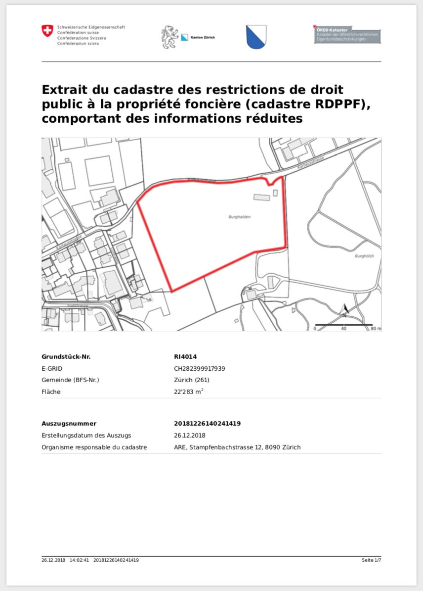
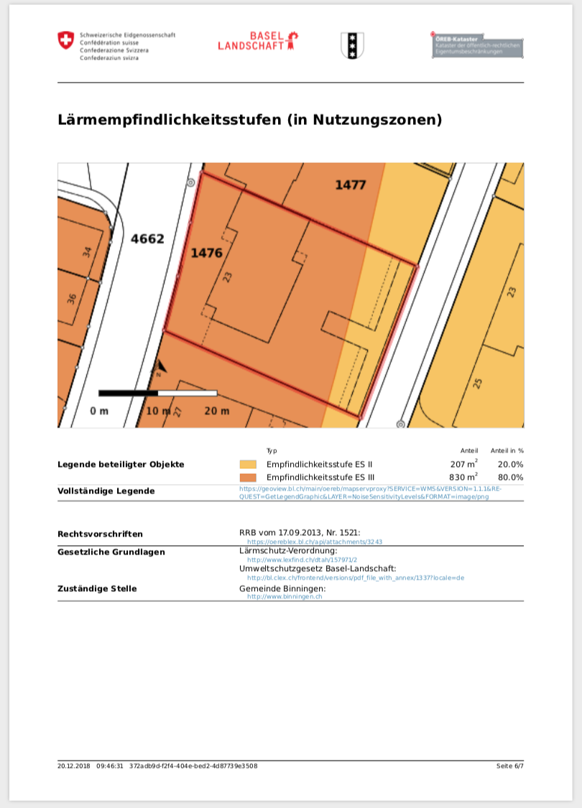

---
= XSLT / XSL-FO #2 - PDF4OEREB
Stefan Ziegler
2018-12-31
:thoth-type: post
:thoth-status: published
:thoth-tags: Java,XSLT,XSL-FO,XML,Apache,FOP,Saxon,OEREB
:idprefix:
---
Nun ist es doch passiert, ein paar Feierabende und die freien Tage um Weihnachten herum investiert und - voilà - der ÖREB-PDF-Auszug mit XSLT und XSL-FO: https://gitlab.com/sogis/pdf4oereb[https://gitlab.com/sogis/pdf4oereb]. Will oder muss man es bloss für die eigene katasterverantwortliche Stelle umsetzen, ist es relativ schnell getan. Soll es generischer werden, muss man sich auch um die zeitintensiveren Details kümmern.

Die Umwandlung einer XML-Datei in eine PDF-Datei mit XSLT und XSL-FO besteht immer aus zwei Schritten. Im ersten wird die XML-Datei (in unserem Fall die DATA-Extract-XML-Datei) mit einem sogenannten Stylesheet in eine XSL-FO-Datei transformiert. Dies geschieht mit XSLT und XPath. Die XSL-FO-Datei wird im zweiten Schritt in eine PDF-Datei umformatiert. Die Hauptaufgabe besteht also im Erstellen des Stylesheets mit dem die erste Transformation durchgeführt werden kann. Dazu muss man sich in XSLT und XPath reinkämpfen. 

Im Grossen und Ganzen ist das benötigte Stylesheet für das ÖREB-PDF keine Raketenwissenschaft. Trotzdem gelangt man an einen Punkt, wo es anscheinend mit purem XSLT nicht mehr weiter geht. Ein solches Beispiel sind die codierten URL in der XML-Datei: `http%3A%2F%2Fwww.binningen.ch`. Diese URL soll nicht so im PDF gerendert werden, sondern als `http://www.binningen.ch`. Man könnte sich mühsam eine eigene XSLT-Funktion im Stylesheet schreiben oder man weicht (mit https://www.saxonica.com/[Saxon]) auf sogenannte _extension functions_ aus. Dies sind Funktionen, welche man selber in Java implementiert und auf die man anschliessend in der XSLT-Transformation zurückgreifen kann. In unserem Beispiel ein URL-Decoder. Dazu muss ein http://www.saxonica.com/html/documentation/extensibility/integratedfunctions/ext-simple-J.html[Inferface implementiert] werden. In einer Bezahlversion von Saxon wäre dieses sehr einfache Beispiel noch einfacher umsetzbar. Denn hier bestünde die Möglichkeit direkt in XSLT auf einzelne Java-Methoden zurückzugreifen.

Neben dem Decodieren der URL, musste ich noch vier weitere Funktionen in Java schreiben:

1. https://xmlgraphics.apache.org/fop/[Apache FOP] bekundet anscheinend Mühe mit 8bit-PNG-Bildern. Jedenfalls wurden einige (nicht alle waren betroffen) Legendensymbole eines Kantons, der sie als 8bit-PNG ausliefert nicht im PDF gerendert. Eine `fixSymbol`-Funktion wandelt die 8bit-Bilder in 24bit-Bilder um. Diese verursachen keine Probleme mehr.
2. Die Bandierung des Grundstückes, der Nordpfeil und der Massstabsbalken werden in einem &laquo;Overlay-Image&raquo; für die spätere Verwendung (Punkt 3. und 4.) gerendert. Die Geometrie des Grunstückes und die Georeferenzierung des Kartenausschnittes müssen in diesem Fall im XML mitgeliefert werden.
3. Kartenausschnitt der Titelseite: Zusammenfügen des in Punkt 2 erstellten Overlay-Images und des Kartenausschnittes der Titelseite, der im XML mitgeliefert wird (`PlanForLandRegisterMainPage`).
4. Zusammenfügen der Kartenausschnitte der einzelnen ÖREB (`RestrictionOnLandownership`) und Überlagern des Planes für das Grundbuch  und des Overlay-Images.

Diese insgesamt fünf zusätzlichen Funktionen müssen dem XSLT-Transformer bekannt gemacht werden. D.h. sie müssen im CLASSPATH sein, damit Java sie findet und sie müssen beim XSLT-Transformer registriert werden. Das Registrieren kann über eine Config-Datei gemacht werden, was bei mir aber nur funktioniert hat, wenn sie ein https://www.saxonica.com/html/documentation/extensibility/integratedfunctions/ext-full-J.html[bestimmtes Interface] implementieren. Meine _extension functions_ implementieren jedoch das einfachere Interface. Aus diesem Grund können die Funktionen nicht mit dem Standalone-Tool von Saxon verwendet werden. Anhand der Dokumentation bin ich mir aber auch nicht sicher, ob das überhaupt mit der OpenSource-Edition funktionieren darf. Testeshalber hatte es das jedenfalls. Weil ich im Grunde sowieso eine Bibliothek schreiben will, welche die gesamte Umwandlung vornimmt, ist das Nicht-Funktionieren mit dem Standalone-Tool nicht weiter tragisch. Für den Notfall habe ich eine kleines Programm geschrieben, das genau das macht (XML->PDF). Eventuell erleichtert es die Entwicklung des Stylesheets, wenn man nichts mehr an den _extension functions_ rumschrauben muss.

Die Bilder, Logos und Symbole des XML-Auszuges können entweder eingebettet werden (als Base64-String) oder als WMS-GetMap-Request resp. URL referenziert werden. Die XSLT-Transformation versucht zuerst das eingebettete Bild zu finden, falls es nicht vorhanden ist, wird das referenzierte Bild verwendet. 

&laquo;Im Prinzip&raquo; unterstützt die Transformation bereits mehrere Sprachen. Eine XSLT-Transformation ist gut parametrisierbar. Die statischen Texte (z.B. der Titel des Dokumentes) werden in Übersetzungsdateien (auch XML) ausgelagert. Je nach Parameter wird die passende Übersetzungsdatei gewählt. Die dynamischen Inhalte sind bereits `MultilingualText`-Elemente. Falls im Auszug mehrere Sprachelemente mitgeliefert werden, muss die entsprechende Sprache ausgewählt werden. 

Herausfordernd war/ist die Gruppierung der einzelnen ÖREB (`RestrictionOnLandownership`). Damit ist gemeint, nach welchem Kriterium die ÖREB auf welche PDF-Seite kommen. Auf den ersten Blick ist alles klar. Es gibt 17 Themen, also maximal 17 PDF-Seiten (natürlich mehr, falls ein Thema aus Platzgründen auf zwei oder mehr Seiten gerendert werden muss). Die Weisung zum statischen Auszug lässt bereits - korrekterweise - Spielraum bei der Nutzungsplanung zu (wobei unnötig einschränkend). Dann könnte man auf die Idee kommen die Nutzungsplanung mit Subthemen abzubilden. Zwei meiner drei Beispiel-Kantone machen jedoch für die Nutzungplanung einzelne, eigene (Ober-)Themen. Ein Beispiel-Kanton macht es noch anders: Er verwendet zwar den `LandUsePlan`-Code aber unterschiedliche Texte dazu. Ob es hier ein richtig oder falsch gibt, weiss ich noch nicht. Wahrscheinlich mehrere richtig und hoffentlich einige falsch. Dass ein generisches Gruppieren inkl. gewünschter Sortierung in jedem Fall funktioniert, glaube ich in diesem Fall aber nicht mehr. Ziel für mich ist jedenfalls die Unterstützung von Subthemen, d.h. es wird zuerst nach Thema gruppiert und falls ein Thema noch zusätzliche Subthemen hat, wird nach diesen gruppiert.

Zwei Resultate der Umwandlung der XML-Datei in die PDF-Datei:

http://blog.sogeo.services/data/xsltxslfop2/CH282399917939_geometry_wms.xml[XML] / http://blog.sogeo.services/data/xsltxslfop2/CH282399917939_geometry_wms.pdf[PDF]

Gut zu sehen ist der französische Titel und ein weiteres französisches Attribut (&laquo;Organisme responsable du cadastre&raquo;). Für beide Texte habe ich als proof-of-concept https://gitlab.com/sogis/pdf4oereb/blob/master/library/src/main/resources/Resources.fr.resx[französische Übersetzungen] bereitgestellt.

http://blog.sogeo.services/data/xsltxslfop2/CH567107399166_geometry_images.xml[XML] / http://blog.sogeo.services/data/xsltxslfop2/CH567107399166_geometry_images.pdf[PDF]

Wie eingangs erwähnt, denke ich, dass mit XSLT und XSL-FO der PDF-Auszug einfach zu erstellen ist, wenn man nur auf sich selber schauen mussen. Ich habe Testdatensätze dreier Kantone verwendet und der scheinbare Spielraum mit dem man das XML abfüllen kann/darf, scheint gross zu sein. D.h. kein Kanton hat es gleich gemacht. Bei einigen Feststellungen dürfte es sich wohl auch um ordinäre Bugs handeln. Aber sicher bin ich mir eigentlich fast nie. Einige Beispiele:

- Kodierung von GML. Ohne es zu prüfen, scheint mir die unterschiedliche GML-Kodierung erlaubt zu sein. GML halt...
- Symbole haben nicht die korrekte Grösse und das korrekte Längen- und Breitenverhältnis.
- Die vom WMS gelieferten Bilder beinhalten bereits die Bandierung des Grundstückes und den Nordfpfeil und Massstabsbalken. Sollte meines Erachtens nicht so sein.
- In `OtherLegend` eines `RestrictionOnLandownership.Map`-Elementes tauchen die Symbole der betroffenen ÖREB auch wieder auf. Ist für mich nicht plausibel.
- `LegalProvisions` können sowohl direkt unter dem `RestrictionOnLandownership`-Element stehen oder als Verweis innerhalb eines `LegalProvisions`-Elementes. Das erscheint mir sinnvoll, wenn man innerhalb einer Rechtsvorschrift auf die gesetzliche Grundlage verweist.
- Fehlende `RestrictionOnLandownership`-Elemente, falls es vom gleichen Typ (z.B. &laquo;Freihaltezone&raquo;) mehrere Geometrien gibt. Oder falsche AreaShare-Werte.
- Doppelte `RestrictionOnLandownership`-Elemente im XML: Auf dem Grundstück gibt es dann z.B. 200% Grundnutzung.
- Falsch abgefüllte `Information`-Elemente im `RestrictionOnLandownership`-Element. Da gehört m.E. die Aussage rein, also &laquo;Wohnen W2&raquo; und nicht &laquo;Grundnutzung Gemeinde XY&raquo;
- `layerOpacity` von Kartenausschnitten ist 0. D.h. sie sind 100% transparent und werden nicht dargestellt (wenn man sich daran halten würde).
- Die `extensions`-Möglichkeit wird relativ häufig verwendet, sei es z.B. zum Speichern des `LengthShare`-Attributes oder zum Speichern der AreaUnit.

Man sieht: Fragen über Fragen. 

Mehr Informationen zum Entwicklen und Ausführen des Programmes (Standalone oder als Web Service) gibt es im https://gitlab.com/sogis/pdf4oereb/blob/master/README.md[README].