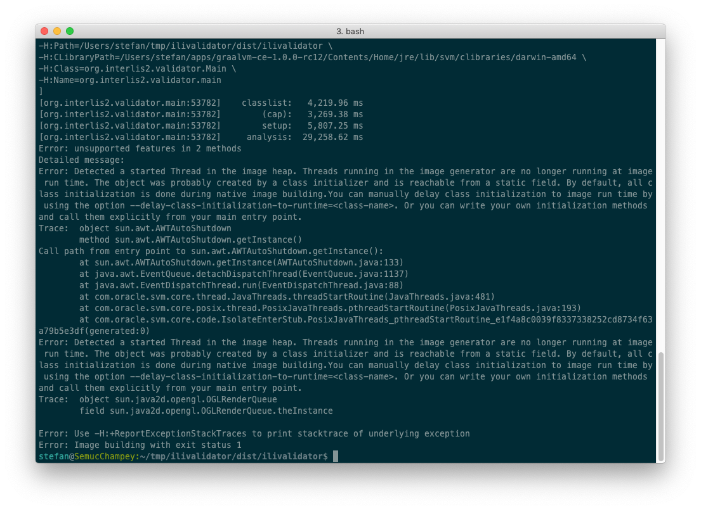
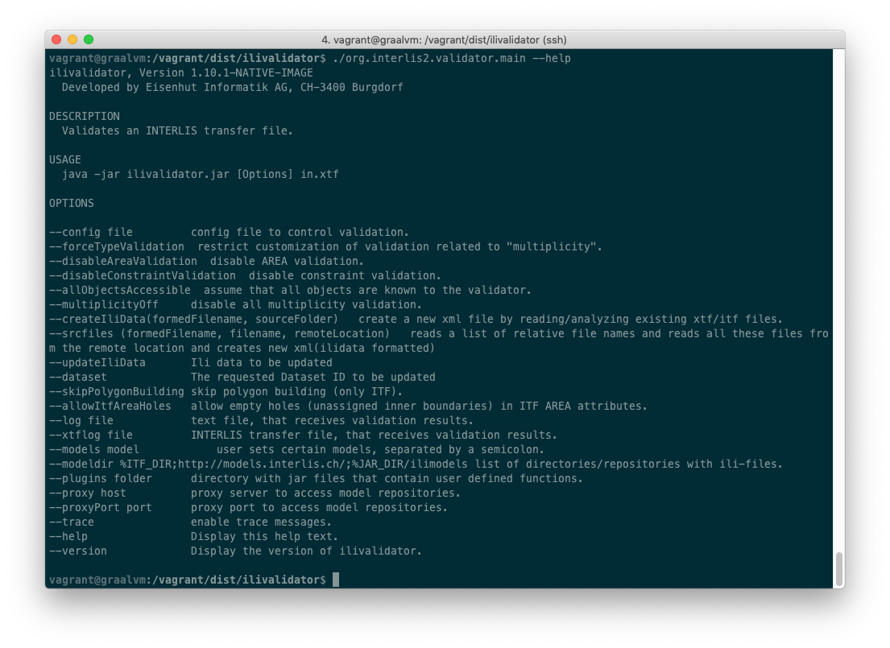
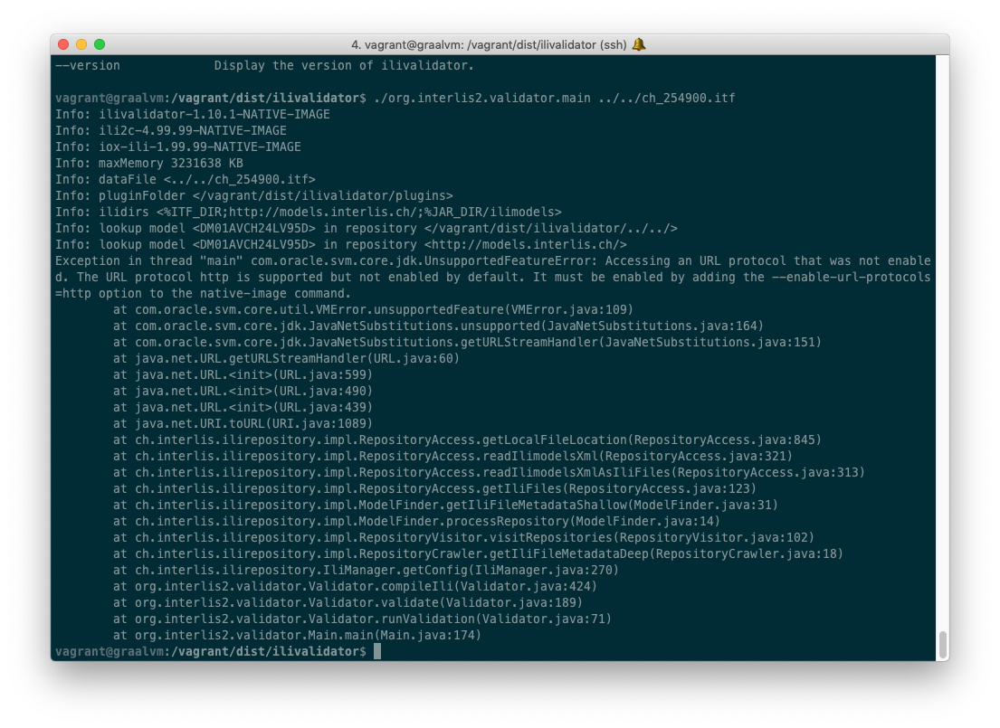
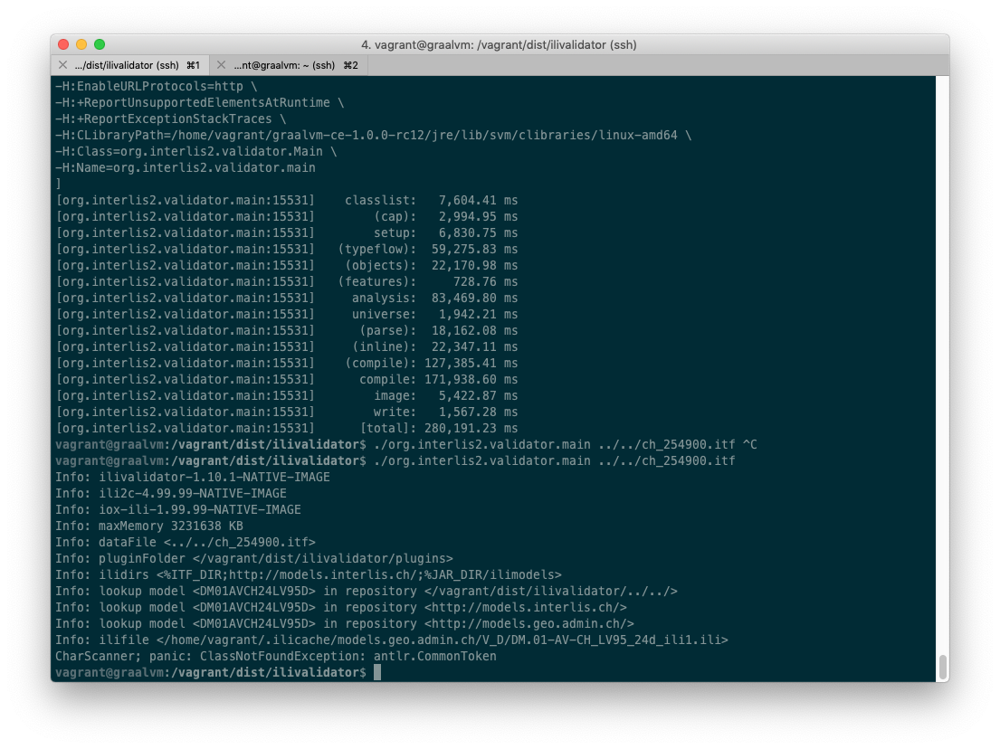
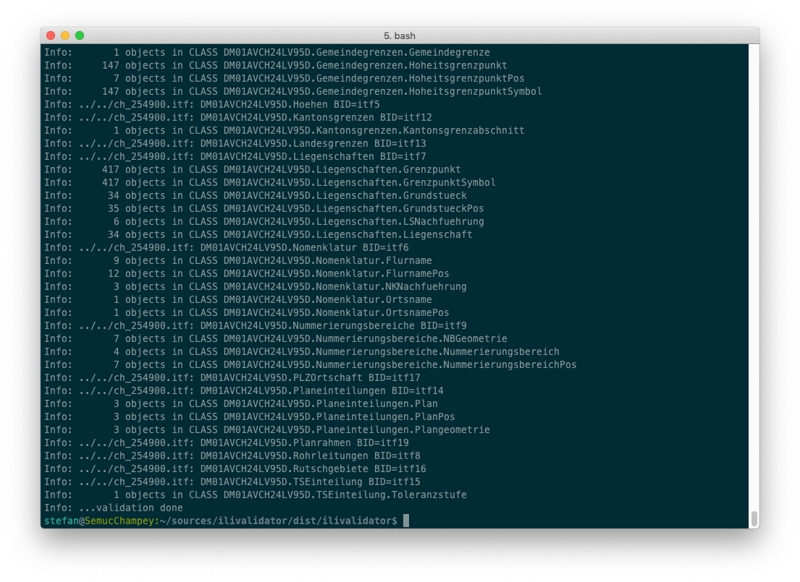

---
= GraalVM #1 - INTERLIS polyglot gemacht
Stefan Ziegler
2019-02-23
:thoth-type: post
:thoth-status: published
:thoth-tags: Graal,GraalVM,Java,INTERLIS,polyglot
:idprefix:
---
GraalVM? Was ist das? Eine &laquo;High-performance polyglot VM&raquo;. Fazit: Wirklich sowas wie der Heilige Gral. Oder gemäss https://www.graalvm.org/[Homepage]:

[, https://www.graalvm.org/]
""
GraalVM is a universal virtual machine for running applications written in JavaScript, Python, Ruby, R, JVM-based languages like Java, Scala, Kotlin, Clojure, and LLVM-based languages such as C and C++.

GraalVM removes the isolation between programming languages and enables interoperability in a shared runtime. It can run either standalone or in the context of OpenJDK, Node.js, Oracle Database, or MySQL.
""

Das erste Mal bin ich darübergestolpert als Oracle eine Open Source Community Version veröffentlicht hat und das sicher den üblichen Kanälen eine Nachricht wert war. Vor kurzem habe ich wieder was darüber gelesen, als ich was mit http://blog.sogeo.services/blog/2018/12/10/faas-1-interlis-webservice.html[_Project Fn_] machen wollte. Das Problem mit Java sind bei FaaS-Geschichten die &laquo;cold start times&raquo;. Das https://medium.com/criciumadev/serverless-native-java-functions-using-graalvm-and-fn-project-c9b10a4a4859[soll mit GraalVM] besser sein. Ein wenig rumgegoogelt und eine https://chrisseaton.com/truffleruby/tenthings/[höchst interessante Zusammenstellung] der Möglichkeiten von GraalVM gefunden. Ganz abgefahren wird es bei Punkt 8 &laquo;Java code as native library&raquo;.

Man kann mit _Graal_ Java-Code zu _native executables_ kompilieren. Damit wird eine JVM für die Ausführung des Programmes unnötig. Es funktioniert jedoch nicht nur mit kompletten Programmen, sondern auch mit Bibliotheken, die anschliessend z.B. in einem C-Pogramm als _shared libraries_ eingebunden werden können. Ganz so einfach oder perfekt wie man sich das jetzt vielleicht vorstellt, ist es natürlich nicht. Es gibt verschiedene https://github.com/oracle/graal/blob/master/substratevm/RESOURCES.md[Bedingungen] und https://github.com/oracle/graal/blob/master/substratevm/LIMITATIONS.md[Einschränkungen], die leider (noch) viel zu schnell auftreten.

So ein kleines Programm wie im verlinkten Blog geht natürlich problemlos. Funktioniert aber auch was grösseres wie z.B. https://github.com/claeis/ilivalidator[`ilivalidator`]?

Als erstes besorgt man sich GraalVM von https://github.com/oracle/graal/releases[Github]. Ich habe bei mir die Umgebungsvariable `GRAALVM_HOME` gesetzt, die auf das Verzeichnis `/Users/stefan/apps/graalvm-ce-1.0.0-rc12/Contents/Home` zeigt. Unter Linux kann das z.B. so ausssehen: `/home/vagrant/graalvm-ce-1.0.0-rc12`. Die `JAVA_HOME`-Umgebungsvariable zeigt ebenfalls auf dieses Verzeichnis. 

`java -version` liefert bei mir folgenden Output:

[source,groovy,linenums]
----
openjdk version "1.8.0_192"
OpenJDK Runtime Environment (build 1.8.0_192-20181024123616.buildslave.jdk8u-src-tar--b12)
GraalVM 1.0.0-rc12 (build 25.192-b12-jvmci-0.54, mixed mode)
----

Als nächstes wird der ilivalidator-Quellcode heruntergeladen und mit Gradle kompiliert: `gradle clean build bindist -x test`. Einige der Tests laufen bei mir nicht durch, darum das `-x`. `bindist` erstellt eine Zipdatei mit der ilivalidator.jar-Datei und den benötigten Bibliotheken (iox-ili, ili2c, ...). Am besten hängt man folgende Befehle zusammen, da die Zip-Datei sowieso immer ausgepackt werden muss:

[source,groovy,linenums]
----
gradle clean build bindist -x test && unzip dist/ilivalidator-1.10.1-SNAPSHOT.zip -d dist/ilivalidator
----

Mit dem Programm `$GRAALVM_HOME/bin/native-image` kann `ilivalidator` in eine _native executable_ kompiliert werden, die keine virtuelle Maschine mehr benötigt. So plusminus aus ein wenig Anleitung und Internet der erste Versuch:

[source,groovy,linenums]
----
$GRAALVM_HOME/bin/native-image --verbose --no-server -cp "libs/antlr-2.7.6.jar:libs/ehibasics-1.2.0.jar:libs/ili2c-core-4.7.10.jar:libs/ili2c-tool-4.7.10.jar:libs/iox-api-1.0.3.jar:libs/iox-ili-1.20.10.jar:libs/jts-core-1.14.0.jar:ilivalidator-1.10.1-SNAPSHOT.jar" org.interlis2.validator.Main
----

Läuft nicht durch. Es gibt Fehler bezüglich java2d- und awt-Klassen:

Hier entschied ich mich alles GUI-Zeugs aus `ilivalidator` zu entfernen. Gleichzeitig habe ich die Möglichkeit der `ilivalidator` Custom Functions entfernt, da - soweit ich es verstanden habe - zum Zeitpunkt des Kompilierens klar sein muss, welche Klassen verwendet werden. Das ist bei den Custom Functions nicht der Fall, da diese erst beim Starten von `ilivalidator` geladen/registriert werden. Also: Brutal viel gelöscht und auskommentiert.

Irgendeinmal war das Erstellen des Binaries erfolgreich. Das Resultat ist eine circa 20MB grosse ausführbare Datei `org.interlis2.validator.main`. Der anschliessende Versuch `ilivalidator` auszuführen, war leider nur halb erfolgreich, da das _native executable_ eine Ressource nicht finden konnte. Es handelte sich dabei um eine https://github.com/claeis/ilivalidator/blob/master/src/org/interlis2/validator/Version.properties[Versions-Properties-Datei]. Der Umgang mit https://github.com/oracle/graal/blob/master/substratevm/RESOURCES.md[Ressourcen] ist klar geregelt. Da bin ich wahrscheinlich falsch abgebogen: Ich dachte, es wäre einfacher das zu ignorieren und dass es einfacher wäre kurz mal den Quellcode anzupassen. Falsch, weil andere benötigte Bibliotheken (_iox-ili_, `ili2c`) ebenfalls eine solche Datei haben und diese zur Laufzeit ausgelesen werden und der Inhalt in die Konsole geschrieben wird. D.h. den Quellcode der weiteren Bibliotheken musste ich auch anpassen.

Trotzdem herrschte Freude, als `./org.interlis2.validator.main --help` funktionierte:

Der logische nächste Schritt ist das Prüfen einer INTERLIS-Transferdatei, was natürlich auch nicht auf Anhieb funktionierte:

Die Fehlermeldung ist klar und die Lösung auch: Man muss das HTTP- und HTTPS-Protokoll freischalten. Das passt, da `ilivalidator` die benötigten INTERLIS-Modelle in den Modellablagen suchen geht und daher via HTTP und HTTPS kommunizieren muss. https://github.com/oracle/graal/blob/master/substratevm/URL-PROTOCOLS.md[Mehr Informationen] zu diesem Thema findet sich ebenfalls im Github-Repo von _Graal_. 

Nächster Versuch, nächster Fehler:

`ClassNotFoundException`... Irgendeinmal versteht man auch mit Halbwissen immer wie mehr und/oder bekommt den richtigen Riecher für des Rätsels Lösung. Liest man sich durch die https://github.com/oracle/graal/blob/master/substratevm/LIMITATIONS.md[Limitations], bleibt man hoffentlich beim Kapitel https://github.com/oracle/graal/blob/master/substratevm/LIMITATIONS.md#reflection[&laquo;Reflection&raquo;] hängen. Meine `ClassNotFoundException` könnte (?) ja in diese Kategorie fallen. Die Lösung ist auch relativ einfach. Man muss dem `native-image`-Befehl (`-H:ReflectionConfigurationFiles=../../reflection.json`) in einer JSON-Datei mitteilen, welche Klassen mittels Reflection verwendet werden:

[source,json,linenums]
----
[
  {
    "name" : "antlr.CommonToken",
    "methods": [
      { "name": "<init>", "parameterTypes": [] }
    ]
  }
]
----

Es folgen noch weitere Fehlermeldungen bezüglich fehlenden Klassen. Diese habe allesamt in der JSON-Datei eingetragen. Der nächste Fehler war wieder eine nicht vorhandene Ressource. Da wurde es mir zu blöde und anstatt den Code anzupassen, habe ich einfach dem `native-image`-Befehl die Option gemäss Fehlermeldung (`-H:IncludeResourceBundles=...`) mitgeliefert.

Und voilà, die Validierung läuft durch:

Mein vollständiger Befehl lautet:

----
$GRAALVM_HOME/bin/native-image --verbose --enable-url-protocols=http,https -H:ReflectionConfigurationFiles=../../reflection.json -H:IncludeResourceBundles=ch.interlis.ili2c.metamodel.ErrorMessages --report-unsupported-elements-at-runtime --allow-incomplete-classpath -H:-UseServiceLoaderFeature --delay-class-initialization-to-runtime=com.sun.naming.internal.ResourceManager$AppletParameter -H:+ReportExceptionStackTraces --no-server -cp "libs/antlr-2.7.6.jar:libs/ehibasics-1.2.0.jar:libs/ili2c-core-4.7.10.jar:libs/ili2c-tool-4.7.10.jar:libs/iox-api-1.0.3.jar:libs/iox-ili-1.20.11-SNAPSHOT.jar:libs/jts-core-1.14.0.jar:ilivalidator-1.10.1-SNAPSHOT.jar" org.interlis2.validator.Main
----

Einen kleinen Haken hat die Sache noch:  Wenn `ilivalidator` zur Laufzeit wirklich via HTTPS kommunizieren muss, fliegt es mir um die Ohren, wegen einer nicht vorhandenen Bibliothek: `The sunec native library, required by the SunEC provider, could not be loaded`. Auch dazu gibt es bereits https://github.com/oracle/graal/blob/master/substratevm/JCA-SECURITY-SERVICES.md[Informationen] und einen aufschlussreichen https://github.com/oracle/graal/issues/951[Issue] auf Github. Ich habe es gleich gelöst wie der Reporter des Tickets, d.h. in der Datei `$GRAALVM_HOME/jre/lib/security/java.security` den SunEC-Provider auskommentiert. 

Links, die geholfen haben:

- https://chrisseaton.com/truffleruby/tenthings/
- https://picocli.info/picocli-on-graalvm.html
- https://royvanrijn.com/blog/2018/09/part-1-java-to-native-using-graalvm/
- https://royvanrijn.com/blog/2018/09/part-2-native-microservice-in-graalvm/
- https://medium.com/criciumadev/serverless-native-java-functions-using-graalvm-and-fn-project-c9b10a4a4859
- https://sites.google.com/a/athaydes.com/renato-athaydes/posts/a7mbnative-imagejavaappthatrunsin30msandusesonly4mbofram
- https://e.printstacktrace.blog/graalvm-groovy-grape-creating-native-image-of-standalone-script/

Ob `ilivalidator` das ideale Beispiel / der ideale Einsatzzweck für _native executables_ ist, weiss ich nicht. Performancemässig bringt es wohl gar nichts. Interessanter dürfte es vielleicht für das https://github.com/opengisch/QgisModelBaker[QGIS Model Baker]-Projekt sein. Da kann man sich vorstellen, dass der Umgang der _ili2pg/ili2gpkg_-Abhängigkeiten einfacher werden könnte. Oder man erstellt nicht die ganze Anwendung, sondern bloss eine _shared library_, damit die INTERLIS-Validierungsfunktionen von `ilivalidator` einfacher in anderen Programmiersprachen resp. Programmen eingebunden werden kann und die Validierungsfunktionen nicht mittels externen Java-Aufrufen erfolgen müssen.