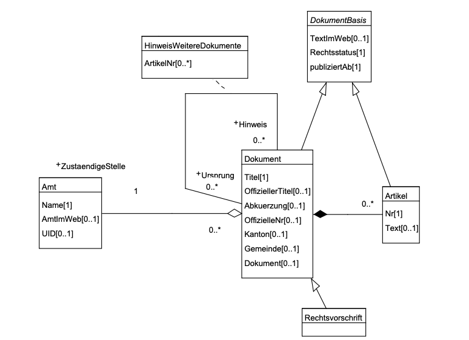

---
= INTERLIS leicht gemacht #20 - ilivalidator goodies
Stefan Ziegler
2019-09-23
:thoth-type: post
:thoth-status: published
:thoth-tags: INTERLIS,Java,ilivalidator
:idprefix:
---
Die Daten der Nutzungsplanung nehmen beim ÖREB-Kataster eine sehr wichtige Rolle ein. Das setzt eine hohe inhaltliche, aber auch strukturelle Qualität der digitalen Daten voraus. Die Daten werden in einem kantonalen http://geo.so.ch/models/ARP/SO_Nutzungsplanung_20171118.ili[Datenmodell] erfasst, das sowohl http://models.geo.admin.ch/ARE/Nutzungsplanung_V1_1.ili[MGDM] wie auch http://models.geo.admin.ch/V_D/OeREB/OeREBKRMtrsfr_V1_1.ili[ÖREB-Rahmenmodell] kompatibel ist. Die Daten werden durch externe Planungs- und Ingenieurbüros im Auftrag der Gemeinde erfasst. So weit, so gut.

Wo gearbeitet wird, passieren auch Fehler. Insbesondere schmerzen diese in der Weiterverarbeitung der Daten, wie jetzt bei der Integration in den ÖREB-Kataster. Damit diese möglichst frühzeitig entdeckt werden, drängt sich natürlich die maschinelle Prüfung mit https://github.com/claeis/ilivalidator[`ilivalidator`] auf. Das wird zwar von Beginn an gemacht, wie sich aber jetzt herausstellt, reicht die pure Modellprüfung nicht, damit eine robuste und transparente Weiterverarbeitung sichergestellt ist. Dank den Möglichkeiten von `ilivalidator` kann die Prüfung an notwendigen Stellen verschärft werden. Bei einigen Verschärfungen ist mir - Stand heute - schlichtweg nicht klar, warum man damals nicht das Modell bereits so modelliert hat...

**Multiplicity**

Das Boolean-Attribut `Rechtsvorschrift` in der Klasse `Dokument` ist _nicht_ mandatory. Für die Weiterverarbeitung müssen wir aber wissen, ob ein Dokument eine Rechtsvorschrift ist oder eben nicht. Um das Datenmodell nicht ändern zu müssen, kann man in einem https://github.com/edigonzales/ilivalidator-web-service-nplso/blob/master/src/main/resources/ili/SO_Nutzungsplanung_20171118_Validierung_20190129_UTF8.ili[&laquo;Valididierungsmodell&raquo;] einen zusätzlichen Constraint definieren. Dazu muss man eine View der Dokumentenklasse erstellen und in dieser View den Constraint definieren:

[source,xml,linenums]
----
CONTRACTED MODEL SO_Nutzungsplanung_20171118_Validierung_20190129 (de)
AT "http://www.geo.so.ch"
VERSION "2019-01-29"  =
  IMPORTS SO_Nutzungsplanung_20171118;
  
  VIEW TOPIC Rechtsvorschriften_Validierung = 
  DEPENDS ON SO_Nutzungsplanung_20171118.Rechtsvorschriften;
  
	VIEW v_Dokument
    	PROJECTION OF SO_Nutzungsplanung_20171118.Rechtsvorschriften.Dokument;
    =
        ALL OF Dokument;
        !!@ ilivalid.msg = "Attribut 'Rechtsvorschrift' muss definiert sein."
        MANDATORY CONSTRAINT DEFINED(Rechtsvorschrift);
    END v_Dokument;
    
  END Rechtsvorschriften_Validierung;

END SO_Nutzungsplanung_20171118_Validierung_20190129.
----

Das Validierungsmodell muss in der Config-Toml-Datei referenziert werden:

[source,xml,linenums]
----
["PARAMETER"]
additionalModels="SO_Nutzungsplanung_20171118_Validierung_20190129"
----

Der Programmaufruf ist wie folgt:

```
java -jar ilivalidator.jar --config myconfig.toml 2502.xtf
```


**Falsche Dokumentenlinks**

Dabei geht es nicht um falsche Links im INTERLIS-Sinn (das prüft `ilivalidator` von sich aus), sondern um Links, die nicht auf eine vorhandene HTTP-Ressource zeigen. Dazu macht man sich die Möglichkeit zu Nutze `ilivalidator` mit eigenen in Java geschriebenen Funktionen zu erweitern. Im Prinzip müsste die Funktion nur den Status Code eines `HEAD`-Befehls überprüfen. Das mit `HEAD` ist aber tricky, da der Befehl aufgrund von Firewalls resp. falsch konfigurierten Webservern nicht immer etwas sinnvolles oder richtiges zurückliefert. Daher muss man wohl oder übel trotzdem einen `GET`-Request absetzen. Bei mir sind jetzt alle Status Codes https://github.com/sogis/ilivalidator-extension-functions/blob/master/src/main/java/ch/so/agi/ilivalidator/ext/CheckHttpRessourceIoxPlugin.java[grösser 200 und kleiner 400] in Ordnung. Alles andere führt zu einem Fehler.

Die kompilierte Java-Klasse muss beim Aufruf `ilivalidator` bekannt gemacht werden indem man ein Plugins-Verzeichnis angibt (`--plugins /path/to/plugin/dir/`). Es reicht nicht, sie einfach im Classpath vorzuhalten. Dies ist vor allem dann nicht immer ideal, wenn man `ilivalidator` nicht bloss auf der Kommandozeile aufruft, sondern z.B. als Web Service.

Damit die Funktion in einem Constraint verwendet werden kann, muss sie vorgängig in einem Modell deklariert werden. Entweder macht man das im oben erwähnten Validierungsmodell oder man macht ein https://github.com/edigonzales/ilivalidator-web-service-nplso/blob/master/src/main/resources/ili/SO_FunctionsExt.ili[weiteres Modell], damit die Funktion mittels `IMPORTS` auch in weiteren Modellen verwendet werden kann.

Das Validierungsmodell muss dann zusätzlich zu `SO_Nutzungsplanung_20171118` auch das neue Modell importieren. Anschliessend kann der Constraint definiert werden:

[source,xml,linenums]
----
!!@ ilivalid.msg = "Dokument 'https://geo.so.ch/docs/ch.so.arp.zonenplaene/Zonenplaene_pdf/{TextImWeb}' wurde nicht gefunden."
MANDATORY CONSTRAINT SO_FunctionsExt.checkHttpRessource(TextImWeb, "https://geo.so.ch/docs/ch.so.arp.zonenplaene/Zonenplaene_pdf/");
----


**Falsch verknüpfte Dokumente in HinweisWeitereDokumente**

Zusätzlich zu den Rechtsvorschriften _müssen_ die gesetzlichen Grundlagen und _können_ weitere Informationen und Hinweise im ÖREB-Kataster erfasst werden. Entsprechend wurde das Rahmenmodell modelliert:



[source,xml,linenums]
----
ASSOCIATION HinweisWeitereDokumente =
    Ursprung -- {0..*} Dokument;
    Hinweis (EXTERNAL) -- {0..*} Dokument;
    /** Hinweis auf spezifische Artikel.
    */
    ArtikelNr : BAG {0..*} OF OeREBKRM_V1_1.ArtikelNummer_;
END HinweisWeitereDokumente;
----

Das sieht auf den ersten Blick relativ harmlos aus. Zur Nemesis wird es aber beim Prozessieren in einer Datenbank. Abgebildet wird die Assoziation klassisch in einer Cross-Reference-Table. Theoretisch kann diese Spirale unendlich sein. D.h. um alle Dokumente zu einem ÖREB zu erhalten, muss die https://www.postgresql.org/docs/11/queries-with.html[SQL-Query rekursiv] sein. Rekursion bedeutet aber immer auch: &laquo;Kann gnadenlos in die Hosen gehen.&raquo; Nämlich dann, wenn kein geeignetes Abbruchkriterium definiert wurde. Das lernt man auf die schmerzhafte Weise: Zum Beispiel dann, wenn der DB-Server nur noch abgeschossen werden kann. Mit blindlings in guten Treu und Glaube die Query rattern lassen, ist somit nicht. 

Es gibt verschiedene Hebel:

- Die Query so schreiben, dass nur bis zu einer Tiefe von z.B. zehn Iterationen Dokumente gesucht werden. Viel mehr ist wohl kaum sinnvoll und auch kaum so erfasst.
- Auf Datenbankseite die Executiontime einschränken oder die Grösse der Logfiles beschränken.
- Die Daten vor dem Import in die Datenbank sauber prüfen, weil hier die Ursache der Probleme liegt.

Der erste aufgetretene Problemfall war, dass ein Dokument A auf sich selber zeigt. Das kann man mit einem `MANDATORY CONSTRAINT` in der Assoziation prüfen. Kniffliger wurden folgende Fälle: Dokument A &rarr; Dokument B &rarr; Dokument C &rarr; Dokument A. Dass ich eine eigene Java-Funktion schreiben musste, war mir schnell klar. Der erste Gedanken war zudem auch: kleine Sache. Überlegt man sich das aber ein wenig, merkt man schnell, dass so einfach die Sache nicht ist. Der dritte Gedanken war dann: Das Problem hat sicher schon jemand anderes gelöst und in letzter Konsequenz ist diese ganze Verschachtelung/Verknüpfung bloss ein Graph. Der Graph ist gerichtet und es dürfen https://jgrapht.org/guide/UserOverview#graph-structures[keine Self-Loops und Kanten dürfen nicht mehrfach vorkommen]. Bibliotheken dazu gibt es mehr als genug. Ich habe mich für https://jgrapht.org[_jgrapht_] entschieden. Die ganze herausfordernde Arbeit - zu prüfen, https://github.com/sogis/ilivalidator-extension-functions/blob/master/src/main/java/ch/so/agi/ilivalidator/ext/oereb/LinkGraphCache.java[ob falsche Verknüpfungen vorliegen] - nimmt mir die Bibliothek ab und ich muss mich nur noch um das https://github.com/sogis/ilivalidator-extension-functions/blob/master/src/main/java/ch/so/agi/ilivalidator/ext/oereb/DocumentsCycleCheckIoxPlugin.java[Integrieren] in die `ilivalidator`-Welt bemühen.

Hier wird die Integration der Zusatzfunktion für den Betrieb noch ein wenig komplizierter, da wir eine Drittbibliothek verwenden müssen. Für den Aufruf auf der Konsole ist es - soweit ich mich erinnere - noch mühsamer. Ilivalidator findet auf Anhieb die Drittbibliothek nicht und mann muss den Befehl http://blog.sogeo.services/blog/2017/02/13/interlis-leicht-gemacht-number-14.html[anders formulieren]. Wenn man die Zusatzfunktion in einem Web Service einsetzen will, ist es wieder einfacher, da man sowieso ein Buildtool verwendet, das sich um die Abhängigkeiten kümmert.

Nichtsdestotrotz muss sinnvollerweise zusätzlich auch an den ersten beiden Hebeln angesetzt werden.

**Typen müssen zwingend mit einem Dokument verknüpft sein**

Im kantonalen Nutzungsplanungsmodell ist die Assoziation zwischen den Typen (= Eigentumsbeschränkungen) und den Dokumenten sehr lasch. Ein Typ kann keines oder mehrere Dokumente haben und ein Dokument kann keinem oder mehreren Typen zugeordnet sein. Im ÖREB-Kataster muss jede Eigentumsbeschränkung mindestens ein Dokument haben. D.h. wir müssen für verschiedene Typen zwingend prüfen, ob sie mit einem Dokument verknüpft sind.

Der erste Teil geht sehr elegant:

[source,xml,linenums]
----
CONSTRAINTS OF Typ_Grundnutzung = 
    !!@ ilivalid.msg = "Typ '{Typ_Kt}' (Typ_Grundnutzung) ist mit keinem Dokument verknüpft."
    MANDATORY CONSTRAINT INTERLIS.objectCount(Dokument)>=1 
END;
----

Dieser Constraint muss im Modell _nach_ der Assoziation stehen. Er prüft ob die Summe der verknüpften Dokumente zu einem Objekt `Typ_Grundnutzung` grösser gleich 1 ist. Das gilt bei uns nicht für alle Typen der Grundnutzung, sondern nur für ein Subset. Ob es kürzer und schöner geht, weiss ich nicht. Bei mir sieht das Filtering der Typen so aus:

[source,xml,linenums]
----
CONSTRAINTS OF Typ_Grundnutzung = 
    !!@ ilivalid.msg = "Typ '{Typ_Kt}' (Typ_Grundnutzung) ist mit keinem Dokument verknüpft."
    MANDATORY CONSTRAINT 
        (
            INTERLIS.objectCount(Dokument)>=1 
            AND 
            (
                Typ_Kt == #N110_Wohnzone_1_G
                OR
                Typ_Kt == #N111_Wohnzone_2_G
                OR
                .... viele mehr
            )
        ) 
        OR 
        (
            Typ_Kt == #N180_Verkehrszone_Strasse
            OR
            Typ_Kt == #N181_Verkehrszone_Bahnareal
            OR
            ... viele mehr
        ); 
END;
----


**Subset von verknüpften Objekten bilden eine AREA**

Die Objekte der Lärmempfindlichkeitstufen werden im kantonalen Modell bei den überlagernden Flächen der Nutzungsplanung erfasst. Die Geometrien der Lärmempfindlichkeitsstufen alleine betrachtet, müssen eine AREA bilden, d.h. sie dürfen sich nicht überlappen. Da die Geometrien und die Typen aber in zwei verschiedenen Klassen verwaltet werden, muss ähnlich vorgegangen werden wie beim vorangegangenen Beispiel, nur dass dieses Mal ein `SET CONSTRAINT` verwendet werden muss:

[source,xml,linenums]
----
CONSTRAINTS OF Ueberlagernd_Flaeche = 
    !!@ name = laermempfindlichkeitsAreaCheck
    !! !!@ ilivalid.msg = "Lärmempfindlichkeitstypen überlappen sich."
    SET CONSTRAINT 
        WHERE 
        (
            Typ_Ueberlagernd_Flaeche->Typ_Kt==#N680_Empfindlichkeitsstufe_I 
            OR 
            Typ_Ueberlagernd_Flaeche->Typ_Kt==#N681_Empfindlichkeitsstufe_II				
            OR 
            Typ_Ueberlagernd_Flaeche->Typ_Kt==#N682_Empfindlichkeitsstufe_II_aufgestuft				
            OR 
            Typ_Ueberlagernd_Flaeche->Typ_Kt==#N683_Empfindlichkeitsstufe_III
            OR 
            Typ_Ueberlagernd_Flaeche->Typ_Kt==#N684_Empfindlichkeitsstufe_III_aufgestuft			
            OR 
            Typ_Ueberlagernd_Flaeche->Typ_Kt==#N685_Empfindlichkeitsstufe_IV				
            OR 
            Typ_Ueberlagernd_Flaeche->Typ_Kt==#N686_keine_Empfindlichkeitsstufe								
        ) : INTERLIS.areAreas(ALL, UNDEFINED, >> Geometrie);
END;       
----

**Bugs**

Es sind bei der Erarbeitung dieser zusätzlichen aber notwendigen Validierungen einige Bugs in `ilivalidator` entdeckt worden:

- https://github.com/claeis/ilivalidator/issues/180
- https://github.com/claeis/ilivalidator/issues/196
- https://github.com/claeis/ilivalidator/issues/203
- https://github.com/claeis/ilivalidator/issues/204
- https://github.com/claeis/ilivalidator/issues/205

Für die meisten konnte ich einen, teilweise sehr unschönen, Workaround finden. Aber das Bugfixing müssen wir zügig angehen.
