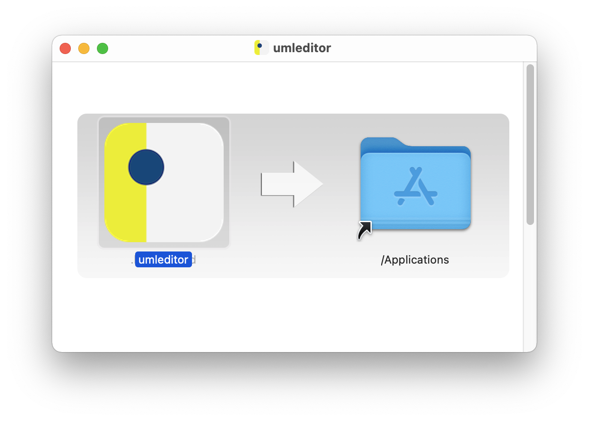

---
= INTERLIS leicht gemacht #23 - Paketierte ilitools
Stefan Ziegler
2021-07-21
:thoth-type: post
:thoth-status: published
:thoth-tags: INTERLIS,Java,ili2db,ilivalidator,ili2gpkg,uml-editor,jlink,jdeps,jpackage
:idprefix:
---
Etwas nervte mich seit langem an http://www.umleditor.org/[_INTERLIS-UML-Editor_] auf macOS: Eine Java-Anwendung kann man nicht einfach ins Dock ziehen und gut ist. 

Früher gab es für JavaFX das Tool _javapackager_, das JavaFX-Anwendungen und alle anderen Java-Anwendungen betriebssystemabhängig zu einem Paket inkl. Java-Runtime schnürt. Dieses konnte dann wie jede andere Anwendung auf Linux, Windows oder macOS installiert werden. Praktisch war auch, dass man sich nicht um eine Java-Installation zu kümmern brauchte, weil die Runtime eben mitgeliefert wurde. Leider flog das Tool mit JavaFX aus dem JDK.

Ein paar Jahre (Java 16) später taucht es unter dem Namen https://openjdk.java.net/jeps/392[_jpackage_] in einer sehr ähnlichen Form wieder auf. Einige Features sind nicht mehr vorhanden, so z.B. JavaFX-spezifische Features. Das Wichtigste ist aber immer noch möglich: betriebssystemabhängige Installationspakete für Java-Anwendungen inkl. Runtime erstellen.

Im einfachsten Fall sieht ein Befehl so aus:

[source,xml,linenums]
----
jpackage --icon icon-umleditor-128x128.icns --name umleditor --type dmg --input libs --main-jar umleditor-3.7.6.jar --app-version 3.7.6 -d output 
----

- --icon: Das Icon für die Anwendung. Dateiformat ist leider je nach Betriebssystem unterschiedlich.
- --name: Name der Anwendung
- --type: `dmg` und `pkg` für macOS, `deb` und `rpm` für Linux, `exe` und `msi` für Windows. &laquo;Cross-Herstellung&raquo; - also rpm-Pakete auf Windows herstellen, geht nicht.
- --input: Das Verzeichnis mit den Jar-Dateien.
- --main-jar: Die Jar-Datei mit der Main-Klasse
- --app-version: Versionsnummer
- -d: Das Verzeichnis, wo das Paket gespeichert wird.

Der Befehl liefert mir im Verzeichnis `output` die Datei `ilivalidator-1.11.10.dmg`. Diese .dmg-Datei kann ich jetzt wie gewohnt ausführen und die Anwendung installieren:

Mit ein wenig Zusatzeffort kann man das Ganze hinsichtlich der Grösse optimieren. Standardmässig wird einfach die gesamte Java-Runtime reinkopiert. Bei mir ergibt das eine 56MB grosse DMG-Datei. Man kann mit _jlink_ selber eine Java-Runtime herstellen. Damit diese kleiner wird, muss man die von der Anwendung (also vom INTERLIS-UML-Editor) benötigten Module als Parameter angeben. Dieses Information liefert mir _jdeps_. Und hier wird es ein wenig hakelig, vor allem bei nicht-modularen Java-Anwendungen:

[source,xml,linenums]
----
jdeps --class-path 'libs/*' --multi-release base -recursive --ignore-missing-deps --print-module-deps umleditor-3.7.6.jar
----

liefert mir: `java.base,java.desktop,java.management,java.sql`. Mit dieser Information erzeuge ich mit _jlink_ meine spezifische Java-Runtime:

[source,xml,linenums]
----
 jlink --add-modules java.base,java.desktop,java.management,java.sql --output umleditor-jre
----

Der jpackage-Befehl wird um den Parameter `--runtime-image umleditor-jre` erweitert. Das Paket ist nun nur noch 40MB gross.

Weil dank https://www.geowerkstatt.ch/[Geowerkstatt] https://github.com/claeis/ilivalidator/pull/315[momentan] https://github.com/claeis/ilivalidator/pull/313[richtig] https://github.com/claeis/ilivalidator/pull/312[Schwung] in der GUI-Programmierung von `ilivalidator` ist, habe ich für die Anwendungen `ilivalidator`, `ili2gpkg`, `ili2c` und _INTERLIS-UML-Editor_ solche Pakete für Ubuntu, Windows und macOS erstellt: https://ilitools.sogeo.services[ilitools.sogeo.services].

Die Pakete werden mit einer https://github.com/edigonzales/ilitools-packager[Github Action] erstellt. Dabei musste ich feststellen, dass die DMG-Dateien bei mir nicht funktionieren. Aus diesem Grund bin ich auf PKG umgeschwenkt. MacOS bemängelt natürlich immer noch, dass die Pakete nicht signiert sind. Dies wäre technich aber möglich. Die anderen beiden Varianten konnte ich mangels fehlendem Betriebssystem nicht testen.

Den beiden Anwendungen `ilivalidator` und `ili2gpkg` habe ich mit `--java-option -Xmx2G` zwei Gigabyte Heap zugewiesen. Es gäbe noch einige weitere spannende Optionen, die man ausprobieren könnte. So sind verschiedene Launcher möglich, was aber bei mir nicht wirklich funktioniert hat. Eventuell können diese Launcher dazu verwendet werden, die Anwendung mit einem GUI zu starten oder in der Konsole. Eine gute Übersicht mit Erläuterung der Möglichkeiten gibt es https://docs.oracle.com/en/java/javase/14/jpackage/image-and-runtime-modifications.html[hier].
