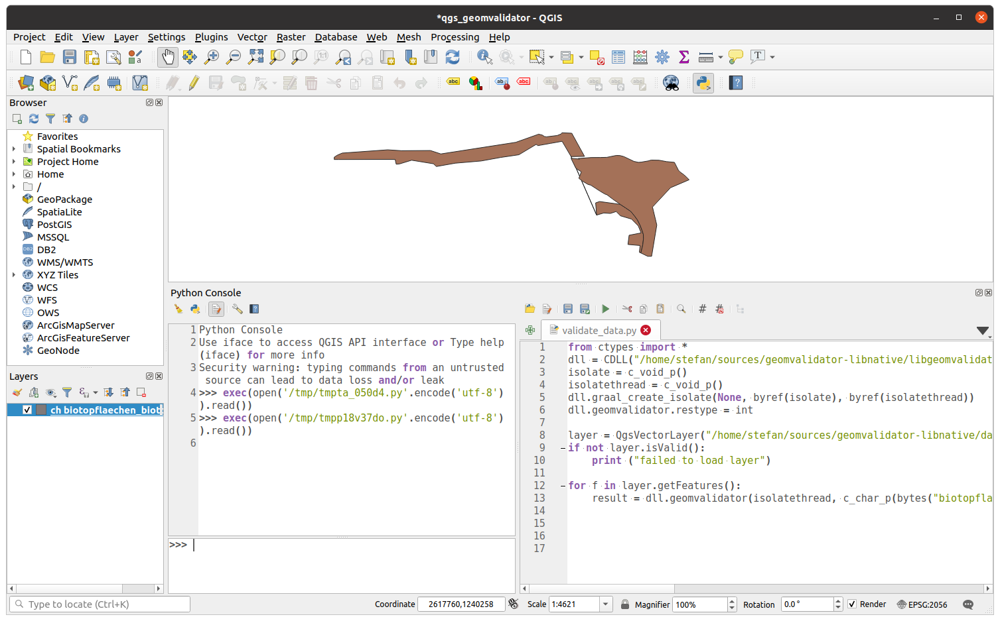
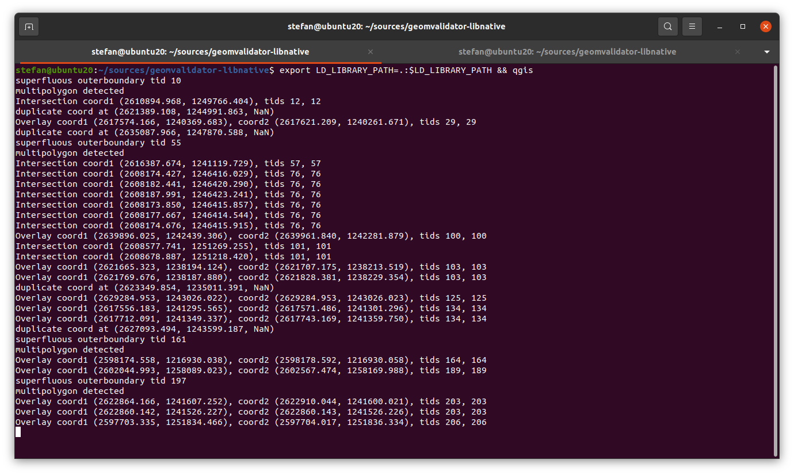
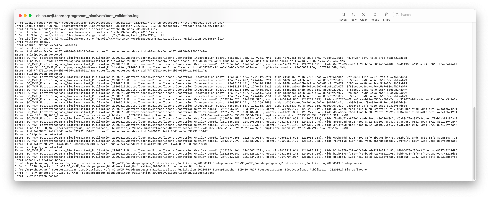

---
= INTERLIS leicht gemacht #24 - Ilivalidator in/mit QGIS
Stefan Ziegler
2021-10-12
:thoth-type: post
:thoth-status: published
:thoth-tags: INTERLIS,Java,ilivalidator,Graal,GraalVM,QGIS
:idprefix:
---
Wer kennt es nicht? Daten in QGIS nachgeführt, mit https://github.com/claeis/ili2pg[`ili2pg`] exportiert und https://github.com/claeis/ilivalidator[`ilivalidator`] meldet Fehler:

[source,xml,linenums]
----
Error: SO_AWJF_Foerderprogramm_Biodiversitaet_Publikation_20200519.Biotopflaechen.Biotopflaeche.Geometrie: Intersection coord1 (2610894.968, 1249766.404), tids 4b76926f-cef2-4b9e-8750-f3aef21385eb, 4b76926f-cef2-4b9e-8750-f3aef21385eb
Error: line 22: SO_AWJF_Foerderprogramm_Biodiversitaet_Publikation_20200519.Biotopflaechen.Biotopflaeche: tid dc58062e-4251-433b-b124-835356dc873e: duplicate coord at (2621389.108, 1244991.863, NaN)
Error: SO_AWJF_Foerderprogramm_Biodiversitaet_Publikation_20200519.Biotopflaechen.Biotopflaeche.Geometrie: Overlay coord1 (2617574.166, 1240369.683), coord2 (2617621.209, 1240261.671), tids 8ed21983-6692-4f99-b306-f084a364440f, 8ed21983-6692-4f99-b306-f084a364440f
Error: line 36: SO_AWJF_Foerderprogramm_Biodiversitaet_Publikation_20200519.Biotopflaechen.Biotopflaeche: tid 01857f02-9fca-4e18-83af-f97de8744ecd: duplicate coord at (2635087.966, 1247870.588, NaN)
----

Entweder wieder doppelte Vertexpunkte (`duplicate coords`) oder minimalste Überlappungen (`Intersection`, `Overlay`) werden schonungslos aufgedeckt. Es gibt in https://qgis.org[QGIS] verschiedene Mittel, damit diese Fehler schon gar nicht gemacht werden können und auch Werkzeuge, die solche Fehler nachträglich aufdecken. Warum aber nicht den Prüfalgorithmus von `ilivalidator` näher zu QGIS bringen? Damit ist sichergestellt, dass die Geometrien nach einem Export auch tatsächlich valide INTERLIS-Geometrien sind.

Aber wie soll das gehen? Ilivalidator ist in Java geschrieben und QGIS will entweder C++ oder Python. Des Rätsels Lösung habe ich http://blog.sogeo.services/blog/2021/02/02/interlis-leicht-gemacht-number-22.html[hier] (im unteren Teil) beschrieben. Ich will für diese zusätzliche Geometrieprüfung in QGIS keine Java-Runtime installiert haben, sondern im Idealfall maximal nur ein Python-Plugin herunterladen und gut ist. Mit https://www.graalvm.org/[GraalVM] können einzelne https://www.graalvm.org/reference-manual/native-image/ImplementingNativeMethodsInJavaWithSVM/[Java-Methoden zu shared libraries] (*.so, *.dylib, *.dll) kompiliert werden. Diese wiederum können relativ einfach in Python verwendet werden.

Die Java-Methode, welche Geometrien nach INTERLIS-Spezifikation validiert, gibt es hier in einem https://github.com/edigonzales/geomvalidator-libnative[Github-Repo]. Es ist im Prinzip sehr viel Copy/Paste aus der https://github.com/claeis/iox-ili[iox-ili-Bibliothek], welche die eigentliche INTERLIS-Validierung für `ilivalidator` durchführt. Copy/Paste darum, weil die Geometrievalidierungs-Methoden nicht zum öffentlichen API gehören und auch weil für den vorliegenden Anwendungsfall Informationen fehlen, welche die Originalmethoden benötigen, z.B. den Wert für erlaubte Overlaps. Dieser steckt im Datenmodell, welches mir beim Datenerfassen in QGIS nicht zur Verfügung steht. Auch fehlt mir die Auflösung der Geometrien. In der Regel ist das bei uns ein Millimeter. Darum werden diese Werte resp. daraus abgeleitet Werte in meiner Copy/Paste-Methode hardcodiert.

Ein grosser Teil der Magie der Geometrievalidierung von z.B. Flächengeometrien (im Sinne der Surfacetopologie) steckt in der Methode https://github.com/claeis/iox-ili/blob/master/src/main/java/ch/interlis/iom_j/itf/impl/ItfSurfaceLinetable2Polygon.java#L263[`validatePolygon`] (ff.) der Klasse `ItfSurfaceLinetable2Polygon`.

Unter Linux lässt sich die Copy/Paste-Java-Methode dann wie folgt zu einer shared library kompilieren:

```
./gradlew clean lib:build shadowJar && \
native-image --no-fallback --no-server -cp lib/build/libs/lib-all.jar --shared -H:Name=libgeomvalidator 
```

Unter Ubuntu 20.04 musste ich noch ein paar Pakete installieren:

```
sudo apt-get install build-essential
sudo apt install libstdc++-8-dev
sudo apt-get install zlib1g-dev 
```

Wobei das letzte Paket nur unter Ubuntu 20.04 auf einem Apple Silicon Rechner (also einem ARM-Prozessor) notwendig war. Ubuntu (die ARM-Variante) läuft hier als virtuelle Maschine in https://mac.getutm.app/[UTM] inkl. QGIS ganz passabel.

Der `native-image`-Befehl erzeugt aus der Jar-Datei die verschiedenen Header-Dateien und die shared library (*.so-Datei). Mit einem Dummy-C-Programm prüfe ich, ob das ganze auch funktioniert:

[source,c,linenums]
----
#include <stdlib.h>
#include <stdio.h>

#include <libgeomvalidator.h>

int main(int argc, char **argv) {
    graal_isolate_t *isolate = NULL;
    graal_isolatethread_t *thread = NULL;

    if (graal_create_isolate(NULL, &isolate, &thread) != 0) {
        fprintf(stderr, "graal_create_isolate error\n");
        return 1;
    }

    char * layername = "my_layer_name";
    char * fid = "afid";
    char * wktGeom = "POLYGON ((2609000 1236700, 2609200 1236700, 2609200 1236700, 2609200 1236600, 2609000 1236600, 2609000 1236700))";
    printf("%d\n", geomvalidator(thread, layername, fid, wktGeom));

    if (graal_detach_thread(thread) != 0) {
        fprintf(stderr, "graal_detach_thread error\n");
        return 1;
    }

    return 0;
}
----

Als Parameter werden neben der Geometrie (im WKT-Format), der Layername und eine Feature-Id der Methode übergeben. Dies entspricht beinahe der Signatur der Originalmethode von `ilivalidator`: Die Feature-Id entspricht der TID, der Layername dem qualifizierten Attributnamen. Was in diesem Kontext nicht unerwähnt bleiben darf, ist die Tatsache, dass als Übergabe- und Rückgabeparameter nur Nicht-Objekttypen verwendet werden können. Abhilfe schafft oftmals die Serialisierung in ein geeignetes Format (z.B. JSON).

Das C-Programm lässt sich kompilieren und ausführen:

```
cc  geomvalidator.c -I. -L. -lgeomvalidator -o geomvalidator
export LD_LIBRARY_PATH=.:$LD_LIBRARY_PATH && ./geomvalidator
```

Output in der Konsole entspricht dem zu erwarteten Ergebnis (siehe WKT-String im C-Programm):
```
duplicate coord at (2609200.0, 1236700.0, NaN)
```

Nun können wir einen Schritt weitergehen und versuchen sämtliche Geometrien eines Layers in QGIS mit dem ilivalidator-Algorithmus zu prüfen. Dazu schreiben wir kein Plugin, sondern als Proof-of-Concept reicht die Python-Konsole:



Das Skript `validate_data.py`, welches die Validierung macht, ist relativ simpel:

[source,python,linenums]
----
from ctypes import *
dll = CDLL("/home/stefan/sources/geomvalidator-libnative/libgeomvalidator.so")
isolate = c_void_p()
isolatethread = c_void_p()
dll.graal_create_isolate(None, byref(isolate), byref(isolatethread))
dll.geomvalidator.restype = int

layer = QgsVectorLayer("/home/stefan/sources/geomvalidator-libnative/data/ch.so.awjf.foerderprogramm_biodiversitaet.gpkg|layername=biotopflaechen_biotopflaeche", "biotopflaechen_biotopflaeche", "ogr")
if not layer.isValid():
    print ("failed to load layer")
    
for f in layer.getFeatures():
    result = dll.geomvalidator(isolatethread, c_char_p(bytes("biotopflaechen_biotopflaeche", "utf8")), c_char_p(bytes(str(f.id()), "utf8")), c_char_p(bytes(f.geometry().asWkt(), "utf8")))
----

Die Zeilen 1 bis 6 dienen dazu die shared library als Python-Binding verfügbar zu machen. Es gibt dazu verschiedene https://realpython.com/python-bindings-overview/[Varianten]. Ich habe mich für die https://realpython.com/python-bindings-overview/#ctypes[ctypes-Variante] entschieden. Ist zwar ziemlich low-level, aber von Vorteil ist für mich vor allem, dass bereits alles in einer Python-Standard-Installation dabei ist.

Zeile 8 importiert die Tabelle einer Geopackage-Datei als QGIS-Vektorlayer. Die Validierung der Geometrien geschieht in der Schleife über sämtliche Geometrien des Layers in den Zeilen 12 - 13. Das erstmalige Ausführen war ernüchternd: Nichts passierte. Aber die Post ging nicht in der Python-Konsole in QGIS ab, sondern im Terminal aus dem QGIS gestartet wurde:



Die shared library loggt nach stderr. Trotzdem hätte ich eigentlich erwartet, dass man den Output in der Python-Konsole sieht. Aber wahrscheinlich ist das Verhalten logisch und ich verstehe es nur nicht. Vergleicht man den Output der Prüfung des QGIS-Layers mittels shared library mit dem ilivalidator-Logfile, kann man mit sich und der Welt zufrieden sein:



Das Ganze ist natürlich bloss eine Spielerei aber zeigt es doch die Fähigkeiten und Möglichkeiten von GraalVM und dass Java sehr flexibel eingesetzt werden kann.