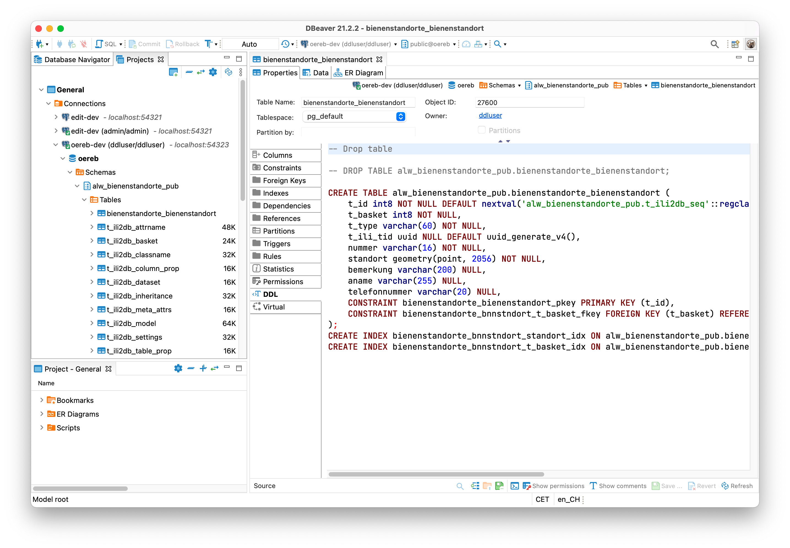

---
= INTERLIS leicht gemacht #25 - Geschützte Attribute
Stefan Ziegler
2021-10-25
:thoth-type: post
:thoth-status: published
:thoth-tags: INTERLIS,Java,ili2db,ili2pg
:idprefix:
---
Im Kanton Solothurn können Geodaten seit circa 15 Jahren frei bezogen und genutzt werden. Es gibt jedoch einige sensible Informationen, die man nicht jedermann zugänglich machen kann. Oftmals sind es personenbezogene Daten wie z.B. eine Telefonnummer des Imkers. Wie gehen wir damit um?  

Für die Publikation der Daten als WMS-Layer (resp. als Kartenlayer im Web GIS Client) lösen wir es applikatorisch. D.h. der Layer wird zweimal als WMS-Layer publiziert. Einmal als öffentlicher Layer ohne die nicht-öffentlichen Attribute und einmal als passwortgeschützter Layer mit den nicht-öffentlichen Attributen. Eine weitere Variante ist das Erstellen einer View in der Datenbank, die nur die öffentlichen Attribute enthält. Diese View wird anschliessend als WMS-Layer publiziert. Für diese Variante wäre eine bessere Unterstützung von Views in https://github.com/claeis/ili2db[`ili2db`] wünschenswert. 

Wie gehen wir aber mit der Abgabe von Rohdaten vor? Wie können wir verhindern, dass die nicht-öffentlichen Attribute ebenfalls ohne Authentifizierung und Authorisierung bezogen werden können? Um die Lösungsvarianten besser zu verstehen, muss man sich unsere Rahmenbedingungen vor Augen führen: Daten werden in einem normalisierten INTERLIS-Datenmodell in der Edit-Datenbank erfasst und nachgeführt. Mit SQL bauen wir die Daten in ein sehr einfaches, d.h. denormalisiertes INTERLIS-Datenmodell ohne Assoziationen um und speichern die Daten in der Publikationsdatenbank. Aus dieser Publikationsdatenbank bedient sich auch der WMS- und WFS-Dienst. Die Erfahrung zeigt, dass die meisten Datenbezüger die Daten nicht im Ursprungsmodell (d.h. in der normalisierten Form) haben wollen, sondern im Publikationsmodell. Die Daten werden also mit `ili2pg` in eine INTERLIS-Transferdatei exportiert und anschliessend mit `ili2gpkg` in eine GeoPackage-Datei umgewandelt. Daraus erstellen wir Shapefiles und DXF-Dateien.

Eine erste Idee war die nicht-öffentlichen Attribute im Publikationsdatenmodell mit einem Metaattribut zu versehen. Ili2pg hätte dann dahingehend erweitert werden müssen, dass Attribute mit diesem Metaattribut nicht exportiert werden. Das führt jedoch zum Problem, dass dieses Attribut nie ein Pflichtattribut sein darf. Da sonst die Daten nicht mehr zwingend modellkonform sind. Ein weiterer Nachteil ist, dass man als Empfänger anhand der Daten (resp. des Datenmodelles) nicht mehr erkennt, ob man nun den öffentlichen oder den nicht-öffentlichen Datensatz vor sich liegen hat.

Die zweite Idee war das Maskieren von Attributwerten: Ein Text-Attribut wird z.B. mit &laquo;XXXXXXXXX&raquo; maskiert. Was macht man aber mit anderen Datentypen? Für Zahlenwerte schreibt man &laquo;99999&raquo;? Oder für ein Datum &laquo;9999-12-31&raquo;? Da wird es ziemlich gruselig. Auch für diese Variante müsste man `ili2pg` anpassen.

Die dritte und bisher beste Variante ist ohne Anpassung von `ili2pg` bereits heute möglich: zwei Datenmodelle. Das Basismodell beinhaltet sämtliche öffentlichen Attribute. Das spezialisierte Modell erweitert die Klassen des Basismodelles um die nicht öffentlichen Attribute. Als Beispiel verwenden wir die https://geo.so.ch/map/?k=806e44957[Bienenstandorte]. Neben einigen öffentlichen Attributen gibt es zwei nicht-öffentliche Atribute: den Namen und die Telefonnummer des Imkers. Das Modell sieht so aus:

[source,xml,linenums]
----
INTERLIS 2.3;

MODEL SO_ALW_Bienenstandorte_20211020 (de)
AT "mailto:stefan@localhost"
VERSION "2021-10-20"  =
  IMPORTS GeometryCHLV95_V1;

  TOPIC Bienenstandorte =
    OID AS INTERLIS.UUIDOID;

    CLASS Bienenstandort =
      Nummer : MANDATORY TEXT*16;
      Standort : MANDATORY GeometryCHLV95_V1.Coord2;
      Bemerkung : TEXT*200;
    END Bienenstandort;

  END Bienenstandorte;

END SO_ALW_Bienenstandorte_20211020.

MODEL SO_ALW_Bienenstandorte_restricted_20211020 (de)
AT "mailto:stefan@localhost"
VERSION "2021-10-20"  =
  IMPORTS SO_ALW_Bienenstandorte_20211020;

  TOPIC Bienenstandorte
  EXTENDS SO_ALW_Bienenstandorte_20211020.Bienenstandorte =

    CLASS Bienenstandort (EXTENDED) =
      Name : MANDATORY TEXT*255;
      Telefonnummer : TEXT*20;
    END Bienenstandort;

  END Bienenstandorte;

END SO_ALW_Bienenstandorte_restricted_20211020.
----

Die Klasse `Bienenstandort` wird mit zwei Attributen erweitert. Das zusätzliche Attribut `Name` ist ein Pflichtattribut. 

Mit folgendem ili2pg-Befehl werden die leeren Tabellen angelegt:

[source,xml,linenums]
----
java -jar /Users/stefan/apps/ili2pg-4.6.0/ili2pg-4.&.0.jar \
--dbhost localhost --dbport 54322 --dbdatabase pub --dbusr ddluser --dbpwd ddluser \
--dbschema alw_bienenstandorte_pub --models SO_ALW_Bienenstandorte_restricted_20211020 \
--defaultSrsCode 2056 --createGeomIdx --createFk --createFkIdx --createUnique \
--createMetaInfo --createNumChecks --nameByTopic --strokeArcs \
--createBasketCol \
--modeldir ".;http://models.geo.admin.ch" \
--schemaimport
----

Es muss das `restricted`-Modell verwendet werden und man muss zwingend `--createBasketCol` verwenden. Aufgrund der bewussten Einfachheit des Modelles und der Abbildungsregeln von `ili2pg` wird nur eine einzige (Daten-)Tabelle in der Datenbank erzeugt:

Zusätzlich zu den erwartenden Attributen wird ein `t_type`-Attribut angelegt. Dieses Attribut speichert die Information zu welcher Klasse ein Record gehört. Wir gehen davon aus, dass immer alle Records Bestandteil beider Datenmodelle sind und wir nur Attribute filtern wollen (und keine Zeilen). In diesem Fall entspricht der Wert von `t_type` immer dem SQL-Namen der `restricted`-Klasse: `so_lw_b0211020bienenstandorte_bienenstandort` (siehe Tabelle `t_ili2db_classename`).

Bevor jedoch Daten in der Tabelle gespeichert werden können, muss ein Basket in der Tabelle `t_ili2db_basket` erstellt werden:

[source,sql,linenums]
----
WITH topics AS 
(
    SELECT DISTINCT 
        split_part(iliname, '.', 1) || '.' || split_part(iliname, '.', 2) AS topicname
    FROM 
        alw_bienenstandorte_pub.t_ili2db_classname
    WHERE 
        iliname ILIKE '%restricted%'
)   
INSERT INTO 
    alw_bienenstandorte_pub.t_ili2db_basket
    (
        t_id,
        topic,
        attachmentkey
    )
SELECT 
    nextval('alw_bienenstandorte_pub.t_ili2db_seq'),
    topics.topicname,
    'foo'
FROM 
    topics
;
----

Das Topic muss das `restricted`-Topic sein. Ich erstelle zwei Records, je einer mit nur öffentlichen Attributen und einer mit zusätzlichen, nicht-öffentlichen Attributen. Spannend wird der Export der Daten. Als erstes will ich sämtliche Daten exportieren (also auch die nicht-öffentlichen Attribute);

[source,xml,linenums]
----
java -jar /Users/stefan/apps/ili2pg-4.5.0/ili2pg-4.5.0.jar \
--dbhost localhost --dbport 54322 --dbdatabase pub --dbusr ddluser --dbpwd ddluser \
--dbschema alw_bienenstandorte_pub --models SO_ALW_Bienenstandorte_restricted_20211020 \
--modeldir ".;http://models.geo.admin.ch" \
--disableValidation \
--export restricted.xtf
----

Das erzeugt mir eine XTF-Datei mit meinen zwei Objekten:

[source,xml,linenums]
----
<?xml version="1.0" encoding="UTF-8"?>
<TRANSFER xmlns="http://www.interlis.ch/INTERLIS2.3">
  <HEADERSECTION SENDER="ili2pg-4.5.0-fc023c8d2d8cd44d792927e45dc80c1ad973f095" VERSION="2.3">
    <MODELS>
      <MODEL NAME="Units" VERSION="2012-02-20" URI="http://www.interlis.ch/models"/>
      <MODEL NAME="CoordSys" VERSION="2015-11-24" URI="http://www.interlis.ch/models"/>
      <MODEL NAME="GeometryCHLV03_V1" VERSION="2017-12-04" URI="http://www.geo.admin.ch"/>
      <MODEL NAME="GeometryCHLV95_V1" VERSION="2017-12-04" URI="http://www.geo.admin.ch"/>
      <MODEL NAME="SO_ALW_Bienenstandorte_20211020" VERSION="2021-10-20" URI="mailto:stefan@localhost"/>
      <MODEL NAME="SO_ALW_Bienenstandorte_restricted_20211020" VERSION="2021-10-20" URI="mailto:stefan@localhost"/>
    </MODELS>
  </HEADERSECTION>
  <DATASECTION>
    <SO_ALW_Bienenstandorte_restricted_20211020.Bienenstandorte BID="1">
      <SO_ALW_Bienenstandorte_restricted_20211020.Bienenstandorte.Bienenstandort TID="ce04e93c-bcaa-45ca-871c-1cc1a8f2c683">
        <Nummer>1234</Nummer>
        <Standort>
          <COORD>
            <C1>2600000.000</C1>
            <C2>1200000.000</C2>
          </COORD>
        </Standort>
        <Bemerkung>foo</Bemerkung>
        <Name>Lisa Liegenschaft</Name>
        <Telefonnummer>555-1234</Telefonnummer>
      </SO_ALW_Bienenstandorte_restricted_20211020.Bienenstandorte.Bienenstandort>
      <SO_ALW_Bienenstandorte_restricted_20211020.Bienenstandorte.Bienenstandort TID="e10f19fa-b60d-4c78-833f-4b3b3bd4890c">
        <Nummer>4321</Nummer>
        <Standort>
          <COORD>
            <C1>2600010.000</C1>
            <C2>1200010.000</C2>
          </COORD>
        </Standort>
        <Bemerkung>bar</Bemerkung>
      </SO_ALW_Bienenstandorte_restricted_20211020.Bienenstandorte.Bienenstandort>
    </SO_ALW_Bienenstandorte_restricted_20211020.Bienenstandorte>
  </DATASECTION>
</TRANSFER>
----

Wenn ich die Daten mit `ilivalidator` prüfe, erhalte ich einen Fehler: `Attribute Name requires a value`. Was absolut korrekt ist. Obwohl `Name` ein zwingendes Attribut ist, konnte ich einen Record in der Datenbank speichern, der diese Information nicht enthält. Das muss so sein, weil es für beide Klassen nur eine Tabelle gibt. Die Tabelle muss also auch fähig sein Records vom Basis-Klassen-Typ zu speichern. Aus diesem Grund muss das Attribut `Name` nullable sein. Für unseren Usecase ist das kein Problem, da es sich &laquo;nur&raquo; um die Publikationsmodelle und -daten handelt. Die originäre Nachführung der Daten geschieht in den Erfassungsmodellen. Notfalls kann man die Daten bereits in der Datenbank mit `ili2pg` und dem Modus `--validate` prüfen.

Spannender ist der Befehl zum Exportieren der Daten im öffentlichen Datenmodell:

[source,xml,linenums]
----
java -jar /Users/stefan/apps/ili2pg-4.5.0/ili2pg-4.5.0.jar \
--dbhost localhost --dbport 54322 --dbdatabase pub --dbusr ddluser --dbpwd ddluser \
--dbschema alw_bienenstandorte_pub --models SO_ALW_Bienenstandorte_restricted_20211020 \
--exportModels SO_ALW_Bienenstandorte_20211020 \
--modeldir ".;http://models.geo.admin.ch" \
--disableValidation \
--export public.xtf
----

Der Befehl ist bis auf die Option `--exportModels` identisch. Die Option bestimmt gemäss welchem Modell die Daten exportiert werden. Das Resultat sieht wie gewünscht aus:

[source,xml,linenums]
----
<?xml version="1.0" encoding="UTF-8"?>
<TRANSFER xmlns="http://www.interlis.ch/INTERLIS2.3">
  <HEADERSECTION SENDER="ili2pg-4.5.0-fc023c8d2d8cd44d792927e45dc80c1ad973f095" VERSION="2.3">
    <MODELS>
      <MODEL NAME="SO_ALW_Bienenstandorte_20211020" VERSION="2021-10-20" URI="mailto:stefan@localhost"/>
    </MODELS>
  </HEADERSECTION>
  <DATASECTION>
    <SO_ALW_Bienenstandorte_20211020.Bienenstandorte BID="1">
      <SO_ALW_Bienenstandorte_20211020.Bienenstandorte.Bienenstandort TID="ce04e93c-bcaa-45ca-871c-1cc1a8f2c683">
        <Nummer>1234</Nummer>
        <Standort>
          <COORD>
            <C1>2600000.000</C1>
            <C2>1200000.000</C2>
          </COORD>
        </Standort>
        <Bemerkung>foo</Bemerkung>
      </SO_ALW_Bienenstandorte_20211020.Bienenstandorte.Bienenstandort>
      <SO_ALW_Bienenstandorte_20211020.Bienenstandorte.Bienenstandort TID="e10f19fa-b60d-4c78-833f-4b3b3bd4890c">
        <Nummer>4321</Nummer>
        <Standort>
          <COORD>
            <C1>2600010.000</C1>
            <C2>1200010.000</C2>
          </COORD>
        </Standort>
        <Bemerkung>bar</Bemerkung>
      </SO_ALW_Bienenstandorte_20211020.Bienenstandorte.Bienenstandort>
    </SO_ALW_Bienenstandorte_20211020.Bienenstandorte>
  </DATASECTION>
</TRANSFER>
----
