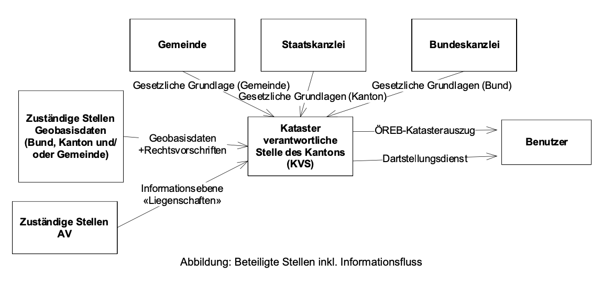
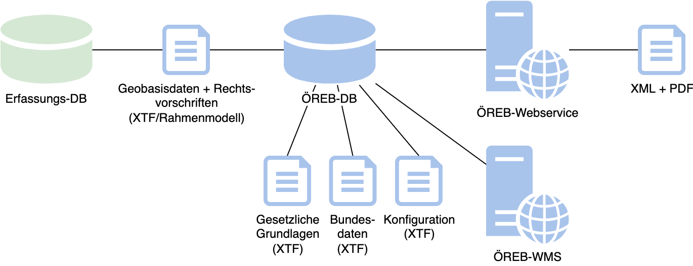

---
= ÖREB-Kataster richtig gemacht #1 - Übersicht
Stefan Ziegler
2022-04-17
:thoth-type: post
:thoth-status: published
:thoth-tags: ÖREB,ÖREB-Kataster,INTERLIS,Gretl,Gradle,ili2pg,ili2db,ilivalidator
:idprefix:
---
Ich habe bereits während der Realisierung der ersten Version des ÖREB-Katasters über unsere http://blog.sogeo.services/blog/2018/10/21/oereb-kataster-1-as-a-gradle-script.html[Architektur] http://blog.sogeo.services/blog/2018/12/31/xslt-xslfo-2-pdf4oereb.html[geschrieben]. Diese Lösung hat sich sehr bewährt. Wir hatten damals zwei bestehende Softwarelösungen angeschaut und uns trotzdem für etwas Eigenes entschieden. Eine der  bestehenden Lösung kann meines Erachtens zu viel, die andere habe ich irgendwie nie ganz verstanden.

Im Rahmen unserer Realisierung der zweiten Version des ÖREB-Katasters möchte ich detailliertere Einblicke in unser System geben und auch ein paar Skripte und Docker-Images bereitstellen, damit man das ausprobieren kann. Und ich gebe die Hoffnung nicht auf, dass auch Swisstopo bei passender Gelegenheit die ganze Sache durchspielt und sieht, was es zu tun gibt und damit ein vertiefteres technisches Verständnis für die Materie bekommt.

Die https://www.cadastre.ch/de/manual-oereb/publication/instruction.detail.document.html/cadastre-internet/de/documents/oereb-weisungen/Rahmenmodell-de.pdf.html[Erläuterungen] zum Rahmenmodell des ÖREB-Katasters zeigen in Kapitel 4 &laquo;Organisatorischer Rahmen&raquo; folgende Abbildung:

In der Mitte steht die Katasterverantwortliche Stelle (KVS), welche in irgendeiner Ausprägung den ÖREB-Kataster betreibt. Die Pfeile deuten die Datenflüsse resp. die Schnittstellen an:

- Gemeinden, Staatskanzlei und die Bundeskanzlei liefern die Gesetzlichen Grundlagen
- Die zuständigen Stellen liefern die Geobasisdaten inkl. der Rechtsvorschriften.
- Aus der amtlichen Vermessung kommen die Liegenschaften und die PLZ/Ortschaften.

Aus dieser Organisation ergeben sich die Anforderungen an das https://models.geo.admin.ch/V_D/OeREB/[ÖREB-Rahmenmodell]. Es gibt somit INTERLIS-Modelle, welche den ganzen Kataster und die Organisation dazu beschreibt. 

Legen wir den Augenmerk vom eher Organisatorischen auf die technischen Rahmenbedingungen:

- Die Bundesthemen inkl. der gesetzlichen Grundlagen, der Logos und der Texte des Bundes liegen als INTERLIS-Transferdatei im Rahmenmodell vor.
- Ein kantonales Thema wird in einer Fachanwendung bewirtschaftet, welche die Daten im INTERLIS-Rahmenmodell bereitstellt.
- Die Daten der amtlichen Vermessung liegen als INTERLIS-Transferdatei vor.
- Seit Rahmenmodell V2.0 gibt es ein https://models.geo.admin.ch/V_D/OeREB/OeREBKRMkvs_V2_0.ili[Konfigurations-Teilmodell], welches z.B. die Logos und die statischen Texte beinhaltet oder die Verfügbarkeit der Gemeinden steuern kann.
- Es gibt ein elaboriertes Toolset für das Arbeiten mit INTERLIS-Datenmodellen und -Transferfiles: https://github.com/claeis/ili2db[`ili2pg`] und https://github.com/claeis/ilivalidator[`ilivalidator`]

Für uns war bei der Lösungsfindung wichtig, dass sowohl die Realisierung als auch der Betrieb des ÖREB-Katasters möglichst einfach, transparent und effizient verläuft. Zusammen mit den vorhandenen Rahmenbedingungen ergab sich (vereinfacht) folgende Architektur:

Erläuterung:

1. Es gibt eine ÖREB-Datenbank mit einem Schema, welches sämtliche Daten (Geobasisdaten, amtliche Vermessung, Konfiguration, ...) beinhaltet. Der Import resp. das Ersetzen der Daten wird mit `ili2pg` durchgeführt. Die Daten werden vor dem Import mit `ilivalidator` geprüft.
2. Es braucht einen Webdienst, der den DATA-Extract (aka XML) und den statischen Auszug (das PDF) herstellt. Dieser Dienst muss bloss mit einer Datenbank (der ÖREB-Datenbank) im Sinne einer &laquo;Cookie-Cutter&raquo;-Abfrage kommunizieren. Das Resultat dieser Abfrage muss nach XML umformatiert werden und das XML muss zu einem PDF gemacht werden. Mehr muss diese Anwendung nicht können.
3. Sämtliche Geobasisdaten müssen im ÖREB-Rahmenmodell vorliegen, damit sie mit den vorhandenen Werkzeugen in die ÖREB-Datenbank importiert und bei einer Nachführung ersetzt werden können. Konsequenz: Einige kantonale Themen müssen vom kantonalen Erfassungsmodell in das ÖREB-Rahmenmodell umgebaut werden. Auch für diesen Schritt können wir auf bewährte Methoden und Werkzeuge zurückgreifen (Stichwort SQL und `ili2pg`).
4. Konfigurationen (Logos, Themen, Texte, ...) und gesetzliche Grundlagen des Bundes und des Kantons müssen ebenfalls im dafür vorgesehenen Teilmodell vorliegen.
5. In der Übersicht fehlt bewusst der dynamische Auszug.

Die Idee war/ist alles was mit Daten und Datenimport/-export zu tun hat mit INTERLIS und den bekannten INTERLIS-Werkzeugen zu machen, also die Reduzierung auf eine einzelne Schnittstelle. Auch weil hier bereits alles vorhanden ist. 

Diese Architektur liefert uns die Basis für eine grösstmögliche Transparenz (z.B. beim Protokollieren von neuen Publikationen in den Kataster) und eine sehr gute Qualitätskontrolle inkl. sauberer Schnitte zwecks Zuweisung der Verantwortlichkeiten. So ist das System auch praktisch unabhängig vom Ort, wo es installiert ist, da es keine Laufzeitabhängigkeiten zu bestehenden GDI-Komponenten hat (z.B. Erfassungsdatenbank).

Im zweiten Teil gehe ich vertieft auf die Herstellung und Organisation der ÖREB-Datenbank ein und stelle ein Docker-Image inkl. Import-Skripte zur Verfügung.
