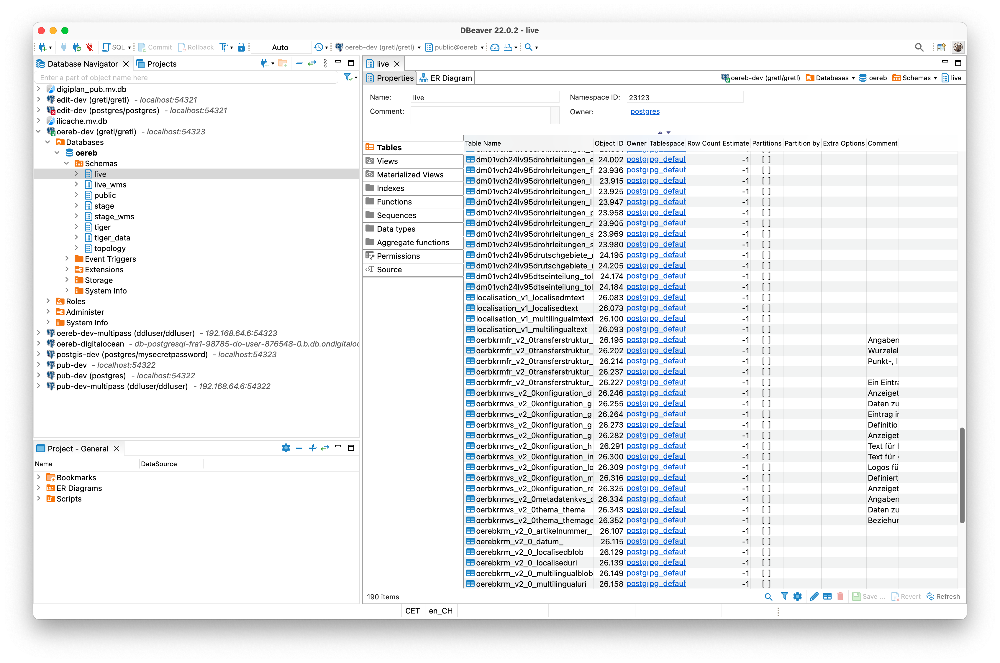

---
= ÖREB-Kataster richtig gemacht #2 - ÖREB-Datenbank
Stefan Ziegler
2022-04-18
:thoth-type: post
:thoth-status: published
:thoth-tags: ÖREB,ÖREB-Kataster,PostgreSQL,PostGIS,INTERLIS,Gretl,Gradle,ili2pg,ili2db,ilivalidator
:idprefix:
---
Wie im http://blog.sogeo.services/blog/2022/04/17/oereb-kataster-richtig-gemacht-1.html[ersten Teil] der &laquo;ÖREB-Kataster richtig gemacht&raquo;-Serie angekündigt, geht es im zweiten Teil um die ÖREB-Datenbank.

Die Grundidee ist, dass sämtliche Daten, die für den Betrieb des Katasters notwendig sind, in einem Schema vorliegen. Wobei das weniger wichtig ist (und schlussendlich aus zwei Gründen nicht ganz eingehalten wird), als dass sämtliche Geobasisdaten inkl. der Rechtsvorschriften in den gleichen Tabellen vorhanden sind. In &laquo;ili2pg-Sprech&raquo; bedeutet das, dass mit `ili2pg` das Transferstruktur-Teilmodell des ÖREB-Rahmenmodells in der Datenbank abgebildet wird und anschliessend können sämtliche ÖREB-Themen in dieses eine Schema importiert werden. Ein ÖREB-Webservice muss sich so nur um eine einzige Datenquelle kümmern und kann mit einer einzigen SQL-Abfrage sämtliche betroffenen Eigentumsbeschränkungen sämtlicher ÖREB-Themen eruieren (&laquo;Cookie-Cutter&raquo;). In das gleiche Schema importieren wir ebenfalls die Konfigurationen (Logos, Texte, Themen, gesetzliche Grundlagen, ...), die amtliche Vermessung und die PLZ/Ortschaften.

Aus betrieblichen Gründen erstellen wir bei uns zwei identische solche Schemen: `live` und `stage`. Das `live`-Schema dient als Produktions-Umgebung und das `stage`-Schema dient den Fachstellen für die Validierung der importierten Daten in den ÖREB-Kataster vor dem definitiven Freischalten. Ein ÖREB-Webservice muss einzig mit einem Schemanamen parametrisiert werden, um eine Validierungsumgebung zu erhalten.

Das Erstellen des Schemas mit `ili2pg` ist leider nicht ganz so super-trivial wie man sich das wünscht. Der Hauptgrund ist, dass man im gleichen Schema INTERLIS 1 und INTERLIS 2 Modelle abbilden will. Das funktioniert mit einem einzelnen ili2pg-Befehl nicht. Wenn man aber zwei Befehle ausführen muss und man mit der `--createScript`-Option das SQL in eine Datei schreiben will, muss man das erzeugte SQL noch leicht anpassen, weil sonst z.B. versucht wird Sequenzen doppelt zu erstellen. Ein SQL-Skript wird benötigt, weil wir so beim erstmaligen Hochfahren der Datenbank (als Dockercontainer) das Schema und die Tabellen anlegen wollen.

Langer Rede, kurzer Sinn: Man muss irgendwie mit `ili2pg` die SQL-Skripte erstellen, diese noch leicht anpassen und dann zusammensetzen. Soweit keine Hexerei. Man kann dazu z.B. ein Shellskript schreiben oder, weil man sowieso Java benötigt, mit https://www.jbang.dev/[jbang] ein Java-Skript (also sowas wie ein Skript in Java geschrieben) schreiben. Das https://github.com/oereb/oereb-db/blob/main/create_schema_sql.java[Skript] befindet sich im https://github.com/oereb/oereb-db[Github-Repository]. Technisch ist es nicht sonderlich interessant. Es wird mit der ili2db-Bibliothek direkt gearbeitet und anschliessend mit Regex-Magie und Suchen und Ersetzen die notwendigen Anpassungen gemacht. Schaut man sich das Skript ein wenig genauer an, fällt auf, dass es neben den beiden erwähnten Schemen auch noch die beiden Schemen `live_wms` und `stage_wms` erstellt. Dabei handelt es sich um Schemen mit Tabellen, die dem ÖREB-Darstellungsdienst (WMS) als Quelle dienen. Die Originaltabellen des Rahmenmodells sind normalisiert, was für die Verwendung in WMS-Servern nicht hilfreich ist. Entweder erstellt man Datenbankviews oder -tabellen und denormalisiert. Wir haben uns für Tabellen entschieden, weil wir die Dokumente als JSON-codierten Text in einer Spalte speichern und so via WMS-GetFeatureInfo verfügbar machen wollen. Das ist aus Sicht ÖREB-Kataster nicht zwingend notwendig. Uns dient die Spalte aber im Validierungsprozess. Da somit der Datenumbau vom Rahmenmodell in unsere denormalisierte Struktur aufwändiger ist, reicht die Performance mit Views nicht mehr. Damit das Anlegen der WMS-Tabellen analog funktioniert, haben wir ein https://geo.so.ch/models/AGI/SO_AGI_OeREB_WMS_20220222.ili[INTERLIS-Datenmodell] erstellt. Das Modell muss in separaten Schemen abgebildet werden, weil andere ili2db-Optionen verwendet werden sollen. 

Das Skript kann mit folgenden Befehl ausgeführt werden:

```
jbang create_schema_sql.java
```

Ist jbang nicht installiert, kann man das Skript (unter Linux und macOS) wie folgt ausführen:
```
curl -Ls https://sh.jbang.dev | bash -s - create_schema_sql.java
```

Das Resultat ist eine `setup.sql`-Datei. Mit dieser lassen sich nun sämtliche Schemen und sämtlichen Tabellen in einer PostgreSQL/PostGIS-Datenbank erstellen. Die Datei interessiert mich direkt aber nicht, da ich sie selber nicht benötige, sondern der Docker-Container beim erstmaligen Hochfahren die SQL-Befehle ausführt. Für das Docker-Image verwende ich unser PostgreSQL/PostGIS-Basisimage (`sogis/postgis:14-3.2`). Bis es offizielle PostGIS-Images gibt, welche auf ARM-Prozessoren (Apple Silicon) laufen, muss ich mich selber um ein solches Image kümmern, was wiederum nicht sonderlich aufwändig ist, weil das offizielle PostgreSQL-Image glückerlicherweise für ARM-Prozesseren verfügbar ist. Richtig viel passiert im https://github.com/oereb/oereb-db/blob/main/Dockerfile[Dockerfile] nicht mehr. Es werden einzig zwei Dateien in den Ordner `/docker-entrypoint-initdb.d` kopiert: Die soeben erstellt Datei `setup.sql` dient dazu die Tabellen und Scheman in der Datenbank zu erstellen. Die Datei `initdb-user.sh` wird benötigt um einige Benutzer in der Datenbank zu erstellen und diesen die benötigten Rechte zuzuweisen.

Das Dockerimage wird mit folgendem Befehl erstellt:
```
docker build -t ghcr.io/oereb/oereb-db:latest .
```

Beim Starten des Containers müssen Umgebungsvariablen mitgeliefert werden:
```
docker run --rm --name oerebdb -p 54323:5432 -e POSTGRES_PASSWORD=mysecretpassword -e POSTGRES_DB=oereb -e POSTGRES_HOST_AUTH_METHOD=md5 -e PG_READ_PWD=dmluser -e PG_WRITE_PWD=ddluser -e PGGRETLPWD=gretl ghcr.io/oereb/oereb-db:latest
```

- `POSTGRES_PASSWORD`: Passwort des `postgres`-Benutzers
- `POSTGRES_DB`: Name der Datenbank
- `POSTGRES_HOST_AUTH_METHOD`: Siehe https://github.com/claeis/ili2db/issues/448. Oder mit den Worten von https://www.youtube.com/watch?v=Ze5Ul7Z9kE8[Tom Petty: &laquo;Time to move on&raquo;]
- `PG_READ_PWD`: Passwort eines read-only Benutzers (`dmluser/dmluser`). Siehe auch `initdb-user.sh`.
- `PG_WRITE_PWD`: Passwort eines read/write Benutzers (`ddluser/ddluser`). Siehe auch `initdb-user.sh`.
- `PG_GRETL_PWD`: Passwort eines read/write Benutzers (`gretl/gretl`). Siehe auch `initdb-user.sh`.

Man kann natürlich in `initdb_user.sh` komplett andere Benutzer und ein eigenes Dockerimage erstellen. Diese drei Benutzer sind bei uns intern häufig die Regel für Entwicklungsumgebungen. 

Die Datenbank `oereb` mit unseren vier erstellten Schemen ist nach kurzer Zeit verfügbar (aber leer): 



Wird der Docker-Container gestoppt, verliert man sämtliche Daten. In unserem Fall ist das noch nicht so tragisch, da bis jetzt noch keine Daten importiert wurden. Jedoch gehen auch die vier Schemen verloren. D.h. bei jedem Container-Neustart, werden diese Schemen wieder erzeugt. Will man dieses Verhalten verhindern, muss man das Datenbankverzeichnis auf dem lokalen Dateisystem persistieren. Das lokale Verzeichnis muss mit korrekten Permissions erzeugt werden.

```
mkdir -m 0777 ~/pgdata
docker run --rm --name oerebdb -p 54323:5432 -v ~/pgdata:/var/lib/postgresql/data:delegated .... (siehe oben)
```

Das Herstellen und Testen des Images übernimmt eine https://github.com/oereb/oereb-db/blob/main/.github/workflows/main.yml[Github] https://github.com/oereb/oereb-db/actions[Action]. Die Images gibt es für `amd64`- (Intel, AMD) wie auch für `arm64`-Systeme (Apple Silicon) in der https://github.com/oereb/oereb-db/pkgs/container/oereb-db[Github Container Registry]. 

Weil eine leere Datenbank nichts bringt, zeige ich im dritten Teil, wie man alle notwendigen Daten einfach importiert.


