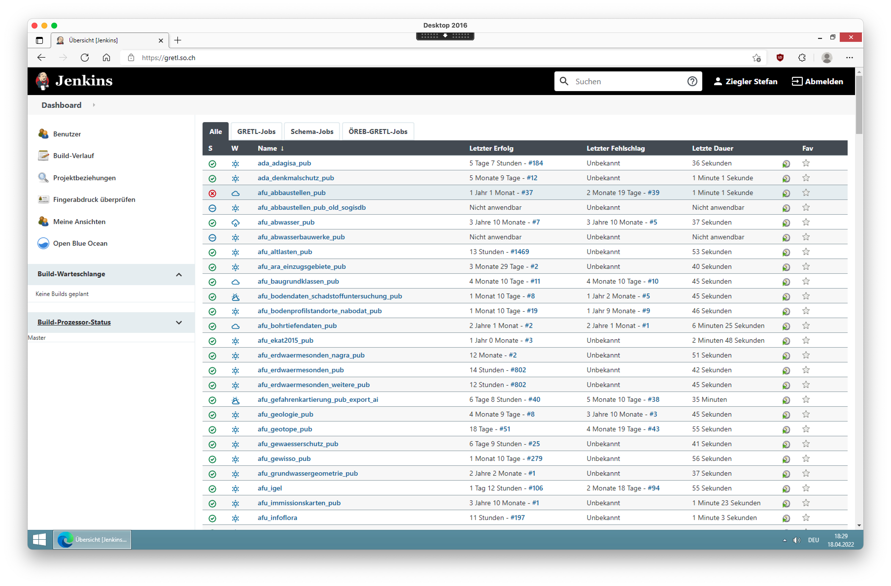
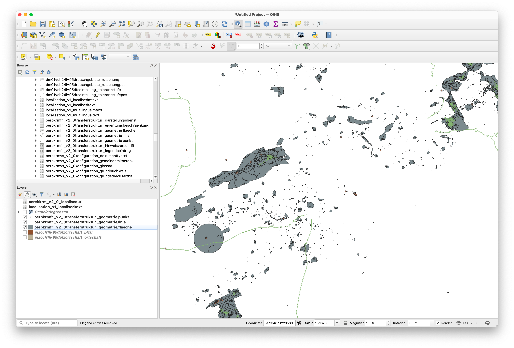

---
= ÖREB-Kataster richtig gemacht (und einfacher) #3 - ÖREB-Gretljobs
Stefan Ziegler
2022-04-19
:thoth-type: post
:thoth-status: published
:thoth-tags: ÖREB,ÖREB-Kataster,PostgreSQL,PostGIS,INTERLIS,Gretl,Gradle,ili2pg,ili2db,ilivalidator
:idprefix:
---
Im dritten Teil schlägt die Stunde der ÖREB-Gretljobs. Gretljobs? Gretl?

Als wir uns vor Jahren daran machten unser Cronjob- und Datenintegrationschaos (oder allgemeiner ETL-Prozesse) zu beseitigen, kamen wir auf die Idee ein Build-Tool zu verwenden. Der Grund für diese Entscheidung war, dass ein solcher Prozess (= Job) immer in Teilschritte (= Tasks) runtergebrochen werden kann. Beispiel: Daten werden heruntergeladen (Task 1), Daten werden entzippt (Task 2), Daten werden geprüft (Task 3), Daten werden importiert (Task 4) und Daten werden in eine andere Datenbankstruktur umgebaut (Task 5). Als Build-Tool verwenden wir https://gradle.org[Gradle]. Einerseits gibt es out-of-the-box bereits viele Funktionen und Plugins und andererseits ist es relativ einfach erweiterbar. Erweiterbar muss es sein, weil wir ein paar &laquo;Geo-Tasks&raquo; benötigen (z.B. INTERLIS-Import etc.) oder andere Funktionen, die es weder im Core noch in einem Plugin gibt. Unsere Erweiterungen packten wir ebenfalls in ein https://plugins.gradle.org/plugin/ch.so.agi.gretl[Plugin] und somit war https://github.com/sogis/gretl[Gretl (Gradle ETL)] geboren.

Ein minimales Beipiel, das eine INTERLIS-Datei prüft, sieht wie folgt aus (der Code muss als `build.gradle`-Datei gespeichert werden): 

[source,groovy,linenums]
----
import ch.so.agi.gretl.tasks.*
import ch.so.agi.gretl.api.*

apply plugin: 'ch.so.agi.gretl'

buildscript {
    repositories {
        maven { url "http://jars.interlis.ch" }
        maven { url "http://jars.umleditor.org" }
        maven { url "https://repo.osgeo.org/repository/release/" }
        maven { url "https://plugins.gradle.org/m2/" }
        mavenCentral()
    }
    dependencies {
        classpath group: 'ch.so.agi', name: 'gretl',  version: '2.1.+'
    }
}

defaultTasks 'validate'

task validate(type: IliValidator){
    dataFiles = ["fubar.xtf"]
}
----

Im Verzeichnis, wo die `build.gradle`-Datei liegt, kann man den Job mit `gradle` aufgerufen werden. Die zu prüfende Datei `fubar.xtf` muss natürlich vorhanden sein und Gradle (und Java) installiert sein. Das Interessante sind die sogenannten Tasks. Von diesen Tasks kann es beliebig viele geben und sie können auch voneinander abhängig (`dependsOn`) sein. Einen Überblick über alle unsere Jobs (und Inspiration) erlangt man in unserem https://github.com/sogis/gretljobs/[gretljobs-Repo]. Eine möglichst vollständige Dokumentation unserer selbst programmierten Tasks findet man ebenfalls im https://github.com/sogis/gretl/blob/master/docs/user/index.md[Repo] oder man kann sich die https://pretalx.com/fossgis2019/talk/ESDMQB/[Gretl-Präsentation] an der FOSSGIS 2019 zu Gemüte führen. Die ganze Sache läuft nun seit circa fünf Jahren und wir könnten zufriedener nicht sein. Zur Orchestrierung sämtliche Jobs verwenden wir übrigens https://www.jenkins.io/[Jenkins], was sich ebenfalls sehr bewährt hat: Perfekte Übersicht über sämtliche Jobs und Logfiles immer am gleichen Ort. Viel mehr braucht es nicht:



Jenkins wird hier der Einfachheithalber keine Rolle spielen, da ein Gretl-Job eben auch ganz ohne Schnick-Schnack nur in der Konsole ausgeführt werden kann. Wir haben das Gretl-Plugin mit sämtlichen Abhängigkeiten in ein https://hub.docker.com/repository/docker/sogis/gretl[Docker-Image] gepackt. So sind wir sicher, dass wir immer die gleichen Versionen der Abhängigkeiten verwenden und sind zugleich unabhängig von einer Java-Installation. Das Image ist seit kurzem auch auf einem Apple Silicon Rechner lauffähig. Man sieht: eine gewisse Leidensfähigkeit und Durchhaltewillen als Macbook-Anwender der neueren Generation muss man mitbringen.

Zurück zum eigentlichen Ziel: Dem Import aller benötigten Daten in die ÖREB-Datenbank (aus http://blog.sogeo.services/blog/2022/04/18/oereb-kataster-richtig-gemacht-2.html[Teil 2]) für den Betrieb des ÖREB-Katasters. Und mit allen Daten sind eben nicht nur Geodaten gemeint, sondern auch Konfiguration im weiteren Sinne, d.h. Gesetzliche Grundlagen, Themen, Logos, Texte. Sowohl für Bund und Kanton (Gemeinden). Ein wichtige Konfiguration im engeren Sinne sind z.B. die freigeschalteten Gemeinden (wo ist der ÖREB-Kataster verfügbar?). Dafür gibt es im https://models.geo.admin.ch/V_D/OeREB/OeREBKRMkvs_V2_0.ili[Modell `OeREBKRMkvs_V2_0`] die Klasse `GemeindeMitOeREBK`. In dieser Klasse kann man feingranular verwalten, welche Themen in welcher Gemeinde vorhanden sind. Alle diese Daten(sätze) sind bei uns in einer INTERLIS-Transferdatei vorhanden resp. für die Bundesthemen stellt sie bereits Swisstopo https://models.geo.admin.ch/V_D/OeREB/[zur Verfügung]. Es gibt absolut keine Notwendigkeit diese Konfigurationen mit etwas selber Gestricktem zu definieren und zu verwalten. Mit der ersten Version des ÖREB-Katasters konnte man aufgrund des fehlenden Konfigurations-Teilmodelles noch nicht vollständig und konsequent mit dem Rahmenmodell (resp. den Daten) einen XML-Auszug und das PDF herstellen. Damals entwickelten wird unser sogenanntes &laquo;Annex-Datenmodell&raquo;, der Vorläufer des heutigen Konfigurationsmodells, damit wir trotzdem in der INTERLIS-Bubble bleiben konnten.

Stehen die Datensätze online zur Verfügung, müssen die Gretl-Jobs diese nur noch herunterladen, validieren und importieren (siehe http://blog.sogeo.services/blog/2022/04/17/oereb-kataster-richtig-gemacht-1.html[Teil 1] &laquo;sauberer Schnitt&raquo; und &laquo;Zuständigkeiten&raquo;). Matchentscheidend ist die Reihenfolge wie die Gretl-Jobs ausgeführt werden: Die Daten werden in eine Datenbank importiert. Die Beziehungen zwischen Klassen werden mittels Fremdschlüsseln abgebildet. D.h. man kann keine Daten importieren, wenn die Daten auf ein Objekt zeigen, dass noch nicht in der Datenbank vorhanden ist. In unserem Fall müssen zwingend die zuständigen Stellen vorhanden sein, wenn man Geobasisdaten importieren will und die zuständigen Stellen nicht mit den Daten mitgeliefert werden. Man kann (mit einer ili2pg-Option) das Erstellen der Fremdschlüsseln zwar ausschalten, was aber meines Erachtens nicht sinnvoll ist. Diese gibt es ja aus guten Gründen und wenn man immer und immer wieder Daten in den DB-Tabellen austauscht, passiert garantiert irgendwann mal ein Fehler und die Daten passen nicht mehr zusammen (Stichwort referentielle Integrität). Herausfordernd wird es, wenn &ndash; bleiben wir beim Beispiel der zuständigen Stellen &ndash; der Name oder die Adresse der zuständigen Stelle ändert. Dieser Record kann in der Datenbank nicht einfach so ausgetauscht werden, weil ein anderer Record einen Fremdschlüssel auf die zuständige Stelle hat. Die meisten solcher Fälle können mit ili2db-Magie gelöst werden indem man die `--update`-Option verwendet. Das Objekt in der Datenbank wird nicht gelöscht, sondern &ndash; nomen est omen &ndash; upgedatet. Das funktioniert natürlich nicht, wenn die zuständige Stelle gelöscht werden soll und es immer noch Objekte gibt, die auf diese zuständige Stelle verweisen. In diesem Fall bleibt einem nichts anderes übrig, als zuerst diese Objekte zu löschen und anschliessend auch die zuständige Stelle. Aus diesem Grund ist es sehr wichtig, dass Gradle (das Build-Tool, die Basis von Gretl) verschiedene Hilfsmittel anbietet, welche die Ausführungs-Reihenfolge der Tasks garantiert (`dependsOn`, `mustRunAfter`, `finalizedBy`). 

Bei der Organisation der Gretl-Jobs sind der Fantasie keine Grenzen gesetzt. Es gibt viele richtige Varianten. Im vorliegenden Fall habe ich mich für einen Haupt-Gretl-Job entschieden, der aus verschiedenen Sub-Jobs besteht. So kann man mit einem Befehl alles Notwendige importieren aber trotzdem noch einzelne Schritte selbständig ausführen, z.B. das Ersetzen sämtlicher Bundesgeobasisdaten. Ein Blick hinter die Kulissen erlaubt das https://github.com/oereb/oereb-gretljobs[Gretljobs-Repo]. Es gibt eine `build.gradle`-Datei im Root-Verzeichnis, welche den Haupt-Gretl-Job definiert. Zusätzlich gibt es eine `settings.gradle`-Datei, die dem Haupt-Gretl-Job die Sub-Jobs bekannt macht.

Meine gewünschte Import-Reihenfolge soll folgende sein:

1. Grundlagedaten, da diese von nichts abhängig sind: Amtliche Vermessung und PLZ/Ortschaften.
2. Bundesgesetze
3. Bundeskonfigurationen
4. Kantonale Konfigurationen (beinhalten auch kantonale Gesetze)
5. Bundesdaten (alle)
6. Kantonsdaten (Auswahl): kommunale und kantonale Nutzungsplanung (einige Gemeinden), KbS, Grundwasserschutz

Erreicht wird das durch eine Kombination von `mustRunAfter`-Optionen in Tasks der Sub-Jobs und einem einzelnen Task im Haup-Gretl-Job, welcher von allen Import-Tasks der einzelnen Sub-Jobs abhängig ist. Die Reihenfolge wie die Tasks resp. Jobs ausgeführt werden, entspricht nicht zwingend der Reihenfolge wie sie in der `dependsOn`-Option definiert sind. Deshalb sind die `mustRunAfter`-Optionen (siehe https://github.com/oereb/oereb-gretljobs/blob/main/oereb_plzo/build.gradle#L63[Beispiel]) notwendig. Mit dieser Definition der Tasks und Jobs und Abhängigkeiten zwischeneinander kann man mit einem Befehl alle Daten importieren aber zu einem späteren Zeitpunkt z.B. nur noch die Geobasisdaten in der Datenbank austauschen.

Schaut man sich die verschiedenen `build.gradle`-Dateien im Repo an, erkennt man, dass sie alle sehr ähnlich sind. Ich denke, man sieht sehr gut, dass die zu erledigende Arbeit eines Sub-Jobs in einzelne kleine Schritte (= Tasks) aufgesplittet wurde, was der Transparenz sehr zuträglich ist (Fehlersuche etc.). Die vorliegende Aufteilung in die Sub-Jobs ist vielleicht nicht ultra-logisch, was darauf zurück zu führen ist, dass ich vieles von unseren produktiven Gretl-Jobs für den ÖREB-Kataster übernommen habe, diese aber für Demo-Zwecke nicht zwingend sinnvoll gruppiert sind.

Wer es nun durchspielen will, hier die notwendigen wenigen Schritte.

Datenbank aus http://blog.sogeo.services/blog/2022/04/18/oereb-kataster-richtig-gemacht-2.html[Teil 2] mittels `docker-compose up` (damit ein Netzwerk angelegt wird) starten. Die https://github.com/oereb/oereb-gretljobs/blob/main/docker-compose.yml[docker-compose-Datei] ist nichts anderes als der `docker run`-Befehl. Anschliessend setzen wir für Gretl einige Umgebungsvariablen, damit man z.B. Datenbank-Credentials nicht in der `build.gradle`-Datei hardcodieren muss:

```
export ORGGRADLEPROJECT_dbUriOerebV2="jdbc:postgresql://oereb-db/oereb"
export ORGGRADLEPROJECT_dbUserOerebV2="gretl"
export ORGGRADLEPROJECT_dbPwdOerebV2="gretl"
export ORGGRADLEPROJECT_geoservicesUrl="http://localhost/wms"
```

Umgebungsvariablen, die mit `ORG_GRADLE_PROJECT_` starten, müssen nicht manuell im Build-Skript ausgelesen werden, sondern stehen automatisch zur Verfügung. Für das Auführen der Gretl-Jobs verwenden wir unser https://hub.docker.com/repository/docker/sogis/gretl[Docker-Image], welches wir mit einem https://github.com/oereb/oereb-gretljobs/blob/main/start-gretl.sh[Shell-Skript] bedienen. Das Shell-Skript ist nicht viel mehr als ein `docker run`-Befehl. Früher hatte das Skript noch weitere Funktionen, die aber nicht mehr benötigt werden. Zum Auflisten sämtlicher Task aller (Sub-)Jobs muss folgender Befehl verwendet werden:

```
./start-gretl.sh --docker-image sogis/gretl:latest --docker-network oereb-gretljobs_default --job-directory $PWD tasks --all
```

Wenn man &laquo;Gretl pur&raquo; verwenden würde, also ohne Docker, entspräche das dem Befehl: `gradle tasks --all`. Mit dem Shell-Skript können wir das Docker-Image, das Docker-Netzwerk und das Job-Directory auswählen. Damit der Gretl-Docker-Container mit dem Datenbank-Container kommunizieren kann, müssen sie im gleichen Netzwerk sein. Falls das Datenbank-Container-Netzwerk anders heisst (`docker network ls`), muss selbstverständlich dieser Namen verwendet werden. 

Zum Importieren sämtlicher Daten reicht der Befehl:

```
./start-gretl.sh --docker-image sogis/gretl:latest --docker-network oereb-gretljobs_default --job-directory $PWD motherOfAllTasks
```

Funktioniert die Kommunikation zwischen den Images, sollte man in der Konsole sehen, welche Tasks Gretl gerade abarbeitet. Bei mir dauert der Import (Download, i.d.R. Validierung, Import) meiner Datenauswahl in das `live`-Schema auf einem Macbook Air (und somit sehr schlechter I/O-Performance mit Docker) circa 6 Minuten. Am längsten dauerte der Import der PLZ/Ortschaften und die amtliche Vermessung. Bei den PLZ/Ortschaften sind halt viele Daten dabei, die mich geografisch nicht interessieren. Hat alles ohne Fehler funktioniert, quittiert Gradle die Arbeit mit `BUILD SUCCESSFUL`. Ansonsten sollte eine mehr oder weniger sinnvolle Fehlermeldung in der Konsole erscheinen.

Zum Beweis laden wir einige Tabellen in QGIS:



Will man zukünftig nur die Bundesdaten ersetzen, reicht folgender Befehl:

```
./start-gretl.sh --docker-image sogis/gretl:latest --docker-network oereb-gretljobs_default --job-directory $PWD oereb_bundesdaten:importData
```

Und 35 Sekunden später sind alle Bundesdaten ersetzt.

Wer jetzt Interesse an Gretl, seinen Fähigkeiten und Einsatzmöglichkeiten in einer GDI hat, darf sich gerne melden. Im nächsten Teil geht es dann ruhiger zu und her: Es entsteht der ÖREB-WMS.
