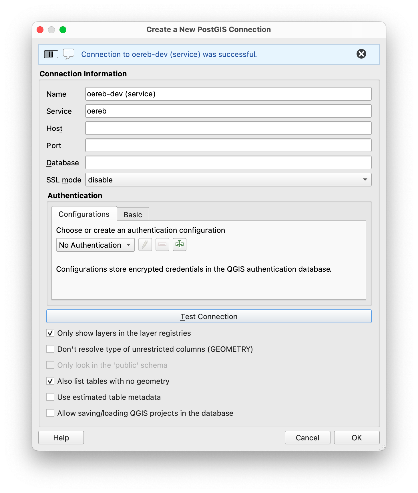
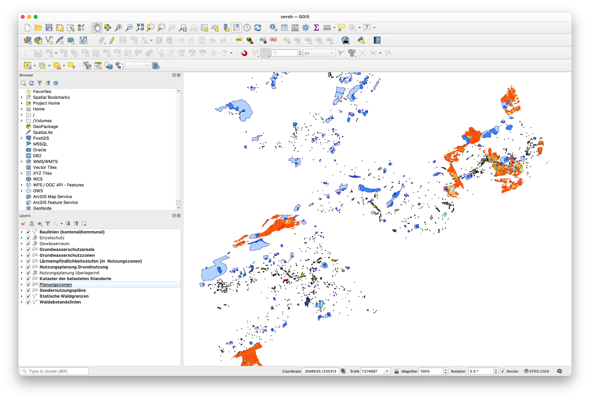
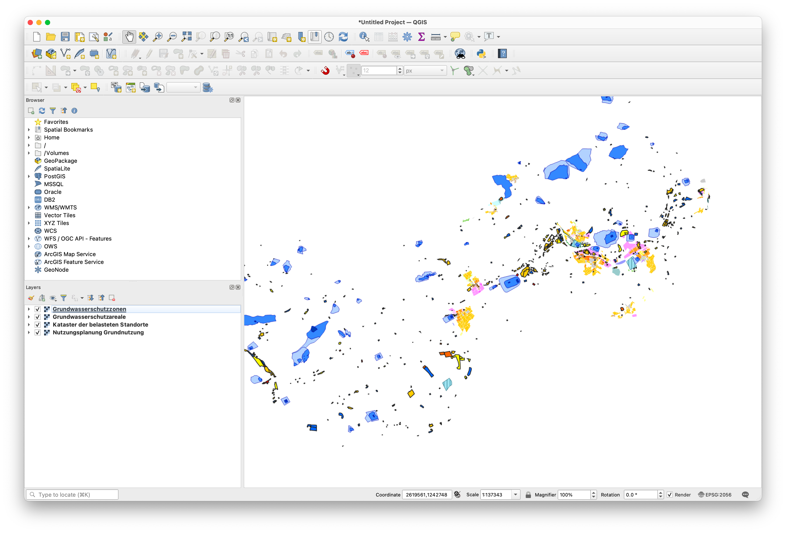

---
= ÖREB-Kataster richtig gemacht #4 - ÖREB-WMS
Stefan Ziegler
2022-04-23
:thoth-type: post
:thoth-status: published
:thoth-tags: ÖREB,ÖREB-Kataster,PostgreSQL,PostGIS,INTERLIS,Gretl,Gradle,ili2pg,ili2db,ilivalidator
:idprefix:
---
Als WMS-Server verwenden wir QGIS-Server. Für die (Nicht-)Anforderungen des ÖREB-Katasters ginge aber wohl jeder halbwegs konforme WMS-Server. Als erstes müssen wir die Layer unserer Daten konfigurieren. Die Datenquelle ist die Datenbank aus http://blog.sogeo.services/blog/2022/04/18/oereb-kataster-richtig-gemacht-2.html[Teil 2], die wir im http://blog.sogeo.services/blog/2022/04/19/oereb-kataster-richtig-gemacht-3.html[Teil 3] mit Daten befüllt haben. Es gibt in der Datenbank die Schemen `stage_wms` und `live_wms`. Ersteres dient zur Verifikation, der in die Katasterstruktur importieren Daten. Das zweite Schema ist das eigentliche Produktionsschema. Damit die QGIS-Projektdatei aber unabhängig vom Schemennamen aufgebaut werden kann, verwenden wir nicht direkt Datenbankverbindungsparameter (Host, DB-Name, User, Passwort), sondern das sogenannte https://www.postgresql.org/docs/current/libpq-pgservice.html[Connection Service File]. Mit grosser Wahrscheinlichkeit werden mindestens zwei benötigt. Eines für das lokale Arbeiten und eines für den Betrieb, da sich die Verbindungsparameter unterscheiden werden. Das Service-File für das lokale Arbeiten sieht bei mir so aus:

```
[oereb]
host=localhost
port=54323
dbname=oereb
user=gretl
password=gretl
sslmode=disable
options=-c search_path=public,live_wms
```

QGIS-Desktop muss man das Service-File bekannt machen, indem man unter `Preferences` - `System` - `Environment` eine `PGSERVICEFILE`-Variable mit dem Pfad zur Datei setzt. Die erste Zeile des Service-Files ist der Name der Verbindung. In QGIS-Desktop muss man im Datenbank-Connection-Fenster einzig dieser Name eintippen:



Die letzte Zeile (`options=`) bestimmt den Suchpfad von Datenbanktabellen. Weil wir wollen, dass in der QGIS-Projektdatei nur die Tabellennamen stehen aber keine Schemennamen, definieren wir einen sogenannten Suchpfad. Dieser bestimmt in welchen Schemen die Tabelle gesucht wird, wenn das QGIS-Projekt geladen wird. Wenn ich mich aber richtig erinnere, musste ich beim Zusammenstöpseln des QGIS-Projektes nachträglich im Texteditor die Schemennamen rauslöschen, weil der `search_path` nur beim Lesen des Projektes greift, wenn die Tabelle kein Schemennamen im Projekt definiert hat. 

Wenn man  keinen Validierungsschritt verwenden will, ist das alles unnötig und die Schemennamen dürfen im Projektfile stehen.

Nach bisschen Fleissarbeit sieht es bei mir so aus:



Mindestens die vorgebenen Themen hat jeder Kanton. Dazu kommen kantonale ÖREB-Themen. Bei uns z.B. das Thema Einzelschutz.

Nun geht es um das Verpacken des ÖREB-WMS in ein Docker-Image. Als Basis-Image verwende ich https://github.com/sogis-oereb/docker-qgis-server[unser] https://hub.docker.com/repository/docker/sogis/qgis-server-base[QGIS-Server-3.16-Image]. Wir betreiben QGIS-Server in Kombination mit _Apache Webserver_ und nicht mit nginx. Super glücklich sind wir mit dem Image nicht. Ob aber die Kombination mit nginx besser ist, ist uns auch nicht klar. Es scheint als scheiden sich hier die Geister. Uns stört aber vor allem, dass unser Image als `root` laufen muss, eine stattliche Grösse aufweist und dass niemand wirklich weiss in welcher Konfiguration man das Teil unter grosser Last in einem Kubernetes-Cluster laufen lassen soll. Aber andere Baustelle...

Auf dem Basis-Image aufbauend, müssen wir für den ÖREB-WMS nicht mehr grosse Handstände machen. Es müssen lediglich die QGIS-Projektdatei und das Servicefile reinkopiert werden. Das Servicefile in dieser Form würde man in einer Produktionsumgebung nicht reinbrennen oder dann das Image nicht öffentlich publizieren oder die Credentials mit Umgebungsvariablen injizieren. 

Das https://github.com/oereb/oereb-wms/blob/main/Dockerfile.qgisserver[Dockerfile]:

[source,groovy,linenums]
----
FROM sogis/qgis-server-base:3.16

LABEL maintainer="Amt fuer Geoinformation Kanton Solothurn <agi@bd.so.ch>"

# copy .qgs 
COPY qgis /data

RUN chown -R www-data:www-data /data

#pg_service.conf File
COPY conf/pg_service.conf /etc/postgresql-common/pg_service.conf
ENV PGSERVICEFILE="/etc/postgresql-common/pg_service.conf"

#sed command to change URL rewrite
RUN sed -i 's/\^\/qgis\//\^\/wms\//g' /etc/apache2/sites-enabled/qgis-server.conf

#tell apache/qgis-server where to find the pg_service.conf file
RUN echo 'SetEnv PGSERVICEFILE "/etc/postgresql-common/pg_service.conf"' > /etc/apache2/mods-enabled/env.conf

HEALTHCHECK --interval=30s --timeout=10s --start-period=60s CMD curl http://localhost
----

Erstellt wird das Image in einer Github Action und wird via https://github.com/oereb/oereb-wms/pkgs/container/oereb-wms[Github Container Registry publiziert]. Wie bei der https://github.com/oereb/oereb-db[ÖREB-Datenbank] wird sowohl ein Image für `linux/amd64` wie auch für `linux/arm64` erstellt. Weil es jedoch das Ubuntugis-Repo nur für `linux/amd64` gibt (?), wird im ARM-Image die QGIS-Version aus dem normalen Ubuntu-Repository (3.10) installiert. Für das lokale Entwickeln soweit kein Problem. Möchte man QGIS 3.16 auf auch ARM-Rechner verwenden, muss man es wohl selber kompilieren.

Zusammen mit der ÖREB-Datenbank haben wir nun schon zwei Komponenten des ÖREB-Katasters. In einem weiteren https://github.com/oereb/oereb-stack[Github-Repository] beginne ich mit einer https://github.com/oereb/oereb-stack/blob/main/docker-compose.yml[docker-compose-Datei] mit der man die Komponenten zusammen starten kann:

```
docker-compose up
```

Wichtig ist, dass der Name des Datenbank-Services im https://github.com/oereb/oereb-stack/blob/main/docker-compose.yml[docker-compose-File] gleich heisst, wie der host-Name im Service-File (`db`), das wir in das WMS-Image reingebrannt haben. Sonst kann sich der WMS-Server nicht mit der Datenbank verbinden. Funktioniert alles, liefert der Server ein http://localhost:8083/wms/oereb?SERVICE=WMS&REQUEST=GetCapabilities[GetCapabilities-Dokument] zurück. Schlägt z.B. die Verbindung zur Datenbank fehl, erscheint im Browser die Fehlermeldung `Layer(s) not valid`. Daten sind aber noch keine in der Datenbank. Mit den Gretl-Jobs aus http://blog.sogeo.services/blog/2022/04/19/oereb-kataster-richtig-gemacht-3.html[Teil 3] können wir Daten einfach importieren:

[source,groovy,linenums]
----
export ORG_GRADLE_PROJECT_dbUriOerebV2="jdbc:postgresql://db/oereb"
export ORG_GRADLE_PROJECT_dbUserOerebV2="gretl"
export ORG_GRADLE_PROJECT_dbPwdOerebV2="gretl"
export ORG_GRADLE_PROJECT_geoservicesUrl="http://localhost/wms/oereb"
----

```
./start-gretl.sh --docker-image sogis/gretl:latest --docker-network oereb-stack_default --job-directory $PWD motherOfAllTasks
```

Man beachte den anderen Docker-Netzwerk-Namen und bei den &laquo;magischen&raquo; Umgebungsvariablen für Gretl die leicht andere Datenbank-Url. Auch hier musste der Hostname der Datenbank angepasst werden. 

Ein paar Minuten später kann man das Werk in QGIS-Desktop anschauen:



Der WMS ist momentan unter der URL http://localhost:8083/wms/oereb[http://localhost:8083/wms/oereb] erreichbar. Die URL des Darstellungsdienstes ist Bestandteil der Geobasisdaten und steht auch im XML-Auszug. Sie kann verwendet werden, um z.B. die Bilder für das PDF herzustellen. Wenn der Darstellungsdienst nicht von einer anderen Stelle bereitgestellt wird, sondern direkt aus der ÖREB-Datenbank publiziert wird, führt das zum Umstand, dass ich je nach Umgebung (lokal, Test, Integration, Produktion) die URL des Darstellungsdienst anpassen muss. Die URL anpassen, heisst die Daten verändern. So gesehen müsste der URL eher eine Konfiguration des Katastersystems sein und nicht Inhalt der Geobasisdaten. 

Im nächsten Teil geht es um den ÖREB-Webservice (DATA-Extract und statischer Auszug).
