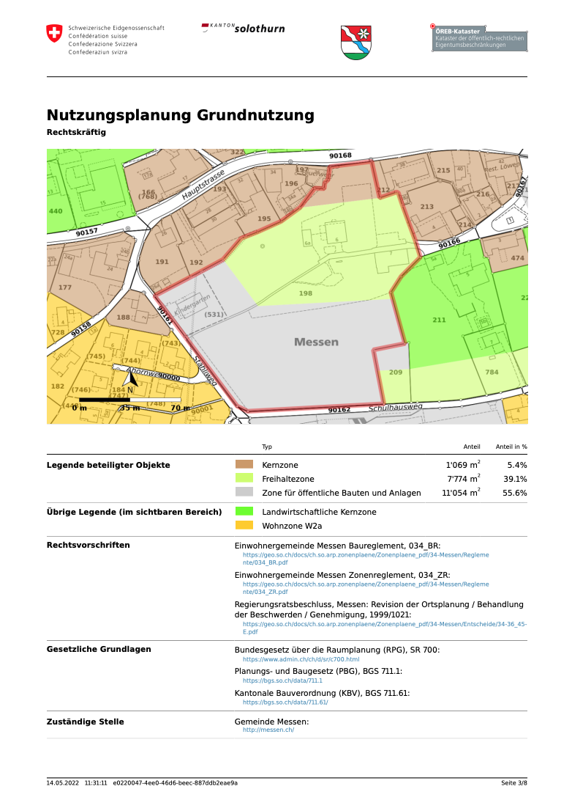

---
= ÖREB-Kataster richtig gemacht #5 - ÖREB-Webservice
Stefan Ziegler
2022-05-14
:thoth-type: post
:thoth-status: published
:thoth-tags: ÖREB,ÖREB-Kataster,PostgreSQL,PostGIS,INTERLIS,,ili2pg,ili2db,ilivalidator,Spring Boot,XSLT,XSL-FO
:idprefix:
---
Der ÖREB-Webservice ist das eigentliche Herz des ÖREB-Katasters und das einzige Originäre. Trotzdem ist er im Prinzip sehr simpel. Er macht pro Aufruf ein paar Datenbankabfragen und wandelt das Resultat nach XML um. Wobei man sich um das eigentliche Formatieren nicht einmal kümmern muss. Doch dazu später mehr. Der PDF-Auszug wird sinnvollerweise direkt aus dem XML abgeleitet und wird nicht mit zusätzlichen Datenbankabfragen gesondert hergestellt.

Die Basis des Webservices ist https://spring.io/projects/spring-boot[Spring Boot]. Ein Java-Framework, das wir für sehr vieles einsetzen. Sämtliche ÖREB-Magie geschieht praktisch in einem https://github.com/claeis/oereb-web-service/blob/master/src/main/java/ch/ehi/oereb/webservice/OerebController.java[Controller]. Der Controller nimmt die Anfragen (GetEgrid, GetExtractById, ...) entgegen und sammelt anschliessend die Daten in der Datenbank zusammen.

Die XML-Datei als solches müssen wir nicht selber formatieren, sondern wir verwenden https://javaee.github.io/jaxb-v2/[JAXB], das uns diese Arbeit abnimmt. Wir müssen bloss die Resultate aus der Datenbank in Java-Objekte umwandeln. Aus den Java-Objekten erzeugt JAXB die XML-Datei selbständig. Die Java-Klassen müssen vorgängig einmalig - ebenfalls mit JAXB - aus dem XML-Schema erzeugt werden. Manchmal kann das auch mühsam werden, wenn - wie in in der Version 1 des Rahmenmodelles - die Geometriekodierung auf GML basiert. Dann enstehen, aufgrund der Komplexität des GML-Standards, hunderte von Java-Klassen. Die meisten natürlich für unseren Anwendungsfall völlig unnötigt. Weil in der Version 2 des Rahmenmodelles die Geometriekodierung auf INTERLIS basiert, schrumpft dies auf ein paar Klassen zusammen.

Die Umwandlung der XML-Datei in eine PDF-Datei machen wir mit https://www.w3.org/TR/xslt/[XSLT] und https://www.w3.org/wiki/Xsl-fo[XSL-FO]. Die XSL-Transformation wandelt das XML in eine &laquo;ASCII-PDF&raquo;-Datei um. Die Transformation mit XSL-FO formatiert diese &laquo;ASCII-PDF&raquo;-Datei in eine richtige PDF-Datei. XSLT ist ein lebendiger Standard, der in der Version 3 sehr mächtig ist. Sogar Browser unterstützen XSLT. Leider nur die Version 1. Trotzdem lassen sich einige sinnvolle Anwendungen für XSL-Transformationen im Browser finden, so z.B. die ilimodels.xml-Datei einer INTERLIS-Modellablage lesbarer zu gestalten: https://geo.so.ch/models/ilimodels.xml[https://geo.so.ch/models/ilimodels.xml]. XSL-FO wird leider als Standard nicht mehr weiterentwickelt. Zukünftig könnte vielleicht https://www.w3.org/TR/css-page-3/[CSS Paged Media] diese Rolle übernehmen. Jedoch gibt es immer noch lebendige XSL-FO-Softwareprojekte, die stetig weiterentwickelt werden, z.B. https://xmlgraphics.apache.org/fop/[Apache FOP], das auch wir einsetzen.

Die Umwandlung der XML-Datei in eine PDF-Datei haben wir in eine separate https://github.com/sogis/pdf4oereb[Bibliothek] ausgelagert, die vom Webservice referenziert wird. Sie unterstützt alle Landessprachen und kann mit eingebetteten Bildern oder mit WMS-GetMap-Requests umgehen. Veröffentlicht wird die Bibliothek auf https://mvnrepository.com/artifact/io.github.sogis/pdf4oereb[Maven-Central] oder als Standalone-CLI-Tool auf https://github.com/sogis/pdf4oereb/releases[Github]. Die Verwendung des CLI-Tools ist im https://github.com/sogis/pdf4oere[README.md] beschrieben. Die XML-Datei wird vor der Transformation nicht auf Schemakonformität geprüft. Dieser Schritt könnte/sollte man eventuell noch einbauen. Für einige sehr spezifische Teilprozesse mussten https://github.com/sogis/pdf4oereb/tree/master/app/src/main/java/ch/so/agi/oereb/pdf4oereb/saxon/ext[eigene XSLT-Funktionen mit Java implementiert] werden. Dabei handelt es sich vor allem um grafische Transformationen, wie z.B. das Herstellen des Overlay-Images bestehend aus Rubberband, Massstabsbalken und Nordpfeil. Es gibt ausserdem einen (quick 'n' dirty) https://github.com/edigonzales/pdf4oereb-web-service/[Webservice] mit einem hässlichen GUI und einer M2M-Schnittstelle.

Neben der http://blog.sogeo.services/blog/2022/04/18/oereb-kataster-richtig-gemacht-2.html[ÖREB-Datenbank] und dem http://blog.sogeo.services/blog/2022/04/24/oereb-kataster-richtig-gemacht-4.html[ÖREB-WMS] ist der ÖREB-Webservice die dritte Software-Komponente des ÖREB-Katasters. Die `docker-compose` https://github.com/oereb/oereb-stack/blob/main/docker-compose.yml[Datei] muss entsprechend erweitert werden. Im Rahmen dieser Blogreihe erstellen wir kein separates Dockerimage für den Webservice, sondern verwenden das Image, welches auch wir in Betrieb haben. Das https://github.com/sogis/oereb-web-service-docker/blob/master/Dockerfile.alpine[Dockerfile] zeigt die wenigen notwendigen Einstellungsmöglichkeiten. Einige der Optionen (z.B. Hintergrundkarte, ...) müssten noch als Umgebungsvariable exponiert werden, damit nicht nur der Kanton Solothurn dieses Image verwenden kann. Ergänzt werden muss die Compose-Datei um folgenden Eintrag:

```
  webservice:
    image: sogis/oereb-web-service:2
    environment:
      TZ: Europe/Zurich
      DBURL: jdbc:postgresql://db:5432/oereb
      DBUSR: dmluser
      DBPWD: dmluser
      TMPDIR: /tmp/
      DBSCHEMA: live
      MININTERSECTION: "0.1"
    ports:
      - 8080:8080
    depends_on:
      - qgis-server
      - db
```

Mit `docker-compose up` kann man die drei Container starten und falls der Webservice erfolgreich gestartet ist, erscheint unter http://localhost:8080[http://localhost:8080] die Meldung &laquo;oereb web service&raquo;. Der Webservice wird trotzdem gestartet, wenn z.B. die Datenbank-Url oder die Login-Credentials falsch sind. In diesem Fall meldet sich der Webservice jedoch &laquo;krank&raquo;. Unter dem http://localhost:8080/actuator/health[Health-Endpoint] erscheint die Meldung `"status": "DOWN"` anstelle von `"UP"`.

Falls der DB-Container seit Teil 4 gestoppt wurde, müssen wir die Daten nochmals importieren: 
```
./start-gretl.sh --docker-image sogis/gretl:latest --docker-network \
oereb-stack_default --job-directory $PWD motherOfAllTasks
```

Wurden die Daten wieder importiert, können wir einen Testrequest machen und einen E-GRID an einer bestimmen Koordinate suchen:

http://localhost:8080/getegrid/xml/?EN=2600573,1215488&GEOMETRY=true
[http://localhost:8080/getegrid/xml/?EN=2600573,1215488&GEOMETRY=true]

Sieht der Output plausibel aus, können wir mit dem eruierten E-GRID einen XML-Auszug anfordern:

http://localhost:8080/extract/xml?EGRID=CH955832730623[http://localhost:8080/extract/xml?EGRID=CH955832730623]

Auch hier gibt es nicht viel zu sagen. Im Browser sollte eine XML-Datei angezeigt werden. Der Webservice unterstützt keinen JSON-Output. Ich finde die Weisung diesbezüglich unglücklich: XML-Output ist Pflichtformat, JSON ist optional. Ich bin der Meinung man sollte sich auf ein Format beschränken. Stand heute würde ich klar immer noch XML vorziehen. Die Schemaunterstützung von XML ist viel erwachsener, entsprechend auch die Werkzeuge. Oftmals hört man in diesem Kontext das Argument &laquo;aber JSON ist schneller&raquo;. Gemeint ist (wohl?), dass aufgrund der absoluten Dateigrösse weniger Daten vom Server an den Clienten geschickt werden müssen, was natürlich stimmt. Jetzt kommt ein grosses ABER: Wenn man seinen Webserver nicht komplett falsch konfiguriert hat, werden die zu sendenden Daten komprimiert. Der Grössenvorteil von JSON gegenüber XML schmilzt so natürlich ziemlich dahin. Und man sollte für eine gute User Experience nicht bloss die Zeit für das Übertragen des Auszugs zählen, sondern die gesamte Zeitdauer, beginnend vom Klicken in die Karte bis zum fertigen Auslieferen des PDF oder XML. Somit dürfte matchentscheidender sein wie schnell das eigentliche Herstellen des Auszuges auf dem Server dauert. Insbesondere die Datenbankabfragen inkl. Verschnitte etc. werden viel mehr ins Gewicht fallen als ein paar Kilobyte mehr, die übertragen werden müssen. Ausserdem sollten die dynamischen Clienten so konfiguriert sein, dass sie nicht zwingend immer auch eingebettete Bilder anfordern, sondern bloss die WMS-Requests. Denn die Bilder braucht man nicht für die Darstellung im Web GIS Client. Und das Herstellen dieser Bilder ist sehr teuer.

Zurück zu unserem Webservice: Ein Request mit eingebetteten Bildern funktioniert nicht (richtig):

http://localhost:8080/extract/xml?EGRID=CH955832730623&WITHIMAGES=true[http://localhost:8080/extract/xml?EGRID=CH955832730623&WITHIMAGES=true]

Es erscheint zwar eine XML-Datei im Browser aber das `<Image>`-Element enthält bloss einen minimalen Platzhalter-Blob. Und in der Konsole, in der wir den Service mit docker-compose gestartet haben, erscheinen Fehlermeldungen: `failed to get wms image`. Was ist passiert?

Im http://localhost:8820/blog/2022/04/19/oereb-kataster-richtig-gemacht-3.html[dritten Teil] haben wir vor dem Import der Daten eine Umgebungsvariable (`ORG_GRADLE_PROJECT_geoservicesUrl`) gesetzt, welche die URL des Darstellungsdienstes in den kantonalen Daten steuert. Unter dieser URL (_http://localhost/wms/oereb_) ist der WMS-Server aber nicht erreichbar, sondern es muss der korrekte Port (8083) mitangegeben werden (siehe dazu die docker-compose-Datei). Wenn wir die Umgebungsvariable nochmals korrekt setzen und anschliessend die kantonalen Daten importieren, funktioniert es aber immer noch nicht. Warum?

Nun hier wird es leider ein wenig kompliziert. Erstens muss erwähnt werden, dass es nur unter macOS und Windows nicht funktioniert. Das hat damit zu tun, dass Docker auf diesen beiden Betriebssystemen nicht nativ läuft, sondern immer noch eine sehr kleine VM dazwischen ist. Zweitens gibt es die Probleme nur bei der Verwendung von https://docs.docker.com/desktop/mac/networking/[`localhost`]. D.h. der Webservice findet den WMS-Server (beiden laufen in einem Docker-Container) immer noch nicht. Abhilfe schafft die Verwendung von _http://host.docker.internal:8083/wms/oereb_ anstelle von `localhost`. Das aber führt leider dazu, dass im XML-Auszug nun die URL der Darstellungsdienste (`<ReferenceWMS>`) von ausserhalb der Container, also wenn man z.B. die URL in die Browserleiste kopiert, nicht funktioniert. Diese Kröte muss man leider unter macOS und Windows während des lokalen Testens oder Entwickelns schlucken.

Zu Testen fordern wir für das Grundstück eine PDF-Datei an:

http://localhost:8080/extract/pdf?EGRID=CH955832730623[http://localhost:8080/extract/pdf?EGRID=CH955832730623]

Das Resultat sollte ein, den Weisungen entsprechender, PDF-Auszug sein:



Mit dem ÖREB-Webservice und den anderen bereits vorgestellten Komponenten steht eine einfache, transparente und performante ÖREB-Katasterinfrastruktur zur Verfügung. Wir sind damit sehr zufrieden, sei es während der Weiterentwicklung oder während des Betriebes. Es wurde nichts Unnötiges erfunden. Insbesondere der Fokus auf das Rahmenmodell und damit auf das INTERLIS-Ökosystem hilft ungemein.